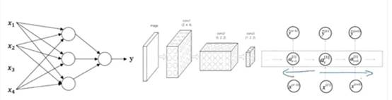
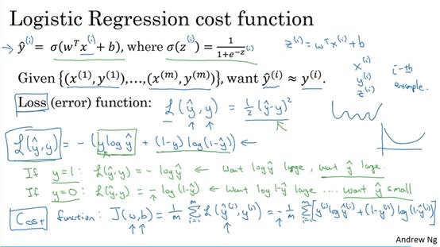
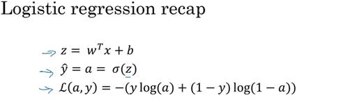
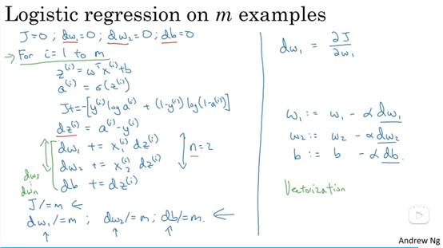

# 简介

## ReLU修正线性单元

​    可以为神经元，修正指的是取不小于0的数。

## 分类

标准神经网络、卷积神经网络、循环神经网络

# 一、     二分分类算法

既分别出是或者不是，如给定一只猫猫图片，输出结果y仅有是/不是两种答案。

逻辑回归适合做二分类，通常使用 0.5 作为分类的阈值。如 (w^T x + b) 大于 0.5，我们可以预测为一类；如果小于 0.5，我们可以预测为另一类。

##   特征向量

​    其是一个一维向量，如下图用图片的RGB三组向量所表示，假设下图是三个64*64的数组，则特征向量X[64*64*3]，依次列出。

​    以下为训练集和验证集，常将训练数据(x,y)，整合为X，其大小为nx*m，此处大X中 的单元，即每列为上文提及的特征向量，急有nx行，共m个训练集，因此此处的X为矩阵（nx，m）；Y同理。

​    注意计算的时候一般以行为单位但为了方便书写则以列为单位，后用转置。

## 1.1 Logistics回归

Sigema函数就是一个归一函数，Logistics有两参数，常数项和斜率，计算出将其归一即可简单算出估计概率(y hat)。

**对于参数w和b如下解释：**

l  (w) 是一个与特征向量 (x) 维度相同的列向量，反映了不同特征之间的联系。例如，当 (x_1) 变化时，(x_2) 会随之变化。

l  (b) 代表偏移量，阈值。对于不同的问题，根据 (w^T x) 是否达到这个特定的阈值来作出不同的判断。

### 损失/成本函数

其目的就是通过训练找寻合适的w和b来让成本函数最小。

损失函数即是y_hat与y的误差，其一般用二分之一差的平方衡量，即预测值与真值的误差，但此处会造成梯度下降法效率减少，因此一般用下方带有log的式子计算。

J即成本函数，衡量参数W和b的效果，为损失函数的总和的平均，越小越好。

​    损失函数本质上计算的是一个概率添加负号，如下图所示，其是计算在x条件下y等于y_hat的概率，但损失函数是带负号，因此寻求下方所给定义的最大值即可，算出来的既是损失函数的最小值。

​    使用对数是因为对数严格单增不会影响其单调性，且对数函数会将较大的值转换为较小的值，且可以将乘法转换为加法，后续进行最大似然估计(概率论知识)也需要两边求导，而log函数对于求导有优势，具体优点如下。

**极大似然估计：**

l  在机器学习中，我们经常使用极大似然估计来推断模型参数。

l  极大似然估计的目标是找到使得观测数据出现的概率最大的模型参数。

l  对于分类问题，我们希望找到能够最大化样本的似然函数的参数。

**连乘和连加：**

l  在似然函数中，我们通常需要计算样本的连乘。

l  为了方便处理，我们常常使用对数函数将连乘转化为连加。

l  对数函数是单调递增的，因此不会改变优化结果。

**对数损失（Log Loss）：**

l  对数损失是一种常用的损失函数，特别用于二分类问题。

l  它基于似然函数，通过计算真实标签与模型预测概率之间的对数差异来衡量模型的性能。

l  对数损失越小，表示模型的预测结果与真实标签之间的差异越小。

**数值稳定性：**

l  对数损失避免了数值溢出的问题，特别在计算概率时。

l  连乘容易导致数值溢出，而取对数后可以避免这个问题。

### 梯度下降法

​    由于W是向量因此可以是多维的，此处为了方便展示w为实数，b也为实数，成本函数J（）为曲面，其目的是要找到一个合适的w，b点使得J(w,b)值最小。

​    梯度下降法所做的就是从初始值朝最抖的下坡方向走一步，在梯度下降一步后或许会停在那里，因为其正试图沿着最快下降的方向往下走，即为梯度下降的第一次迭代，循环多次达到目的点。

 

​    方便说明这里先忽略b。

​    对于在左边的w其斜率为负，则w计算式会增加；右边反之。α为学习率，因此梯度下降计算公式为w=w-α*导数。

​    因此J（w，d）的梯度梯度下降计算方法如下。

#### Logistics回归中梯度下降法

​    即是画出计算图然后从后往前推求出w和d对损失函数的导数，然后应用梯度下降公式。

#### M个梯度下降法的算法逻辑

​    此处还是以两个训练集为例子。

​    J+=损失函数，即J为成本函数，a为y_hat，导数的计算从上图计算图中可以推出来。

## 向量化

​    即使用numpy库中的矩阵乘法来代替使用for循环进行乘法计算。

​    下方例子中的绿色记号为去掉第二个for循环后使用np库中的向量化进行计算。

## 广播

​    其主要目的就是自适应在矩阵加减乘除，若两矩阵不满足加减乘除的规则（大部分为维度不匹配错误），则其会自动复制行或列以此来达到可以进行加减乘除，因此可以在矩阵后面加常数，因为广播会将其转换为对应的常数矩阵。

​    **注意事项**

​    前者是一个数组，后者才为行矩阵或者列矩阵，一般会出现想当然的错误，其后续运算结果会出错，前者会用数组运算规则后者会使用矩阵运算规则。

