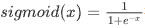
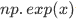
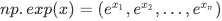
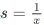
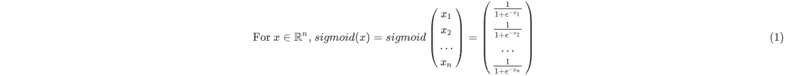
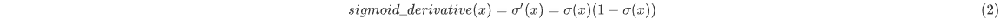

# L1Week2

## 1-numpy

### 1.1-sigmoid function和np.exp（）

​	在使用np.exp（）之前，你将使用math.exp（）实现Sigmoid函数。然后，你将知道为什么np.exp（）比math.exp（）更可取。

**练习**：构建一个返回实数x的sigmoid的函数。将math.exp（x）用于指数函数。



​	也称为逻辑函数。一种非线性函数，即可用于机器学习（逻辑回归），也能用于深度学习。

​	深度学习中主要使用的是矩阵和向量，因此numpy更为实用，对于使用math写的sigmid函数，如果传入向量或者矩阵会报类型不匹配的错误，因此使用np.exp()。

​	如果是行向量，则会将指数函数应用于x的每个元素。输出为：

```python
import math 
import numpy as np

# example of np.exp
x = np.array([1, 2, 3])
print(np.exp(x)) # result is (exp(1), exp(2), exp(3))
```

output:

```python
[ 2.71828183  7.3890561  20.08553692]
```

如果x是向量，则𝑠=𝑥+3或之类的Python运算将输出与x维度大小相同的向量s。

```PY
x = np.array([1, 2, 3])
print (x + 3)
```

output：

```python
[4 5 6]
```

综上，对于np.exp()所实现的sigmoid函数，可以输入矩阵，向量等，输出输入如下所示。



```python
def sigmoid(x):

    s = 1 / (1 + np.exp(-x))
    
    return s
```


### 1.2- Sigmoid gradient

**练习**：创建函数sigmoid_grad（）计算sigmoid函数相对于其输入x的梯度。 公式为：

​	此处对应于二分法，x一般为w^T*x+b，使用梯度下降法的时候会从成本函数一步步向前求偏导，以找到成本函数最小的值与点，合理利用链式法则以求得相应的导数。



```python
def sigmoid_derivative(x):
    s = sigmoid(x)
    ds = s * (1-s)
    return ds

x = np.array([1, 2, 3])
print ("sigmoid_derivative(x) = " + str(sigmoid_derivative(x)))
```

output:

```PYTHON
sigmoid_derivative(x) = [0.19661193 0.10499359 0.04517666]
```

