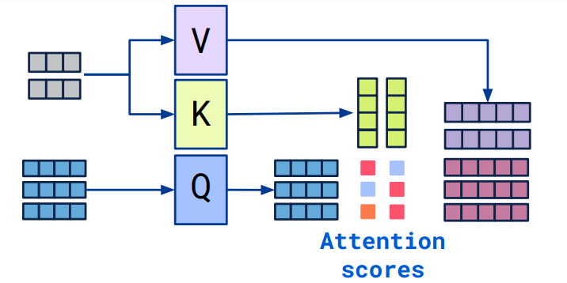

# 0 Cross attention概念

- Transformer架构中混合两种不同嵌入序列的注意机制
- 两个序列**必须具有相同的维度**
- 两个序列可以是不同的模式形态（如：文本、声音、图像）
- 一个序列作为输入的$Q$，定义了输出的序列长度，另一个序列提供输入的$K\&V$

Cross-attention的输入来自不同的序列，Self-attention的输入来自同序列，也就是所谓的输入不同，但是除此之外，基本一致。

具体而言，self-attention输入则是一个**单一的嵌入序列**。

Cross-attention将两个相同维度的嵌入序列不对称地组合在一起，而其中一个序列用作查询Q输入，而另一个序列用作键K和值V输入。当然也存在个别情况，在SelfDoc的cross-attention，使用一个序列的查询和值，另一个序列的键。总而言之，**QKV是由两序列拼凑的，不单一。**

# 1 CrossAttention算法

$$
softmax((W_{Q}S_{2})(W_{K}S_{1})^{T})W_{V}S_{1}
$$

- 拥有两个序列S1、S2
- 计算S1的K、V
- 计算S2的Q
- 根据K和Q计算注意力矩阵
- 将V应用于注意力矩阵
- 输出的序列长度与S2一致

