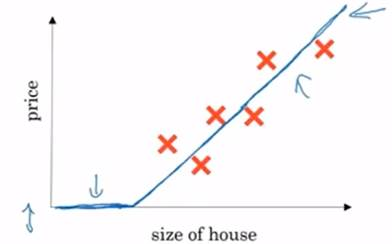
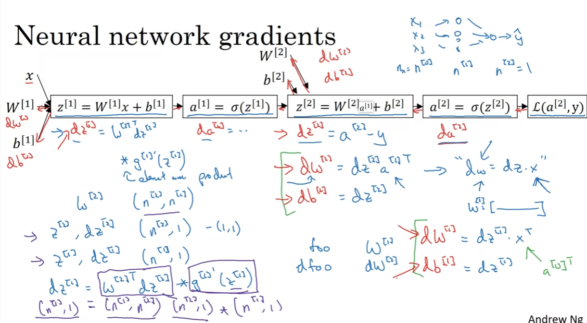

# 简介

## ReLU修正线性单元

​    可以为神经元，修正指的是取不小于0的数(a=max(0,z))。

## 神卷网络分类

标准神经网络、卷积神经网络、循环神经网络

# 一、     二分分类算法

既分别出是或者不是，如给定一只猫猫图片，输出结果y仅有是/不是两种答案。

逻辑回归适合做二分类，通常使用 0.5 作为分类的阈值。如 (w^T x + b) 大于 0.5，我们可以预测为一类；如果小于 0.5，我们可以预测为另一类。

##   特征向量

​    其是一个一维向量，如下图用图片的RGB三组向量所表示，假设下图是三个64*64的数组，则特征向量X[64*64*3]，依次列出。

​    以下为训练集和验证集，常将训练数据(x,y)，整合为X，其大小为nx*m，此处大X中 的单元，即每列为上文提及的特征向量，急有nx行，共m个训练集，因此此处的X为矩阵（nx，m）；Y同理。

​    注意计算的时候一般以行为单位但为了方便书写则以列为单位，后用转置。

## 1.1 Logistics回归

Sigema函数就是一个归一函数，Logistics有两参数，权重和偏差，计算出将其归一即可简单算出估计概率(y hat)。

**对于参数w和b如下解释：**

 w（weight权重）是一个与特征向量 (x) 维度相同的列向量，反映了不同特征之间的联系。例如，当 (x_1) 变化时，(x_2) 会随之变化。

b（bias偏差）代表偏移量，阈值。对于不同的问题，根据 (w^T x) 是否达到这个特定的阈值来作出不同的判断。

### 损失/成本函数

其目的就是通过训练找寻合适的w和b来让成本函数最小。

损失函数即是y_hat与y的误差，其一般用二分之一差的平方衡量，即预测值与真值的误差，但此处会造成梯度下降法效率减少，因此一般用下方带有log的式子计算。

J即成本函数，衡量参数W和b的效果，为损失函数的总和的平均。

成本函数设计为衡量模型预测值与真实值之间差异的指标。理论上，当成本函数的值最小时，模型的预测结果与真实结果的差异也最小，意味着模型的性能最好。

​    损失函数本质上计算的是一个概率添加负号，如下图所示，其是计算在x条件下y等于y_hat的概率，但损失函数是带负号，因此寻求下方所给定义的最大值即可，算出来的既是损失函数的最小值。

​    使用对数是因为对数严格单增不会影响其单调性，且对数函数会将较大的值转换为较小的值，且可以将乘法转换为加法，后续进行最大似然估计(概率论知识)也需要两边求导，而log函数对于求导有优势，具体优点如下。

**极大似然估计：**

l  在机器学习中，我们经常使用极大似然估计来推断模型参数。

l  极大似然估计的目标是找到使得观测数据出现的概率最大的模型参数。

l  对于分类问题，我们希望找到能够最大化样本的似然函数的参数。

**连乘和连加：**

l  在似然函数中，我们通常需要计算样本的连乘。

l  为了方便处理，我们常常使用对数函数将连乘转化为连加。

l  对数函数是单调递增的，因此不会改变优化结果。

**对数损失（Log Loss）：**

l  对数损失是一种常用的损失函数，特别用于二分类问题。

l  它基于似然函数，通过计算真实标签与模型预测概率之间的对数差异来衡量模型的性能。

l  对数损失越小，表示模型的预测结果与真实标签之间的差异越小。

**数值稳定性：**

l  对数损失避免了数值溢出的问题，特别在计算概率时。

l  连乘容易导致数值溢出，而取对数后可以避免这个问题。

### 梯度下降法

​    由于W是向量因此可以是多维的，此处为了方便展示w为实数，b也为实数，成本函数J（）为曲面，其目的是要找到一个合适的w，b点使得J(w,b)值最小。

​    梯度下降法所做的就是从初始值朝最抖的下坡方向走一步，在梯度下降一步后或许会停在那里，因为其正试图沿着最快下降的方向往下走，即为梯度下降的第一次迭代，循环多次达到目的点。

 

​    方便说明这里先忽略b。

​    对于在左边的w其斜率为负，则w计算式会增加；右边反之。α为学习率，因此梯度下降计算公式为w=w-α*导数。

​    因此J（w，d）的梯度梯度下降计算方法如下。

#### Logistics回归中梯度下降法

​    即是画出计算图然后从后往前推求出w和d对损失函数的导数，然后应用梯度下降公式。

#### M个梯度下降法的算法逻辑

​    此处还是以两个训练集为例子。

​    J+=损失函数，即J为成本函数，a为y_hat，导数的计算从上图计算图中可以推出来。

## 向量化

​    即使用numpy库中的矩阵乘法来代替使用for循环进行乘法计算。

​    下方例子中的绿色记号为去掉第二个for循环后使用np库中的向量化进行计算。

## 广播

​    其主要目的就是自适应在矩阵加减乘除，若两矩阵不满足加减乘除的规则（大部分为维度不匹配错误），则其会自动复制行或列以此来达到可以进行加减乘除，因此可以在矩阵后面加常数，因为广播会将其转换为对应的常数矩阵。

​    **注意事项**

​    前者是一个数组，后者才为行矩阵或者列矩阵，一般会出现想当然的错误，其后续运算结果会出错，前者会用数组运算规则后者会使用矩阵运算规则。

# 二、神经网络

​	神经网络就是将sigmoid单元堆叠起来,多个logistics回归嵌套，中括号[]用来表示层，()括号用来表示单个训练样本。

​	得到z后要直接去计算a(y_hat),

## 2.1神经网络表示

输入层：输入特征。

隐藏层：在训练集中这些节点中的真正数值无法探知，看不到其数值，能看到输入也能看到输出但是隐藏层中的值无法看到。

输出层：输出预测值。

输入数据有另一种表示（activate)激活，意味着网络中不同层的值，会传递给后面的层；输入层将x的值传递给隐藏层，将输入层的激活值称为a[0]；在隐藏层中也会产生一些激活值，则将其称为a[1];以此类推。

在神经网络中，输入层不计入层数例如一个两层的神经网络即不把输入层看成一个标准层，第一层是隐藏层第二层是输出，输入层实际上是第零层。

下方绿色字体标注，其隐藏层和输入层是有两个参数，w和b，w[1]为[4,3]矩阵是因为隐藏层有四个节点（四个隐藏单元），三来自上一层的有三个激活值（输入特征）；后方类似。

## 2.2神经网络的输出

​	神经网络只不过将logistics回归重复多遍，以每个节点每个节点来看，将会很简单。

下方将这些运算向量化，请注意W[1]在此处是一个[4,3]的矩阵，W[1]TX则是将其分解为产生的行向量（如下图），则要依照激活值a[0]来决定；下一层同理。

下方既是两层神卷网络的理论计算方法，仅仅需要实现下方四个计算式即可。

在二层神经网络中，输出层以前一层的激活函数输出 **a** 作为输入，神经网络的每一层都旨在从输入数据中提取特征，并将这些特征传递到下一层。这个过程可以用以下步骤来描述：

1. **输入层** 接收原始数据，比如图像的像素值。
2. **第一隐藏层** 通过权重 **W** 和偏置 **b** 计算加权和，然后应用激活函数（如ReLU或Sigmoid）来产生激活值 **a**。
3. **输出层** 接收来自隐藏层的激活值 **a**，并再次进行加权和和激活函数处理，以产生最终的预测输出。

关键点是，每一层的激活值 **a** 实际上是输入数据经过该层的权重和激活函数转换后的结果。这些激活值代表了输入数据在当前层的表示，它们包含了从原始数据中提取的特征信息。因此，输出层需要前一层的激活值 **a** 作为输入，以便在这些提取的特征基础上进行最终的预测。

如a[1]在猫图像中可能表示为输入图像的某些特征，比如边缘、角点或者特定的纹理模式。

### 多个样本的向量化

**单个训练样本**：

- 这种方法也被称为在线学习或单样本更新。在这种情况下，网络在每次迭代中只接收一个训练样本，然后立即更新权重。这种方法可以使网络更快地适应新数据，但可能会导致训练过程中的权重更新非常不稳定，因为每次更新都只基于一个数据点。

例如，假设我们有一个用于手写数字识别的神经网络，每次我们只输入一个手写数字的图像（比如数字’5’的图像），网络对这个图像进行处理并更新权重，然后再输入下一个图像（比如数字’3’的图像）。

**多个训练样本**：

- 又称为批量学习或批量更新。在这种情况下，网络在每次迭代中接收多个训练样本（一个批次），然后基于这些样本的总体表现更新权重。这种方法可以提供更稳定的权重更新，因为它考虑了多个数据点，但可能需要更多的内存和计算资源。

例如，如果我们有1000个手写数字的图像，我们可以将它们分成大小为100的10个批次。每次迭代时，网络会接收这100个图像的一个批次，然后基于这个批次中所有图像的平均表现来更新权重。

​	也即如果单个样本训练的话则要for循环N次才算得上迭代一次，使用多样本训练可以减少for循环的次数，加强效率且批量训练通常更受欢迎，因为可以利用现代计算硬件（如GPU）的并行处理能力，从而加速训练过程。帮助网络更好地泛化，避免过度拟合单个数据点的问题。

​	多个样本向量化即是进行列向量或行向量拼凑成矩阵，其中a和z都是向量，A和Z为向量拼凑称的大矩阵，列向量所组成的元素就是各个神经单元的数值，如A矩阵的左上角就为**a[1](1)1(上标：[第一层]（第一个样本）下标：第一个隐藏层神经元)**；其余以此类推。

此处A[1]矩阵，所代表的是更一般情况。

## 2.3激活函数

​	选择隐藏层中用哪一个激活函数以及神经网络的输出单元用什么激活函数，之前我们一直使用的是sigmoid激活函数，例如tanh(反正弦函数)在许多情况都比sigmoid函数优越，除了二分分类中作为输出层的激活函数（此时使用sigmoid函数会更佳），对于激活函数上标[]，仅表示不同层的激活函数。

​	对于上述两个激活函数，当Z非常大或者非常小的时候，导数的梯度（函数斜率）可能会很小，从图像中可以看出，接近于0，因此会拖慢梯度下降算法，

​	**经验**

​	如果输出为0或1（二分法），选择sigmoid函数作为输出层的激活函数，其余单元选择ReLU函数作为激活函数，，如果不确定选择哪个激活函数作为隐藏层的激活函数，那么通常会选用ReLU作为激活函数。在实践中选择ReLU作为激活函数，神经网络学习速度通常会比使用tanh和sigmoid函数快很多，因为ReLU函数没有这种函数斜率接近0时减慢学习效率的现象，在实践中，有足够多的隐藏单元使得z会大于0。

​	sigmoid：除了在二元分类的输出层使用，不然绝对不要用，大多数有tanh函数作为上位替代。

​	Relu和Leaky Relu函数：二者选其一即可，无太大差别。

**为什么要使用非线性激活函数**

​	事实证明，如果仅仅使用线性激活函数，或者没有激活函数而直接输出，那么无论你的神经网络有多少层，一直在做的只是计算线性激活函数，所以不如直接去掉隐藏层。总结为一句话既是线性的隐藏层没有作用。在不使用激活函数时，你会发现a[1]作为隐藏层输出到下一层其输出结果a[2]其也是一个线性函数，即a[1]没有起到任何作用。

​	只有一个地方可以使用线性激活函数，即g[z]=z，就算如果你要机器学习的是回归问题，如其输出层所输出的是一个实数，比如房价之类的，可以使用线性激活函数，在隐藏层中使用线性激活函数极其少见，

## 2.4神经网络的梯度下降算法

​	正常由计算图推导即可，无难度。

​	

*为元素相乘，由导数链式法则而来，dz[1]的计算结果实际为da[1]\*(da[1]/dz[1])。

右方为矩阵化，实则就是行列矩阵拼凑成的大矩阵，以减少显示for循环导致的代码效率低下。而对于前方带有1/m系数，为成本函数J前求平均的1/m所遗留下来的。

## 2.5随机初始化

​	神经网络中各个参数不可全部设置为0（对于b没有这种情况，可以初始化为0），否则会导致梯度下降算法无效，因为会导致隐藏单元总是在计算相同的函数，所有的隐藏单元都是对称的，因此需要随机初始化所有的参数。

​	通常喜欢把权重矩阵W初始化为非常小的随机数，如果权重太大，计算激活函数值的时候z会非常大，则计算出的梯度会接近于0，从而减缓学习效率。

​	对于单隐藏层的神经网络，权重矩阵乘以的常数一般为0.01，但对于深层神经网络有其他选择，后续课程会讲解。

# 三、深度神经网络

​	其深度神经网络就是有多个隐藏层而不是单隐层，计算方法也与前面的大致相同。

## 3.1深度神经网络的前向后向传播

## 3.2矩阵维数

在神经网络中，如果我们有一张猫的照片，输入的特征向量 ( x_1, x_2, x_3, x_4 ) 通常是图片的像素值或者是这些像素值的某种变换。对于一个简单的神经网络模型，这些特征向量可能代表以下内容：

- ( x_1 ): 图片中的红色通道(Red channel)的像素值。

- ( x_2 ): 图片中的绿色通道(Green channel)的像素值。

- ( x_3 ): 图片中的蓝色通道(Blue channel)的像素值。

- ( x_4 ): 可能是一个额外的通道，如透明度通道(Alpha channel)，或者是图片的某个其他特征，比如边缘强度、颜色直方图等。

  因此在多个样本既是多个X1,X2,X3,X4，可以进行向量化以此来减少for的出现。

向量化前，单个样本。

向量化后的矩阵维数。

## 3.3深度神经网络传播算法

## 3.4参数与超参数

控制参数权重矩阵W和偏置值B的参数称为超参数。

## 总框图

