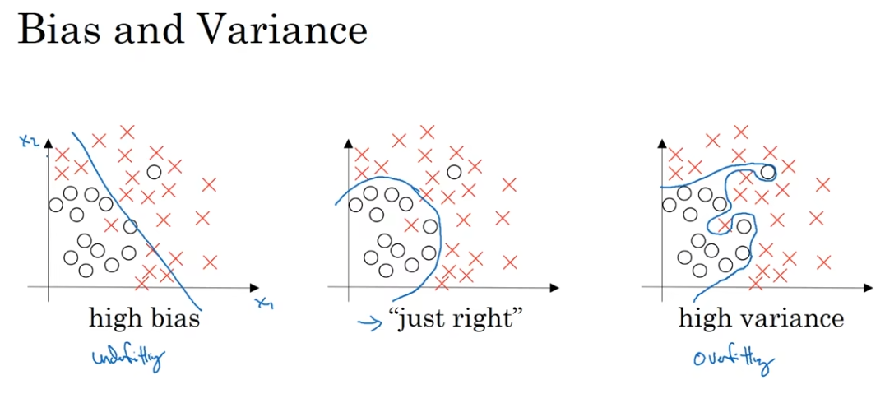
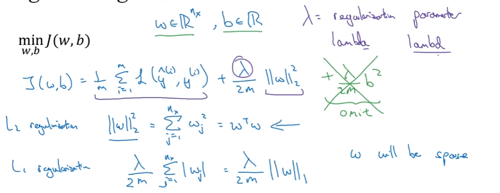
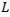
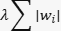
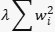
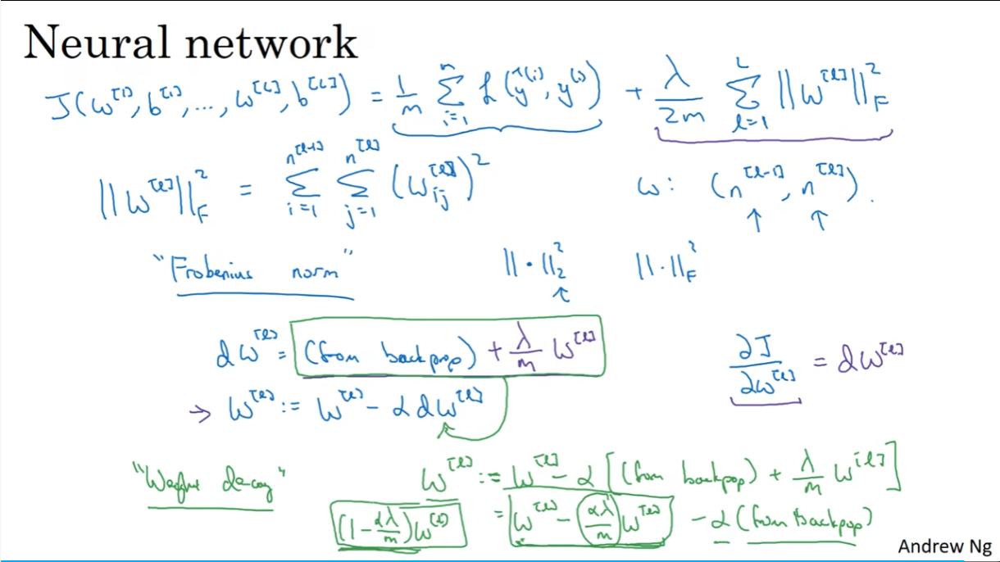

# 训练、开发、测试集

1. **训练集 (Training Set)**:

   - **作用**：训练集用于训练机器学习模型。模型通过观察训练集中的样本来学习数据的模式、特征和关系。
   - **示例**：假设构建一个垃圾邮件分类器。训练集将包含已标记为“垃圾邮件”或“非垃圾邮件”的电子邮件样本。模型将使用这些样本来学习如何区分垃圾邮件和非垃圾邮件。

2. **验证集 (Validation Set)**:

   - **作用**：验证集用于调整模型的超参数（例如学习率、正则化参数等）。它帮助我们选择最佳的模型配置，以避免过拟合或欠拟合。
   - **示例**：在训练过程中，使用验证集来评估不同超参数设置的性能。例如，可以尝试不同的隐藏层大小、学习率等，并选择在验证集上表现最好的模型。

3. **测试集 (Test Set)**:

   - **作用**：测试集用于评估模型的泛化能力。是模型在未见过的数据上的性能指标。

   - **示例**：在训练和验证之后，使用测试集来评估模型的准确性、召回率、精确度等指标。测试集中的样本与训练集和验证集中的样本不重复，以确保模型在新数据上的表现。

# 偏差、方差

对于下方照片，第一个是高偏差的情况，中间为适度拟合，右边为高度拟合。

理解偏差和方差的两个关键数据是训练集误差和验证集误差。

**高方差：**即高度拟合，训练集效果好，验证集效果差，如训练集的误差为1%而验证集的误差为11%。

**高偏差：**即训练集的错误率高，也即欠拟合，和验证集的结果却较为合理。如训练集的误差为15%而验证集的误差为16%。

**高偏差且高方差：**即训练集的错误率高的同时，验证集的结果也不合理。如训练集的误差为15%而验证集的误差为30%。

如训练集的误差为0.5%，验证集的误差为1%，则是低偏差低方差，为模型优秀结果。

**最优误差(基本误差)：**如果假设人类的识别程度的错误率为15%，那么验证集的错误率15%也为合理情况。

如果出现高偏差的情况无法拟合训练集，则选择新的网络；如果偏差适合的情况下，方差高则最好的解决办法就是采用更多数据或者正则化来减少拟合。

## 2.1-正则化

​	一般用于高方差的情况下；**正则化**（Regularization）：用于控制模型的复杂度，防止模型在训练数据上过度拟合（overfitting）。当模型过度拟合时，它会学习到训练数据中的噪声和细微变化，导致在新数据上的性能下降。

**L1 正则化**:

- **数学形式**

  : L1 正则化通过在损失函数中添加权重参数的绝对值之和作为惩罚项。这可以表示为损失函数 加上正则化项

  **效果**: L1 正则化倾向于产生稀疏的权重矩阵，即许多权重会变为零。这意味着它可以用于特征选择，因为它会自动去除不重要的特征（权重为零的特征）。
  
  **L1范数**（也称为曼哈顿距离）：
  
  - **定义**：L1范数是向量中各个元素绝对值之和。
  - **作用**：L1范数倾向于产生稀疏的权重矩阵，即许多权重会变为零。因此，它可以用于特征选择。
  - **示例**：在对用户的电影爱好进行分类时，L1范数可以过滤掉无用的特征，只保留对分类有用的特征

**L2 正则化**（权重衰减）:

- **数学形式**:

   L2 正则化通过在损失函数中添加权重参数的平方和作为惩罚项。这可以表示为损失函数加上正则化项

  **效果**: L2 正则化会使权重值变得较小，但不会将它们推向零，这意味着它不会产生稀疏模型。L2 正则化有助于控制模型的复杂度，但不具备特征选择的功能。

  **L2范数**（弗罗贝尼乌斯范数）（也称为欧氏距离）：

  - **定义**：L2范数是向量元素平方和再开平方。
  - **作用**：L2范数不会将权重推向零，但会使权重变得较小，从而防止过拟合。
  - **示例**：在模型优化中，L2范数通常用作正则化项，以提高模型的泛化能力。

