# 训练、开发、测试集

1. **训练集 (Training Set)**:

   - **作用**：训练集用于训练机器学习模型。模型通过观察训练集中的样本来学习数据的模式、特征和关系。
   - **示例**：假设构建一个垃圾邮件分类器。训练集将包含已标记为“垃圾邮件”或“非垃圾邮件”的电子邮件样本。模型将使用这些样本来学习如何区分垃圾邮件和非垃圾邮件。

2. **验证集 (Validation Set)**:

   - **作用**：验证集用于调整模型的超参数（例如学习率、正则化参数等）。它帮助我们选择最佳的模型配置，以避免过拟合或欠拟合。
   - **示例**：在训练过程中，使用验证集来评估不同超参数设置的性能。例如，可以尝试不同的隐藏层大小、学习率等，并选择在验证集上表现最好的模型。

3. **测试集 (Test Set)**:

   - **作用**：测试集用于评估模型的泛化能力。是模型在未见过的数据上的性能指标。

   - **示例**：在训练和验证之后，使用测试集来评估模型的准确性、召回率、精确度等指标。测试集中的样本与训练集和验证集中的样本不重复，以确保模型在新数据上的表现。

# 偏差、方差

对于下方照片，第一个是高偏差的情况，中间为适度拟合，右边为高度拟合。

理解偏差和方差的两个关键数据是训练集误差和验证集误差。

**高方差：**即高度拟合，训练集效果好，验证集效果差，如训练集的误差为1%而验证集的误差为11%。

**高偏差：**即训练集的错误率高，也即欠拟合，和验证集的结果却较为合理。如训练集的误差为15%而验证集的误差为16%。

**高偏差且高方差：**即训练集的错误率高的同时，验证集的结果也不合理。如训练集的误差为15%而验证集的误差为30%。

如训练集的误差为0.5%，验证集的误差为1%，则是低偏差低方差，为模型优秀结果。

**最优误差(基本误差)：**如果假设人类的识别程度的错误率为15%，那么验证集的错误率15%也为合理情况。

如果出现高偏差的情况无法拟合训练集，则选择新的网络；如果偏差适合的情况下，方差高则最好的解决办法就是采用更多数据或者正则化来减少拟合。

## 2.1-正则化

​	一般用于高方差的情况下；**正则化**（Regularization）：用于控制模型的复杂度，防止模型在训练数据上过度拟合（overfitting）。当模型过度拟合时，它会学习到训练数据中的噪声和细微变化，导致在新数据上的性能下降。

**L1 正则化**:

- **数学形式**

  : L1 正则化通过在损失函数中添加权重参数的绝对值之和作为惩罚项。这可以表示为损失函数 加上正则化项

  **效果**: L1 正则化倾向于产生稀疏的权重矩阵，即许多权重会变为零。这意味着它可以用于特征选择，因为它会自动去除不重要的特征（权重为零的特征）。
  
  **L1范数**（也称为曼哈顿距离）：
  
  - **定义**：L1范数是向量中各个元素绝对值之和。
  - **作用**：L1范数倾向于产生稀疏的权重矩阵，即许多权重会变为零。因此，它可以用于特征选择。
  - **示例**：在对用户的电影爱好进行分类时，L1范数可以过滤掉无用的特征，只保留对分类有用的特征

**L2 正则化**（权重衰减）:

- **数学形式**:

   L2 正则化通过在损失函数中添加权重参数的平方和作为惩罚项。这可以表示为损失函数加上正则化项

  **效果**: L2 正则化会使权重值变得较小，但不会将它们推向零，这意味着它不会产生稀疏模型。L2 正则化有助于控制模型的复杂度，但不具备特征选择的功能。

  **L2范数**（弗罗贝尼乌斯范数）（也称为欧氏距离）：

  - **定义**：L2范数是向量元素平方和再开平方。
  - **作用**：L2范数不会将权重推向零，但会使权重变得较小，从而防止过拟合。
  - **示例**：在模型优化中，L2范数通常用作正则化项，以提高模型的泛化能力。

​	当λ足够大时，它会对权重矩阵施加很大的惩罚，导致权重的值减小，甚至趋于0。神经网络会越来越接近逻辑回归，但神经网络的隐藏单元依旧存在，只不过影响变小了。

​	损失函数中加入L2正则化项时，算法会尝试最小化损失函数和正则化项的总和（成本函数）。由于正则化项是权重的平方和，增加λ会使得优化算法在减少损失的同时，也倾向于将权重值减小，以降低正则化项的值。如果λ设置得非常大，那么优化算法在减少正则化项的过程中，会将权重推向。

​	当权重值减小或趋于0时，隐藏单元与输入和输出之间的连接变得非常弱。意味着隐藏单元对模型的输出贡献减少，从而减少了它们的影响力。虽然隐藏单元仍然存在，但对最终结果的影响也会变得很小，使得整个网络的行为更像是一个简单的逻辑回归分类器。

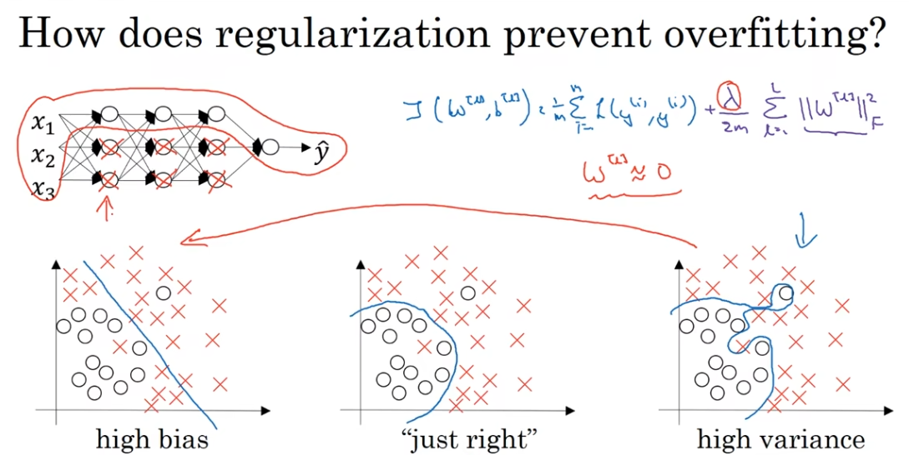

### **为什么正则化可以减少过拟合？**

​	即正则化通过添加一个与权重相关的惩罚项到损失函数中，鼓励模型学习更小的权重，而这样会使得模型倾向于学习更简单的、泛化能力更强的模式，而不是复杂的模式，这些复杂的模式可能只在训练数据上有效，但在未见过的数据上则不一定有效（过拟合）。

​	以tanh激活函数为例，当正则化参数λ增大，导致权重w减小，因为z是输入x和权重w的线性组合，所以z的值也会减小。当z的值较小时，tanh函数的输出接近线性关系（因为tanh函数在原点附近是近似线性的，如图所示）。这意味着，随着λ的增加，神经网络的非线性效应减弱，模型的复杂度降低，从而减少了过拟合的风险。

tanh函数可以表示为：
$$
\text{tanh}(z) = \frac{e^z - e^{-z}}{e^z + e^{-z}}
$$
当z的值较小（即接近0）时，tanh函数可以近似为：
$$
\text{tanh}(z) \approx z
$$
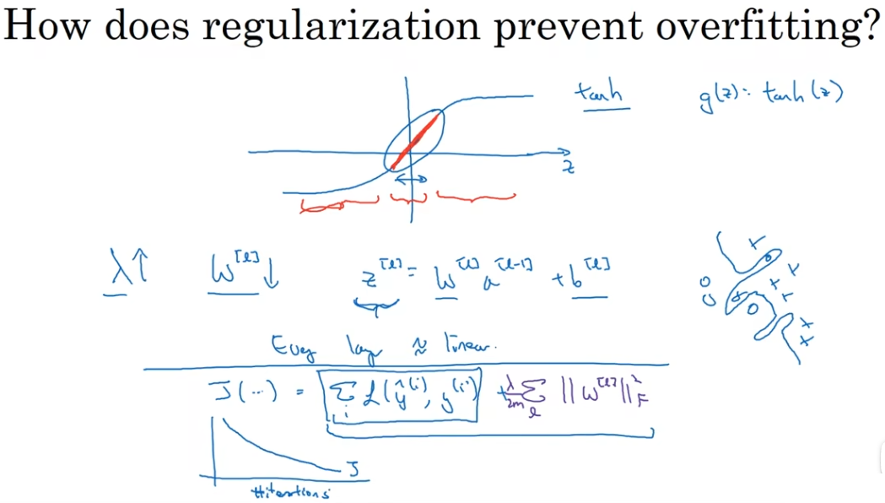

## 2.2-dropout(随机失活)正则化

dropout会遍历网络的每一层，并设置消除神经网络中节点的概率，假设我们设置每一层的消除概率为0.5，即理论上有一半的隐藏单元会被消除，那么这个消除后的神经网络既是正则化后的神经网络。

​	通过在训练过程中随机地丢弃（即将权重设置为0）网络中的一部分神经元来减少过拟合。在每一层设置一个丢弃概率。如0.5，则在每次训练迭代中，每个神经元都有50%的概率不被包括在前向和后向传播中。这样，网络的每次训练迭代都是在一种略微不同的网络架构下完成的。

​	这种方法的效果类似于训练多个不同的网络，并将它们的预测结果进行平均。因为每次迭代都随机丢弃不同的神经元，所以实际上是在训练多个“子网络”。这些子网络共享权重，因此dropout可以被看作是一种非常高效的模型集成方法。

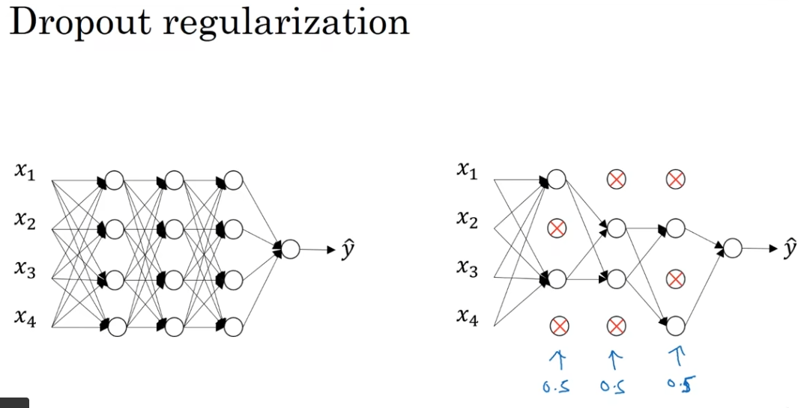

### inverted dropout（反向随机失活）

​	keep-prob是一个概率，意味为1的概率是多少，此处为0.8即80%为1，20%为0，后将a3(第三层输出)与d3相乘，然后将a3中对应于d3中为0的位置置1，也即是完成了消除。

​	在使用dropout正则化时，除以keep-prob（保留概率）是为了保证激活值的期望不变。在dropout过程中，一部分神经元会被随机丢弃，从而减少了网络的有效容量。如果不进行调整，那么在训练阶段，神经元的输出激活值的期望会因为dropout而减少。

​	例如，假设keep-prob为0.8，这意味着有20%的神经元会被丢弃。剩下的神经元的输出激活值的总和将只有原来的80%，这会影响到后续层的学习过程。我们需要将激活值除以keep-prob，这样在期望上，激活值的总和仍然保持不变。假设一个神经元的输出激活值为 ( a )，在不使用dropout的情况下，其期望值为 ( a )。如果使用了dropout，神经元的输出激活值的期望变为 ：
$$
\text{keep-prob} \times a
$$
​	为了使期望值与不使用dropout时一致，我们需要将激活值除以keep-prob，即：
$$
\frac{\text{keep-prob} \times a}{\text{keep-prob}} = a
$$
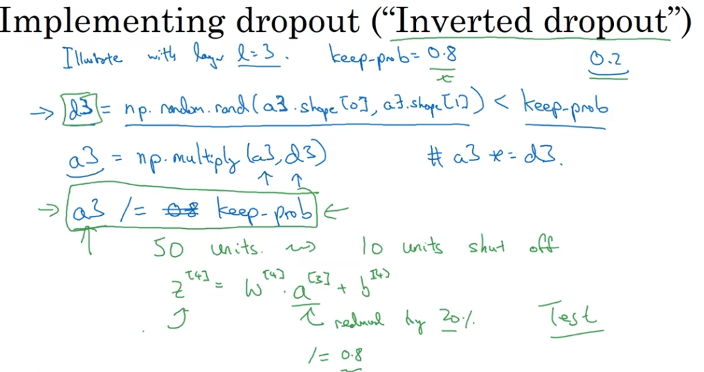

​	而在测试阶段不用使用dropout。其原因是，我们希望模型能够利用其全部学到的知识来进行预测，而不是依赖于训练时的随机性。Dropout是一种正则化技术，它通过在训练过程中随机地关闭一部分神经元来防止模型过拟合。这种随机性有助于模型学习到更加鲁棒（鲁棒性（Robustness）指的是系统在面对各种变化、干扰或不确定性时，仍能保持正常运行和正确输出结果的能力。）的特征表示，因为它不能依赖于任何特定的神经元激活模式。

​	在测试阶段，我们需要模型给出稳定的预测结果。如果在测试时也使用dropout，那么每次运行模型时都可能得到不同的结果，因为不同的神经元会被随机关闭。这会导致模型的预测性能下降，因为我们无法保证模型每次都能使用最佳的神经元组合来做出决策。由于在训练阶段使用了dropout，模型的权重已经适应了在一定比例的神经元被关闭的情况下进行预测。因此，在测试阶段，我们可以使用所有的神经元（即不使用dropout），但权重可能会乘以保留概率（keep-prob），以保持激活值的总和与训练阶段相似。这样做可以确保模型的输出反映了训练时学到的所有知识，同时保持了预测的一致性。

### 理解dropout

​	Dropout作为一种正则化技术，会随机地关闭网络中的一些单元，这样做的目的是为了防止网络对于训练数据的过度拟合。当一个单元被关闭时，它在当前训练迭代中不会对前向传播和反向传播产生影响。这迫使网络不会对任何一个输入特征赋予过多的权重，因为在训练过程中，这些特征可能会被随机删除。因此，网络必须学习更加分散的权重，以便在某些输入特征缺失时仍能做出准确的预测。

​	Dropout的效果类似于L2正则化，因为它倾向于减小权重的大小，但它们的工作原理有所不同。L2正则化通过惩罚权重的平方和来工作，导致所有权重都均匀地缩小，特别是对于那些较大的权重。而Dropout则是通过随机地关闭单元来实现正则化，这种方法不是均匀地缩小权重，而是增加了权重配置的多样性。

​	对于不同层应用不同的keep-prob（保留概率），因为不同的层可能对过拟合的敏感度不同。例如，如果某个权重矩阵特别大，可能需要更高的dropout率来防止过拟合；而对于那些我们认为不太可能过拟合的层，可以设置较高的keep-prob，甚至可以是1，意味着这些层不使用dropout。

​	Dropout主要用于计算机视觉领域，在这个领域中，模型往往非常深且复杂，容易过拟合。在其他类型的问题中，可能不需要使用dropout，或者使用其他形式的正则化就足够了。这取决于具体问题的复杂性、数据的数量和质量，以及模型的结构。

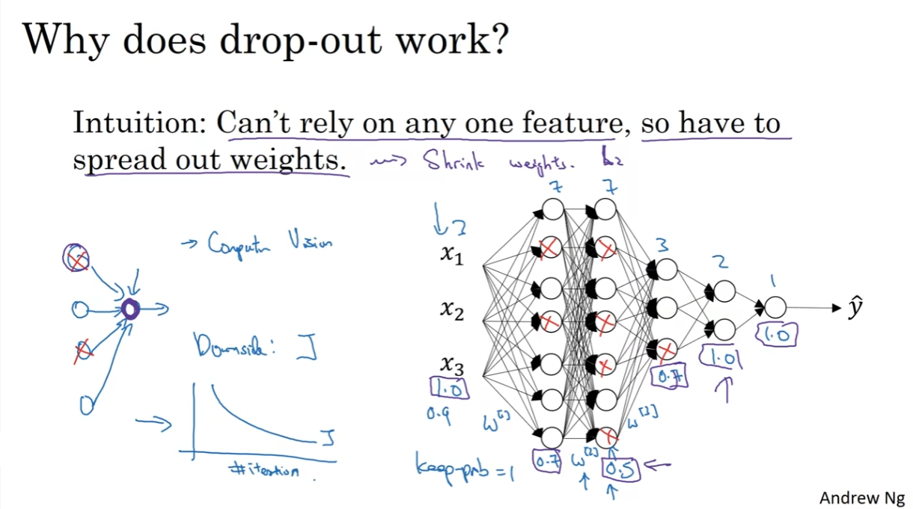

## 2.3-其他正则化的方法

通过改变图片的方式来伪增加图片集。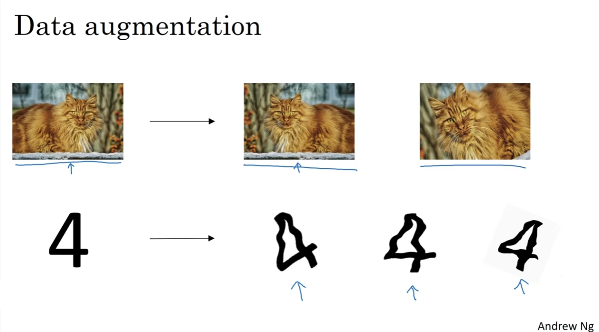

#### Early stopping

​	Early stopping是一种防止神经网络过拟合的正则化技术。它的基本思想是在训练过程中，当模型在验证集上的性能不再提升时停止训练。这样做的目的是为了避免权重w变得过大，从而导致模型在训练数据上过度拟合。

​	在神经网络的训练过程中，权重w通常是从较小的随机值开始的。随着训练的进行，权重w会逐渐增大，以最小化训练集上的损失函数。如果训练时间过长，权重w可能会变得非常大，这时模型可能会开始学习训练数据中的噪声，而不是潜在的、更一般的模式，即过拟合现象。

Early stopping通过在验证集上监控性能来解决这个问题。当连续多个epoch性能没有提升时，就会停止训练。这通常意味着模型在验证集上的误差开始增加，表明模型可能开始过拟合。通过在这个“中间点”停止训练，我们可以得到一个大小适中的权重w，有助于保持模型的泛化能力，同时避免过拟合。

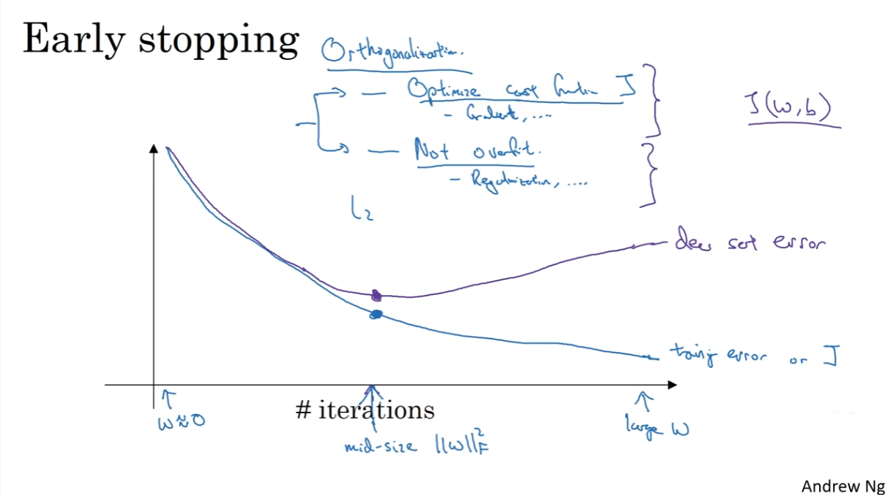

# 归一化输入

​	归一化输入数据是一个重要的预处理步骤，有助于算法更快地收敛并提高模型的性能。这个过程通常包括两个步骤：零均值化和方差归一化。

​	**第一步：零均值化** ，也称为中心化，指将输入变量的均值变为零。对于每个特征，我们从该特征的所有数据点中减去其平均值。数学上，如果我们有一个特征 ( X )，其均值为μ，零均值化后的特征 ( X’ ) 计算如下：
$$
\mu = \frac{1}{n}\sum_{i=1}^{n}x_i
$$

$$
X' = X - \mu
$$

​	将数据集的中心移至原点。在优化过程中，这有助于梯度下降等算法更快地找到最小值，它确保了所有特征都在同一尺度上被考虑，避免了某些特征由于数值范围大而对结果产生不成比例的影响。

​	**第二步：方差归一化** ，也称为标准化，是指将输入变量的方差变为1，当方差变为1时，这意味着数据的分布具有单位方差，也就是说，数据点在数值上相对于均值的平均距离是标准化的。这种情况下，数据的分布被称为“标准化”或“单位化”。通过将特征值除以其标准差来实现的，设特征 ( X’ ) 的标准差为 ( σ )。

​	标准差是衡量数据点偏离均值的程度的指标。首先，我们需要计算每个数据点与均值之差的平方，然后求和，最后除以数据点的数量（对于样本标准差，除以 ( n-1 )），再取平方根。标准差 (σ  ) 计算如下
$$
\sigma = \sqrt{\frac{1}{n}\sum_{i=1}^{n}(x_i - \mu)^2} 
$$
​	则归一化后的特征 ( X’’ ) 计算如下：
$$
X'' = \frac{X'}{\sigma}
$$
​	确保了所有特征具有相同的尺度，这意味着它们对模型的贡献是平等的。例如，在使用基于距离的算法（如K-最近邻或支持向量机）时，未归一化的特征可能会由于其值的范围较大而对距离计算产生过大影响。

​	**Eg:**假设我们有两个特征，一个是人的身高（以厘米为单位），另一个是体重（以千克为单位）。身高的范围可能是150到200厘米，而体重的范围可能是50到100千克。如果直接使用这些原始数据进行机器学习，体重特征因为数值范围更大，可能会对模型产生更大的影响。但通过将这两个特征的方差都标准化为1，我们确保了它们在模型中的影响是平等的，从而使模型更加公正和有效。

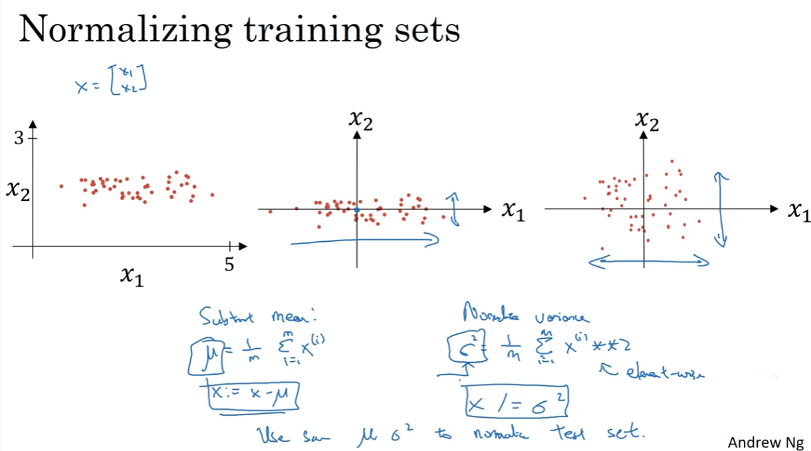

## 3.1-基本原理

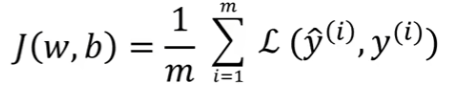	

​	如果使用非归一化的输入特征，代价函数会如左图所示，这是一个非常细长狭窄的成本函数；如果使用归一化，代价函数平均起来看更对称。

​	代价函数的形状会受到特征值范围的影响。如果特征 ( X_1 ) 的取值范围是 ( (0, 1000) )，而 ( X_2 ) 的取值范围是 ( (0, 1) )，那么 ( X_1 ) 在代价函数中的影响会远大于 ( X_2 )。这是因为 ( X_1 ) 的变化对代价函数的影响更大，即使它的变化很小。

​	这会导致代价函数的等高线（代价相同的点的集合）变得非常细长和狭窄，类似于左图所示。在这种情况下，梯度下降算法在不同方向上前进的速度差异很大：沿着 ( X_1 ) 方向的梯度会非常大，而沿着 ( X_2 ) 方向的梯度会非常小。因此，为了避免在 ( X_1 ) 方向上的大步长导致梯度下降超过最小值，我们需要使用一个非常小的学习率。

​	如果我们对输入特征进行归一化，使得所有特征的取值范围相似，那么代价函数的等高线会更加对称，类似于右图所示。这样，梯度下降算法在所有方向上前进的速度会更加均匀，可以使用更大的学习率，而不会有超过最小值的风险。这也意味着梯度下降算法可以更快地收敛到最小值。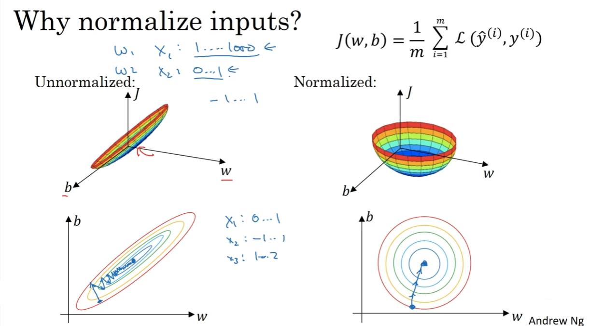

# 梯度消失和梯度爆炸

​	梯度爆炸或梯度消失：当训练神经网络时，导数或梯度的变化非常大或非常小，甚至以指数方式变小的现象。

​	**激活函数饱和**：使用像sigmoid或tanh这样的激活函数时，当输入值非常大或非常小，激活函数的导数接近于零，这会导致梯度消失。
​	**权重初始化**：如果权重初始化得太大，那么在网络的前向传播过程中，激活函数的输出可能会变得非常大，导致梯度在反向传播时爆炸。相反，如果权重初始化得太小，激活函数的输出可能会变得非常小，导致梯度消失。
​	**深层网络结构**：在深层网络中，梯度必须通过多个层进行反向传播。如果每层的梯度都小于1，那么最终的梯度会随着层数的增加而指数级减小，导致梯度消失。同样，如果每层的梯度都大于1，那么梯度会随着层数的增加而指数级增大，导致梯度爆炸。

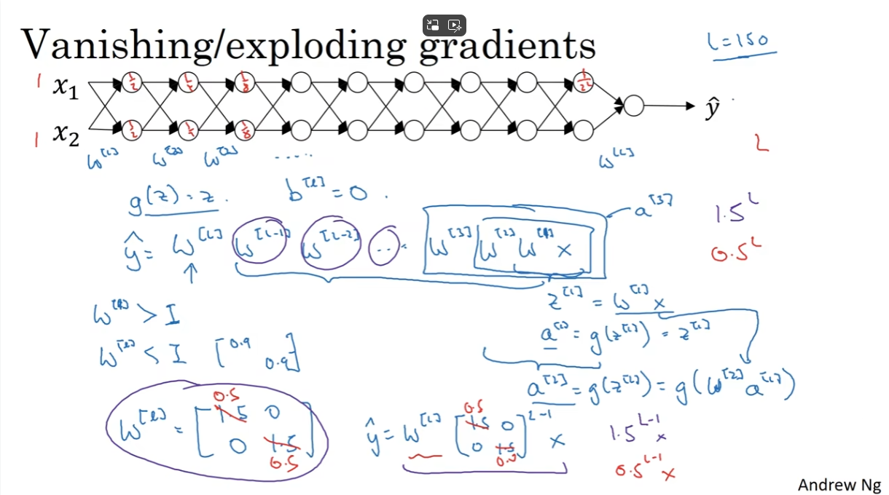

## 4.1-权重初始化

​	方差衡量的是数据分布的离散程度，即数据值与其平均值的偏离程度。在神经网络中，权重的方差决定了通过该层传播的信号的分散程度。如果方差太大，信号可能会随着层数的增加而放大，导致梯度爆炸；如果方差太小，信号可能会逐渐衰减，导致梯度消失。

1. **权重方差设置为 ( $\frac{1}{n}$ )**：这种方法通常用于激活函数如sigmoid或tanh，其中 ( n ) 是神经元的输入特征数量。这样做可以保持网络各层激活值的分布一致，有助于梯度在深层网络中稳定传播。
2. **权重方差设置为 ( $\frac{2}{n}$)**：当使用ReLU激活函数时，推荐的方差设置为 ( $\frac{2}{n}$ )，因为ReLU函数在正半轴上的梯度为1，这种初始化方法有助于保持激活值的分布，并减少梯度消失的风险。当使用ReLU激活函数时，如果我们初始化权重使得其方差为 ($ \frac{1}{n} $)，那么由于ReLU的非负性，经过激活函数后的输出方差将会减半，因为输入的一半期望会被ReLU置为0。为了补偿这种减半的效果，我们将权重的方差初始化为 ( $\frac{2}{n} $)，这样经过ReLU函数后，输出的方差期望仍然是1，从而保持了信号在网络层之间传播时的稳定性。
3. **原因：**假设我们有一个神经元，它的输入 ( x ) 是一个具有 ( n ) 个独立同分布的随机变量，每个都有方差为1（因为我们通常会对输入进行标准化）。神经元的输出 ( z ) 是权重 ( w ) 与输入 ( x ) 的点积，然后通过ReLU函数。权重 ( w ) 也是随机变量，我们希望找到一个合适的方差，使得 ( z ) 的方差在ReLU激活后仍然为1。在不考虑ReLU的情况下，( z ) 的方差将是权重方差和输入方差的乘积，乘以输入的数量 ( n )。为了使 ( z ) 的方差为1，权重的方差应该是 ($ \frac{1}{n} $)。但是，由于ReLU会将一半的输入置为0，我们需要将权重方差翻倍，以补偿这种减少。因此，权重的方差应该是 ( $\frac{2}{n}$ )。
  4. **零均值和单位方差**：如果输入特征被标准化为零均值和单位方差（即均值为0，方差为1），那么通过权重矩阵的线性变换后，输出 ( z ) 也会倾向于有相似的分布。这是因为标准化输入意味着输入特征在不同维度上是可比的，且没有一个维度会在计算 ( z ) 时主导其他维度。这有助于避免某些权重在训练过程中变得过大或过小，从而保持梯度的稳定。

​	通过调整权重的初始方差，我们可以确保在网络的每一层，信号的分布保持一致，不会随着网络深度的增加而发生显著的放大或衰减。这有助于维持梯度的稳定性，使其既不会爆炸也不会消失。

​	 **$\text{np.random.randn(shape)} \times \sqrt{\frac{1}{n}}$：**基于正态分布的权重初始化方法。np.random.randn(shape) 生成均值为0，标准差为1的正态分布随机数，乘以 ($ \sqrt{\frac{1}{n}} $) 是为了调整权重的标准差，使得网络层的输出的方差接近1。`np.random.randn(shape)` 生成的是均值为0，标准差为1的正态分布随机数，这意味着这些数的方差确实是1。然而，当我们将这些权重用于神经网络层时，我们必须考虑到每个神经元的输入特征数量 ( n )。在不考虑激活函数的情况下(或者激活函数为线性g(z)=z)，神经元的输出 ( z ) 是其权重 ( w ) 与输入 ( x ) 的点积(如下图所示)。如果输入 ( x ) 被标准化（均值为0，方差为1），并且权重 ( w ) 也是从标准正态分布中抽取的，那么 ( z ) 的方差将会随着 ( n ) 的增加而增加。这是因为 ( z ) 是 ( n ) 个独立随机变量的和，每个都有方差1，所以 ( z ) 的方差将是 ( n )。为了防止这种方差的增加，我们通过 ($ \sqrt{\frac{1}{n}} $) 来缩放权重 ( w )(方差的计算公式，常数要提出来并²)，这样 **( z ) 的方差就会保持为1**(注意是z而不是w要搞清楚)，而不会随着 ( n ) 的增加而增加。

​	**方差为1的意义**： 在权重初始化中，方差为1意味着权重的分布既不会导致输出值的放大，也不会导致输出值的衰减。这有助于保持网络各层激活值的分布一致，从而避免梯度消失或爆炸问题。当方差为1时，假设输入数据已经被标准化（即具有零均值和单位方差），那么网络层的输出（在没有激活函数的情况下）也将具有相同的分布。这有助于确保梯度在整个网络中稳定传播，从而有利于模型的训练和收敛。

​	**方差与激活函数的关系：**激活函数的选择会影响梯度的传播。例如，Sigmoid和Tanh函数在输入值很大或很小时会饱和，导致梯度接近于零，这会减缓学习速度或导致梯度消失。而ReLU函数在正区间的梯度为1，在负区间为0，因此不会导致梯度消失，但可能会导致梯度爆炸。因此，选择合适的权重初始化方法，如He初始化或Xavier初始化，可以根据激活函数的特性来调整权重的方差，以保持梯度的稳定性。

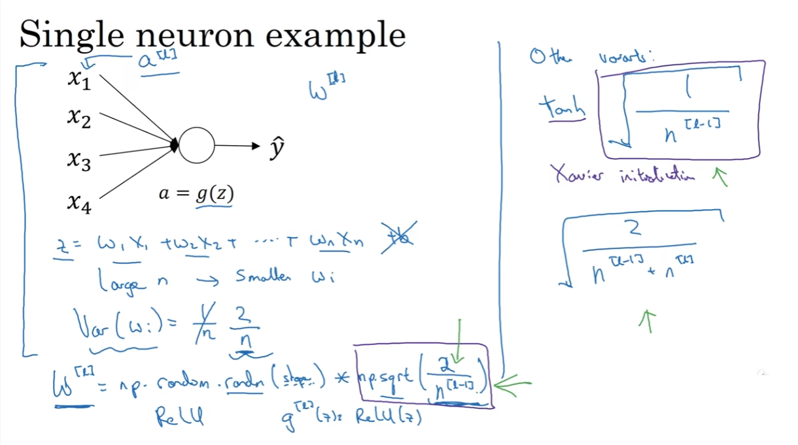

## 4.2-梯度的数值逼近

​	使用双边差分和不使用单边差分来逼近导数，其结果误差更小。对于双边差分他的逼近误差可以写为O(ε²)而单边差分的逼近误差则为O(ε)。

​	单边差分和双边差分。在数值微分中，我们通常使用差分来逼近导数，因为在计算机上直接计算导数的极限是不可能的。我们通过计算函数在某点附近的变化来估计导数。

​	**单边差分（单边误差）**是指只考虑函数在某一点的一侧（例如，只考虑点 ( x + $\epsilon$ )）来逼近导数。其公式为：
$$
\approx \frac{f(x + \epsilon) - f(x)}{\epsilon} 
$$
​	**双边差分（双边误差）**则考虑了函数在该点的两侧（即点 ( x +$ \epsilon$ ) 和 ( x -$ \epsilon$ )），其公式为：
$$
\approx \frac{f(x + \epsilon) - f(x - \epsilon)}{2\epsilon} 
$$

​	在泰勒级数展开中，双边差分的误差项是 ( $\epsilon^2 $) 的高阶项，而单边差分的误差项是 ( $\epsilon $) 的高阶项。这意味着随着 ($ \epsilon$ ) 的减小，双边差分的误差会比单边差分的误差减小得更快。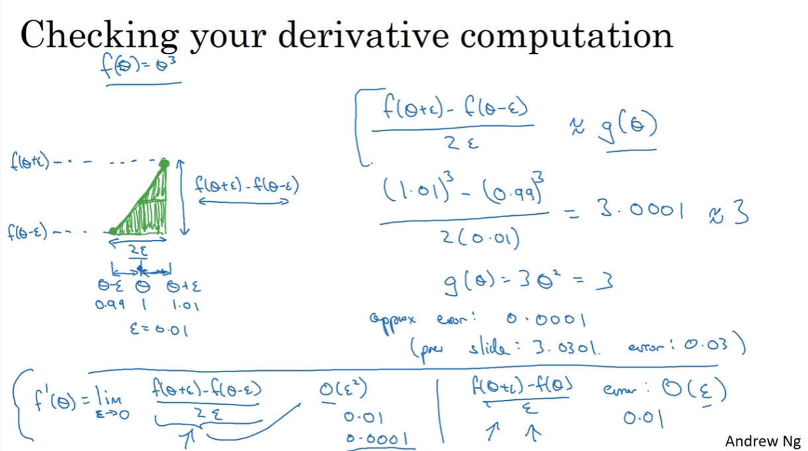

## 4.3-梯度检验

​	执行梯度检验首先要做的是把所有参数转换为一个巨大的向量数据，将这些参数，例如权重矩阵 ( W ) 和偏置向量 ( b )，展平成一个长向量 ( $\theta$ )，这样就可以将梯度检验的过程统一化，对每个参数进行相同的操作，然后使用dw[L]和db[L]来初始化大向量dθ，它与θ有相同的维度。

​	梯度检验过程中，计算数值梯度作为梯度的近似值，并将其与反向传播得到的梯度进行比较。如果两者之间的差异很小，那么我们就可以认为反向传播算法是正确的。为了计算数值梯度，我们需要对每个参数 ($ \theta_i $) 分别进行双边差分，然后观察目标函数 ( J ) 的变化。

​	现在成本函数J是超级参数θ的一个函数，计算dθapprox[i]（逼近值）的值，使用双边差分，将θ分为(θ1,θ2,......,θi),然后求其偏导数，然后使用for循环对其每一个都求偏导。

​	**θ分为(θ1,θ2,......,θi)的实际例子：**我们有一个权重向量 ( $\theta$ )，它包含了所有的权重参数 ( $\theta_1, \theta_2, \ldots, \theta_n$ )。如果我们有一个特征向量 ( x ) 和对应的权重向量 ($ \theta $)，那么模型的预测 ( $\hat{y} $) 可以通过向量内积来计算：
$$
\hat{y} = \theta^T x = \sum_{j=1}^{n} \theta_j x_j
$$
​	在执行梯度检验时，我们通常会计算两个向量之间的距离，即梯度的逼近值 ($ d\theta_{approx} $) 和实际的梯度 ( $d\theta $)。这个距离可以通过计算两个向量的欧几里得范数来得到，然后将其归一化，以便比较不同规模的参数。具体来说，我们计算的是：
$$
\frac{||d\theta_{approx} - d\theta||_2}{||d\theta_{approx}||_2 + ||d\theta||_2}
$$
​	这个比率被称为相对误差。当相对误差非常小，比如小于 ( $10^{-7} $)，这通常意味着梯度的逼近非常接近实际的梯度，表明梯度计算是正确的。如果相对误差在 ( $10^{-5}$ ) 到 ( $10^{-4}$ ) 之间，可能还可以接受，但需要谨慎；如果相对误差大于 ($10^{-3}$ )，则很可能计算中存在错误。

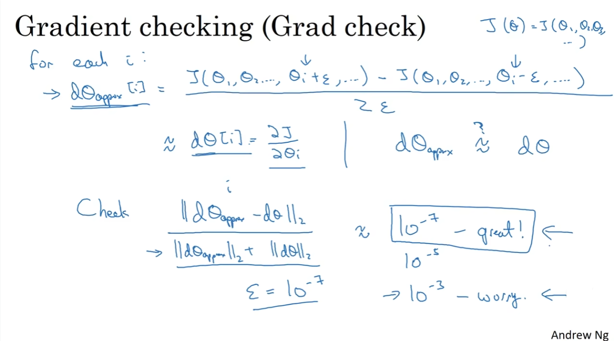

## 注意事项

1. **不要在训练就使用梯度检验，其仅适用于调试：** 梯度检验是计算密集型的，因为它需要对每个参数进行至少两次前向传播（对于双边差分）。如果在每次训练迭代中都进行梯度检验，将大大增加训练时间。因此，梯度检验通常仅在调试阶段使用，以验证梯度计算的正确性。

2. **梯度检验失败时的调试方法**：在梯度检验中，如果发现 ($d\theta_{approx}^{[i]}$ ) 与 ( $d\theta$ ) 之间的差异很大，这通常意味着在计算梯度时可能存在错误。这种情况下，我们需要逐个检查每个参数的梯度，以确定问题的具体位置。

   - 当我们发现某些层的 ( $db^{[L]}$ ) 的梯度检验失败（即 ( $d\theta_{approx}^{[i]}$ ) 与 ($ d\theta$ ) 差异很大），而相应层的 ( $dw^{[L]}$ ) 的梯度检验却通过了（即 ( $d\theta_{approx}^{[i]} $) 与 ($ d\theta$ ) 非常接近），这表明问题可能出在偏置参数 ( b ) 的梯度计算上。在神经网络中，权重 ( w ) 和偏置 ( b ) 是分开计算的，它们对应于不同的参数和梯度。如果 ( dw ) 的计算是正确的，但 ( db ) 的计算是错误的，那么这表明反向传播算法在计算偏置梯度时可能出现了问题。

     同样，如果某个特定的 ( $d\theta_{approx}^{[i]}$ ) 与 ( $d\theta$ ) 差异很大，而其他的梯度检验都通过了，那么这个特定的 ( i ) 值可能指向了问题所在的参数。例如，如果这个 ( i ) 值对应于某一层的 ( dw )，那么问题可能出在这一层的权重梯度计算上。

3. **正则化项的影响**：在进行梯度检验的时候，如果使用正则化去除过拟合现象，请注意正则化项：即代价函数J则计算dθ的时候要包括这个正则化的项。正则化项会影响梯度的值，如果在梯度检验中忽略了正则化项，将导致数值梯度与实际梯度不匹配。

4. **梯度检验与dropout的不兼容性**：Dropout是一种正则化技术，它通过随机丢弃网络中的一些单元来防止过拟合。由于dropout的随机性，每次迭代中丢弃的单元都不同，这使得梯度的计算变得不确定，难以计算dropout在梯度下降上的代价函数J。因此，在进行梯度检验时，应关闭dropout。

5. **梯度检验与参数初始化的关系**：参数初始化对于模型的训练和梯度检验都非常重要。参数 ( w )（权重）和 ( b )（偏置）的初始值会影响梯度下降算法的效率和梯度检验的准确性。当权重 ( w ) 和偏置 ( b ) 接近0时，意味着模型在开始训练时没有强烈的偏见，有助于模型更公平地探索权重空间，从而找到损失函数的全局最小值。其次，这种初始化方法有助于避免权重的对称性问题，即避免所有神经元都学习到相同的特征。

   然而，当 ( w ) 和 ( b ) 的值变大时，模型可能会进入激活函数的饱和区域，特别是当使用像Sigmoid或Tanh这样的激活函数时。在这些区域，激活函数的梯度非常小，这会导致梯度消失问题，使得梯度下降难以继续更新权重。此外，大的权重值也可能导致梯度爆炸，特别是在深层网络中，这会使得梯度下降无法稳定地收敛。

   在网络训练之前使用较小的随机值进行参数初始化，并进行梯度检验，是为了确保反向传播算法正确实施，梯度计算准确无误。这一步是在训练开始前的一个重要的验证步骤，因为此时参数还没有经过任何训练，数值稳定性问题较小。随着训练的进行，参数 ( w ) 和 ( b ) 会更新并远离初始值。如果在训练过程中进行梯度检验，由于参数值的增大，可能会遇到数值稳定性问题，导致梯度检验不再准确。此外，训练过程中引入的如动量、自适应学习率等优化技术，也会影响梯度的计算，使得梯度检验的结果不再可靠。因此，梯度检验通常在训练开始前进行，以验证梯度计算的正确性。一旦开始训练，就应该依赖于其他方法（如监控训练/验证损失）来确保模型的学习过程是正确的。

   
