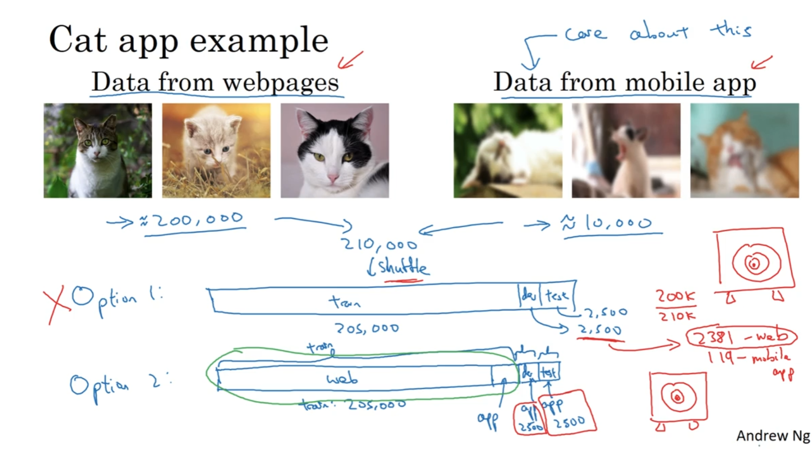
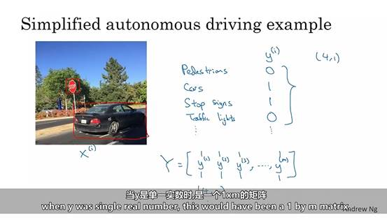
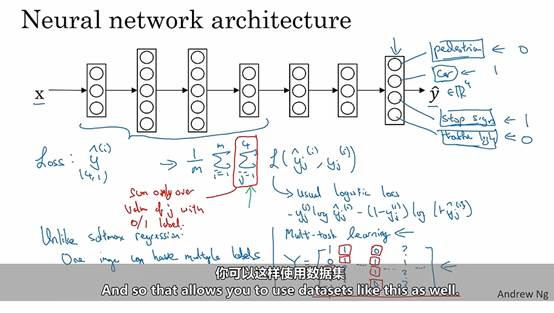
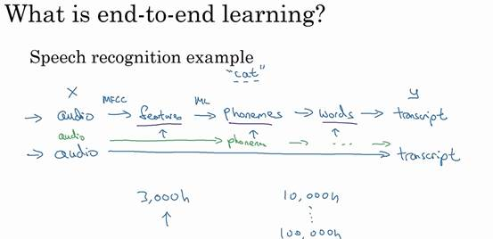
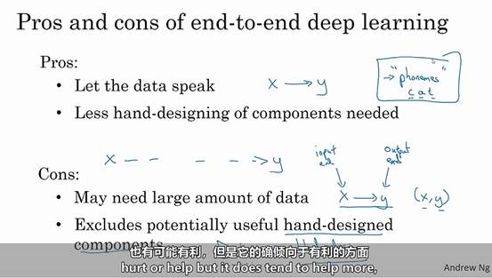

# ML策略

​	机器学习（ML）策略是指在开发和优化机器学习模型时所采用的一系列方法和步骤，以确保模型能够高效、准确地完成任务。

## 1.1-正交化

​	正交化简单来说就是确保改变一个参数的时候只改变一个你想要调整的东西；例如汽车的速度控制和转向，如果有一个按钮同时控制速度和转向，那么就很难达到想要的效果，正交化就是两个旋钮分别控制速度和转向，那么就很容易得到自己想要的效果。

​	正交化可以独立地调整模型的不同方面，从而更有效地优化模型性能。

​	好的一个监督学习系统，需要确保四点

- **系统至少在训练集上得到的结果不错**：
  - **按钮**：切换优化算法或训练更大的网络。
  - **原因**：在训练集上表现良好意味着模型能够很好地拟合训练数据。通过切换优化算法（如从SGD切换到Adam）或训练更大的网络（增加层数或神经元数量），可以提高模型的表达能力和训练效率，从而在训练集上获得更好的结果。

- **在验证集上得到的结果不错**：

  - **按钮**：调整正则化。

  - **原因**：验证集用于评估模型的泛化能力。如果模型在验证集上表现不佳，可能是过拟合或欠拟合的问题。通过调整正则化（如L2正则化、Dropout），可以控制模型的复杂度，防止过拟合，从而在验证集上获得更好的结果。

- **在测试集上得到的结果不错**：

  - **按钮**：需要更大的开发集。

  - **原因**：测试集用于最终评估模型的性能。如果模型在测试集上表现不佳，可能是因为开发集（训练集和验证集）的数据分布与测试集不一致。通过增加开发集的规模和多样性，可以更好地代表测试集的数据分布，从而提高模型在测试集上的表现。

- **在实际应用中结果不错**：

  - **按钮**：改变验证集或成本函数J。

  - **原因**：实际应用中的表现是最终目标。如果模型在实际应用中表现不佳，可能是因为验证集与实际应用场景不匹配，或者成本函数J没有正确反映实际应用中的需求。通过调整验证集使其更接近实际应用场景，或重新定义成本函数J以更好地反映实际需求，可以提高模型在实际应用中的表现。

## 1.2-单实数评估指标

​	如果存在一个单实数评估指标，其可以告诉我们新尝试的方法比之前的方法好还是坏，因此我们需要为问题设置一个单实数评估指标。

- **查准率（Precision）**：表示在所有被模型预测为正类（例如猫）的样本中，实际为正类的比例。公式为：
  $$
  \text{Precision} = \frac{\text{True Positives}}{\text{True Positives} + \text{False Positives}}
  $$

- **查全率（Recall）**：表示在所有实际为正类（例如猫）的样本中，被模型正确识别为正类的比例。公式为：
  $$
  \text{Recall} = \frac{\text{True Positives}}{\text{True Positives} + \text{False Negatives}}
  $$

​	现在的问题是如果在A和B中一个查准率高一个查全率高，那么就无法快速分辨哪个分类器更优，因此并不推荐使用两个评估指标，即查全率和查准率来选择一个分类器，我们需要找到一个新的评估指标能够结合查全率和查准率，即F1分数。

**F1分数**是一个非常有用的评估指标，特别是在查准率（Precision）和查全率（Recall）之间需要权衡的情况下。F1分数是查准率和查全率的调和平均数，其公式为：
$$
F1 = 2 \cdot \frac{\text{Precision} \cdot \text{Recall}}{\text{Precision} + \text{Recall}}
$$

### 调和平均数

调和平均数比算术平均数更适合用于衡量两个数值的平衡，特别是在两个数值差异较大时。以下是具体原因：

1. **平衡性**：F1分数通过调和平均数来平衡查准率和查全率。如果一个模型的查准率很高但查全率很低，或者反之亦然，F1分数会较低。这意味着F1分数只有在查准率和查全率都较高时才会较高，从而鼓励模型在这两个指标上都表现良好。
2. **惩罚极端值**：调和平均数对极端值（即一个值很高而另一个值很低）的惩罚更大。例如，如果查准率为1而查全率为0，F1分数将为0，而不是0.5。这种特性使得F1分数能够更好地反映模型在查准率和查全率上的综合表现。

## 1.3-满足和优化指标

​	假设我们设定在满足运行时间要求的情况下，要最大限度的提高准确的，则这就是一个满足和优化指标；其中运行时间=满足指标，准确率=优化指标。

## 1.4-训练、开发、测试集

​	机器学习中的工作流程是：用训练集训练不同的模型，然后使用开发集来评估不同的思路，然后选择一个不断迭代去改善开发集的性能直到最后可以得到一个令人满意的成本，然后再用测试集去评估。

1. **用训练集训练不同的模型**：
   - **目的**：训练集用于训练模型，调整模型的参数，使其能够学习数据中的模式和特征。
   - **过程**：选择不同的模型架构和算法，使用训练集进行训练，调整模型的权重和偏置。
2. **使用开发集评估不同的思路**：
   - **目的**：开发集（也称验证集）用于评估模型的性能，选择最优的模型和超参数。
   - **过程**：在训练过程中，不断使用开发集评估模型的性能，调整超参数（如学习率、正则化参数等），选择在开发集上表现最好的模型。
3. **选择一个模型并不断迭代优化**：
   - **目的**：通过不断迭代，优化模型在开发集上的性能，确保模型能够泛化到未见过的数据。
   - **过程**：根据开发集的反馈，调整模型架构、超参数和训练策略，直到在开发集上达到令人满意的性能。
4. **用测试集进行最终评估**：
   - **目的**：测试集用于最终评估模型的性能，确保模型在未见过的数据上也能表现良好。
   - **过程**：在模型优化完成后，使用测试集进行评估，计算模型的最终性能指标（如准确率、F1分数等）。

### 原因

1. **防止过拟合**：通过使用开发集评估模型，可以防止模型在训练集上过拟合。过拟合的模型在训练集上表现很好，但在新数据上表现不佳。
2. **选择最优模型**：开发集用于选择最优的模型和超参数，确保模型在不同的配置下都能表现良好。
3. **最终评估**：测试集用于最终评估模型的性能，确保模型在未见过的数据上也能表现良好。这是对模型泛化能力的最终检验。

### 如何选择开发集和验证集？

1. **数据划分比例**：
   - **传统方法**：在数据量较小时，通常将数据集划分为训练集、验证集和测试集，比例为6:2:2或7:2:1
   - **大数据方法**：在数据量较大时，验证集和测试集的比例可以较小，例如98:1:1
2. **随机抽样**：
   - 从训练集中均匀随机抽样一部分样本作为验证集]确保验证集和测试集的数据分布与训练集一致，以便模型能够在不同数据集上表现一致。
3. **数据代表性**：
   - 确保验证集和测试集具有代表性，能够反映实际应用中的数据分布]避免数据偏斜，确保不同类别的数据数量相对均衡。

选择可以反应在未来你所期望的开发集和测试集以及认为重要的数据和必须得到好结果的数据。

## 1.5-贝叶斯最优错误率

​	贝叶斯最优错误率一般认为是理论上最可能达到的最优错误率，代表了在已知数据分布情况下，数据所能提供的最大信息量。因此，它是理论上可以达到的最低错误率。

### 为什么人工智能在超越人类错误率后很难再增长？

1. **接近理论极限**：当人工智能系统的错误率接近贝叶斯最优错误率时，进一步降低错误率变得非常困难，因为已经接近数据和模型的理论极限
2. **数据和模型的局限性**：即使有大量的数据和复杂的模型，仍然存在一些不可避免的噪声和不确定性，这些因素限制了模型的进一步改进
3. **边际收益递减**：在错误率较高时，改进模型可以显著降低错误率，但当错误率已经很低时，进一步改进所带来的收益会逐渐减少
4. **人类水平的瓶颈**：许多任务中，人类水平已经非常接近贝叶斯最优错误率，因此人工智能在超越人类水平后，进一步提升的空间非常有限

## 1.6-可避免偏、方差

### 偏差和方差

偏差（Bias）和方差（Variance）是机器学习中评估模型性能的重要概念，它们描述了模型在训练数据和新数据上的表现。以下是它们的区别和在人工智能中的影响：

**偏差（Bias）**

- **定义**：偏差是指模型预测值与真实值之间的差异。高偏差意味着模型对训练数据的拟合程度不够，通常表现为欠拟合（Underfitting）。
- **影响**：高偏差的模型过于简单，无法捕捉数据中的复杂关系，导致在训练数据和新数据上都表现不佳。

方差（Variance）

- **定义**：方差是指模型在不同训练数据集上的预测结果的波动程度。高方差意味着模型对训练数据中的噪声和细节过于敏感，容易过拟合（Overfitting）。
- **影响**：高方差的模型在训练数据上表现很好，但在新数据上表现差，因为它学习到了训练数据中的噪声和不相关的细节。

### 减少方差和偏差

## 1.7-误差分析

​	假设我们的一个分类器错误率达到了10%，那么此处也需要我们去考虑一下要优化什么，我们可以列一个表格，然后统计出错误图片中不同类别的占比，这可以给我们一个大致方向；例如如果我们选择去优化狗图像，那么即便是优化好了其错误率也不会降低很多，因为这在错误率10%中仅占了8%，那么如果我们转头优化模糊图像或者大猫类别，那么优化后错误率就会有显著的下降，如下图所示。

​	下面是一个例子。

1. **错误类别分析**

首先，我们需要统计分类器在不同类别上的错误率。例如：

| 类别     | 错误率占比 |
| :------- | :--------- |
| 狗       | 8%         |
| 模糊图像 | 30%        |
| 大猫     | 25%        |
| 其他     | 37%        |

从表格中可以看出，模糊图像和大猫类别的错误率占比较高，分别为30%和25%。

2. **优化策略**

优化狗图像

假设我们选择优化狗图像，即使我们将狗图像的错误率完全消除，整体错误率也只能从10%降低到9.2%（因为狗图像错误率占比为8%）。

优化模糊图像或大猫类别

如果我们选择优化模糊图像或大猫类别，假设我们能将其中一个类别的错误率降低一半，那么整体错误率将显著下降。例如：

- **模糊图像**：从30%降低到15%，整体错误率从10%降低到7.5%。
- **大猫类别**：从25%降低到12.5%，整体错误率从10%降低到7.5%。

还有一些其他优化方法如：

- **数据增强**：通过数据增强技术（如旋转、缩放、裁剪等）增加训练数据的多样性，提升分类器的泛化能力。
- **模型改进**：尝试不同的模型架构或优化算法（如Adam、RMSProp等），提升模型的性能。
- **超参数调优**：通过网格搜索或随机搜索等方法，找到最佳的超参数组合，进一步提升模型的准确性。

## 1.8-标注错误问题

​	对于数据训练集，如果在标注的时候因为一些原因导致标注错误，如果此错误是随机的、无意的那么不修复也没有什么问题，但修正也可以，成本时间问题。

- **随机误差**：这些误差是无意的、随机分布的，对模型的影响较小。深度学习算法对随机误差有较强的鲁棒性，因为这些误差不会形成明显的偏差。
- **系统性误差**：这些误差是有规律的、系统性的，例如将所有白色的狗标注为猫。这种误差会导致模型学习到错误的模式，严重影响模型的性能。

​	深度学习算法对随机误差很包容但对系统性的错误就没那么包容了，训练出来就会有问题。因此我们可以在上述表格中添加错误标签一列，如下图。

​	如果这些标记错误的数据严重影响了你在开发集上评估算法的能力，那么就应该去花时间修正错误的标签。其实就是抓取主要矛盾，比如总体错误率是10%而错误标签占其中的0.6%那么就没有必要花时间去修复，而总体错误率为2%那么花时间去修复就很划算。

​	不管用什么修正手段，都要同时作用到开发集和测试集上，因为开发集和测试集必须来自相同的分布，因此来保证他们在修正后继续来自相同的分布。

​	为了确保模型在训练和评估时的表现具有一致性和可比性。

- **模型评估的准确性**：如果开发集和测试集的分布不一致，模型在开发集上的表现无法准确反映其在测试集上的表现，导致评估结果不可靠。
- **避免数据偏差**：修正错误标签时，如果只修正开发集或测试集的一部分，会导致数据分布不一致，进而引入偏差，影响模型的泛化能力。

## 1.9-训练集和测试集存在差异

​	如下图所示，网上的照片多但其目的是分类用户拍的照片，有一种做法是将其两种混合然后随机选择训练集、验证集、测试集，但因为网络上图片较多，验证集种大部分都为网络上的图片，而我们的受众是用户拍的照片，此时我们大部分的优化是对于网络上的图片进行优化，这并不是我们所想要的。

​	为了确保模型在用户拍的照片上的表现，我们可以选择将用户拍的照片单独分配到验证集和测试集中。这种策略可以确保模型在验证和测试阶段主要评估的是用户拍的照片，从而更好地反映模型在实际应用中的表现。

​	将用户拍的照片单独分配到验证集和测试集，而训练集主要由网络照片组成，会导致训练集和验证集的分布不一致。这种不一致会带来以下问题：

- **泛化能力下降**：模型在训练阶段主要学习的是网络照片的特征，而验证和测试阶段需要处理用户拍的照片。由于这两类照片的分布不同，模型可能无法很好地泛化到用户拍的照片上，导致验证和测试性能下降。
- **评估不准确**：由于训练集和验证集的分布不同，模型在验证集上的表现可能无法准确反映其在实际应用中的表现，导致评估结果不可靠。

## 1.10-数据不匹配导致的问题

在上述中我们提到可以根据训练集、验证集的误差一次来通过方差来调整，但如果训练集和验证集不是来自同一分布则我们就不可以下次结论例如在训练集误差低仅仅因为图片清晰、好分辨而测试集会模糊，导致了误差的差距而并非方差问题。

当我们从训练集转移到验证集的时候有两件事改变了。

**1.算法看到的只有训练集没有开发集** 

**2.开发集和训练集的分布不同**

​	因为同时存在两个变量，我们很难判断这9%的误差有多少是因为算法非接触开发集而影响力方差，又有多少是因为开发集的数据分布不同。为了解决这个问题我们有一个叫做训练-开发集，这是一个新的数据子集，我们要让它与训练集拥有同样的数据分布，但不用它直接来训练网络。 其生成过程就是将训练集混淆取出一小块即是训练-开发集，如同开发集和测试集分布相同，训练集与训练-开发集也是相同分布，与训练集的误差也是网络看见了训练集而未看到训练-开发集。因此我们可以通过分析训练集、训练-开发集、和开发集的误差来判断是什么导致了误差，如下图这种状况所示，上：左边实际上是方差导致的，右边则数据失配问题；下：左则为偏差问题，右边则可避免偏差过大，数据失配程度高。

​	且采集数据的时候，比如汽车噪声，有一万个小时的数据但只有一小时的汽车噪声，我们当然可以把这一小时的汽车噪声和另外的数据融合，但很有可能造成对这一小时的汽车噪声过拟合。

为了平衡训练集和验证集的分布问题，可以考虑以下几种方法：

- **数据增强**：通过数据增强技术（如旋转、裁剪、颜色变换等）增加训练数据的多样性，使训练集更接近验证集和测试集的分布。
- **分层抽样**：在划分数据集时，确保每个数据集（训练集、验证集、测试集）中都包含一定比例的用户拍的照片和网络照片，以保持数据分布的一致性。
- **迁移学习**：使用预训练模型，并在用户拍的照片上进行微调，以提高模型在用户拍的照片上的表现。

## 1.11-迁移学习

​	将在一个任务学习到的东西，应用到另一个任务中去，当我们训练好一个网络时，我们可以取出这个神经网络的最后一层，并移除掉这一层及其相关的权重，然后为最后一层神经网络创建一个新的随机初始化的权重，使用新建的这个输出层来进行分类。假如我们把分类猫的神经网络进行数据迁移，需要把数据集的X和Y，设定为放射影像，我们需要做的是初始化最后一层权重，然后重新在新的数据集上训练这个神经网络。

​	具体来说，当我们在一个大数据集上训练好一个神经网络后，可以将这个网络的知识迁移到一个新的任务上。这个过程通常包括以下步骤：

1. **移除最后一层**：因为最后一层通常是特定于原任务的分类器（例如，猫和狗的分类器），所以我们需要移除它。
2. **添加新的输出层**：为新的任务添加一个新的输出层，并随机初始化其权重。
3. **训练新的输出层**：在新的数据集上训练这个新的输出层。

​	如果只有小的数据集那么就可以保留之前训练的其他的权重只训练最后一层或者最后一到两层，而如果数据集较大那么我们就可以重新训练这个网络，要是对神经网络的所有参数进行重新训练的话，那么这样训练的初始化阶段称之为预训练，因为我们是在使用图像识别的数据，来预初始化或者说预训练神经网络的权重，如果在之后对所有的权重进行更新，那么在放射扫描的数据集上的训练被叫做微调。

1. **预训练**：预训练是指在一个大数据集（例如，ImageNet）上训练神经网络的过程。这个过程使得网络能够学习到通用的特征表示，例如边缘、纹理等。这些特征在很多视觉任务中都是有用的。
2. **微调**：微调是指在预训练的基础上，在新的数据集上进一步训练网络的过程。微调可以分为两种情况：
   - **小数据集**：如果新的数据集较小，我们通常只训练最后一层或最后几层的权重，而保留之前预训练的权重不变。这是因为小数据集不足以训练整个网络，但可以用来调整最后几层的权重以适应新的任务。
   - **大数据集**：如果新的数据集较大，我们可以重新训练整个网络的权重。这是因为大数据集提供了足够的信息来调整所有层的权重，使得网络能够更好地适应新的任务。

### 迁移学习原理

​	当神经网络学会了图像识别，意味着可能学习到了关于不同图像的点、线、面等信息在不同图像中看起来是什么样子或者关于物体对象一个很小的细节都能够帮助网络在放射信息诊断的神经网络中学习的更快一些或者减少学习需要的数据。

​	在大规模图像识别数据集上训练的神经网络能够学习到许多低层次的特征，如边缘检测、曲线检测和明暗对比等。这些特征在许多视觉任务中都是通用的，因为它们捕捉了图像的基本结构和模式。当我们将这些预训练的特征迁移到新的任务（如放射扫描结果的诊断）时，这些低层次特征可以帮助新任务更快地学习，因为它们已经包含了丰富的视觉信息。

​	同样，迁移过程中也不一定非去掉最后一层再加一层，可以加数层来帮助我们训练网络，然后根据数据量来决定是训练新添加的几层或者更多层。

​	**数据集大小的影响**：

- **小数据集**：对于小数据集，我们通常只训练新添加的几层或最后几层的权重，而保留预训练的其他层的权重不变。这是因为小数据集不足以训练整个网络，但可以用来调整新添加的层以适应新的任务。
- **大数据集**：对于大数据集，我们可以选择重新训练更多层甚至整个网络的权重。这是因为大数据集提供了足够的信息来调整所有层的权重，使得网络能够更好地适应新的任务。

### 迁移学习什么时候有用？

1.当在被迁移的模型中有大量数据而在需要解决的问题上拥有相对较少的数据时，迁移学习是适用的。

​	在大数据集上预训练的模型已经学到了丰富的特征表示，这些特征可以在小数据集上复用。这样可以避免在小数据集上从头开始训练模型，从而节省时间和计算资源。

2.两个数据有相同的输入，如图片对应图片，语音对应语音。

​	当两个任务的输入类型相同（如图片对图片，语音对语音），预训练模型学到的特征更容易迁移到新任务中。这是因为相同类型的输入数据具有相似的特征表示。

3.在低层次中大数据量的特征有助于低数据里的学习中。

​	低层次特征（如边缘、纹理、颜色等）在许多视觉任务中都是通用的。这些特征在大数据集中已经被很好地学习到，可以帮助在小数据集中更快地学习和泛化。	

 

## 1.12-多任务学习

​	在多任务学习中，将多个任务一起开始，尝试让一个神经网络同时做几件事，然后每个任务将会帮助完成其他任务。

​	假如我们这在建设一个自动驾驶系统，需要识别的有行人，汽车，停车标志，还有交通灯和其他的东西，如果将图片作为输入$x^{(i)}$，而输出并不是一个标签而是四个标签$y^{(i)}$，其是一个$(4,1)$的向量，如果你把训练标签当成一个整体，将其拼成矩阵的形式，每一个都是列向量。加入我们这在建设一个自动驾驶系统，需要识别的有行人，汽车，停车标志，还有交通灯和其他的东西，如果将图片作为输入$x^{(i)}$，而输出并不是一个标签而是四个标签$y^{(i)}$，其是一个$(4,1)$的向量，如果你把训练标签当成一个整体，将其拼成矩阵的形式，每一个都是列向量。

​	而对于下述的图片中的神经网络，损失函数也既在一次性训练四个标签和的最小，这就是多任务学习，因为我们试图在一个建立一个单一的神经网络，通过一张图片而解决四个问题，神经网络试图告诉你每个图片中是否含有那四个图像。当然我们可以训练四个神经网络而不是训练一个网络做四件事，但是在不同输出之间，神经网络前面的特征可以共享，那么我们就会发现训练一个神经网络做四件事的结果要比训练四个完全独立的神经网络的结果要好。

​	到目前为止好像每个算法中，图像都需要标签，其实在多任务学习中，即使有一些图像只标记某些对象也能正常工作。在第一个训练例子中，标注的人告诉你图片有行人没有汽车，但并没有告诉你是否有停车标志和红绿灯，在第二个例子中，有行人和汽车但是标注的人看到图却没有标注有没有停车标志或者红绿灯等等，也许一些例子是完全标记的，也许一些例子只标注是否有汽车，拥有这样的数据我们仍然可以训练我们的算法，进行同时完成四项任务，即使有些图像的标注有残缺或不完整。

1. **共享特征表示**：即使某些图像只标记了部分对象，神经网络仍然可以从这些图像中学习到有用的特征。这些特征可以在其他任务中得到应用。例如，识别行人和识别汽车可能会共享一些低层次的特征，如边缘和轮廓。
2. **部分监督学习**：多任务学习可以利用部分监督学习的概念，即使某些标签缺失，网络仍然可以从其他任务中获得监督信号。例如，如果一张图像只标记了行人和汽车，网络可以通过其他图像中完整的标注来学习停车标志和交通灯的特征。
3. **数据效率**：在多任务学习中，所有任务共享同一个神经网络，这意味着我们可以更高效地利用数据。即使某些图像的标注不完整，网络仍然可以从其他任务中获得足够的训练信号，从而提高整体的性能。
4. **正则化效果**：多任务学习可以起到正则化的作用，防止模型过拟合。通过同时训练多个任务，网络可以学习到更通用的特征，从而提高泛化能力。即使某些图像的标注不完整，网络仍然可以通过其他任务的监督信号来调整参数，避免过拟合。
5. **任务间的互补性**：不同任务之间可能存在互补关系。例如，识别行人和识别汽车可能会相互影响，因为它们通常出现在相似的场景中。即使某些图像的标注不完整，网络仍然可以通过其他任务的监督信号来捕捉这些任务之间的关系，从而提高整体的识别效果。

### 多任务学习的适用

1. **共享低层次特征**：
   - 在多任务学习中，多个任务可以共享低层次的特征表示。例如，在自动驾驶系统中，识别交通灯、汽车和行人时，都会涉及到一些相似的特征，如边缘、形状和颜色等。这些低层次特征可以在多个任务之间共享，从而提高整体的识别性能。
   - 共享特征表示可以减少模型的参数数量，提高训练效率，并且有助于模型更好地泛化到未见过的数据。

2. **数据量相似**：
   - 多任务学习的一个前提是每个单项任务的数据量相似。如果某个任务的数据量远远少于其他任务，可能会导致该任务在训练过程中被忽视，影响其性能。
   - 数据量相似可以确保每个任务在训练过程中都能获得足够的关注，从而提高整体的学习效果。

3. **神经网络足够大**：
   - 研究表明，如果神经网络的容量不足，那么进行多任务学习时可能会导致性能下降。这是因为网络的容量有限，无法同时处理多个任务的复杂性。
   - 如果神经网络足够大，它可以容纳更多的参数和更复杂的特征表示，从而更好地处理多个任务。大容量的网络可以更好地捕捉到不同任务之间的共享特征和互补关系，从而提高整体的性能。
   - 具体来说，大容量的神经网络可以通过增加层数和每层的神经元数量来实现。这使得网络能够学习到更丰富的特征表示，从而在多任务学习中表现更好。

## 1.13-端到端的学习

​	简单的说我们有一些数据处理系统，或者是由多个阶段组成的学习系统，端到端的学习方式是指它可以捕获所有的阶段，并且，通常可以将其替换为单个神经网络，也就是说运行速度很快。端对端的深度学习可以训练一个庞大的神经网络，只需输入音频片段，然后只建输出脚本，既直接从X映射到Y，省去中间很多步骤。但它需要大量的数据才能取得很好的结果，在数据量不够多的时候，传统的$pipeline$方法会工作的更好。如果有中等数量的数据集，可以使用折中的方法：输入音频，只学习输出神经网络的音素等。

​	端到端学习简单来说是一种将整个数据处理系统简化为单个神经网络的方式，能够捕获所有阶段并加快运行速度。通过一个单一的神经网络模型，从输入直接映射到输出，省去了传统方法中多个阶段的处理步骤。例如，在语音识别系统中，传统方法需要以下几个步骤：

1. **特征提取**：从音频片段中提取特征，如MFCC（梅尔频率倒谱系数）。
2. **音素识别**：应用机器学习算法，从音频片段中识别音素（声音的基本单位）。
3. **音素组合**：将识别出的音素组合成完整的脚本。

而端到端学习则是通过一个大型神经网络模型，直接从输入的音频片段 ( X ) 映射到输出的脚本 ( Y )，省去了中间的多个步骤。

### 端对端深度学习的优缺点

**优点：**

1. **数据主导**：
   - 端对端学习让数据发挥主导作用。如果有足够多的数据，神经网络可以自动学习到最佳的从输入 ( X ) 到输出 ( Y ) 的映射函数。这意味着模型可以捕捉到数据中的复杂模式和关系，而不需要人为干预。
   - 只要神经网络足够大且训练充分，它可以拟合出非常复杂的函数，从而实现高精度的预测和分类。
2. **减少人工设计**：
   - 端对端学习减少了对人工设计特征的依赖。传统方法需要专家设计特征提取步骤，而端对端学习则直接从原始数据中学习特征。
   - 这简化了工作流程，减少了人为干预的复杂性，使得模型开发更加高效。

**缺点：**

1. **数据需求量大**：
   - 端对端学习需要大量的数据来训练模型，以确保模型能够准确地从 ( X ) 映射到 ( Y )。如果数据量不足，模型可能无法充分学习到数据中的模式，导致性能下降。
   - 大量的数据不仅需要收集，还需要进行标注，这在实际应用中可能会非常耗时和昂贵。
2. **忽视手工设计组件**：
   - 端对端学习排除了手工设计的组件，这些组件在某些情况下可能具有潜在的用途。例如，手工设计的特征提取步骤可以利用领域知识，提高模型的性能。
   - 如果数据量不足，端对端学习的模型可能无法充分学习到数据中的规律。在这种情况下，手工设计的组件可以提供有价值的先验知识，帮助模型更好地理解数据。

