# 卷积网络

## 1.1-卷积运算

### 边缘检测

​	边缘检测就是从一个小边缘到整体图像，比如要在一个图片中进行垂直检测或者水平检测，绘画出图像的轮廓。

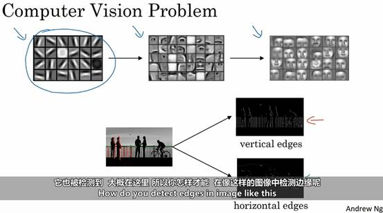

### 边缘检测的步骤

1. **输入图像**：

   - 假设我们有一个 ($6 \times 6$) 的灰度图像，表示为 ($6 \times 6 \times 1$)，其中每个像素点的值表示灰度级别。

2. **创建过滤器（滤波器）**：

   - 为了检测垂直边缘，我们需要创建一个 ($3 \times 3$) 的过滤器（也称为核）。一个常见的垂直边缘检测过滤器是Sobel过滤器：
     $$
     \begin{bmatrix}
     -1 & 0 & 1 \\
     -2 & 0 & 2 \\
     -1 & 0 & 1
     \end{bmatrix}
     $$
     
- 类似地，水平边缘检测过滤器可以是：
     $$
     \begin{bmatrix}
     -1 & -2 & -1 \\
      0 &  0 &  0 \\
      1 &  2 &  1
     \end{bmatrix}
     $$
     **卷积操作**：
   
  - 将 ($3 \times 3$) 的过滤器与 ($6 \times 6$) 的图像进行卷积操作。卷积的过程是将过滤器在图像上滑动，并计算每个位置的点积。
     - 具体来说，将过滤器放在图像的一个位置，计算过滤器与图像对应区域的点积，然后将结果作为输出图像的一个像素值。
  
  **得到边缘检测结果**：
  
  - 完成卷积操作后，我们得到一个新的图像，这个图像包含了垂直边缘的信息。同样地，我们可以使用水平边缘检测过滤器进行卷积，得到水平边缘的信息。

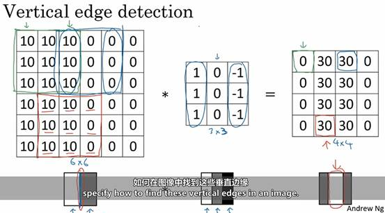

​	水平和竖直过滤器

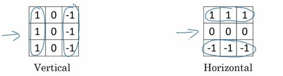

### 正边缘和负边缘

即由亮变暗和由暗变量的边缘过渡。

1. **正边缘**：
   - 正边缘是指从亮到暗的过渡。在图像中，这种边缘通常表示亮的区域突然变成暗的区域。
   - 例如，在一个白色背景上有一个黑色物体的边缘，这个边缘就是正边缘。
2. **负边缘**：
   - 负边缘是指从暗到亮的过渡。在图像中，这种边缘通常表示暗的区域突然变成亮的区域。
   - 例如，在一个黑色背景上有一个白色物体的边缘，这个边缘就是负边缘。

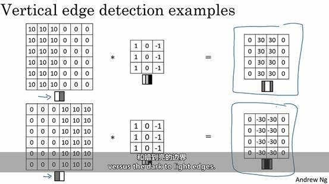

### 几种其他的过滤器

$Sobel filter$：给予了中间行赋予了更大的权重，从而使得其更加稳定,在上文中有提及。

$Scharr filter$：$Scharr$过滤器是$Sobel$过滤器的改进版本，特别适用于检测图像中的细微边缘。它在计算梯度时更加精确，尤其是在噪声较多的图像中表现更好。典型的$Scharr$过滤器如下：

垂直边缘检测:
$$
\begin{bmatrix}
-3 & 0 & 3 \\
-10 & 0 & 10 \\
-3 & 0 & 3
\end{bmatrix}
$$
水平边缘检测：
$$
\begin{bmatrix}
-3 & -10 & -3 \\
 0 &   0 &  0 \\
 3 &  10 &  3
\end{bmatrix}
$$

### 反向传播学习过滤器参数

​	如果想要检测一些复杂的图形边界，可能并不需要挑选出这9个矩阵元素，可以把矩阵里的这9个元素当做参数，通过反向传播学习，得到他们的值，目的是要获得这9个参数使得对于这个6*6的图片卷积3*3的过滤器可以得到一个优良的边检检测器，反向传播学习选择得到上述3个过滤器，除了垂直边界和水平边界，也可以学习到检测45°边界等多个随意度数的边界过滤器，因此这样使得通告反向传播可以学习到任何所需的3*3的过滤器。

在卷积神经网络（CNN）中，我们可以通过反向传播算法来学习过滤器的参数，而不需要手动设计过滤器。这种方法的优势在于：

1. **自动化学习**：通过反向传播，神经网络可以自动调整过滤器的参数，以最小化损失函数，从而学习到最优的边缘检测器。
2. **灵活性**：除了垂直和水平边缘，网络还可以学习到检测任意角度的边缘（如45°边缘）以及复杂的图形边界。
3. **适应性**：网络可以根据具体的任务和数据集，学习到最适合的过滤器，从而提高检测精度。

​	初始的 ($3 \times 3$) 过滤器可能是随机初始化的：
$$
\begin{bmatrix}
a & b & c \\
d & e & f \\
g & h & i
\end{bmatrix}
$$

通过训练，网络会调整这些参数 $(a, b, c, d, e, f, g, h, i) $以最小化损失函数，从而学习到最优的边缘检测器。

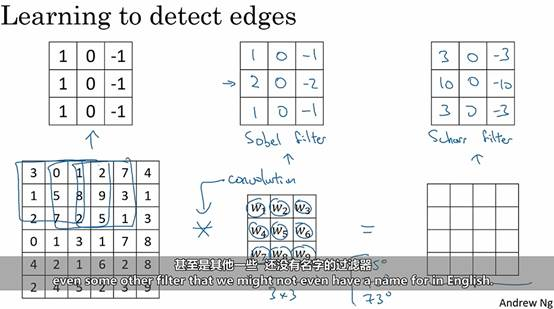

### 填充

​	为构建深层神经网络，对基本的卷积操作的改进是填充$(padding)$,当一个$n*n$的图片被一个$f*f$的过滤器卷积，得到的是一个$(n-f+1)*(n-f+1)$的图像。而这会导致两个缺陷，每一次使用一次卷积操作，则图片会缩小；通过在图像边缘添加填充，我们可以保持图像的尺寸。使用大小为$P$像素的填充，可以使卷积后的图像尺寸变为$((n+2p-f+1) \times (n+2p-f+1))$。这样，填充可以有效地防止图像尺寸过度缩小。

​	在没有填充的情况下，图像边缘和角落的像素只会被卷积核覆盖一次，而图像中间的像素会被卷积核多次覆盖。这会导致边界和角落的信息在卷积过程中被忽略或丢失。通过添加填充，我们可以确保卷积核在图像边缘和角落也能多次覆盖这些像素，从而保留更多的边界信息。	

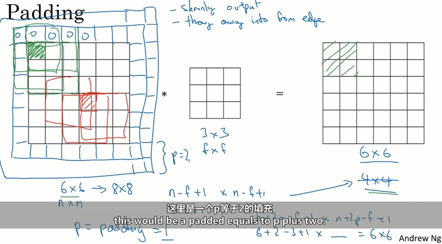

关于填充的数量，我们通常有两个选择，则vaild卷积和same卷积。 

通常有两种填充方式：valid卷积和same卷积。

- **Valid卷积**：没有填充，输出图像尺寸会缩小。
- **Same卷积**：填充使得输出图像尺寸与输入图像尺寸相同。对于大小为$(f \times f)$的卷积核，填充的数量$(p)$可以通过公式$p = \frac{f-1}{2}$计算得出。当(f)为奇数时，(p)是一个整数，这样可以确保输入和输出图像尺寸相同。

卷积核通常选择奇数大小（如3x3、5x5等），主要有以下几个原因：

- **中心点的存在**：奇数大小的卷积核有一个明确的中心点，使得卷积操作在图像的每个位置都能对称地应用卷积核。

- **填充计算的简化**：当卷积核大小为奇数时，填充数量(p)是整数，计算更加简便。

- **对称性和边界处理**：奇数大小的卷积核在处理图像边界时更加对称，有助于保留边界信息。

### 卷积步长

​	带步长卷积是指在进行卷积操作时，卷积核每次移动的步长（stride）大于1。假设输入图像的尺寸为$(n \times n)$，卷积核的尺寸为$(f \times f)$，填充为$(p)$，步长为$(S)$，在计算输出尺寸时，如果分数的结果不是整数，我们需要向下取整。因为卷积核在图像上移动时，必须完全覆盖图像的区域。如果不向下取整，卷积核可能会超出图像的边界，导致无法进行有效的卷积操作。则输出图像的尺寸可以通过以下公式计算：
$$
\text{输出尺寸} = \left\lfloor \frac{n + 2p - f}{S} \right\rfloor + 1
$$
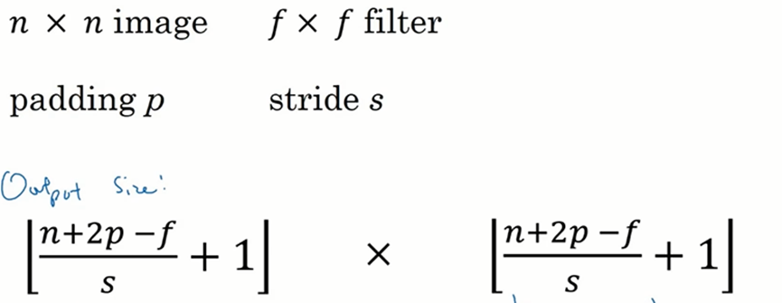

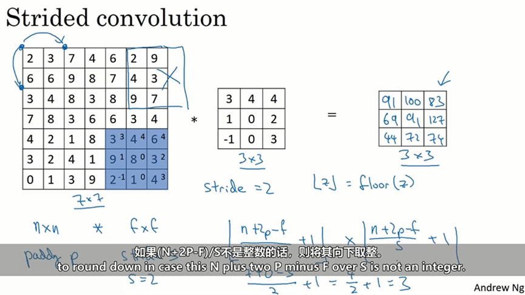

### 交叉相关与卷积

- **卷积（Convolution）**：在信号处理中，卷积操作通常包括将一个信号（或图像）与一个过滤器（或核）进行卷积。这个过程包括将过滤器翻转，然后在信号上滑动并计算点积。
- **交叉相关（Cross-Correlation）**：在深度学习中，交叉相关操作与卷积类似，但没有翻转过滤器。过滤器直接在输入信号上滑动并计算点积。

在深度学习中，卷积层的主要目的是提取特征，而不是进行信号处理中的严格数学操作而在深度学习中更常用交叉相关,而且使用交叉相关而不是严格的卷积并不会影响深度学习模型的性能：

- **计算效率**：交叉相关省略了过滤器翻转的步骤，计算上更为简单和高效。
- **实现简便**：在实际实现中，交叉相关更容易理解和实现，特别是在使用深度学习框架（如$TensorFlow$、$PyTorch$）时。
- **特征提取一致性**：在深度学习中，卷积层的主要目的是提取特征，而不是进行严格的数学卷积操作。交叉相关在特征提取方面表现良好，并且在实践中效果显著。

​	尽管技术上深度学习中进行的是交叉相关操作，但由于历史原因和约定俗成的命名，我们仍然称之为“卷积”。这种命名方式已经被广泛接受，并且在文献和实践中普遍使用。

### 三维卷积

​	在二维卷积中，我们处理的是单通道的灰度图像，而在三维卷积中，我们处理的是多通道的彩色图像。彩色图像通常有三个通道：红色（R）、绿色（G）和蓝色（B）。三维卷积的过滤器不仅在空间维度上滑动，还在通道维度上进行操作。过滤器的通道数必须与输入图像的通道数相同。这是因为每个通道都包含不同的颜色信息，过滤器需要在每个通道上进行卷积操作，以提取特征。例如，对于一个RGB图像，过滤器的通道数也必须是3，以便在红色、绿色和蓝色通道上分别进行卷积。

​	通过设定RGB三个维度的不同数字，我们可以调节需要检测的颜色。例如，如果我们希望检测红色特征，可以在过滤器的红色通道上设置较高的权重，而在绿色和蓝色通道上设置较低的权重。这样，过滤器在卷积操作中会更关注红色通道的信息。如果我们希望仅仅检测边界而不在意颜色，可以在所有通道上设置相同的权重。这样，过滤器在卷积操作中会均匀地处理所有颜色通道，从而提取边界特征，而不偏向任何特定的颜色。尽管输入图像有多个通道，三维卷积的输出通常是一维的。这是因为卷积操作会将多通道的信息融合在一起，生成一个综合的特征图。这个特征图包含了所有通道的信息，并且可以用于后续的处理和分析。

​	假设我们有一个大小为$(32 \times 32 \times 3)$的RGB图像，使用一个大小为$(5 \times 5 \times 3)$的过滤器进行卷积。过滤器在每个通道上分别进行卷积操作，然后将结果相加，生成一个大小为$(28 \times 28 \times 1)$的特征图。

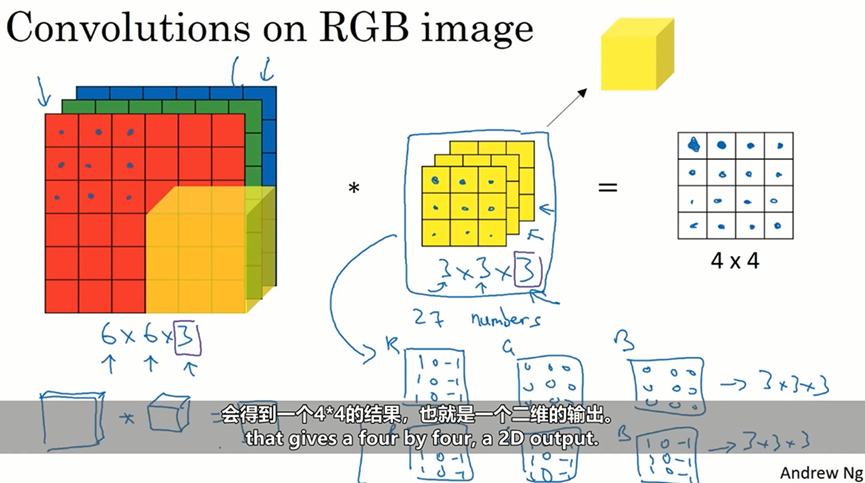

​	在卷积神经网络中，我们可以使用多个过滤器来检测不同的特征。例如，一个过滤器可以用来检测垂直边缘，另一个过滤器可以用来检测水平边缘，还有其他过滤器可以用来检测不同角度的边缘。每个过滤器在图像上滑动并计算点积，生成一个特征图，将这些特征图叠加在一起，我们可以得到一个包含所有过滤器输出的多通道特征图。这些特征图的叠加可以捕捉到图像中的不同特征，从而提高模型的识别能力。

​	假设输入图像的尺寸为$(n \times n \times n_c)$（其中$(n_c)$是通道数），过滤器的尺寸为$(f \times f \times n_c)$，步长为$(S)$，填充为$(p)$。每个过滤器会生成一个大小为$(\frac {(n+2p-f)}S + 1 \times \frac {(n+2p-f)}S + 1)$的特征图。

​	如果我们使用(k)个过滤器，每个过滤器都会生成一个特征图。将这些特征图叠加在一起，输出的特征图的尺寸为$((\frac {(n+2p-f)}S + 1) \times (\frac {(n+2p-f)}S + 1) \times k)$。

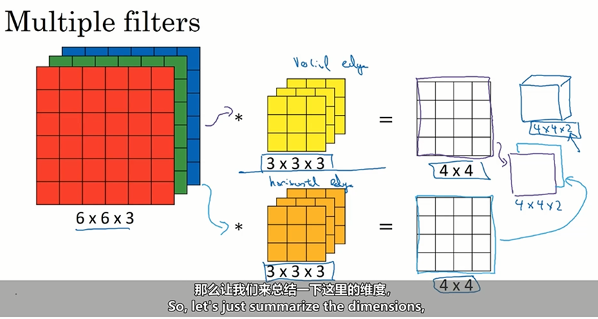

## 1.2-卷积网络层

​	在卷积层中，过滤器的作用和$w^{[1]}$的作用相似，之前我们在卷积计算中，我们有27个输入，或者确切的说，是两组27个输入，因为我们有两个过滤器，我们需要把上面这些数字相乘，其实就是通过一个线性方程计算得到了一个$4\times4$的矩阵，因此这里通过卷积得到的的$4\times4$矩阵的过程和$w^{[1]}*a^{[0]}$的过程类似，然后添加偏差值$b$，因此下图方框中，添加了偏差的式子的作用和$z$类似，最后应用非线性方程，此处的输出就成了下一层神经网络的激活函数。

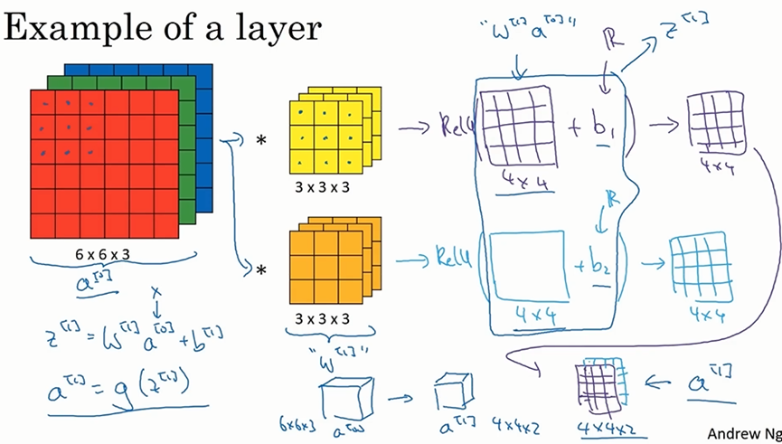

### 卷积层的符号标识

​	1. 卷积层的参数

- **$( f^{[l]} )$**：过滤器的大小（filter size），即卷积核的尺寸。

- **$( p^{[l]} )$**：填充（padding），即在输入图像的边缘添加的像素数。

- **$( s^{[l]} )$**：步长（stride），即卷积核在图像上滑动的步长。

- **$( n_c^{[l]} )$**：过滤器的数量（number of filters），即卷积层中使用的卷积核的数量。

​	2. 激活函数的维度

- **高度（Height）**：$( n_H^{[l]} = \left\lfloor \frac{n_{H_{prev}} + 2p^{[l]} - f{[l]}}{s{[l]}} + 1 \right\rfloor )$
- **宽度（Width）**：$( n_W^{[l]} = \left\lfloor \frac{n_{W_{prev}} + 2p^{[l]} - f{[l]}}{s{[l]}} + 1 \right\rfloor )$

​	3. 过滤器的尺寸

- 每个过滤器的尺寸为 $( f^{[l]} \times f^{[l]} \times n_c^{[l-1]} )$，其中$ ( n_c^{[l-1]} ) $是前一层的通道数。

​	4. 权重和偏置

- **权重（Weights）**：$( W_1, W_2, …, W_{n_c^{[l]}} )$，表示每个过滤器的权重。
- **偏置（biases）**：$( b_1, b_2, …, b_{n_c^{[l]}} )$，表示每个过滤器的偏置项。

​	**输入和输出维度**

- **输入维度**：$( n_H^{[l-1]} \times n_W^{[l-1]} \times n_c^{[l-1]} )$
- **输出维度**：$( n_H^{[l]} \times n_W^{[l]} \times n_c^{[l]} )$

​		这些维度表示输入图像和输出特征图的高度、宽度和通道数。

- $A^{[L]}$是进行批量化或者矩阵化后的激活函数。

### 卷积网络的简单示例

​	每个卷积层通常会使用多个过滤器，每个过滤器生成一个特征图。随着卷积层的增加，过滤器的数量（即通道数）也会增加。

​	在卷积层和池化层之后，特征图会被扁平化为一个向量，然后输入到全连接层（Fully Connected Layer）中进行分类。全连接层通过线性变换和激活函数，将特征向量映射到输出类别。

​	随着卷积神经网络层数的增加，图像的空间尺寸（高度和宽度）会逐渐减小，而通道数（深度）会逐渐增加。这是因为卷积和池化操作会减小特征图的尺寸，而更多的过滤器会提取更多的特征。最终，特征图会被扁平化为一个向量，输入到全连接层中进行分类。

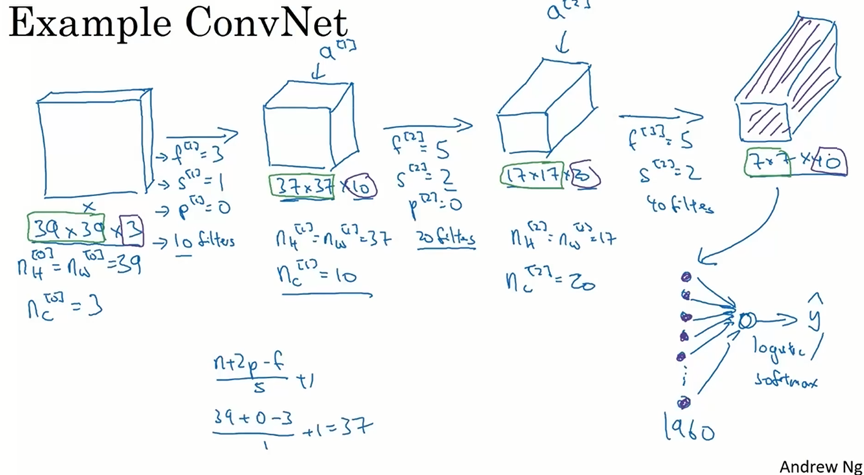

**1. 卷积层（Convolutional Layer, Conv）**

**作用**：卷积层是CNN的核心组件，用于提取输入图像的特征。通过卷积操作，卷积层能够捕捉到图像中的局部特征，如边缘、纹理和形状。

**命名原因**：卷积层之所以称为“卷积层”，是因为它执行的主要操作是卷积（convolution）。卷积操作包括使用多个过滤器（filters）在输入图像上滑动，计算局部区域的加权和，从而生成特征图（feature maps）。

**2. 池化层（Pooling Layer, Pool）**

**作用**：池化层用于减小特征图的尺寸，同时保留重要的特征。常见的池化操作包括最大池化（Max Pooling）和平均池化（Average Pooling）。池化层有助于减少计算量和参数数量，并引入一定程度的平移不变性。

**命名原因**：池化层之所以称为“池化层”，是因为它执行的主要操作是池化（pooling）。池化操作通过在局部区域内取最大值或平均值，来减小特征图的尺寸。

**3. 全连接层（Fully Connected Layer, FC）**

**作用**：全连接层通常位于卷积神经网络的末端，用于高层次的特征表示和分类。全连接层中的每个神经元与前一层的所有神经元相连，类似于传统的多层感知器（MLP）。

**命名原因**：全连接层之所以称为“全连接层”，是因为它的每个神经元与前一层的所有神经元都有连接。这种全连接的结构使得全连接层能够综合前面卷积层和池化层提取的特征，用于最终的分类任务。

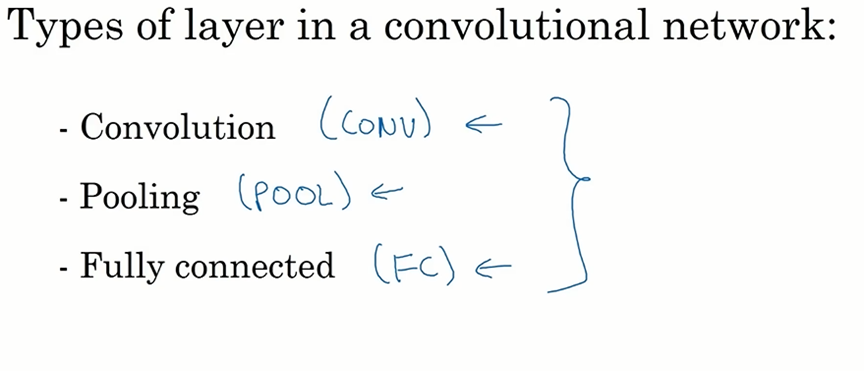

## 1.3-池化层

### Max Pooling

​	池化层（Pooling Layer）在卷积神经网络（CNN）中起着至关重要的作用，主要用于减少特征图的尺寸，从而降低计算复杂度并防止过拟合。让我们详细解释一下你提到的最大池化（Max Pooling）过程。

1. **减少计算量**：通过减少特征图的尺寸，最大池化降低了后续层的计算量。
2. **特征提取**：最大池化保留了特征图中最显著的特征（即最大值），这有助于检测重要的特征，例如边缘或纹理。
3. **防止过拟合**：通过减少特征图的尺寸，最大池化有助于防止模型过拟合训练数据。

​	假设我们在一个图像中检测边缘。一个大的激活值可能表示检测到了一个边缘。通过最大池化，我们保留了这些大的激活值，从而在较小的特征图中仍然能够检测到边缘。

我们使用一个 ($2 \times 2$) 的池化窗口（即 $(f = 2)$），步长 $(s = 2)$。最大池化的过程如下：

**最大池化（Max Pooling）的工作原理**

假设我们有一个 ($4 \times 4$) 的输入特征图，如下所示：
$$
\begin{bmatrix}
1 & 3 & 2 & 4 \\
5 & 6 & 1 & 2 \\
7 & 8 & 9 & 0 \\
4 & 3 & 2 & 1 \\
\end{bmatrix}
$$
**第一步**：将池化窗口放在输入特征图的左上角，覆盖第一个 ($2 \times 2$) 区域：
$$
\begin{bmatrix}
1 & 3 \\
5 & 6 \\
\end{bmatrix}
$$
这个区域的最大值是 6。

**第二步**：将池化窗口向右移动$ (s = 2)$ 个单位，覆盖下一个 ($2 \times 2$) 区域：
$$
\begin{bmatrix}
2 & 4 \\
1 & 2 \\
\end{bmatrix}
$$
这个区域的最大值是 4。

​	以此类推，最终，经过最大池化后的输出特征图为：
$$
\begin{bmatrix}
6 & 4 \\
8 & 9 \\
\end{bmatrix}
$$
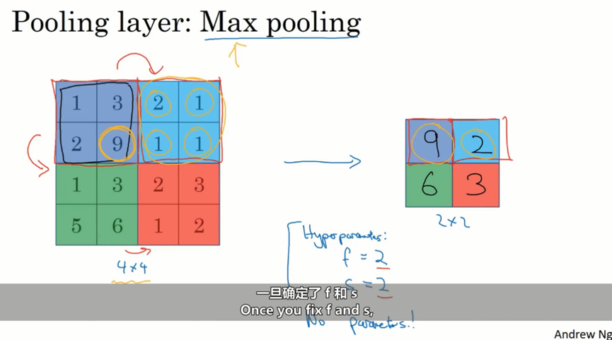

**池化层的多通道处理**

​	池化层（如最大池化）处理多通道输入时，每个通道独立进行池化操作。假设输入特征图有 $(n_c)$ 个通道，每个通道的尺寸为$ (n_H \times n_W)$，池化窗口的尺寸为 $(f \times f)$，步长为 (s)。

1. **独立池化**：池化操作在每个通道上独立进行，不同通道之间没有相互影响。
2. **输出通道**：池化层的输出特征图将保留与输入相同的通道数 $(n_c)$，但每个通道的尺寸将减小。

#### 最大池化的超参数

最大池化有两个主要的超参数：

1. **池化窗口的尺寸 (f)**：决定每次池化操作覆盖的区域大小。
2. **步长 (s)**：决定池化窗口在特征图上移动的步幅。

​	与卷积层不同，最大池化层没有需要通过训练学习的参数。卷积层有滤波器（权重）和偏置，这些参数需要通过反向传播和梯度下降算法进行更新。而最大池化层只需要确定池化窗口的尺寸和步长，一旦确定，这些参数在整个训练过程中保持不变。

1. **固定操作**：最大池化的操作是固定的，即在每个池化窗口内选择最大值。这种操作不依赖于数据的特定特征，因此不需要通过训练来调整参数。
2. **简化计算**：由于没有需要学习的参数，最大池化层的计算相对简单，只需执行最大值选择操作。这减少了计算复杂度和内存需求。

#### 输出与输入的关系

最大池化层的输出尺寸可以通过以下公式计算，与卷积层的计算公式相同：
$$
\text{输出高度} = \left\lfloor \frac{\text{输入高度} - f}{s} \right\rfloor + 1
$$

$$
\text{输出宽度} = \left\lfloor \frac{\text{输入宽度} - f}{s} \right\rfloor + 1
$$

### Average pooling

​	平均池化的过程是将池化窗口覆盖的区域内的所有值取平均值。例如，假设我们有一个$ (2 \times 2)$ 的池化窗口，输入特征图的一部分如下：
$$
\begin{bmatrix}
1 & 3 \\
5 & 6 \\
\end{bmatrix}
$$
平均池化的结果是：
$$
\frac{1 + 3 + 5 + 6}{4} = 3.75
$$
**而一般Max Pooling 更常用一点**

1. **特征保留**：最大池化保留了特征图中最显著的特征（即最大值），这有助于检测重要的特征，例如边缘或纹理。相比之下，平均池化会平滑特征，可能会丢失一些重要的细节。
2. **稀疏表示**：最大池化有助于生成稀疏表示，这对于某些任务（如图像分类）非常有用。稀疏表示可以减少计算量并提高模型的泛化能力。
3. **非线性特征**：最大池化引入了一种非线性操作，这有助于模型学习更复杂的特征。平均池化则是线性操作，可能在某些情况下不如最大池化有效。

在非常大的神经网络中，有时会使用平均池化来合并表示。这是因为：

1. **平滑效果**：在某些情况下，平滑特征图可以减少噪声，帮助模型更好地学习全局特征。
2. **梯度消失问题**：在深层网络中，平均池化可以帮助缓解梯度消失问题，因为它不会像最大池化那样产生稀疏梯度。

## 1.4-CNN

1. **卷积层（Convolutional Layer）**：
   - **权重和参数**：卷积层有需要学习的参数，即滤波器（权重）和偏置。这些参数通过反向传播和梯度下降算法进行更新。
   - **操作**：卷积层通过卷积操作提取输入特征图中的局部特征，生成新的特征图。
2. **池化层（Pooling Layer）**：
   - **超参数**：池化层没有需要学习的参数，只有一些超参数，如池化窗口的尺寸 (f) 和步长 (s)。
   - **操作**：池化层通过池化操作（如最大池化或平均池化）减少特征图的尺寸，保留重要特征，降低计算复杂度。

下面是一个简单的识别手写字体的例子，其流程图基本上如下图所示。

1. **Conv1**：第一个卷积层，输入尺寸为$ (32 \times 32 \times 1)$，输出尺寸为 $(28 \times 28 \times 6)$。
2. **Pool1**：第一个池化层，输入尺寸为$ (28 \times 28 \times 6)$，输出尺寸为 $(14 \times 14 \times 6)$。
3. **Conv2**：第二个卷积层，输入尺寸为 $(14 \times 14 \times 6)$，输出尺寸为$ (10 \times 10 \times 16)$。
4. **Pool2**：第二个池化层，输入尺寸为$ (10 \times 10 \times 16)$，输出尺寸为$ (5 \times 5 \times 16)$。
5. **全连接层（FC3 和 FC4）**：将池化层的输出展平并输入到全连接层，最终通过$Softmax$层进行分类。

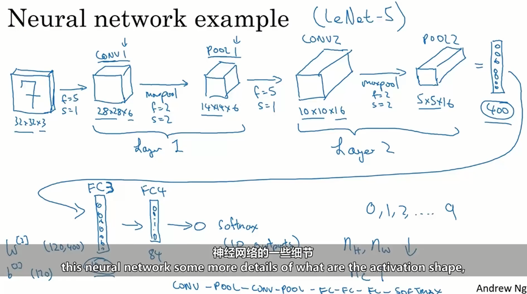

​	在卷积神经网络中，随着网络的深入，卷积层的特征图尺寸通常会逐渐减小，而通道数（特征图的深度）会逐渐增加。这是因为：

1. **尺寸减小**：通过卷积操作和池化操作，特征图的空间尺寸（高度和宽度）会逐渐减小。这有助于减少计算量和内存需求。
2. **通道数增加**：随着网络的深入，卷积层会提取越来越多的高级特征，因此需要更多的通道来表示这些特征。

​	大多数参数集中在全连接层（Fully Connected Layers）。这是因为全连接层的每个神经元与前一层的所有神经元相连，因此参数数量非常多。相比之下，卷积层的参数数量相对较少，因为卷积滤波器的尺寸通常较小。随着网络的深入，特征图的空间尺寸逐渐减小。这是通过卷积操作和池化操作实现的。特征图尺寸的减小有助于减少计算复杂度，同时保留重要的特征信息。

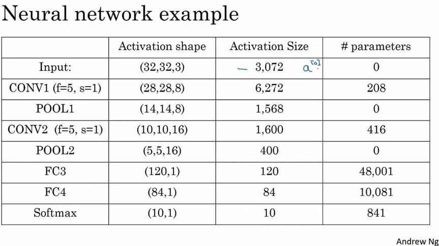

### 为什么要用卷积

**参数共享**

**参数共享**是指在卷积层中，同一个滤波器$（kernel）$在整个输入特征图上滑动，应用于不同的位置。这意味着同一个滤波器的参数在整个输入图像上共享使用。

​	假设我们有一个 $(32 \times 32 \times 3)$ 的输入图像（即 3072 个激活参数），使用尺寸为$ (5 \times 5)$ 的 6 个滤波器。每个滤波器有$ (5 \times 5 \times 3 = 75) $个参数，加上一个偏置，共有 $(75 + 1 = 76)$ 个参数。6 个滤波器总共有 $(76 \times 6 = 456) $个参数。

- 每个滤波器的参数数量：$(5 \times 5 \times 3 = 75)$
- 每个滤波器的偏置：$1$
- 每个滤波器的总参数：$(75 + 1 = 76)$
- 6 个滤波器的总参数：$(76 \times 6 = 456)$

**稀疏连接**

**稀疏连接**是指卷积层中的每个输出神经元只与输入特征图中的一小部分神经元相连。这与全连接层不同，全连接层中的每个神经元与前一层的所有神经元相连。

在全连接层中，如果我们有一个$ (32 \times 32 \times 3) $的输入图像（3072 个激活参数），并希望生成一个 $(28 \times 28 \times 6) $的输出（4704 个激活参数），则需要 $(3072 \times 4704 \approx 1440) $万个参数。这是一个非常庞大的数字，尤其是在处理高分辨率图像时。

- 输入神经元数量：$3072$
- 输出神经元数量：$4704$
- 总参数数量：$(3072 \times 4704 \approx 1440) 万$

​	**卷积神经网络（CNN）参数较少的两个主要原因：**参数共享和稀疏连接，确实是CNN在处理图像数据时的关键优势。

​	假设我们有一个$ (32 \times 32 \times 3)$ 的输入图像，使用尺寸为$ (3 \times 3)$ 的滤波器来检测垂直边缘。这个滤波器会在输入图像的每个位置滑动，检测垂直边缘。由于滤波器的参数在整个图像上共享，我们只需要学习一个$ (3 \times 3) $的滤波器，而不是为每个位置学习不同的参数。

​	使用一个 $(3 \times 3)$ 的滤波器：
$$
\begin{bmatrix}
1 & 0 & -1 \\
1 & 0 & -1 \\
1 & 0 & -1 \\
\end{bmatrix}
$$
​	这个滤波器可以在整个图像上滑动，检测垂直边缘。这样，我们只需要学习 9 个参数，而不是为每个位置学习不同的参数。

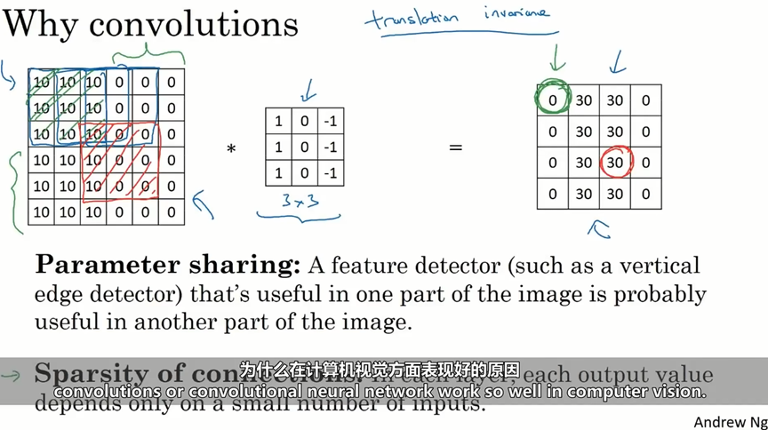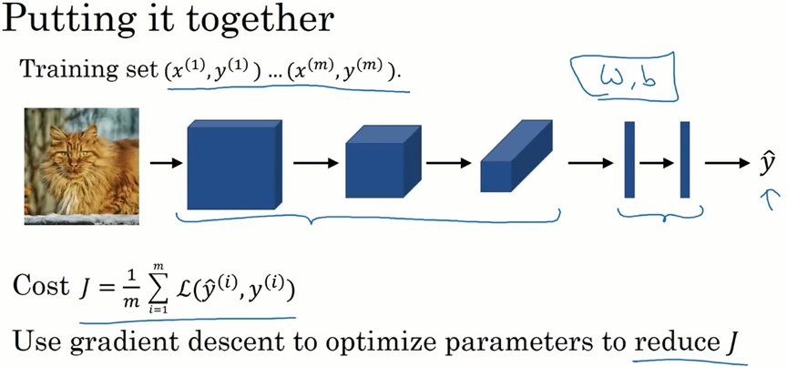

## 1.5-案例研究

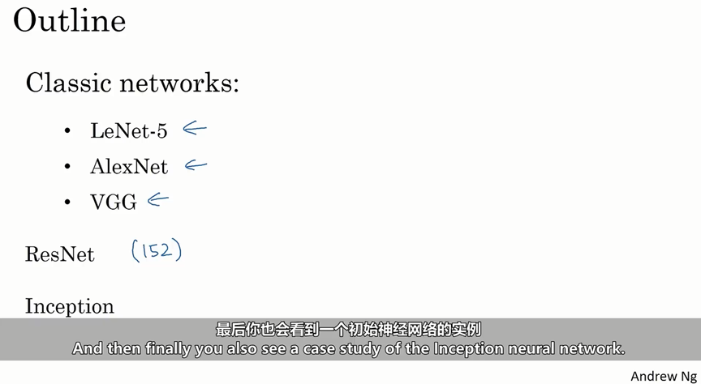

### 经典网络

#### LeNet-5

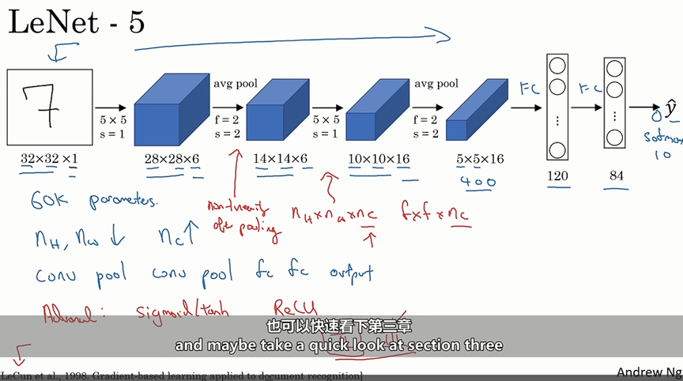

#### AlexNet

​	其中输入输出没有变化的就是使用了same填充。

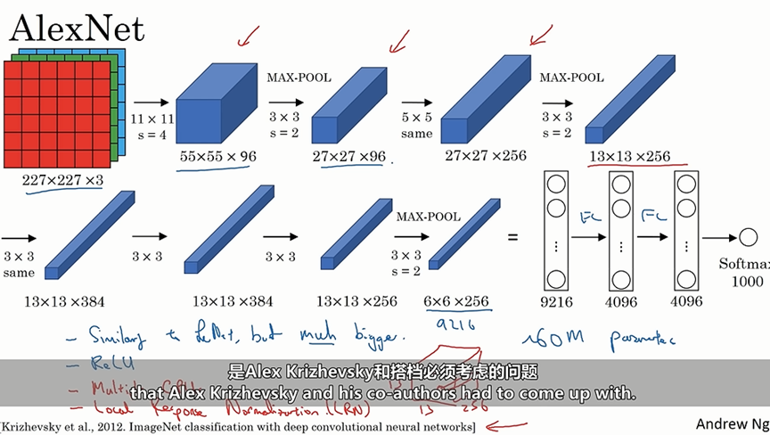
