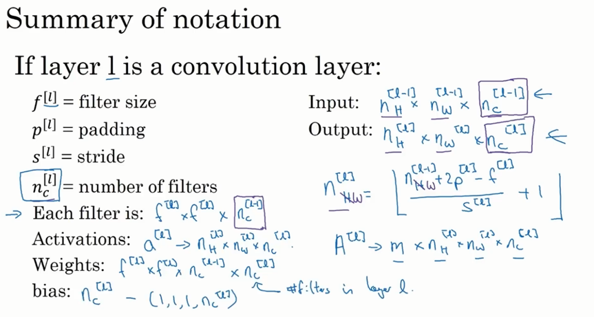
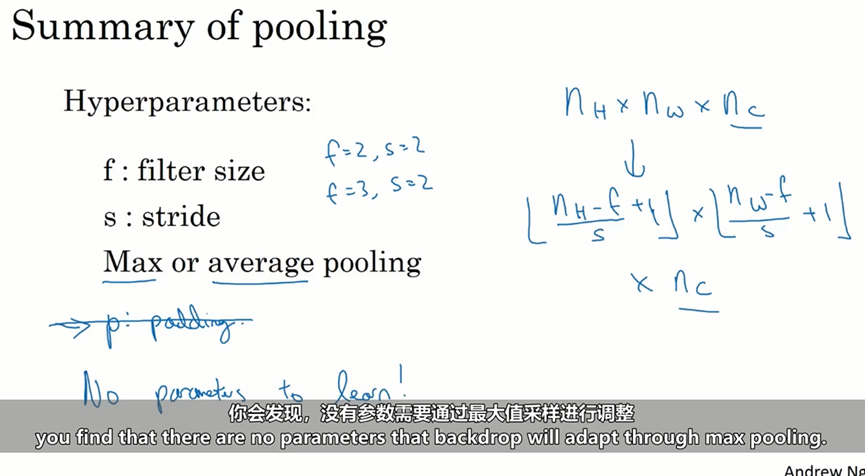
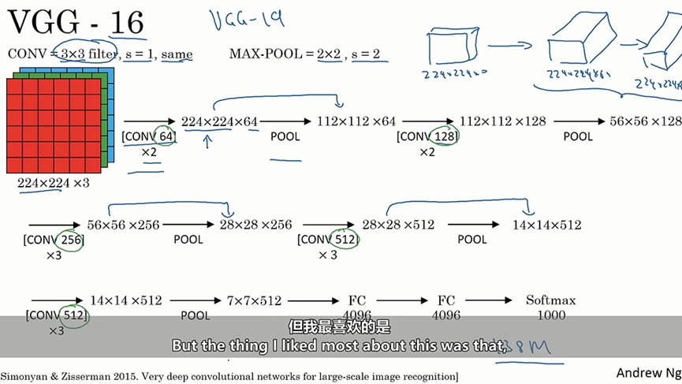
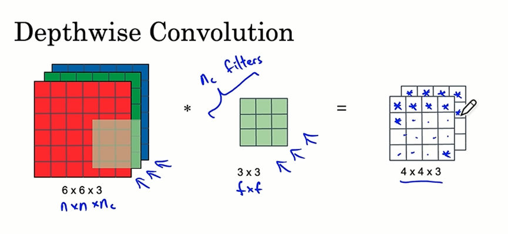
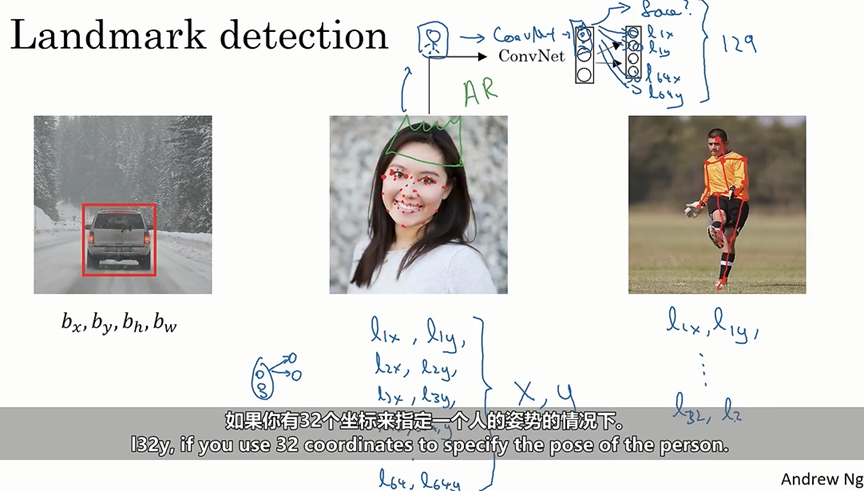
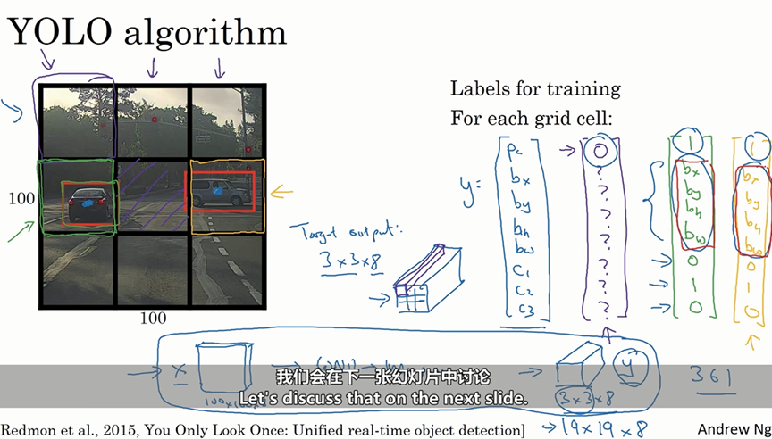
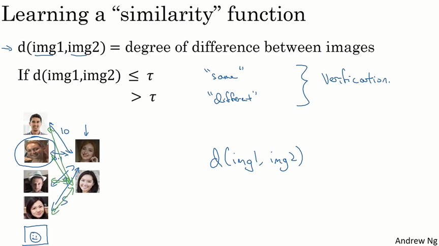

# 	卷积网络

## 1.1-卷积运算

### 边缘检测

​	边缘检测就是从一个小边缘到整体图像，比如要在一个图片中进行垂直检测或者水平检测，绘画出图像的轮廓。

### 边缘检测的步骤

1. **输入图像**：

   - 假设我们有一个 ($6 \times 6$) 的灰度图像，表示为 ($6 \times 6 \times 1$)，其中每个像素点的值表示灰度级别。

2. **创建过滤器（滤波器）**：

   - 为了检测垂直边缘，我们需要创建一个 ($3 \times 3$) 的过滤器（也称为核）。一个常见的垂直边缘检测过滤器是Sobel过滤器：
     $$
     \begin{bmatrix}
     -1 & 0 & 1 \\
     -2 & 0 & 2 \\
     -1 & 0 & 1
     \end{bmatrix}
     $$
     
- 类似地，水平边缘检测过滤器可以是：
     $$
     \begin{bmatrix}
     -1 & -2 & -1 \\
      0 &  0 &  0 \\
      1 &  2 &  1
     \end{bmatrix}
     $$
     **卷积操作**：
   
  - 将 ($3 \times 3$) 的过滤器与 ($6 \times 6$) 的图像进行卷积操作。卷积的过程是将过滤器在图像上滑动，并计算每个位置的点积。
     - 具体来说，将过滤器放在图像的一个位置，计算过滤器与图像对应区域的点积，然后将结果作为输出图像的一个像素值。
  
  **得到边缘检测结果**：
  
  - 完成卷积操作后，我们得到一个新的图像，这个图像包含了垂直边缘的信息。同样地，我们可以使用水平边缘检测过滤器进行卷积，得到水平边缘的信息。

​	水平和竖直过滤器

### 正边缘和负边缘

即由亮变暗和由暗变量的边缘过渡。

1. **正边缘**：
   - 正边缘是指从亮到暗的过渡。在图像中，这种边缘通常表示亮的区域突然变成暗的区域。
   - 例如，在一个白色背景上有一个黑色物体的边缘，这个边缘就是正边缘。
2. **负边缘**：
   - 负边缘是指从暗到亮的过渡。在图像中，这种边缘通常表示暗的区域突然变成亮的区域。
   - 例如，在一个黑色背景上有一个白色物体的边缘，这个边缘就是负边缘。

### 几种其他的过滤器

$Sobel filter$：给予了中间行赋予了更大的权重，从而使得其更加稳定,在上文中有提及。

$Scharr filter$：$Scharr$过滤器是$Sobel$过滤器的改进版本，特别适用于检测图像中的细微边缘。它在计算梯度时更加精确，尤其是在噪声较多的图像中表现更好。典型的$Scharr$过滤器如下：

垂直边缘检测:
$$
\begin{bmatrix}
-3 & 0 & 3 \\
-10 & 0 & 10 \\
-3 & 0 & 3
\end{bmatrix}
$$
水平边缘检测：
$$
\begin{bmatrix}
-3 & -10 & -3 \\
 0 &   0 &  0 \\
 3 &  10 &  3
\end{bmatrix}
$$

### 反向传播学习过滤器参数

​	如果想要检测一些复杂的图形边界，可能并不需要挑选出这9个矩阵元素，可以把矩阵里的这9个元素当做参数，通过反向传播学习，得到他们的值，目的是要获得这9个参数使得对于这个6*6的图片卷积3*3的过滤器可以得到一个优良的边检检测器，反向传播学习选择得到上述3个过滤器，除了垂直边界和水平边界，也可以学习到检测45°边界等多个随意度数的边界过滤器，因此这样使得通告反向传播可以学习到任何所需的3*3的过滤器。

在卷积神经网络（CNN）中，我们可以通过反向传播算法来学习过滤器的参数，而不需要手动设计过滤器。这种方法的优势在于：

1. **自动化学习**：通过反向传播，神经网络可以自动调整过滤器的参数，以最小化损失函数，从而学习到最优的边缘检测器。
2. **灵活性**：除了垂直和水平边缘，网络还可以学习到检测任意角度的边缘（如45°边缘）以及复杂的图形边界。
3. **适应性**：网络可以根据具体的任务和数据集，学习到最适合的过滤器，从而提高检测精度。

​	初始的 ($3 \times 3$) 过滤器可能是随机初始化的：
$$
\begin{bmatrix}
a & b & c \\
d & e & f \\
g & h & i
\end{bmatrix}
$$

通过训练，网络会调整这些参数 $(a, b, c, d, e, f, g, h, i) $以最小化损失函数，从而学习到最优的边缘检测器。

### 填充

​	为构建深层神经网络，对基本的卷积操作的改进是填充$(padding)$,当一个$n*n$的图片被一个$f*f$的过滤器卷积，得到的是一个$ (n-f+1)*(n-f+1) $的图像。而这会导致两个缺陷，每一次使用一次卷积操作，则图片会缩小；通过在图像边缘添加填充，我们可以保持图像的尺寸。使用大小为$P$像素的填充，可以使卷积后的图像尺寸变为$((n+2p-f+1) \times (n+2p-f+1)) $。这样，填充可以有效地防止图像尺寸过度缩小。

​	在没有填充的情况下，图像边缘和角落的像素只会被卷积核覆盖一次，而图像中间的像素会被卷积核多次覆盖。这会导致边界和角落的信息在卷积过程中被忽略或丢失。通过添加填充，我们可以确保卷积核在图像边缘和角落也能多次覆盖这些像素，从而保留更多的边界信息。	

关于填充的数量，我们通常有两个选择，则vaild卷积和same卷积。 

通常有两种填充方式：valid卷积和same卷积。

- **Valid卷积**：没有填充，输出图像尺寸会缩小。
- **Same卷积**：填充使得输出图像尺寸与输入图像尺寸相同。对于大小为$(f \times f)$的卷积核，填充的数量$(p)$可以通过公式$p = \frac{f-1}{2}$计算得出。当(f)为奇数时，(p)是一个整数，这样可以确保输入和输出图像尺寸相同。

卷积核通常选择奇数大小（如3x3、5x5等），主要有以下几个原因：

- **中心点的存在**：奇数大小的卷积核有一个明确的中心点，使得卷积操作在图像的每个位置都能对称地应用卷积核。

- **填充计算的简化**：当卷积核大小为奇数时，填充数量(p)是整数，计算更加简便。

- **对称性和边界处理**：奇数大小的卷积核在处理图像边界时更加对称，有助于保留边界信息。

### 卷积步长

​	带步长卷积是指在进行卷积操作时，卷积核每次移动的步长（stride）大于1。假设输入图像的尺寸为$(n \times n)$，卷积核的尺寸为$(f \times f)$，填充为$(p)$，步长为$(S)$，在计算输出尺寸时，如果分数的结果不是整数，我们需要向下取整。因为卷积核在图像上移动时，必须完全覆盖图像的区域。如果不向下取整，卷积核可能会超出图像的边界，导致无法进行有效的卷积操作。则输出图像的尺寸可以通过以下公式计算：
$$
\text{输出尺寸} = \left\lfloor \frac{n + 2p - f}{S} \right\rfloor + 1
$$

### 交叉相关与卷积

- **卷积（Convolution）**：在信号处理中，卷积操作通常包括将一个信号（或图像）与一个过滤器（或核）进行卷积。这个过程包括将过滤器翻转，然后在信号上滑动并计算点积。
- **交叉相关（Cross-Correlation）**：在深度学习中，交叉相关操作与卷积类似，但没有翻转过滤器。过滤器直接在输入信号上滑动并计算点积。

在深度学习中，卷积层的主要目的是提取特征，而不是进行信号处理中的严格数学操作而在深度学习中更常用交叉相关,而且使用交叉相关而不是严格的卷积并不会影响深度学习模型的性能：

- **计算效率**：交叉相关省略了过滤器翻转的步骤，计算上更为简单和高效。
- **实现简便**：在实际实现中，交叉相关更容易理解和实现，特别是在使用深度学习框架（如$TensorFlow$、$PyTorch$）时。
- **特征提取一致性**：在深度学习中，卷积层的主要目的是提取特征，而不是进行严格的数学卷积操作。交叉相关在特征提取方面表现良好，并且在实践中效果显著。

​	尽管技术上深度学习中进行的是交叉相关操作，但由于历史原因和约定俗成的命名，我们仍然称之为“卷积”。这种命名方式已经被广泛接受，并且在文献和实践中普遍使用。

### 三维卷积

​	在二维卷积中，我们处理的是单通道的灰度图像，而在三维卷积中，我们处理的是多通道的彩色图像。彩色图像通常有三个通道：红色（R）、绿色（G）和蓝色（B）。三维卷积的过滤器不仅在空间维度上滑动，还在通道维度上进行操作。过滤器的通道数必须与输入图像的通道数相同。这是因为每个通道都包含不同的颜色信息，过滤器需要在每个通道上进行卷积操作，以提取特征。例如，对于一个RGB图像，过滤器的通道数也必须是3，以便在红色、绿色和蓝色通道上分别进行卷积。

​	通过设定RGB三个维度的不同数字，我们可以调节需要检测的颜色。例如，如果我们希望检测红色特征，可以在过滤器的红色通道上设置较高的权重，而在绿色和蓝色通道上设置较低的权重。这样，过滤器在卷积操作中会更关注红色通道的信息。如果我们希望仅仅检测边界而不在意颜色，可以在所有通道上设置相同的权重。这样，过滤器在卷积操作中会均匀地处理所有颜色通道，从而提取边界特征，而不偏向任何特定的颜色。尽管输入图像有多个通道，三维卷积的输出通常是一维的。这是因为卷积操作会将多通道的信息融合在一起，生成一个综合的特征图。这个特征图包含了所有通道的信息，并且可以用于后续的处理和分析。

​	假设我们有一个大小为$(32 \times 32 \times 3)$的RGB图像，使用一个大小为$(5 \times 5 \times 3)$的过滤器进行卷积。过滤器在每个通道上分别进行卷积操作，然后将结果相加，生成一个大小为$(28 \times 28 \times 1)$的特征图。

​	在卷积神经网络中，我们可以使用多个过滤器来检测不同的特征。例如，一个过滤器可以用来检测垂直边缘，另一个过滤器可以用来检测水平边缘，还有其他过滤器可以用来检测不同角度的边缘。每个过滤器在图像上滑动并计算点积，生成一个特征图，将这些特征图叠加在一起，我们可以得到一个包含所有过滤器输出的多通道特征图。这些特征图的叠加可以捕捉到图像中的不同特征，从而提高模型的识别能力。

​	假设输入图像的尺寸为$(n \times n \times n_c)$（其中$(n_c)$是通道数），过滤器的尺寸为$(f \times f \times n_c)$，步长为$(S)$，填充为$(p)$。每个过滤器会生成一个大小为$(\frac {(n+2p-f)}S + 1 \times \frac {(n+2p-f)}S + 1)$的特征图。

​	如果我们使用(k)个过滤器，每个过滤器都会生成一个特征图。将这些特征图叠加在一起，输出的特征图的尺寸为$((\frac {(n+2p-f)}S + 1) \times (\frac {(n+2p-f)}S + 1) \times k)$。

## 1.2-卷积网络层

​	在卷积层中，过滤器的作用和$w^{[1]}$的作用相似，之前我们在卷积计算中，我们有27个输入，或者确切的说，是两组27个输入，因为我们有两个过滤器，我们需要把上面这些数字相乘，其实就是通过一个线性方程计算得到了一个$4\times4$的矩阵，因此这里通过卷积得到的的$4\times4$矩阵的过程和$w^{[1]}*a^{[0]}$的过程类似，然后添加偏差值$b$，因此下图方框中，添加了偏差的式子的作用和$z$类似，最后应用非线性方程，此处的输出就成了下一层神经网络的激活函数。

### 卷积层的符号标识

​	1. 卷积层的参数

- **$( f^{[l]} )$**：过滤器的大小（filter size），即卷积核的尺寸。

- **$( p^{[l]} )$**：填充（padding），即在输入图像的边缘添加的像素数。

- **$( s^{[l]} )$**：步长（stride），即卷积核在图像上滑动的步长。

- **$( n_c^{[l]} )$**：过滤器的数量（number of filters），即卷积层中使用的卷积核的数量。

​	2. 激活函数的维度

- **高度（Height）**：$( n_H^{[l]} = \left\lfloor \frac{n_{H_{prev}} + 2p^{[l]} - f{[l]}}{s{[l]}} + 1 \right\rfloor )$
- **宽度（Width）**：$( n_W^{[l]} = \left\lfloor \frac{n_{W_{prev}} + 2p^{[l]} - f{[l]}}{s{[l]}} + 1 \right\rfloor )$

​	3. 过滤器的尺寸

- 每个过滤器的尺寸为 $( f^{[l]} \times f^{[l]} \times n_c^{[l-1]} )$，其中$ ( n_c^{[l-1]} ) $是前一层的通道数。

​	4. 权重和偏置

- **权重（Weights）**：$( W_1, W_2, …, W_{n_c^{[l]}} )$，表示每个过滤器的权重。
- **偏置（biases）**：$( b_1, b_2, …, b_{n_c^{[l]}} )$，表示每个过滤器的偏置项。

​	**输入和输出维度**

- **输入维度**：$( n_H^{[l-1]} \times n_W^{[l-1]} \times n_c^{[l-1]} )$
- **输出维度**：$( n_H^{[l]} \times n_W^{[l]} \times n_c^{[l]} )$

​		这些维度表示输入图像和输出特征图的高度、宽度和通道数。

- $A^{[L]}$是进行批量化或者矩阵化后的激活函数。

### 卷积网络的简单示例

​	每个卷积层通常会使用多个过滤器，每个过滤器生成一个特征图。随着卷积层的增加，过滤器的数量（即通道数）也会增加。

​	在卷积层和池化层之后，特征图会被扁平化为一个向量，然后输入到全连接层（Fully Connected Layer）中进行分类。全连接层通过线性变换和激活函数，将特征向量映射到输出类别。

​	随着卷积神经网络层数的增加，图像的空间尺寸（高度和宽度）会逐渐减小，而通道数（深度）会逐渐增加。这是因为卷积和池化操作会减小特征图的尺寸，而更多的过滤器会提取更多的特征。最终，特征图会被扁平化为一个向量，输入到全连接层中进行分类。

**1. 卷积层（Convolutional Layer, Conv）**

**作用**：卷积层是CNN的核心组件，用于提取输入图像的特征。通过卷积操作，卷积层能够捕捉到图像中的局部特征，如边缘、纹理和形状。

**命名原因**：卷积层之所以称为“卷积层”，是因为它执行的主要操作是卷积（convolution）。卷积操作包括使用多个过滤器（filters）在输入图像上滑动，计算局部区域的加权和，从而生成特征图（feature maps）。

**2. 池化层（Pooling Layer, Pool）**

**作用**：池化层用于减小特征图的尺寸，同时保留重要的特征。常见的池化操作包括最大池化（Max Pooling）和平均池化（Average Pooling）。池化层有助于减少计算量和参数数量，并引入一定程度的平移不变性。

**命名原因**：池化层之所以称为“池化层”，是因为它执行的主要操作是池化（pooling）。池化操作通过在局部区域内取最大值或平均值，来减小特征图的尺寸。

**3. 全连接层（Fully Connected Layer, FC）**

**作用**：全连接层通常位于卷积神经网络的末端，用于高层次的特征表示和分类。全连接层中的每个神经元与前一层的所有神经元相连，类似于传统的多层感知器（MLP）。

**命名原因**：全连接层之所以称为“全连接层”，是因为它的每个神经元与前一层的所有神经元都有连接。这种全连接的结构使得全连接层能够综合前面卷积层和池化层提取的特征，用于最终的分类任务。

## 1.3-池化层

### Max Pooling

​	池化层（Pooling Layer）在卷积神经网络（CNN）中起着至关重要的作用，主要用于减少特征图的尺寸，从而降低计算复杂度并防止过拟合。让我们详细解释一下你提到的最大池化（Max Pooling）过程。

1. **减少计算量**：通过减少特征图的尺寸，最大池化降低了后续层的计算量。
2. **特征提取**：最大池化保留了特征图中最显著的特征（即最大值），这有助于检测重要的特征，例如边缘或纹理。
3. **防止过拟合**：通过减少特征图的尺寸，最大池化有助于防止模型过拟合训练数据。

​	假设我们在一个图像中检测边缘。一个大的激活值可能表示检测到了一个边缘。通过最大池化，我们保留了这些大的激活值，从而在较小的特征图中仍然能够检测到边缘。

我们使用一个 ($2 \times 2$) 的池化窗口（即 $(f = 2)$），步长 $(s = 2)$。最大池化的过程如下：

**最大池化（Max Pooling）的工作原理**

假设我们有一个 ($4 \times 4$) 的输入特征图，如下所示：
$$
\begin{bmatrix}
1 & 3 & 2 & 4 \\
5 & 6 & 1 & 2 \\
7 & 8 & 9 & 0 \\
4 & 3 & 2 & 1 \\
\end{bmatrix}
$$
**第一步**：将池化窗口放在输入特征图的左上角，覆盖第一个 ($2 \times 2$) 区域：
$$
\begin{bmatrix}
1 & 3 \\
5 & 6 \\
\end{bmatrix}
$$
这个区域的最大值是 6。

**第二步**：将池化窗口向右移动$ (s = 2)$ 个单位，覆盖下一个 ($2 \times 2$) 区域：
$$
\begin{bmatrix}
2 & 4 \\
1 & 2 \\
\end{bmatrix}
$$
这个区域的最大值是 4。

​	以此类推，最终，经过最大池化后的输出特征图为：
$$
\begin{bmatrix}
6 & 4 \\
8 & 9 \\
\end{bmatrix}
$$

**池化层的多通道处理**

​	池化层（如最大池化）处理多通道输入时，每个通道独立进行池化操作。假设输入特征图有 $(n_c)$ 个通道，每个通道的尺寸为$ (n_H \times n_W)$，池化窗口的尺寸为 $(f \times f)$，步长为 (s)。

1. **独立池化**：池化操作在每个通道上独立进行，不同通道之间没有相互影响。
2. **输出通道**：池化层的输出特征图将保留与输入相同的通道数 $(n_c)$，但每个通道的尺寸将减小。

#### 最大池化的超参数

最大池化有两个主要的超参数：

1. **池化窗口的尺寸 (f)**：决定每次池化操作覆盖的区域大小。
2. **步长 (s)**：决定池化窗口在特征图上移动的步幅。

​	与卷积层不同，最大池化层没有需要通过训练学习的参数。卷积层有滤波器（权重）和偏置，这些参数需要通过反向传播和梯度下降算法进行更新。而最大池化层只需要确定池化窗口的尺寸和步长，一旦确定，这些参数在整个训练过程中保持不变。

1. **固定操作**：最大池化的操作是固定的，即在每个池化窗口内选择最大值。这种操作不依赖于数据的特定特征，因此不需要通过训练来调整参数。
2. **简化计算**：由于没有需要学习的参数，最大池化层的计算相对简单，只需执行最大值选择操作。这减少了计算复杂度和内存需求。

#### 输出与输入的关系

最大池化层的输出尺寸可以通过以下公式计算，与卷积层的计算公式相同：
$$
\text{输出高度} = \left\lfloor \frac{\text{输入高度} - f}{s} \right\rfloor + 1
$$

$$
\text{输出宽度} = \left\lfloor \frac{\text{输入宽度} - f}{s} \right\rfloor + 1
$$

### Average pooling

​	平均池化的过程是将池化窗口覆盖的区域内的所有值取平均值。例如，假设我们有一个$ (2 \times 2)$ 的池化窗口，输入特征图的一部分如下：
$$
\begin{bmatrix}
1 & 3 \\
5 & 6 \\
\end{bmatrix}
$$
平均池化的结果是：
$$
\frac{1 + 3 + 5 + 6}{4} = 3.75
$$
**而一般Max Pooling 更常用一点**

1. **特征保留**：最大池化保留了特征图中最显著的特征（即最大值），这有助于检测重要的特征，例如边缘或纹理。相比之下，平均池化会平滑特征，可能会丢失一些重要的细节。
2. **稀疏表示**：最大池化有助于生成稀疏表示，这对于某些任务（如图像分类）非常有用。稀疏表示可以减少计算量并提高模型的泛化能力。
3. **非线性特征**：最大池化引入了一种非线性操作，这有助于模型学习更复杂的特征。平均池化则是线性操作，可能在某些情况下不如最大池化有效。

在非常大的神经网络中，有时会使用平均池化来合并表示。这是因为：

1. **平滑效果**：在某些情况下，平滑特征图可以减少噪声，帮助模型更好地学习全局特征。
2. **梯度消失问题**：在深层网络中，平均池化可以帮助缓解梯度消失问题，因为它不会像最大池化那样产生稀疏梯度。

## 1.4-CNN

1. **卷积层（Convolutional Layer）**：
   - **权重和参数**：卷积层有需要学习的参数，即滤波器（权重）和偏置。这些参数通过反向传播和梯度下降算法进行更新。
   - **操作**：卷积层通过卷积操作提取输入特征图中的局部特征，生成新的特征图。
2. **池化层（Pooling Layer）**：
   - **超参数**：池化层没有需要学习的参数，只有一些超参数，如池化窗口的尺寸 (f) 和步长 (s)。
   - **操作**：池化层通过池化操作（如最大池化或平均池化）减少特征图的尺寸，保留重要特征，降低计算复杂度。

下面是一个简单的识别手写字体的例子，其流程图基本上如下图所示。

1. **Conv1**：第一个卷积层，输入尺寸为$ (32 \times 32 \times 1)$，输出尺寸为 $(28 \times 28 \times 6)$。
2. **Pool1**：第一个池化层，输入尺寸为$ (28 \times 28 \times 6)$，输出尺寸为 $(14 \times 14 \times 6)$。
3. **Conv2**：第二个卷积层，输入尺寸为 $(14 \times 14 \times 6)$，输出尺寸为$ (10 \times 10 \times 16)$。
4. **Pool2**：第二个池化层，输入尺寸为$ (10 \times 10 \times 16)$，输出尺寸为$ (5 \times 5 \times 16)$。
5. **全连接层（FC3 和 FC4）**：将池化层的输出展平并输入到全连接层，最终通过$Softmax$层进行分类。

​	在卷积神经网络中，随着网络的深入，卷积层的特征图尺寸通常会逐渐减小，而通道数（特征图的深度）会逐渐增加。这是因为：

1. **尺寸减小**：通过卷积操作和池化操作，特征图的空间尺寸（高度和宽度）会逐渐减小。这有助于减少计算量和内存需求。
2. **通道数增加**：随着网络的深入，卷积层会提取越来越多的高级特征，因此需要更多的通道来表示这些特征。

​	大多数参数集中在全连接层（Fully Connected Layers）。这是因为全连接层的每个神经元与前一层的所有神经元相连，因此参数数量非常多。相比之下，卷积层的参数数量相对较少，因为卷积滤波器的尺寸通常较小。随着网络的深入，特征图的空间尺寸逐渐减小。这是通过卷积操作和池化操作实现的。特征图尺寸的减小有助于减少计算复杂度，同时保留重要的特征信息。

### 为什么要用卷积

**参数共享**

**参数共享**是指在卷积层中，同一个滤波器$（kernel）$在整个输入特征图上滑动，应用于不同的位置。这意味着同一个滤波器的参数在整个输入图像上共享使用。

​	假设我们有一个 $(32 \times 32 \times 3)$ 的输入图像（即 3072 个激活参数），使用尺寸为$ (5 \times 5)$ 的 6 个滤波器。每个滤波器有$ (5 \times 5 \times 3 = 75) $个参数，加上一个偏置，共有 $(75 + 1 = 76)$ 个参数。6 个滤波器总共有 $(76 \times 6 = 456) $个参数。

- 每个滤波器的参数数量：$(5 \times 5 \times 3 = 75)$
- 每个滤波器的偏置：$1$
- 每个滤波器的总参数：$(75 + 1 = 76)$
- 6 个滤波器的总参数：$(76 \times 6 = 456)$

**稀疏连接**

**稀疏连接**是指卷积层中的每个输出神经元只与输入特征图中的一小部分神经元相连。这与全连接层不同，全连接层中的每个神经元与前一层的所有神经元相连。

在全连接层中，如果我们有一个$ (32 \times 32 \times 3) $的输入图像（3072 个激活参数），并希望生成一个 $(28 \times 28 \times 6) $的输出（4704 个激活参数），则需要 $(3072 \times 4704 \approx 1440) $万个参数。这是一个非常庞大的数字，尤其是在处理高分辨率图像时。

- 输入神经元数量：$3072$
- 输出神经元数量：$4704$
- 总参数数量：$(3072 \times 4704 \approx 1440) 万$

​	**卷积神经网络（CNN）参数较少的两个主要原因：**参数共享和稀疏连接，确实是CNN在处理图像数据时的关键优势。

​	假设我们有一个$ (32 \times 32 \times 3)$ 的输入图像，使用尺寸为$ (3 \times 3)$ 的滤波器来检测垂直边缘。这个滤波器会在输入图像的每个位置滑动，检测垂直边缘。由于滤波器的参数在整个图像上共享，我们只需要学习一个$ (3 \times 3) $的滤波器，而不是为每个位置学习不同的参数。

​	使用一个 $(3 \times 3)$ 的滤波器：
$$
\begin{bmatrix}
1 & 0 & -1 \\
1 & 0 & -1 \\
1 & 0 & -1 \\
\end{bmatrix}
$$
​	这个滤波器可以在整个图像上滑动，检测垂直边缘。这样，我们只需要学习 9 个参数，而不是为每个位置学习不同的参数。

## 1.5-案例研究

### 经典网络

#### LeNet-5

#### AlexNet

​	其中输入输出没有变化的就是使用了same填充。

#### VGG-16

​	它的设计理念是通过使用多个小卷积核（如3x3）来构建深层网络，从而在保持计算效率的同时提高模型的表达能力。

1. **16层带权重**：VGG-16有16个带权重的层，包括13个卷积层和3个全连接层。
2. **相同的卷积核和池化过滤器**：所有卷积层使用3x3的卷积核，池化层使用2x2的最大池化。
3. **same填充**：所有卷积操作都使用same填充，这意味着输出的空间尺寸与输入相同。
4. **重复卷积**：/times2表示某些卷积操作重复两次，这有助于捕捉更多的特征。
5. **庞大的参数量**：VGG-16有超过1亿个参数，这使得它非常强大，但也需要大量计算资源。

### 残差网络（ResNet）

1. **梯度消失和梯度爆炸问题**

在深层神经网络中，梯度消失和梯度爆炸是常见问题。当网络层数增加时，反向传播过程中梯度可能会变得非常小（消失）或非常大（爆炸），这会导致训练过程变得非常困难，甚至无法收敛。

2. **跳跃连接（Skip Connection）**

跳跃连接是$ResNet$的核心思想。它允许从一层的输出直接传递到更深层的某一层，而不经过中间的层。这种连接方式可以帮助梯度更有效地传播，缓解梯度消失和爆炸问题。

3. **残差块（Residual Block）**

残差块是ResNet的基本构建单元。一个典型的残差块包含两条路径：

- **主路径（Main Path）**：输入经过一系列的卷积、批量归一化和ReLU激活函数。
- **快捷路径（Shortcut Path）**：输入直接传递到输出层，与主路径的输出相加。

这种结构可以用以下公式表示：
$$
a^{[l+2]} = g(z^{[l+2]} + a^{[l]})
$$
其中，$( z^{[l+2]} = W^{[l+2]}a^{[l+1]} + b^{[l+2]} )，( a^{[l+1]} = g(z^{[l+1]}) )，( z^{[l+1]} = W^{[l+1]}a^{[l]} + b^{[l+1]} )$。

**1. 深层网络的挑战**

在深层神经网络中，随着层数的增加，训练变得越来越困难，主要原因有两个：

- **梯度消失和梯度爆炸**：在反向传播过程中，梯度可能会变得非常小（消失）或非常大（爆炸），这会导致网络难以训练。
- **退化问题**：即使没有梯度消失或爆炸问题，增加更多层次后，网络的性能可能会变差。这是因为深层网络更难优化，导致训练误差反而增加。

​	有了ResNet的结果是，即使层数越来越深，我们仍可以让训练误差继续下降，这也可以对解决梯度消失和爆炸问题有帮助，使得我们可以训练深得多的神经网络而不会看到性能倒退的现象。

#### ResNet原理

**1. 残差块的基本原理**

​	在传统的深层神经网络中，随着网络层数的增加，梯度消失和梯度爆炸问题会导致训练变得困难。ResNet通过引入残差块来缓解这些问题。残差块的核心思想是通过恒等映射（identity mapping）来跳过一些层，从而使得网络更容易训练。

**恒等映射**：

- 在传统的深层神经网络中，随着层数的增加，梯度消失或爆炸的问题会使得训练变得困难。$ResNet$通过引入残差块（Residual Block）解决了这个问题。
- **残差块的基本公式**： 残差块的输出可以表示为：
  $$
  a^{[l+2]} = g(W^{[l+2]}a^{[l+1]} + b^{[l+2]} + a^{[l]})
  $$
  **权重和偏置趋于零**： 当$ (W^{[l+2]} \to 0) 和 (b^{[l+2]} \to 0) $时，公式中的第一项趋于零：
  $$
  W^{[l+2]}a^{[l+1]} + b^{[l+2]}\to 0
  $$
  因此，激活函数的输出也趋于零：
  $$
  g(W^{[l+1]}a^{[l]} + b^{[l+1]}) \to g(0) = 0
  $$
  **残差块的输出**： 代入上述结果到残差块的基本公式中：
  $$
  a^{[l+2]} = 0 + a^{[l]} = a^{[l]}
  $$
  这表明，当权重和偏置都趋于零时，残差块的输出$ (a^{[l+2]}) $等于输入$ (a^{[l]})$，即实现了恒等映射。
- 当权重 (W) 和偏置 (b) 都趋于零时，残差块的输出$ (a^{[l+2]})$ 会等于输入 $(a^{[l]})$，即 $(a^{[l+2]} = a^{[l]})$。这相当于网络学习了一个恒等函数$（Identity Function$），确保即使网络没有学到任何有用的特征，也不会对性能造成负面影响。

**维度匹配**：

- 如果 $(a^{[l+2]}) 和 (a^{[l]}) $具有相同的维度，$ResNet$会大量使用“$same$”卷积，使得输入和输出的维度保持一致。这种设计使得计算更加方便，因为可以直接将两个相同维度的向量相加。
- 如果 $(a^{[l+2]}) 和 (a^{[l]})$ 的维度不同，例如$(a^{[l+2]}) 为256$，而 $(a^{[l]}) 为128$，则需要引入一个额外的矩阵$ (W_s)（大小为$$256\times128$）。这个矩阵$ (W_s)$ 可以是包含已学习参数的矩阵，也可以是一个固定的矩阵，其中包含许多0，用来补足维度差异。

## 1.6-网中网及1X1卷积核

​	1x1卷积核在卷积神经网络（CNN）中有着独特的作用，尤其是在调整通道数和增加网络的非线性表达能力方面。

### 1x1卷积核的作用

​	1x1卷积核的主要作用是对输入特征图的每个位置进行逐通道的线性组合，然后应用非线性激活函数（如ReLU）。具体来说：

1. **线性组合**：
   - 1x1卷积核的每个过滤器包含与输入通道数相同的权重。例如，对于一个1x1x32的卷积核，它有32个权重。
   - 这些权重与输入特征图在相同位置的32个通道值逐一相乘并求和，形成一个新的值。
2. **非线性激活**：
   - 线性组合的结果通过非线性激活函数（如ReLU），增加了模型的非线性表达能力。
3. **通道数调整**：
   - 通过使用多个1x1卷积核，可以生成多个输出通道。例如，使用64个1x1卷积核，可以将输入特征图的通道数从32调整到64。

### 1x1卷积核的理解

1x1卷积核可以被理解为一个完全连接的神经网络，逐位置作用于输入特征图的每个位置。具体来说：

- **完全连接的神经网络**：在每个位置上，1x1卷积核接收输入特征图的所有通道值（例如32个），并通过线性组合和非线性激活生成一个或多个输出值。
- **逐位置作用**：这种操作在输入特征图的每个位置上独立进行，因此可以看作是一个小型的完全连接网络在每个位置上作用。

​	这个$1\times1\times32$的过滤器中的32个数，类似于有一个神经元，接收一个32个数的输入向量，将这一条位于相同的位置，既相同高度、宽度，但位于32个不同通道的数，和32个权重相乘，然后将$RELU$函数作用于它，再把对应结果输出到这个。若有不止一个单元，而有多个单元，既多个卷积核，则会生成一个$6\times6\times卷积核数$ 的输出，所以对其一种理解就是本质上是一个完全连接的神经网络，逐一作用于这36个不同的位置，这个完全连接的网络所做的是接收32个数，然后输出卷积核个数的输出值，有时也称作网中网。

#### 缩小通道数

​	1x1卷积核可以用来减少特征图的通道数，从而降低计算复杂度和内存需求。这在深度神经网络中非常有用，尤其是在处理高维度特征图时。

- 在Inception网络中，1x1卷积核用于减少特征图的通道数，从而减少后续卷积层的计算量。例如，从256个通道减少到64个通道。

#### 增加非线性性

​	1x1卷积核还可以增加网络的非线性性，使其能够学习更复杂的函数形式。通过在每个位置上应用非线性激活函数（如ReLU）来实现的。

**具体过程**：

- 1x1卷积核对输入特征图的每个位置进行线性组合，然后应用非线性激活函数。
- 这种操作在输入特征图的每个位置上独立进行，从而增加了网络的非线性表达能力。

**为什么增加非线性性**：

- **线性组合**：1x1卷积核首先对输入特征图的每个位置进行线性组合，这相当于一个线性变换。
- **非线性激活**：然后应用非线性激活函数（如ReLU），引入非线性。这使得网络能够学习和表示更复杂的函数形式，而不仅仅是线性变换。

## 1.7-初始(inception)网络

Inception Network的核心思想是通过并行使用不同尺寸的卷积核和池化层来捕捉不同尺度的特征。这种设计的主要原因包括：

1. **多尺度特征提取**：
   - 不同尺寸的卷积核可以捕捉不同尺度的特征。例如，1x1卷积核可以捕捉局部细节，3x3卷积核可以捕捉中等尺度的特征，而5x5卷积核可以捕捉更大尺度的特征。
   - 通过并行使用这些卷积核，网络可以同时提取多种尺度的特征，从而提高特征表示的丰富性。
2. **避免手动选择卷积核尺寸**：
   - 在传统的卷积神经网络中，设计者需要手动选择卷积核的尺寸，这可能会限制网络的性能。
   - Inception Network通过并行使用多种卷积核尺寸，避免了手动选择的限制，让网络自己学习最适合的卷积核尺寸和参数。
3. **提高计算效率**：
   - Inception模块通过1x1卷积核来减少特征图的通道数，从而降低计算复杂度。
   - 这种设计在保持高性能的同时，显著减少了计算量和内存需求。

### 不同卷积核的作用

1. **1x1卷积**：用于减少特征图的通道数，提高计算效率。
2. **3x3卷积**：用于提取中等尺度的特征。
3. **5x5卷积**：用于提取大尺度的特征。
4. **最大池化**：用于下采样和提取全局特征。
5. **输出连接**：将所有卷积和池化的输出连接起来，形成最终的输出特征图。

### 实例

假设我们有一个输入特征图$a^{[l]}$其尺寸为28x28x192。一个Inception模块可能包含以下操作：

1. **1x1卷积**：28x28x192 -> 28x28x64
2. **3x3卷积**：28x28x192 -> 28x28x128
3. **5x5卷积**：28x28x192 -> 28x28x32
4. **最大池化**：28x28x192 -> 28x28x32

最终，将所有输出连接起来，形成28x28x256的输出特征图。

### 计算成本问题

对于一个5x5卷积核，计算量可以通过以下公式计算：
$$
\text{乘法次数} = \text{输出数} \times \text{每一个输出所需要的乘法次数}
$$
假设输入特征图的尺寸为
$$
H \times W \times C_{in}
$$
输出特征图的尺寸为
$$
H \times W \times C_{out}
$$
每个输出需要的乘法次数为：
$$
5 \times 5 \times C_{in}
$$
因此，总的乘法次数为：
$$
H \times W \times C_{out} \times 5 \times 5 \times C_{in}
$$
​	这对于一个高分辨率将是非常庞大的计算，如下图所示。

#### 降低计算成本

通过在5x5卷积核之前使用1x1卷积核，可以显著减少计算量。具体过程如下：

**1x1卷积核**：

- 首先使用1x1卷积核将输入特征图的通道数从$C_{in}$减少到一个较小的值$C_{mid}$。
- 这一步的计算量为：$H \times W \times C_{mid} \times 1 \times 1 \times C_{in}$
- 这一层称之为**瓶颈层（Bottleneck Layer）**：通过1x1卷积核减少特征图的通道数，然后再恢复，从而提高计算效率。

**5x5卷积核**：

- 然后使用5x5卷积核处理经过1x1卷积核后的特征图。
- 这一步的计算量为：$H \times W \times C_{out} \times 5 \times 5 \times C_{mid}$

**总计算量**：

- 总的计算量为两步计算量之和：
  $$
  H \times W \times C_{mid} \times C_{in} + H \times W \times C_{out} \times 5 \times 5 \times C_{mid}
  $$
  

### 鹅颈层是否会丢失数据

​	使用瓶颈层（即1x1卷积核）来降低通道数时，确实会减少特征图的维度，但这并不意味着会丢失重要的信息。实际上，瓶颈层的设计是为了在保持重要特征的同时，提高计算效率。

1. **学习到的权重**：
   - 1x1卷积核的权重是通过训练学习到的，这意味着它们能够有效地提取和保留输入特征图中的重要信息。
   - 通过适当的权重分配，1x1卷积核可以将输入特征图中的重要特征进行线性组合，从而生成具有相同或更高表达能力的输出特征图。
2. **非线性激活**：
   - 在1x1卷积核之后通常会应用非线性激活函数（如ReLU），这进一步增强了网络的非线性表达能力，使其能够捕捉更复杂的特征。

​	在实际应用中，瓶颈层已经被证明能够在不显著损失信息的情况下，显著提高网络的计算效率。例如，在ResNet和Inception网络中，瓶颈层被广泛使用，并且这些网络在各种计算机视觉任务中都取得了优异的性能。

### 建立初始网络

​	下图展示了一个Inception模块，这是Inception网络的基本构建块。这个模块通过并行执行多种卷积操作（如1x1、3x3和5x5卷积）和最大池化操作来处理相同的输入。然后将这些操作的输出在通道维度上进行拼接，形成一个结合了不同滤波器提取特征的单一输出。

​	下图是一个完整的inception 神经网络，对于额外添加的两个softmax层，是把中间的隐藏层作为输入来通过softmax分类器检测输出结果，用来保证所计算的特征值，即使他们在最头部或者中间隐藏层的单元里对于预测结果来说也不算差，这是对inception网络的正则化，以防止过拟合出现。

1. **辅助分类器**：softmax层连接到中间隐藏层，作为辅助分类器。它们在训练过程中对中间层的特征进行分类，从而提供额外的梯度信号。有助于在反向传播过程中，特别是在训练初期，确保梯度能够有效地传递到网络的早期层。
2. **特征学习**：通过在中间层进行分类，这些辅助分类器可以确保网络在不同层次上学习到有用的特征。这意味着即使是早期层和中间层的特征也能对最终的预测结果产生积极影响。
3. **防止梯度消失**：添加辅助分类器，可以在网络的中间层提供额外的梯度信号，帮助缓解梯度消失问题，从而提高训练效率和模型性能。
4. **正则化效果**：这些辅助分类器起到了一定的正则化作用，防止模型过拟合。通过在训练过程中对中间层进行监督，模型能够更好地泛化到未见过的数据。

## 1.8-MobileNet

### 深度可分离卷积

​	深度可分离卷积主要分为两个步骤，先深度卷积再逐点卷积，这两个步骤共同构成了深度可分离卷积。

#### 深度卷积

​	深度卷积的主要区别在于卷积核只在空间维度上进行卷积，而不跨通道进行。每个卷积核只作用于输入张量的一个通道。具体过程如下：

​	1.**输入张量**：假设输入张量的形状为
$$
H \times W \times C_{in}
$$
​	2.**卷积核**：深度卷积的卷积核形状为
$$
f \times f \times 1
$$
​	3.**卷积操作**：每个卷积核在输入张量的每个通道上独立进行卷积操作，得到一个输出通道。由于每个输入通道都有一个对应的卷积核，输出张量的形状为
$$
H' \times W' \times C_{in}
$$
深度卷积的计算方法可以分为以下几个步骤：

1. **卷积核应用**：将每个卷积核应用到输入张量的每个通道上，进行卷积操作。
2. **输出通道**：每个卷积核的输出形成一个输出通道，因此输出张量的通道数与输入张量的通道数相同。
3. **组合输出**：将所有输出通道组合在一起，形成最终的输出张量。

​	具体的运算过程如下图所示。

​	然后我们需要将上述深度卷积得出的结果应用到驻点卷积中，以得出我们想要的输出值，既$4*4*5$。

#### 逐点卷积

​	逐点卷积（Pointwise Convolution），也称为1x1卷积，是一种特殊的卷积操作，逐点卷积的主要目的是通过1x1卷积核对输入张量的每个通道进行卷积操作，从而改变通道数而不改变空间维度。具体来说，逐点卷积的卷积核形状为$1\times1\times n_c$，其中$n_c$是输出通道数。

1. **输入张量**：
   - 假设输入张量的形状为4x4x3，即高度和宽度为4，通道数为3。
2. **卷积核**：
   - 逐点卷积的卷积核形状为1x1x3，每个卷积核只作用于输入张量的一个位置，但会覆盖所有通道。
3. **卷积操作**：
   - 每个1x1卷积核在输入张量的每个位置进行卷积操作，计算方式如下：
     - 对于输入张量的每个位置，逐点卷积核会与该位置的所有通道进行点积运算，得到一个输出值。
     - 这个输出值对应于输出张量的一个通道。
4. **输出张量**：
   - 通过逐点卷积操作，输出张量的形状为$4\times4\times n_c$，其中$n_c$是输出通道数。

### 计算成本

对于普通的卷积神经网络，输入一个$6\times 6\times 6$，输出一个$4\times 4\times 5$的所需要的乘法次数如下所示。

而对于深度可分离卷积来说、则是下图所示。

#### 总结

下图我们可以看到乘法次数节省了许多，其中$\frac {深度可分离卷积乘法次数}{普通卷积乘法次数}$的比例可以用如下公式计算。
$$
\frac 1{n_c'}+\frac 1{f²}
$$
**推导过程如下：**

普通卷积的总乘法次数为：
$$
H' \times W' \times C_{out} \times (f \times f \times C_{in})
$$
深度可分离卷积的总乘法次数为：
$$
H' \times W' \times C_{in} \times (f \times f) + H' \times W' \times C_{in} \times C_{out}
$$
计算比例：
$$
\frac{H' \times W' \times C_{in} \times (f \times f) + H' \times W' \times C_{in} \times C_{out}}{H' \times W' \times C_{out} \times (f \times f \times C_{in})}
$$
简化后得到：
$$
\frac{1}{C_{out}} + \frac{1}{f^2}
$$

## 1.9-Efficient Net 

### 1. 复合缩放策略

​	$EfficientNet$ 使用了一种称为复合缩放（Compound Scaling）的策略。这种策略同时调整深度、宽度和分辨率，而不是单独调整某一个参数，复合缩放策略通过以下公式来平衡这三个超参数：
$$
\text{depth} = \alpha^d, \quad \text{width} = \beta^w, \quad \text{resolution} = \gamma^r
$$

# 开源社区应用

## 2.1-迁移学习

​	假设我们需要识别的目标的数据集较少，那么我们可以使用迁移学习，在ImageNet数据库上下载对应的源码以及权重，假设是一个softmax有1000分类的网络，我们需要做的就是去掉softmax层然后创造自己的softmax层来输出Tigger/misty/Neither。建议冻结softmax层前的神经网络，既冻结相应的参数，因此可以只训练与我们自己的softmax层的相关参数，通过使用别人训练好的参数，即使在很小的数据库上也可以得到很好的性能。

**冻结前面层的原因**

冻结前面层的参数有几个主要原因：

- **保留预训练特征**：前面层已经学到了通用的低级特征（如边缘、纹理等），这些特征在大多数视觉任务中都是通用的。冻结这些层可以保留这些有用的特征。
- **减少计算量**：冻结前面层意味着这些层的参数不会在训练过程中更新，从而减少了计算量和训练时间。
- **防止过拟合**：在小数据集上训练时，模型容易过拟合。冻结前面层可以减少需要训练的参数数量，从而降低过拟合的风险。

**预计算激活的优势**

预计算激活（即前面层的输出）并将其存储在硬盘上有以下优势：

- **加速训练**：由于前面层的计算结果是固定的，可以预先计算并存储这些结果。在训练过程中，只需读取这些预计算的激活值，从而大大加速训练过程。
- **减少内存占用**：预计算激活值存储在硬盘上，而不是每次训练时都重新计算，可以减少内存占用。

**训练浅层的 Softmax 模型**

​	通过冻结前面层并仅训练最后的 Softmax 层，可以专注于调整模型的最后一部分，使其适应新的任务。由于前面层的特征表示已经非常强大，训练一个浅层的 Softmax 模型通常就足够了。

​	当数据集较大时，可以选择冻结更少的参数，甚至不冻结任何参数，可以选择只冻结前面几层的参数，训练后面的层：

- **前面层的通用特征**：前面几层通常学习的是通用的低级特征（如边缘、纹理等），这些特征在大多数任务中都是通用的。
- **后面层的特定特征**：后面几层则学习的是更高级的、与特定任务相关的特征。通过训练这些层，可以使模型更好地适应新的任务。

​	我们可以用最后几层的权重作为初始化参数开始训练或者也可以去掉最后几层然后用自己的新神经元和最终的softmax输出训练。

- **加速收敛**：预训练权重提供了一个良好的起点，可以加速模型的收敛过程
- **避免随机初始化的劣势**：相比于从头随机初始化，预训练权重可以避免模型在训练初期陷入局部最优解

# 目标定位

​	在目标识别中，除了识别物体的种类外，还需要确定物体在图像中的具体位置。因此我们不仅要训练神经网络输出类别标签，还要输出额外的四个数值$b_x, b_y, b_w, b_h$​，这些数值用于确定物体的边界框。

- 数据集不仅包含物体的类别标签，还包含每个物体的边界框信息（b_x, b_y, b_w, b_h）。
- 通过监督学习，神经网络可以学习到如何同时输出类别标签和边界框参数。

1. **边界框的定义**：
   - $b_x 和 b_y$：物体中心点的归一化坐标，范围在0到1之间。
   - $b_w和 b_h$：物体宽度和高度的归一化值，范围在0到1之间。

​	假设有四个类别，那么我们需要输出一个8维的向量，参数如下。

1. **( $P_c$ )**：表示是否存在对象。如果 ( $P_c$ = 1 )，表示存在对象；如果 ( $P_c$ = 0 )，表示没有对象，只有背景。
2. **中心点坐标**：表示对象在图像中的位置。
3. **长度和宽度**：表示对象的尺寸。
4. **类别**：表示对象的类别（例如，猫、狗、车等）。

​	在训练过程中，损失函数用于衡量模型预测与实际情况之间的差异。因此如果 ( $P_c$ = 0 )，表示没有对象存在，我们只需要关注 ( $P_c$ ) 的预测是否正确，而不需要考虑其他参数的误差

## 3.1-地标检测

地标检测是指神经网络识别图像中的关键点，并输出这些点的 (x,y) 坐标。这些关键点可以是物体的特征点、人体的关节点、面部的特征点等。例如：

- **面部地标检测**：识别眼睛、鼻子、嘴巴等特征点。
- **人体姿态估计**：识别人体的关节点，如肩膀、肘部、膝盖等。
- **物体检测**：识别物体的边界框或特征点。

​	地标检测在许多应用中非常有用，如面部识别、姿态估计、手势识别等。这些应用通常只需要关键点信息，而不需要整个图像的详细信息。

## 3.2-目标检测

### 滑动窗口检测

滑动窗口检测是一种经典的目标检测方法。具体步骤如下：

1. **窗口大小**：选择一个固定大小的窗口（例如 64x64 像素）。
2. **步长**：选择一个固定的步长（例如 8 像素）。
3. **遍历图像**：从图像的左上角开始，以步长为单位，逐步移动窗口，遍历整个图像。
4. **分类器判断**：在每个窗口位置，使用预先训练好的分类器判断窗口内是否包含目标对象（例如汽车）。
5. **多尺度检测**：为了检测不同大小的目标，通常会对图像进行多尺度处理，即缩放图像后重复上述步骤。

但是想要精确找到图像，我们需要有以下几个衡量指标以及需要考虑的问题。

1. **计算成本增加**：
   - 每个窗口都需要通过分类器进行判断。分类器的计算成本通常与窗口数量成正比。
   - 步长越小，窗口数量越多，分类器需要处理的窗口也越多，计算成本随之增加。
2. **精度与计算成本的权衡**：
   - 步长越小，检测的精度越高，因为窗口移动的距离更短，更容易精确定位目标对象。
   - 但是，步长越小，计算成本也越高，需要更多的计算资源和时间。

为了解决计算成本这个问题，我们使用卷积的形式来实现滑动窗口算法。

#### 全连接层转卷积层

​	在神经网络中，全连接层（Fully Connected Layer, FC）和卷积层（Convolutional Layer, Conv）是两种常见的层类型。全连接层将输入的所有节点与输出的所有节点相连，而卷积层则通过卷积核（filter）在输入上滑动来提取特征。

1. **全连接层的特点**：
   - 全连接层中的每个节点与前一层的所有节点相连，形成一个线性方程。假设前一层有 (N) 个节点，全连接层有 (M) 个节点，那么全连接层的权重矩阵大小为 ($M \times N$)。

2. **卷积层的特点**：
   - 卷积层通过卷积核在输入上滑动来提取局部特征。每个卷积核的大小通常比输入小得多，例如 ($5 \times 5 \times 16$)。

3. **转换过程**：
   - 假设前一层的输出大小为 ($5 \times 5 \times 16$)，我们希望将其转换为一个全连接层，输出大小为 ($1 \times 1 \times 400$)。
   - 可以使用 400 个卷积核，每个卷积核的大小为 ($5 \times 5 \times 16$)。这样，每个卷积核都会覆盖前一层的整个输出，并生成一个单一的值。
   - 这 400 个卷积核的输出将形成一个大小为 ($1 \times 1 \times 400$) 的张量，与全连接层的输出形状相同。

#### 卷积实现滑动窗口

​	传统的滑动窗口方法需要在图像上逐步移动一个固定大小的窗口，并在每个位置上运行分类器。这种方法的计算成本很高，因为每个窗口位置都需要单独进行前向传播。

​	卷积操作本质上就是一种滑动窗口操作，但它通过共享计算来提高效率。具体步骤如下：

1. **卷积操作**：
   - 卷积层使用卷积核在输入图像上滑动，提取局部特征。每个卷积核在输入图像的不同位置上进行相同的计算，这就实现了参数共享。
   - 例如，一个 ($3 \times 3$) 的卷积核在 ($5 \times 5$) 的输入图像上滑动时，会生成一个 ($3 \times 3$) 的输出特征图。
2. **共享计算**：
   - 在传统的滑动窗口方法中，每个窗口位置都需要单独计算。而在卷积操作中，卷积核在不同位置上滑动时共享相同的参数，这大大减少了计算量。
   - 例如，在 ($5 \times 5$) 的输入图像上使用 ($3 \times 3$) 的卷积核，只需要计算一次卷积核的参数，而不是每个窗口位置都计算一次。
3. **池化层**：
   - 池化层（如最大池化）进一步减少了特征图的尺寸，同时保留了重要的特征。这也有助于减少计算量和参数数量。

#### 为什么卷积实现滑动窗口更高效

1. **参数共享**：
   - 卷积核在输入图像上滑动时共享相同的参数，减少了需要学习的参数数量。这不仅降低了计算成本，还减少了模型的复杂度。
2. **减少冗余计算**：
   - 通过卷积操作，输入图像的不同区域可以共享计算结果，避免了传统滑动窗口方法中的冗余计算。
3. **提高计算效率**：
   - 卷积操作可以利用高效的矩阵运算，特别是在现代硬件（如GPU）上，这大大提高了计算效率。

## 3.3-边界框预测

​	虽然使用卷积计算滑动窗口可以节省计算成本，但这依然无法精确输出边界框。

1. **固定大小的窗口**：
   - 滑动窗口方法使用固定大小的窗口来检测目标对象。这意味着无论目标对象的实际大小如何，窗口的尺寸都是不变的。
   - 如果目标对象的大小与窗口不匹配，边界框可能会过大或过小，无法准确包围目标对象。
2. **步长的限制**：
   - 滑动窗口的步长决定了窗口移动的距离。步长越大，窗口移动的距离越大，检测的精度越低。
   - 即使使用较小的步长，窗口的位置也可能无法完全对齐目标对象的边界，导致边界框不精确。
3. **卷积核的大小和数量**：
   - 卷积操作使用固定大小的卷积核来提取特征。如果卷积核的大小与目标对象的特征不匹配，提取的特征可能不够准确，影响边界框的精度。
   - 卷积核的数量也会影响检测的精度。更多的卷积核可以提取更多的特征，但也会增加计算成本。
4. **池化层的影响**：
   - 池化层（如最大池化）会减少特征图的尺寸，同时保留重要的特征。然而，这也会导致特征图的分辨率降低，影响边界框的精度。
   - 池化操作会丢失一些空间信息，使得边界框的位置和大小不够精确。

​	YOLO（You Only Look Once）算法将输入图像划分为多个网格单元，每个单元负责检测其范围内的目标对象。每个网格单元输出一个包含多个参数的向量，这些参数包括：

- ($ P_c$ )：是否存在对象的概率
- ( $b_x, b_y $)：边界框的中心点坐标
- ( $b_w, b_h$ )：边界框的宽度和高度
- ( $C $)：类别概率

1. **提高检测精度**：
   - 通过更细致的网格划分（例如 19x19），每个网格单元覆盖的区域更小，可以更精确地定位目标对象的中心点。
   - 细致的网格划分可以减少每个单元格内包含多个目标的情况，提高检测精度。
2. **避免目标重叠**：
   - 每个网格单元只能输出一个目标对象的检测结果。如果网格划分不够细致，可能会出现一个单元格内包含多个目标的情况，导致检测混乱。
   - 通过细致的网格划分，可以确保每个单元格只包含一个目标对象，从而避免目标重叠。

​	每个网格单元输出一个包含多个参数的向量，其中包括边界框的中心点坐标 ($ b_x, b_y$ ) 和边界框的宽度和高度 ( $b_w, b_h$ )，这些参数是相对于网格单元的。

1. **相对位置**：
   - ( $b_x$ ) 和 ($ b_y$ ) 表示边界框中心点相对于网格单元左上角的偏移量。这些值通常在 0 到 1 之间，表示相对于网格单元的比例。
   - 例如，如果 ($ b_x = 0.5$ )，表示边界框的中心点位于网格单元的水平中心位置。
2. **相对尺寸**：
   - ( $b_w $) 和 ($ b_h$ ) 表示边界框的宽度和高度相对于整个图像的比例。这些值可以大于 1，表示边界框的尺寸可能超过单个网格单元的范围。
   - 例如，如果 ( $b_w = 0.9$ )，表示边界框的宽度接近整个图像的宽度。

### 交并比(IoU)

​	交并比（IoU）是一个常用的评价指标，用于衡量目标检测算法的准确性。它计算预测边界框与真实边界框之间的重叠程度。具体计算方法如下：

1. **交集（Intersection）**：
   - 交集是预测边界框和真实边界框重叠的区域。
2. **并集（Union）**：
   - 并集是预测边界框和真实边界框的总覆盖区域，即两个边界框的面积之和减去它们的交集面积。
3. **IoU 计算公式**：

$$
\text{IoU} = \frac{\text{交集的面积}}{\text{并集的面积}} 
$$

4. **设定阈值**：
   - 通常设定一个阈值（例如 0.5），如果 IoU 值大于或等于该阈值，则认为检测是正确的。
   - 例如，如果 IoU ≥ 0.5，则认为预测边界框与真实边界框足够接近，检测结果是正确的。

### 非极大值抑制

​	非极大值抑制（Non-Maximum Suppression, NMS）是一种确保目标检测算法对每个对象只检测一次的方法。让我们详细解释一下这个过程。

1. **计算每个检测结果的概率**：
   - 对于每个检测结果，算法会计算其相关的概率分数，表示该检测结果是目标对象的置信度。
2. **选择最高概率的检测结果**：
   - 首先选择概率最高的检测结果作为参考。例如，在图片中，两个蓝色边界框的概率分别为 0.8 和 0.9，因此选择概率为 0.9 的边界框。
3. **计算重叠区域（IoU）**：
   - 对于所有剩余的边界框，计算它们与已选择的边界框的交并比（IoU）。交并比越高，表示两个边界框的重叠区域越大。
4. **抑制高 IoU 的边界框**：
   - 如果某个边界框与已选择的边界框的 IoU 值高于某个阈值（例如 0.5），则抑制该边界框，表示它是重复检测。例如，图片中两个绿色边界框的概率分别为 0.6 和 0.7，由于它们的 IoU 值较高，因此被抑制。
5. **重复上述步骤**：
   - 从剩余的边界框中选择概率最高的一个，重复上述步骤，直到处理完所有边界框。

对于多分类的情况，可以对每个类别独立运行非极大值抑制的操作。具体步骤如下：

1. **分类筛选**：
   - 对每个类别的检测结果分别进行处理，丢弃置信度低的边界框。
2. **独立运行 NMS**：
   - 对每个类别的剩余边界框独立运行非极大值抑制，确保每个类别的目标对象只被检测一次。

### 锚框

​	锚框是一种预定义的边界框，用于在目标检测中处理同一网格单元内的多个目标。每个锚框有不同的形状和大小，代表可能检测到的不同类型和尺寸的目标。在复杂的图像中，多个目标的中心点可能位于同一网格单元内。如果每个网格单元只能输出一个目标，这会导致检测不准确。锚框通过允许每个网格单元输出多个目标，解决了这个问题。

1. **定义锚框**：
   - 预先定义多个不同形状和大小的锚框。例如，可以定义两个锚框，一个用于检测较大的目标（如汽车），另一个用于检测较小的目标（如行人）。
   - 这些锚框的形状和大小通常基于训练数据中目标的分布情况进行选择。
2. **分配锚框**：
   - 在训练过程中，每个目标对象都会被分配到一个网格单元和一个锚框。分配的依据是目标对象的中心点落在哪个网格单元，以及哪个锚框与目标对象的交并比（IoU）最高。
   - 例如，如果一个目标对象的中心点落在某个网格单元内，并且与锚框1的IoU高于锚框2，则该目标对象会被分配给锚框1。
3. **预测和关联**：
   - 在预测过程中，模型会为每个网格单元的每个锚框输出一个包含类别概率、边界框参数等的向量。
   - 例如，对于每个锚框，输出向量可以表示为： $[ y = \begin{pmatrix} p_c \ b_x \ b_y \ b_h \ b_w \ c_1 \ c_2 \ c_3 \end{pmatrix} ]$ 其中 $( p_c )$ 是类别概率，$( b_x, b_y )$ 是边界框的中心点坐标，$( b_h, b_w )$ 是边界框的高度和宽度，$( c_1, c_2, c_3 )$ 是类别概率。
4. **合并输出向量**：
   - 将每个锚框的输出向量合并。例如，如果有两个锚框，每个锚框输出一个八维向量，则合并后的输出向量为十六维。
   - 这样，每个网格单元可以同时检测多个目标。
5. **选择最佳锚框**：
   - 对于每个预测的边界框，计算其与预定义锚框的IoU值。选择IoU值最高的锚框作为最终的检测结果。
   - 例如，如果一个预测的边界框与锚框1的IoU高于锚框2，则该边界框会被判定为锚框1的类别。

# 语义分割

​	语义分割的目标是对图像中的每个像素进行分类，以便精确地确定哪些像素属于对象，哪些像素不属于对象。相比于目标检测（如图中间的面板），语义分割（如图右侧的面板）提供了更详细的图像理解。

1. **像素级别的分类**：语义分割将图像中的每个像素分类为特定的类别，例如道路、车辆、建筑物、天空等。
2. **细致轮廓**：通过语义分割，算法可以绘制出对象的细致轮廓，而不仅仅是用边界框来表示对象。
3. **全面的图像理解**：语义分割提供了图像中所有元素的全面映射，而不仅仅是检测到的对象。

​	神经网络在语义分割中的作用是通过学习图像中的特征来识别和分类每个像素，从而实现对图像的精细分割。

1. **特征提取**：神经网络，特别是卷积神经网络（CNNs），通过多个卷积层提取图像中的特征。这些特征可以是边缘、纹理、形状等，逐层提取的特征越来越复杂和抽象。
2. **分类**：在语义分割中，神经网络的最后一层通常是一个全连接层或卷积层，用于对每个像素进行分类。每个像素被分配一个类别标签，例如道路、车辆、建筑物等。
3. **像素级别的预测**：通过对每个像素进行分类，神经网络可以生成一个与输入图像大小相同的分割图，每个像素的值表示其所属的类别。这种像素级别的预测使得语义分割能够精确地绘制出对象的轮廓。

​	在语义分割中，图像的尺寸逐渐变小是因为卷积神经网络（CNN）中的卷积层和池化层会对输入图像进行下采样（downsampling），这有助于提取更高层次的特征。然而，为了生成与输入图像相同大小的分割图，我们需要将下采样后的特征图逐渐恢复到原始尺寸，这就需要使用转置卷积（也称为反卷积或上采样）。

## 4.1-转置卷积

转置卷积（也称为反卷积或上采样）详细步骤如下所示。

1. **填充和步长**：在转置卷积中，输出的填充（padding）通常设置为 p=1，即在输出矩阵的边缘添加一圈零值，这些填充部分不添加任何数值，只是为了确保卷积核可以完全覆盖输入矩阵的边缘。
2. **卷积核乘以输入**：转置卷积的核心操作是将卷积核与输入矩阵的部分进行逐元素相乘，然后将结果写入输出矩阵的相应位置。例如，如果卷积核是 3x3 的矩阵，输入矩阵是 2x2 的矩阵，那么卷积核会在输入矩阵上滑动，每次覆盖 3x3 的区域，并将乘积结果写入输出矩阵。
3. **重叠部分的处理**：在转置卷积中，滤波器的移动步长（stride）可能会导致输出矩阵的某些部分重叠。在这种情况下，重叠部分的值需要相加，而不是覆盖。例如，如果两个滤波器的结果都写入输出矩阵的同一个位置，那么这两个结果需要相加，以确保输出矩阵的值是所有重叠部分的总和。
4. **步长和滤波器移动**：转置卷积的步长决定了滤波器在输入矩阵上的移动距离。如果滤波器在一行上移动后，剩余的空间不足以容纳整个滤波器，那么滤波器会移动到下一行，继续进行卷积操作。

## 4.2-U-net结构

​	在U-net结构中，网络分为两个主要部分：**收缩路径**（contracting path）和**扩展路径**（expansive path）。收缩路径通过一系列卷积和池化操作逐步减少图像的空间分辨率，同时提取高层次的特征。但是这个过程会导致一些低层次的细节信息丢失。

跳过连接的作用是将收缩路径中每一层的特征图直接传递到扩展路径中对应层的输入。这些跳过连接通过将高分辨率的特征图与扩展路径中的上采样特征图进行拼接，帮助恢复图像中的细节信息。

1. **保留细节信息**：跳过连接可以保留在收缩路径中丢失的低层次细节信息。例如，边缘和纹理等细节在分割任务中起着关键作用。
2. **增强特征融合**：通过将高层次的语义信息与低层次的细节信息结合，网络可以更好地理解图像的全局和局部特征，提高分割的准确性。
3. **梯度传播**：跳过连接可以帮助缓解梯度消失问题，使得梯度能够更有效地传播到网络的浅层，加速训练过程。

​	跳跃连接的好处在于，它将前半程中偏于具象的图像信息，与后半程处理出来的偏向抽象的特征信息结合在一起，给后面的网络更充分的信息，有利于网络做出正确的划分。

​	下图展示了U-net网络的总体流程图。

1. **输入图像**：左侧的输入图像通过网络进行处理。
2. **收缩路径（Contracting Path）**：图像首先经过一系列的卷积层（黑色箭头）和最大池化层（红色箭头），逐步减少空间分辨率，同时提取高层次特征。
3. **跳过连接（Skip Connections）**：灰色箭头表示跳过连接，它们将收缩路径中的特征图直接传递到扩展路径中对应层。这些连接帮助保留细节信息，增强特征融合。
4. **扩展路径（Expansive Path）**：在扩展路径中，图像经过上采样或转置卷积层（绿色箭头），逐步恢复空间分辨率，并与跳过连接传递的特征图拼接。

​	图片中展示的层其实是通道数如图所示。

# 人脸识别

## 5.1-单样本学习

​	在传统的机器学习方法中，模型通常需要大量的训练数据来学习有效的特征表示。然而，在人脸识别任务中，我们可能只有一张目标人物的照片，这就要求模型能够在仅有一张样本的情况下进行准确识别。

为了解决单样本学习问题，我们需要学习一个相似性函数 ($ d $)，这个函数用于衡量两张图片之间的相似度。具体来说：

- 如果$ ( d(\text{img1}, \text{img2}) \leq \tau )$（阈值），则认为两张图片是同一个人。
- 如果$ ( d(\text{img1}, \text{img2}) > \tau )$，则认为两张图片是不同的人。

我们可以使用神经网络来学习这个相似性函数。常用的方法包括Siamese Network（孪生网络）和Triplet Loss（三元组损失）。以下是它们的基本原理：

1. **Siamese Network**：
   - 这种网络由两个共享权重的子网络组成，每个子网络接收一张输入图像。
   - 通过计算两个子网络输出的特征向量之间的距离，来衡量两张图片的相似度。
   - 训练过程中，使用成对的图像（同一人或不同人）来优化网络，使得同一人的图像距离更近，不同人的图像距离更远。
2. **Triplet Loss**：
   - 这种方法使用三张图像：Anchor（锚点图像）、Positive（正样本图像，同一人）和Negative（负样本图像，不同人）。
   - 目标是使得Anchor和Positive之间的距离小于Anchor和Negative之间的距离。
   - 通过优化这个目标，网络能够学习到更有效的特征表示，从而提高识别准确性。

### 孪生神经网络（Siamese Network）

​	孪生神经网络（Siamese Network）是一种用于比较两个输入之间相似度的神经网络架构。它特别适用于人脸识别中的单样本学习问题。

1. **输入图像对**：孪生网络接收两张输入图像（例如，$x_1$和$x_2$），并通过两个共享权重的卷积神经网络（CNN）进行处理。这两个CNN的结构和参数完全相同。

2. **特征编码**：每个CNN将输入图像转换为一个特征向量（编码），假设为128维的向量。这些特征向量捕捉了图像中的重要信息。

3. **相似度计算**：接下来，计算两个特征向量之间的距离，通常使用欧氏距离或余弦相似度。这个距离函数 ($ d(x_1, x_2)$ ) 衡量了两张图像的相似度。

4. **判定阈值**：通过设定一个阈值 ($ \tau$ )，如果 ( $d(x_1, x_2) \leq \tau $)，则认为两张图像是同一个人；否则，认为是不同的人。

​	在孪生神经网络中，通常使用2-范数（欧几里得范数）来计算两个特征向量之间的距离。具体来说，如果有两个特征向量 ( $\mathbf{f}(x_1)$ ) 和 ($ \mathbf{f}(x_2) $)，它们的距离 ( $d(x_1, x_2)$ ) 可以表示为：
$$
   d(x_1, x_2) = \|\mathbf{f}(x_1) - \mathbf{f}(x_2)\|_2
$$

#### 1-范数

**1-范数（曼哈顿范数）**：
$$
\|\mathbf{x}\|_1 = \sum_{i=1}^{n} |x_i| 
$$
**2-范数（欧几里得范数）**
$$
\|\mathbf{x}\|_2 = \sqrt{\sum_{i=1}^{n} x_i^2} 
$$

### 三元组损失(Triplet Loss)

​	三元组损失的目标是确保锚图像（Anchor）与正例图像（Positive）的编码距离小于锚图像与负例图像（Negative）的编码距离。具体来说，我们希望满足以下不等式：
$$
d(A, P) + \alpha \leq d(A, N) 
$$
​	其中，( $d(A, P)$ ) 表示锚图像和正例图像之间的距离，( $d(A, N) $) 表示锚图像和负例图像之间的距离，$α$是一个正的边距参数，用于确保两个距离之间有足够的差距。

#### 1-退化解

​	在训练过程中，如果不加以约束，神经网络可能会出现退化解，即所有图像的编码都趋向于零向量或所有图像的编码都相同。这两种情况都会导致模型无法有效地区分不同的图像。

1. **零向量问题**：如果神经网络将所有图像的编码都学习成零向量，那么无论输入什么图像，编码之间的距离总是零，这显然不能满足我们的目标。
2. **相同编码问题**：如果神经网络将所有图像的编码都学习成相同的向量，那么无论输入什么图像，编码之间的距离总是相同，这也不能有效地区分不同的图像。

​	为了防止上述退化解，我们引入了边距参数 α。这个参数确保了锚图像与正例图像之间的距离不仅要小于锚图像与负例图像之间的距离，而且还要有一个最小的边距 α。这样可以强制神经网络学习到更有区分度的特征表示。

#### 2-三元组损失函数

​	我们可以将上述不等式移项到右边，得到：
$$
d(A, P) - d(A, N) + \alpha \leq 0 
$$
​	定义一个损失函数，我们使用max函数来确保当不等式右边的值小于0时，损失函数输出0，而不必关心其是负多少的具体数值,因为0以及满足要求。具体的损失函数定义如下：
$$
L(A, P, N) = \max(d(A, P) - d(A, N) + \alpha, 0) 
$$

#### 3-三元组训练集

1. **随机选择的问题**：
   - 如果我们随机选择三元组，可能会出现很多容易满足条件的情况，即 ( $d(A, P) + \alpha \leq d(A, N)$ ) 很容易成立。
   - 这种情况下，神经网络不会受到足够的挑战，无法有效地学习到区分不同图像的特征。
2. **“难以训练”的三元组**：
   - 我们希望选择那些“难以训练”的三元组，即 ( $d(A, P) $) 接近 ( $d(A, N) $) 的情况。
   - 这些三元组会迫使神经网络更努力地调整参数，以确保锚图像与正例图像的距离小于锚图像与负例图像的距离，并且有一个最小的边距 α。

**选择方式：**

1. **选择接近的正例和负例**：
   - 选择那些正例和负例图像，它们与锚图像的距离接近，但仍然满足 ( $d(A, P) < d(A, N)$ )。
   - 这种选择方法确保了神经网络在训练过程中面临更大的挑战，从而学习到更有区分度的特征表示。
2. **动态调整三元组**：
   - 在训练过程中，可以动态调整三元组的选择，确保每次训练都使用那些对模型最具挑战性的三元组。
   - 这种方法可以通过在线硬负例挖掘（Online Hard Negative Mining）来实现，即在每个训练批次中选择那些最难区分的负例。

## 5.2人脸验证和二进制分类

1. **特征提取**：首先，通过一个预训练的神经网络（如FaceNet）将每张人脸图片转换为一个128维的特征向量。这些特征向量是高维的表示，包含了图片中人脸的独特特征。
2. **特征差异计算**：接下来，计算两张图片的特征向量之间的差异。通常，这个差异可以表示为两个特征向量的绝对差值，即

$$
|f(x_k)^{(i)} - f(x_l)^{(i)}|
$$

其中$f(x_k)^{(i)}$和$f(x_l)^{(i)}$分别是第k和第l张图片的第i个特征值。

​	3.**逻辑回归分类器**：将计算得到的差异向量输入到逻辑回归分类器中。逻辑回归分类器会学习一组权重$w_i$和偏置$b$。并通过以下公式计算输出值：
$$
\hat y = \sigma\left(\sum_{i=1}^{128} w_i \cdot |f(x_k)^{(i)} - f(x_l)^{(i)}| + b\right)
$$

# 神经风格迁移

​	神经风格迁移（Neural Style Transfer）是一种利用深度学习技术将一张图片的内容与另一张图片的风格相结合的方法。这个过程可以分为以下几个步骤：

1. **内容图像和风格图像**：选择一张内容图像（例如，一座建筑）和一张风格图像（例如，梵高的《星夜》）。
2. **特征提取**：使用预训练的卷积神经网络（如VGG19）提取内容图像和风格图像的特征。内容图像的特征主要来自网络的较深层次，而风格图像的特征则来自网络的较浅层次。
3. **损失函数**：定义一个损失函数来衡量生成图像与内容图像和风格图像的相似度。损失函数通常包括内容损失和风格损失两部分：
   - **内容损失**：衡量生成图像与内容图像在内容特征上的相似度。
   - **风格损失**：衡量生成图像与风格图像在风格特征上的相似度。
4. **优化生成图像**：通过梯度下降法不断调整生成图像，使其同时接近内容图像和风格图像。最终，生成图像将具有内容图像的结构和风格图像的艺术风格。

## 6.1-深度卷积神经网络学习

#### 神经网络可视化

​	可视化方法是用来理解神经网络在不同层中学到的特征。这种方法可以帮助我们看到每个隐藏单元（神经元）在处理输入数据时最关注的特征。

1. **选择隐藏单元**：在神经网络的某一层（例如第一层卷积层）中，选择一个隐藏单元。
2. **最大化激活**：找到能够最大程度激活这个隐藏单元的图像块。这些图像块是通过在大量输入图像中搜索得到的，即找到那些能够使该隐藏单元输出值最大的图像区域。
3. **展示激活图块**：将这些最大化激活隐藏单元的图像块展示出来。通常会选择多个（例如九个）图像块来展示。

通过展示这些图像块,我们可以看到一些有规律的地方。

- **相似特征**：每组图像块通常具有相似的特征。例如，在第一层卷积层中，隐藏单元可能会对简单的边缘、颜色或纹理特征高度敏感。因此，最大化激活这些单元的图像块可能会显示出类似的垂直线、水平线或特定颜色区域。
- **浅层特征**：在网络的浅层（如第一层卷积层），隐藏单元通常会学习到简单的特征，如边缘、颜色和基本形状。这是因为浅层卷积核的感受野较小，只能捕捉到局部的低级特征。

随着网络层数的增加，隐藏单元会逐渐学习到更复杂和抽象的特征：

- **中层特征**：在中间层，隐藏单元可能会对更复杂的形状和纹理敏感，例如角、曲线和重复图案。
- **深层特征**：在深层，隐藏单元会学习到高级语义特征，如物体的部分或整体结构。例如，在人脸识别任务中，深层隐藏单元可能会对眼睛、鼻子或整个面部结构敏感。

**浅层特征**

在神经网络的浅层（如第一层卷积层），隐藏单元通常会学习到一些简单的特征。这些特征包括：

- **边缘**：水平线、垂直线、对角线等。
- **颜色**：特定颜色区域。
- **纹理**：简单的纹理模式。

**中层特征**

在中间层，隐藏单元会开始学习到更复杂的特征：

- **形状**：如圆形、矩形等。
- **组合特征**：多个简单特征的组合，如角、曲线等。

**深层特征**

在神经网络的深层（如最后几层卷积层），隐藏单元会学习到高级语义特征：

- **物体部分**：如眼睛、鼻子、嘴巴等。
- **整体结构**：如人脸、动物、车辆等。

## 6.2-代价函数

​	代价函数（Cost Function）在神经风格迁移（Neural Style Transfer）中起着关键作用，这个函数帮助我们衡量生成图像的质量，并通过最小化这个代价函数来生成理想的图像。

### 代价函数的组成

代价函数 ($ J(G)$ ) 包含两个主要部分：内容代价 ($ J_{\text{content}}$ ) 和风格代价 ($ J_{\text{style}} $)。

1. **内容代价 ( $J_{\text{content}}$ )**：
   
   **定义**：内容代价衡量生成图像 ( G ) 与内容图像 ( C ) 在内容上的相似程度。
   
   **计算方法**：通常使用预训练的卷积神经网络（如VGG19）的某一层的激活值来表示图像的内容特征。假设在某一层的激活值为 ( $A^{[l]}$ )，则内容代价可以表示为：

$$
J_{\text{content}}(C, G) = \frac{1}{2} \sum_{i,j} \left( A^{[l]}(C)_{ij} - A^{[l]}(G)_{ij} \right)^2
$$

​		其中，( $A^{[l]}(C)_{ij}$ ) 和 ( $A^{[l]}(G)_{ij}$ ) 分别是内容图像和生成图像在第 ( $l$ ) 层的激活值。

​	2.**风格代价 ( $J_{\text{style}}$ )**：

​		**定义**：风格代价衡量生成图像 ( G ) 与风格图像 ( S ) 在风格上的相似程度。

​		**计算方法**：使用Gram矩阵来捕捉图像的风格特征。Gram矩阵 ($ G^{[l]}$ ) 是通过计算卷积层激活值的内积得到的。风格代价可以表示		为：
$$
J_{\text{style}}(S, G) = \sum_{l} w_l \cdot \frac{1}{4N_l^2M_l^2} \sum_{i,j} \left( G^{[l]}(S)_{ij} - G^{[l]}(G)_{ij} \right)^2
$$
​		其中，( $G^{[l]}(S)$ ) 和 ( $G^{[l]}(G)$ ) 分别是风格图像和生成图像在第 ($ l$ ) 层的Gram矩阵，( $w_l$ ) 是第 ($ l $) 层的权重，( $N_l $) 和 ($ M_l$ ) 分别是第 ( $l$ ) 层的通道数和激活值的大小。

​	总代价函数 ( J(G) ) 是内容代价和风格代价的加权和：
$$
J(G) = \alpha \cdot J_{\text{content}}(C, G) + \beta \cdot J_{\text{style}}(S, G)
$$
​	其中，( $\alpha$ ) 和 ( $\beta$ ) 是权重参数，用于平衡内容和风格的权重，为两个超参数。

#### 优化过程

​	通过梯度下降法，我们可以最小化代价函数 ($ J(G) $)，从而生成出理想的图像 ( G )。具体步骤如下：

1. **初始化**：将生成图像 ( G ) 初始化为内容图像 ( C ) 或随机噪声图像。
2. **计算梯度**：计算代价函数 ( $J(G)$ ) 对生成图像 ( G ) 的梯度。
3. **更新图像**：根据梯度下降法更新生成图像 ( G )：

$$
G = G - \eta \cdot \frac{\partial J(G)}{\partial G}
$$

#### 内容代价函数

​	内容代价函数 ($ J_{\text{content}}$ ) 用于衡量生成图像 ( G ) 与内容图像 ( C ) 在内容上的相似程度。具体来说，它通过比较两张图像在某一隐藏层 ( $l$ ) 的激活值来实现。

选择隐藏层 ( $l$ ) 时，需要考虑以下几点：

1. **浅层（小的 ( l )）**：
   - 浅层的激活值主要捕捉图像的低级特征，如边缘、颜色等。
   - 如果选择浅层，生成图像 ( G ) 会在像素级别上与内容图像 ( C ) 非常接近，但可能缺乏高级语义信息。
2. **深层（大的 ( l )）**：
   - 深层的激活值主要捕捉图像的高级特征，如物体的部分或整体结构。
   - 如果选择深层，生成图像 ( G ) 会在语义级别上与内容图像 ( C ) 更加相似，但可能会忽略一些细节。

因此，通常选择介于两者之间的层数，这样既能捕捉到图像的高级语义信息，又不会丢失太多细节。
$$
J_{\text{content}}(C, G) = \frac{1}{2} \sum_{i,j} \left( A^{[l]}(C)_{ij} - A^{[l]}(G)_{ij} \right)^2
$$

#### 风格代价函数

​	风格代价函数 ( $J_{\text{style}} $) 用于衡量生成图像 ( G ) 与风格图像 ( S ) 在风格上的相似程度。通过比较两张图像在某一隐藏层 ( $l$ ) 的激活值之间的相关性来实现。

为了衡量不同通道之间的相关性，即风格矩阵：Gram矩阵 ( $G^{[l]} $) 

​	风格代价函数定义为生成图像 ( G ) 和风格图像 ( S ) 在隐藏层 ( l ) 的Gram矩阵之间的差异：佛罗贝尼乌斯范数（Frobenius norm）计算两个风格矩阵之间的差异：
$$
J_{\text{style}}^{[l]}(S, G) = \frac{1}{4(n_c^2)(n_w \cdot n_h)^2} \sum_{i,j} \left( G^{[l]}(S)_{ij} - G^{[l]}(G)_{ij} \right)^2
$$
​	其中，( $G^{[l]}(S)$ ) 和 ( $G^{[l]}(G)$ ) 分别是风格图像和生成图像在第 ( $l$ ) 层的Gram矩阵。

​	在神经风格迁移中，风格代价函数通过衡量不同通道之间的相关性来捕捉图像的风格特征。

1. **高相关性**：如果两个通道（例如第二组和第四组）高度相关，这意味着图像中任何有竖条纹的部分也很可能有橙色的色调。这表明这些高层特征（竖条纹和橙色色调）在图像的某一部分倾向于同时出现。
2. **低相关性**：如果两个通道不相关，这意味着图像中有竖条纹的地方很可能不会有橙色的色调。这表明这些高层特征在图像的某一部分倾向于不同时出现。

##### 计算风格矩阵

风格矩阵 ( $G^l$ ) 用于记录隐藏层 ( $l $) 中不同通道之间的相关性。

1. **激活值表示**：假设在隐藏层 ($ l$ ) 中，激活值 ( $a_{i,j,k}$ ) 表示在位置 ( $(i, j)$ ) 和通道 ( $k$ ) 的激活值。
2. **风格矩阵大小**：风格矩阵 ( $G^l$ ) 的大小为 ( $n_c \times n_c$ )，其中 ( $n_c$ ) 是通道数。矩阵中的每个元素 ($ G_{kk’}^l$ ) 表示通道 ($ k $) 和通道 ($ k’$ ) 之间的相关性。
3. **计算相关性**：遍历图像中的每个位置 ( $(i, j)$ )，计算不同通道的激活值的乘积并求和：这里计算的是相关系数也是未标准化的互协方差 。

$$
G_{kk'}^l = \sum_{i=1}^{n_H} \sum_{j=1}^{n_W} a_{ijk}^l \cdot a_{ijk'}^l
$$

- **高相关性**：如果对应的激活值都很大，说明通道 ( $k$ ) 和通道 ( $k’ $) 高度相关，风格矩阵中的值 ( $G_{kk’}^l$ ) 也会很大。
- **低相关性**：如果对应的激活值不相关，风格矩阵中的值 ($ G_{kk’}^l$ ) 会较小。

在神经风格迁移中，使用多个层来计算风格矩阵可以捕捉到图像的不同层次的特征。

1. **全面捕捉特征**：使用多个层可以捕捉到图像的不同层次特征。
2. **提高生成效果**：结合低层和高层特征，可以生成既包含细节又具有高级语义信息的图像，提升生成效果。

​	将所有层的风格代价函数加权求和，得到总的风格代价函数：
$$
J_{\text{style}}(S, G) = \sum_l \lambda^{[l]} J_{\text{style}}^{[l]}(S, G)
$$
​	其中，( $\lambda^{[l]}$ ) 是第 ( l ) 层的权重，用于调整不同层的重要性。

#### 未标准化的互协方差 

在计算风格矩阵时，我们直接将对应的激活值相乘并求和，而没有减去均值。这种计算方式称为未标准化的互协方差。具体来说：

- **协方差**：衡量两个变量之间的线性关系。表示当一个变量变化时，另一个变量如何变化。协方差衡量两个变量之间的线性关系。标准的协方差计算公式为：

$$
\text{Cov}(X, Y) = \frac{1}{n} \sum_{i=1}^{n} (X_i - \mu_X)(Y_i - \mu_Y)
$$

​		其中，( $\mu_X$ ) 和 ( $\mu_Y$ ) 分别是 ( X ) 和 ( Y ) 的均值。

​		**正协方差**：如果协方差为正，表示两个变量呈正相关关系，即一个变量增加时，另一个变量也增加。
​		**负协方差**：如果协方差为负，表示两个变量呈负相关关系，即一个变量增加时，另一个变量减少。
​		**零协方差**：如果协方差为零，表示两个变量之间没有线性关系。

- **未标准化的互协方差**：在计算风格矩阵时，没有减去均值，而是直接将对应的激活值相乘并求和：

$$
\text{Unnormalized Cov}(X, Y) = \sum_{i=1}^{n} X_i \cdot Y_i
$$

​		它表示两个变量的总协同变化量，但不考虑均值的影响。
​		这种计算方式在某些应用中更为简单和直接，尤其是在处理大规模数据时。

## 6.3-一维和三维卷积

### 1D卷积

**1D卷积**通常用于处理时间序列数据或一维信号，如音频信号。

1. **输入和滤波器**：假设输入数据是一个长度为 ( n ) 的一维数组，滤波器是一个长度为 ( k ) 的一维数组。
2. **卷积操作**：将滤波器在输入数据上滑动，每次计算滤波器与输入数据的点积，得到一个新的一维数组作为输出。
3. **输出维度**：输出数组的长度为 ( n - k + 1 )。

### 3D卷积

**3D卷积**通常用于处理三维数据，如视频数据或医学图像。

1. **输入和滤波器**：假设输入数据是一个大小为 ( $d \times h \times w $) 的三维数组，滤波器是一个大小为 ( $n_d \times n_h \times n_w$ ) 的三维数组。
2. **卷积操作**：将滤波器在输入数据的三个维度上滑动，每次计算滤波器与输入数据的点积，得到一个新的三维数组作为输出。
3. **输出维度**：输出数组的大小为 ($ (d - n_d + 1) \times (h - n_h + 1) \times (w - n_w + 1)$ )。

