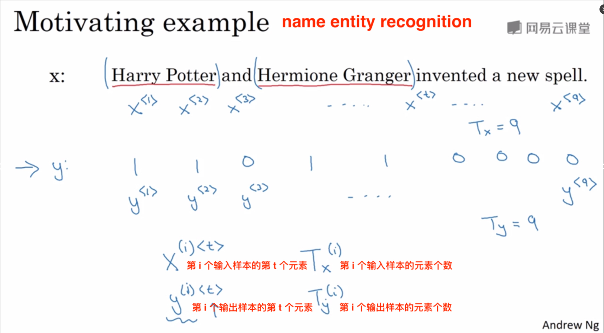
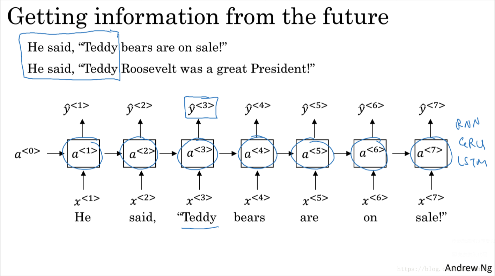
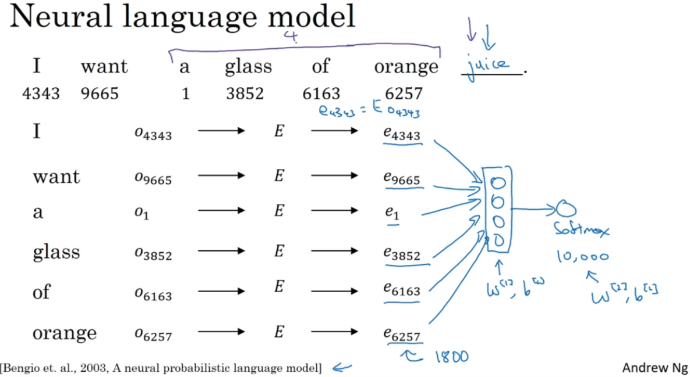
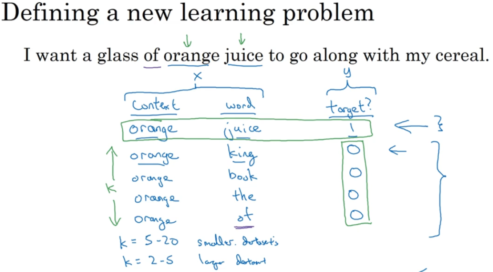

# 序列模型

## 1.1-符号

​	在序列模型中，**t** 代表的是样本的某个元素的位置，而 **T_x** 代表的是样本总元素的长度。
$$
X^{(i)<t>} 
$$

$$
y^{(i)<t>}
$$

​	代表的是第 (i) 个样本的第 (t) 个元素。

​	对于自然语言处理（NLP），我们通常需要先创建一个词汇表（字典）。每个词汇可以用一个 one-hot 向量表示，这意味着在这个向量中，只有一个位置为 1，其余位置为 0。这样，每个词都可以表示为一个与字典维数相对应的向量。

## 1.2-循环神经网络模型

在普通神经网络中训练看某一个单词是否为人名时，确实会遇到两个主要问题：

1. **输入和输出长度不一致**：不同的句子长度会导致输入和输出的长度不同。虽然可以通过填充0来使它们长度一致，但这并不是一个理想的解决方案，因为填充的0会引入噪声，影响模型的训练效果。
2. **特征共享问题**：普通神经网络不会共享从不同文本位置学到的特征。例如，如果一个词在位置1被标记为人名的一部分，那么在其他位置出现时，模型可能无法识别它仍然是人名的一部分。这是因为普通神经网络没有记忆机制，无法利用上下文信息来判断词汇的意义。

​	为了解决这些问题，循环神经网络（RNN）被引入。RNN 可以处理变长的输入和输出序列，并且通过其内部的循环结构，可以共享和记住从不同位置学到的特征。例如，RNN 可以记住一个词在不同位置出现的频率，从而更准确地判断它是否为人名。

​	在循环神经网络（RNN）中，每一步的预测不仅依赖于当前输入，还依赖于前一步的计算结果。这种机制使得 RNN 能够捕捉序列中的时间依赖关系。

1. **激活值传递**：在第一个单词的预测之后，RNN 会将第一个单词的激活值 ($a^{<1>}$) 传递给第二个单词的预测过程。因此，第二个单词的预测不仅依赖于当前输入 ($x^{<2>}$)，还依赖于前一步的激活值 ($a^{<1>}$)。这种传递机制使得 RNN 能够记住之前的上下文信息。
2. **初始激活值 ($a^{<0>}$)**：在序列的开始，我们通常会初始化一个激活值 ($a^{<0>}$)，这个值通常是一个全零的向量。
3. **共享权重**：RNN 的权重矩阵在每一步都是共享的，这意味着它可以在不同的时间步中 学习到相同的特征。这解决了普通神经网络中无法共享特征的问题。

**参数共享**：在每一步中，RNN 使用相同的参数集来处理输入和计算激活值。具体来说：

- **$W_{ax}$**：控制从输入 (X) 到隐藏层的连接。这组参数在每一个时间步中都会被使用。
- **$W_{aa}$**：控制隐藏层之间的水平连接。这组参数也在每一个时间步中都会被使用。
- **$W_{ya}$**：控制从隐藏层到输出的连接。

**RNN 的局限性**：RNN 只能利用序列中早期的信息来做预测。例如，在预测 $(y^{<3>})$ 时，RNN 只使用了$ (x^{<1>})、(x^{<2>}) 和 (x^{<3>})$ 的信息，而没有利用到 ($x^{<4>}) 和 (x^{<5>}$) 等后续的信息。这在处理长序列时会导致信息丢失，尤其是当后续的信息对于当前预测非常重要时。

### 前向传播

​	在每一步，RNN 的计算可以表示为： [$ a^{<t>} = g(W_{aa} \cdot a^{<t-1>} + W_{ax} \cdot x^{<t>} + b_a) $] [ $\hat{y}^{<t>} = g(W_{ya} \cdot a^{<t>} + b_y) $] 其中，$(W_{aa})、(W_{ax}) 和 (W_{ya})$ 是权重矩阵，$(b_a) 和 (b_y) $是偏置项。$W$的下标，左边代表计算的字母右边代码要与之相乘的字母。

1. **合并权重矩阵**：我们可以将不同的权重矩阵$ (W_{ax}) 和 (W_{aa})$ 合并成一个大的权重矩阵 $(W)$。这样做的好处是可以将所有的权重操作集中在一个矩阵乘法中，从而简化计算过程。例如：$ [ W = \begin{bmatrix} W_{ax} & W_{aa} \end{bmatrix} ]$ 这样，输入 $(x^{<t>})$ 和前一个时间步的激活值 $(a^{<t-1>}) $可以上下合并成一个大的输入向量：$ [ \begin{bmatrix} x^{<t>} \ a^{<t-1>} \end{bmatrix} ]$。

​	2.**简化计算公式**：通过合并后的矩阵，我们可以简化前向传播的计算公式。
$$
 [ a^{<t>} = g(W \cdot \begin{bmatrix} x^{<t>} \ a^{<t-1>} \end{bmatrix} + b_a) ]
$$
​		同理，$\hat y$也可以简化。

### 通过时间反向传播(BPTT)

1. **前向传播**：
   - 输入序列 $( {x^{<1>}, x^{<2>}, \ldots, x^{<T>}} ) $依次通过 RNN 的每个时间步，计算出每个时间步的激活值 $( a^{<t>} ) $和输出值 $( \hat{y}^{<t>} )$。
   - 公式表示为：$ [ a^{<t>} = g(W_{ax} \cdot x^{<t>} + W_{aa} \cdot a^{<t-1>} + b_a) ] [ \hat{y}^{<t>} = g(W_{ya} \cdot a^{<t>} + b_y) ]$
2. **计算损失**：
   - 对于整个序列，计算损失函数 ( L )，通常使用交叉熵损失：$ [ L = -\sum_{t=1}^{T} \left( y^{<t>} \log(\hat{y}^{<t>}) + (1 - y^{<t>}) \log(1 - \hat{y}^{<t>}) \right) ]$
3. **反向传播**：
   - 在反向传播过程中，BPTT 会将损失函数对每个参数的梯度计算展开到每个时间步。
   - 具体来说，计算每个时间步的误差项$ ( \delta^{<t>} )$，并将其传播回前面的时间步： $[ \delta^{<t>} = \frac{\partial L}{\partial \hat{y}^{<t>}} \cdot \frac{\partial \hat{y}^{<t>}}{\partial a^{<t>}} \cdot \frac{\partial a^{<t>}}{\partial z^{<t>}} ]$
   - 其中，( $z^{<t>} $) 是激活前的线性组合，( $\delta^{<t>}$) 是误差项。
4. **更新权重**：
   - 使用梯度下降法更新权重矩阵$ ( W_{ax} )、( W_{aa} ) 和 ( W_{ya} )： [ W_{ax} \leftarrow W_{ax} - \alpha \sum_{t=1}^{T} \delta^{<t>} \cdot x^{<t>} ] [ W_{aa} \leftarrow W_{aa} - \alpha \sum_{t=1}^{T} \delta^{<t>} \cdot a^{<t-1>} ] [ W_{ya} \leftarrow W_{ya} - \alpha \sum_{t=1}^{T} \delta^{<t>} \cdot a^{<t>} ]$
   - 其中，$( \alpha )$ 是学习率。

### 不同类型的RNNS

1. **一对一（One to One）**：
   - **结构**：单个输入对应单个输出。
   - **应用**：传统的神经网络，如图像分类。
2. **一对多（One to Many）**：
   - **结构**：单个输入对应多个输出。
   - **应用**：图像描述生成。给定一张图片，生成一段描述文字。
3. **多对一（Many to One）**：
   - **结构**：多个输入对应单个输出。
   - **应用**：情感分析。给定一段文字，判断其情感（如正面或负面）。
4. **多对多（Many to Many，同步长度）**：
   - **结构**：多个输入对应多个输出，输入和输出序列长度相同。
   - **应用**：视频分类。给定一段视频，生成对应的标签序列。
5. **多对多（Many to Many，不同步长度）**：
   - **结构**：多个输入对应多个输出，输入和输出序列长度可以不同。
   - **应用**：机器翻译。给定一句话，翻译成另一种语言。

## 1.3-语言模型和序列生成

语言模型的主要功能是估计一个给定句子的概率。

1. **语言模型的定义**：
   - 语言模型（Language Model, LM）是一个概率分布模型，它给定一个单词序列$ ( y^{(1)}, y^{(2)}, \ldots, y^{(T)} ) $的概率 $( P(y^{(1)}, y^{(2)}, \ldots, y^{(T)}) )。$
   - 这个概率表示了该句子在语言中的合理性或自然性。
2. **计算句子概率**：
   - 语言模型通过分解联合概率来计算句子的概率：$[ P(y^{(1)}, y^{(2)}, \ldots, y^{(T)}) = P(y^{(1)}) \cdot P(y{(2)}|y{(1)}) \cdot P(y{(3)}|y{(1)}, y^{(2)}) \cdots P(y{(T)}|y{(1)}, y^{(2)}, \ldots, y^{(T-1)}) ]$
   - 这种分解方式利用了条件概率，使得计算更为可行。

- 假设我们有一个句子 “The apple and pear salad”。语言模型会计算这个句子的概率 $( P(\text{The apple and pear salad}) )$，并与其他可能的句子进行比较，如 “The apple and pair salad”。通过比较这些概率，模型可以选择最自然的句子。

### 构建语言模型

1. **收集语料库**：
   - 首先，需要一个包含大量文本数据的语料库（corpus）。这些文本数据可以是新闻文章、书籍、对话记录等。
2. **标记化（Tokenization）**：
   - 将语料库中的文本数据分割成单词或标记（tokens）。例如，句子 “Cats average 15 hours of sleep a day.” 会被分割成 “Cats”, “average”, “15”, “hours”, “of”, “sleep”, “a”, “day”, 和一个表示句子结束的 <EOS> 标记。
3. **构建词汇表**：
   - 根据标记化后的单词，构建一个词汇表（vocabulary）。词汇表包含所有在语料库中出现的单词及其对应的索引。
4. **一位有效矢量（One-Hot Encoding）**：
   - 将每个单词映射到一个一位有效矢量（one-hot vector）。在这个向量中，只有一个位置为1，其余位置为0。例如，如果词汇表中有10,000个单词，那么每个单词都会被表示为一个长度为10,000的向量，其中只有一个位置为1。
5. **处理未知单词**：
   - 对于不在词汇表中的单词，用一个全局唯一的标记 $<UNK>$（unknown）代替，并对 $<UNK> $的概率进行建模。这可以帮助模型处理在训练数据中未见过的单词。
6. **训练语言模型**：
   - 使用循环神经网络（RNN）或其他序列模型来训练语言模型。模型的输入是一个单词序列，输出是下一个单词的概率分布。
   - 例如，对于句子 “Cats average 15 hours of sleep a day.”，模型会学习到在 “Cats” 之后最有可能出现的单词是 “average”，在 “average” 之后最有可能出现的单词是 “15”，以此类推。
7. **计算句子概率**：
   - 语言模型通过计算每个单词在给定前面单词的条件下出现的概率，来估计整个句子的概率。
   - 公式表示为：$ [ P(y^{(1)}, y^{(2)}, \ldots, y^{(T)}) = P(y^{(1)}) \cdot P(y{(2)}|y{(1)}) \cdot P(y{(3)}|y{(1)}, y^{(2)}) \cdots P(y{(T)}|y{(1)}, y^{(2)}, \ldots, y^{(T-1)}) ]$

### RNN训练过程

1. **初始化**：
   - 输入 ( $x_1$ ) 和初始激活值 ($ a_0$ ) 被初始化为零向量。这是因为在序列的开始，我们没有之前的上下文信息。
2. **前向传播**：
   - 在第一个时间步，RNN 使用 softmax 函数预测第一个单词的概率分布$(\hat{y}^{<1>})$。假设词汇表中有 10,000 个单词，那么$( \hat{y}^{<1>} ) $是一个 10,000 维的向量，每个元素表示对应单词的概率。
   - 例如，句子 “Cats average 15 hours of sleep a day.” 中，第一个单词 “Cats” 的概率由$( \hat{y}^{<1>} ) $表示。
3. **输入正确的单词**：
   - 在第二个时间步，RNN 的输入是第一个单词的正确输出$({y}^{<1>} ) $，即 “Cats”。这解释了为什么 ($({y}^{<1>} ) $ = $({x}^{<2>} ) $ )。通过这种方式，RNN 可以利用前一个时间步的正确单词来预测下一个单词。
4. **继续前向传播**：
   - 这个过程继续进行，例如在第三个时间步，RNN 需要预测第三个单词 “15” 的概率分布$(\hat{y}^{<3>})$。为了做到这一点，RNN 需要前两个单词 “Cats” 和 “average” 作为输入。
   - 公式表示为： [ P($({y}^{<3>})$ | $({y}^{<1>})$$({y}^{<2>})$) = $\text{softmax}(W_{ya} \cdot a^{<3>} + b_y) ]$
   - 其中，( $a_3$ ) 是第三个时间步的激活值，( $W_{ya} $) 是权重矩阵，( $b_y$ ) 是偏置项。

### 采样新序列

​	采样新序列是理解序列模型（如RNN）如何生成新数据的重要过程

- 在采样过程，我们使用训练好的模型生成新的序列。这个过程如下：
  1. **初始化**：首先，我们需要一个起始输入（可以是一个特定的词或一个特殊的起始符号）。
  2. **预测下一个词**：模型根据当前输入和隐藏状态，使用softmax函数计算每个可能的下一个词的概率分布。
  3. **随机采样**：根据softmax输出的概率分布，我们使用`np.random.choice`函数随机选择下一个词。这意味着概率较高的词更有可能被选中，但概率较低的词也有一定的机会被选中。
  4. **更新输入**：将选中的词作为下一个时间步的输入，重复步骤2和3，直到生成完整的序列或达到预定的长度。

​	通过这种方式，模型可以生成与训练数据相似的新序列，但也可能会有一些创新和变化。

### 字符级RNN模型

**优点（Pros）：**

1. **处理未知词汇**：基于字符的模型不会遇到未知词汇的问题。即使是训练集中没有出现过的词汇，模型也可以通过字符组合生成。例如，像“Mau”这样的词汇，即使不在训练集中，模型也能处理。
2. **更细粒度的控制**：字符级模型可以捕捉到更细微的语言特征，如拼写错误、缩写和新词的生成。

**缺点（Cons）：**

1. **序列长度增加**：字符级模型的输入序列通常比词汇级模型长得多。一个句子可能包含数十个字符，而不是几个单词。这使得模型需要处理更长的依赖关系，增加了计算复杂度。
2. **训练成本高**：由于序列长度增加，训练字符级模型需要更多的计算资源和时间。模型需要更多的时间来学习字符之间的关系，而不是单词之间的关系。
3. **长距离依赖关系**：字符级模型在捕捉长距离依赖关系时可能不如词汇级模型有效。句子前后部分的依赖关系在字符级模型中可能更难捕捉。

## 1.4-RNNs梯度消失

### 梯度消失问题

在训练RNN时，我们使用反向传播算法来更新模型的权重。然而，当我们计算梯度并将其反向传播通过网络时，梯度值可能会变得非常小，尤其是在深层网络中。这种现象称为梯度消失。具体来说：

1. **梯度计算**：在每个时间步，梯度是通过链式法则计算的，这意味着梯度是多个小值的乘积。
2. **梯度减小**：由于这些小值的乘积，梯度会随着时间步的增加而指数级减小。这导致早期时间步的梯度几乎为零，无法有效更新权重。
3. **长期依赖关系**：由于梯度消失，RNN很难捕捉到远距离的依赖关系。例如，句子的前半部分的信息很难影响到后半部分的输出。

### 解决方法

为了缓解梯度消失问题，研究人员提出了几种改进的RNN结构：

1. **长短期记忆网络（LSTM）**：LSTM通过引入门控机制（如输入门、遗忘门和输出门）来控制信息的流动，从而有效地缓解了梯度消失问题。LSTM可以更好地捕捉长期依赖关系。
2. **门控循环单元（GRU）**：GRU是LSTM的简化版本，具有类似的门控机制，但结构更简单，计算效率更高。
3. **深度RNN**：通过堆叠多个RNN层，可以增强模型的表达能力，但也需要更复杂的训练技巧来处理梯度消失问题。

#### 门控循环单元（GRU）

​	门控循环单元修改了神经网络的隐藏层从而更好地捕捉长距离的关系同时有助于减轻梯度消失的问题。GRU通过引入两个门控机制：**相关门**和**更新门**，来控制信息的流动。这些门控机制帮助GRU在训练过程中更好地捕捉和保留重要的信息，同时减轻梯度消失的问题。

​	$∗$表示元素级乘法。

**相关门（relation Gate）**：

- 相关门控制前一时间步的隐藏状态对当前时间步的影响。它决定了多少过去的信息需要被遗忘。

$$
Γ_r = \sigma(W_r \cdot [C^{<t-1>}, x^{<t>}]+b_r)
$$

​	$C_{t-1}$是前一步的隐藏状态。

**更新门（Update Gate）**

- 更新门决定了当前时间步的隐藏状态有多少需要被更新。它控制了新信息和旧信息的混合比例。

$$
Γ_u = \sigma(W_u \cdot [C^{<t-1>}, x^{<t>}]+b_u)
$$

**候选隐藏状态（Candidate Hidden State）**：

- 候选隐藏状态是当前时间步的新信息，它结合了当前输入和前一时间步的隐藏状态（经过相关门的调节）。

$$
\tilde{C}^{<t>} = \tanh(W_C \cdot [Γ_r \ast C^{<t-1>}, x^{<t>}]+b_c)
$$

**隐藏状态更新（Hidden State Update）**：

- 最终的隐藏状态是前一时间步的隐藏状态和候选隐藏状态的加权和，由更新门控制。

$$
C^{<t>} = (1 - Γ_u) \ast C^{<t-1>} + Γ_u \ast \tilde{C}^{<t>}
$$

- **捕捉长距离依赖关系**：通过门控机制，GRU能够更好地捕捉和保留长距离依赖关系。
- **减轻梯度消失问题**：门控机制帮助GRU在反向传播过程中保持梯度的稳定，减轻梯度消失的问题。
- **计算效率高**：相比LSTM，GRU结构更简单，计算效率更高。

1. **更新门（Update Gate）**：更新门的值介于0到1之间，用于控制当前状态和新信息的混合程度。更新门的值通过sigmoid函数计算，sigmoid函数的输出范围是0到1，因此更新门的值也在这个范围内。
2. **候选状态（Candidate State）**：候选状态是GRU在当前时间步计算的潜在新状态。这个状态会根据更新门的值决定是否更新到最终状态。
3. **门控机制**：更新门的作用是决定是否更新记忆单元C的值。如果更新门的值接近1，表示需要更新记忆单元；如果接近0，表示保持当前记忆单元的值不变。
4. **记忆单元C的更新**：记忆单元C的值会根据更新门的值进行更新。具体来说，如果更新门的值为1，记忆单元C会被更新为候选状态；如果更新门的值为0，记忆单元C保持不变。
5. **语法示例**：你提到的语法示例是为了说明GRU如何在自然语言处理中记住主语的数（单数或复数）并在适当的时候更新记忆单元C。例如，当主语是单数时，记忆单元C的值可能为1；当主语是复数时，记忆单元C的值可能为0。GRU会记住这个值直到需要更新谓语动词的数时。

#### 长短期记忆(LSTM)

​	LSTM（长短期记忆网络）和GRU（门控循环单元）都是RNN（循环神经网络）的变体，用于处理序列数据，但LSTM比GRU更复杂，具有更强的泛化能力。

GRU有两个主要的门控机制：

1. **更新门（Update Gate, $Γ_u$）**：控制当前状态和新信息的混合程度。
2. **相关门（relation Gate, $Γ_r$）**：决定如何结合新输入和之前的记忆。

LSTM引入了更多的门控机制，使其能够更好地捕捉长时间依赖关系。LSTM有三个主要的门控机制：

1. **遗忘门（Forget Gate, $Γ_f$）**：决定是否丢弃之前的记忆。
2. **更新门（update Gate, $Γ_u$）**：决定是否更新当前的记忆。
3. **输出门（Output Gate, $Γ_o$）**：决定当前状态的输出。

LSTM的状态更新公式更复杂，包含两个状态：细胞状态$C_t$和隐藏状态$a_t$。细胞状态通过遗忘门和更新门进行更新，而隐藏状态通过输出门进行更新。

​	窥孔连接引入了前一时刻的细胞状态$C^{<t−1>}$，使得门控机制能够直接访问细胞状态的信息。	

​	例如，遗忘门的计算公式可以表示为：
$$
Γ_f = \sigma(W_f \cdot [C^{<t-1>}, x^{<t>}]+U_f\cdot C^{<t-1>}+b_f)
$$
​	其中，$U_f$是与细胞状态相关的权重矩阵。

​	如果细胞状态是一个100维的向量那么$ C^{<t-1>}$的第5个元素只会影响门控向量的第5个元素。

​	这里使用$a^{<t-1>)}$和$x^{<t>}$一起来计算遗忘门、更新门和输出门的值。注意一下下方的三张图，把它们按照时间次序连接起来，这里输入$x^{<1>}、x^{<2>}、x^{<3>}$，有个很有意思的事情（红色直线），这条线显示了只要你正确地设置了遗忘门和更新门，LSTM是相当容易把$c^{<t>}$的值一直往下传递到右边。

## 1.5-双向RNN(BRNN)

1. **基本概念**

- **前向序列**：从左到右处理输入序列（例如，$x^{<1>}, x^{<2>}, x^{<3>}, …$）。
- **后向序列**：从右到左处理输入序列（例如，$…, x^{<3>}, x^{<2>}, x^{<1>}$）。

2. **信息流动**

在BRNN中，信息在两个方向上流动：

- **前向传播**：标准RNN的前向传播，从输入序列的起点到终点。
- **后向传播**：反向处理输入序列，从终点到起点。

3. **结合前向和后向信息**

在每个时间点（例如时间点t=3），BRNN结合了前向和后向的信息：

- **前向信息**：在时间点t=3，前向序列提供了x1和x2的信息。
- **后向信息**：在时间点t=3，后向序列提供了x4的信息。

4. **预测的优势**

通过结合前向和后向的信息，BRNN能够在时间点t=3时利用过去、现在和未来的信息进行预测。这种双向处理方式使得BRNN在处理序列数据（如自然语言处理、时间序列预测等）时具有更高的准确性和鲁棒性。

深度RNN（Deep RNN）通过堆叠多个RNN层来学习复杂的函数。

### 1. **基本概念**

- **多层RNN**：通过堆叠多个RNN层（例如，$l=1, l=2, l=3$）来形成更深的网络。
- **激活函数**：在每一层和每个时间步上，使用激活函数（例如，g）来计算激活值。

### 2. **计算过程**

在深度RNN中，每一层的激活值 ( $a^{[l]<t>}$ ) 是通过前一层的激活值和当前层的输入计算得到的。例如：

- **输入**：在时间步t=3，输入为 ( $x^{<3>} $)。
- **激活值**：在第二层（l=2），时间步t=3的激活值 ( $a^{[2]<3>}$ ) 由以下公式计算：$ [ a^{[2]<3>} = g(W_a \cdot a^{[2]<2>} + W_x \cdot x^{<3>} + b) ] $其中，( $W_a$ ) 是激活权重矩阵，( $W_x$ ) 是输入权重矩阵，b是偏置项。

### 3. **训练复杂性**

深度RNN在训练时计算复杂且耗时，原因包括：

- **长时间依赖**：需要处理长时间范围内的依赖关系。
- **梯度消失和爆炸**：随着层数增加，梯度可能会消失或爆炸，导致训练困难。

# 词嵌入

**One-Hot编码（$O_{num}$）的局限性**：

1. **高维稀疏性**：每个单词都被表示为一个高维向量，其中只有一个位置是1，其余都是0。例如，如果词汇表有10,000个单词，那么每个单词的one-hot向量就是一个10,000维的向量。这种表示方式非常稀疏且高维。
2. **无法捕捉语义关系**：one-hot编码无法捕捉单词之间的语义关系。例如，“apple”和“orange”在one-hot表示中是完全不同的向量，它们之间的内积为0，这些向量之间的距离都一样，无法反映它们在语义上的相似性。
3. **维度不变**：one-hot向量的维度是固定的，等于词汇表的大小。这意味着随着词汇表的增长，向量的维度也会增加，导致计算复杂度增加。

**词嵌入（$E_{num}$）的优势**：

词嵌入通过将单词映射到一个低维的连续向量空间来解决上述问题。以下是词嵌入的几个关键优势：

1. **低维密集表示**：词嵌入将每个单词表示为一个低维的密集向量（例如，300维），这大大减少了计算复杂度。
2. **捕捉语义关系**：词嵌入能够捕捉单词之间的语义关系。例如，在词嵌入空间中，“apple”和“orange”的向量距离会比“apple”和“king”的距离更近。这是因为词嵌入通过训练数据学习到了单词的上下文信息。
3. **向量运算**：词嵌入允许我们进行向量运算来捕捉单词之间的关系。例如，向量运算“King - Man + Woman”会得到一个接近“Queen”的向量。这种运算反映了单词之间的语义类比关系。

例如句子“I want a glass of orange ____”很可能会被填充为“juice”，因为“orange”和“juice”在训练数据中经常一起出现。而句子“I want a glass of apple ____”也应该填充为“juice”，但one-hot编码无法捕捉到“apple”和“orange”之间的相似性，导致泛化能力差。

通过使用词嵌入，模型可以学习到“apple”和“orange”在某些上下文中是相似的，从而更好地进行预测。

## 2.1-特征化表示（featurized representation）

​	特征化表示（featurized representation）通过为每个单词分配多个特征值来捕捉其语义关系。

1. **多维特征向量**：每个单词被表示为一个多维向量，每个维度代表一个特征。例如，性别（Gender）、高贵（Royal）、年龄（Age）、食物（Food）等。每个特征的值可以是一个实数，表示该单词在该特征上的程度。
2. **特征值的分配**：根据经验或训练数据，为每个单词分配特征值。例如，性别特征中，男性的值为-1，女性的值为+1。对于“man”，性别值为-1；对于“woman”，性别值为+1。类似地，“king”的性别值可能为-0.95，而“queen”的性别值为+0.97。
3. **捕捉语义关系**：通过这种方式，单词之间的语义关系可以通过向量之间的距离或角度来度量。例如，“apple”和“orange”在食物特征上的值都为1，因此它们在食物特征上是相似的。
4. **捕捉复杂关系**：能够捕捉单词之间的复杂语义关系。例如，“king”和“queen”在性别和高贵特征上都有相似的值，因此它们在这些特征上是相似的。

### 可视化

​	嵌入（embeddings）确实是通过将单词映射到一个高维空间中的点来表示它们的语义关系。由于我们无法直观地展示300维空间，所以通常使用降维技术（如t-SNE）将这些高维数据映射到低维空间（如2D或3D）进行可视化。

​	t-SNE（t-Distributed Stochastic Neighbor Embedding）是一种常用的降维算法，它能够将高维数据映射到低维空间，同时尽量保持数据点之间的相对距离和结构。这使得我们可以在低维空间中观察到单词之间的相似性和聚类情况。

​	假设我们有一个300维的嵌入空间，其中每个单词都被表示为一个300维的向量。通过t-SNE算法，我们可以将这些向量降维到2D空间，并绘制出一个2D图像。在这个图像中，语义相似的单词会聚集在一起。例如，“apple”和“orange”可能会靠得很近，而“king”和“queen”也会靠得很近。

## 2.2-使用词嵌入

### 词嵌入的学习

1. **大规模无标签文本**：词嵌入的学习通常依赖于非常大的无标签文本数据集。这些数据集可以包含数亿甚至数十亿个单词。通过在这些大规模数据集上训练，词嵌入模型能够捕捉到单词之间的语义关系。例如，通过大量的文本，模型可以学习到“orange”和“durian”都是水果，“farmer”和“cultivator”都是从事农业工作的人。
2. **预训练词嵌入**：你可以使用预训练的词嵌入模型，这些模型已经在大规模数据集上训练好了，可以直接下载使用。这些预训练模型已经包含了丰富的语义信息，可以应用到各种NLP任务中。

### 迁移学习

1. **迁移到新任务**：在有了预训练的词嵌入之后，你可以将这些嵌入应用到一个新的任务中，即使这个任务的训练集很小。例如，在命名实体识别任务中，即使你的训练集中没有“durian”或“cultivator”这两个词，预训练的词嵌入仍然可以帮助模型理解这些词的语义。
2. **小规模标记数据**：即使你的训练集只有10万单词甚至更少，预训练的词嵌入仍然可以提供有价值的信息。通过将预训练的词嵌入应用到你的任务中，模型可以利用从大规模无标签数据中学到的知识，从而在小规模标记数据上表现得更好。
3. **微调**：你还可以选择在新任务的数据上继续微调预训练的词嵌入，以进一步提高模型的性能。这种方法可以使词嵌入更加适应特定任务的需求。

例如句子“Robert Lin is a durian cultivator”中的“durian”和“cultivator”可能在你的训练集中没有出现过。但是，通过使用预训练的词嵌入，模型可以理解“durian”是水果，就像“orange”一样，而“cultivator”是从事农业工作的人，就像“farmer”一样。因此，模型可以从训练集中学到的“an orange farmer”泛化到“a durian cultivator”。

### 词嵌入和人脸识别关系

#### 相似性

1. **向量表示**：无论是词嵌入还是人脸编码，核心思想都是将对象（单词或人脸）映射到一个高维向量空间中。对于词嵌入，每个单词被表示为一个固定维度的向量（例如300维）。对于人脸编码，每张人脸图片被表示为一个固定维度的向量（例如128维）。
2. **相似性度量**：在这两个领域中，相似性都是通过计算向量之间的距离来度量的。对于词嵌入，语义相似的单词在向量空间中距离较近。对于人脸编码，相同或相似的人脸在向量空间中距离较近。
3. **神经网络**：两者都使用神经网络来学习这些向量表示。词嵌入通常通过训练神经网络（如Word2Vec或GloVe）来学习单词的向量表示。人脸编码则通过训练Siamese网络或其他深度学习模型来学习人脸的向量表示。

#### 差异

1. **固定词汇表 vs. 动态输入**：在词嵌入中，我们通常有一个固定的词汇表（例如10,000个单词），并为每个单词学习一个固定的向量表示。这意味着每个单词的嵌入是固定的，不会随输入变化。而在人脸识别中，神经网络可以处理任意输入的人脸图片，并为每张图片生成一个动态的编码结果。
2. **未知单词处理**：在自然语言处理（NLP）中，如果遇到词汇表中没有的单词，通常会将其标记为未知单词（<UNK>），并使用一个固定的向量表示。而在人脸识别中，神经网络可以处理从未见过的人脸图片，并生成相应的编码结果。

## 2.3 词嵌入的特性

​	假设我们使用的是四维的嵌入向量

**计算差异向量**：首先，我们计算两个单词之间的差异向量。例如，计算“man”和“woman”之间的差异向量：
$$
e_{man} - e_{woman}
$$

这个差异向量捕捉了“man”和“woman”之间的主要差异，即性别。

**应用差异向量**：接下来，我们将这个差异向量应用到另一个单词对上。例如，计算“king”和“queen”之间的差异向量：
$$
e_{king} - e_{queen}
$$

这个差异向量也捕捉了“king”和“queen”之间的主要差异，即性别。

**类比推理**：通过比较这两个差异向量，我们可以发现它们是相似的：
$$
e_{man} - e_{woman} \approx e_{king} - e_{queen}
$$

这意味着“man”对“woman”的关系类似于“king”对“queen”的关系。

因此当算法被问及“man对woman相当于king对什么”时，算法所做的就是计算以下向量运算：
$$
e_{man} - e_{woman} + e_{king}
$$
然后找出一个向量，使得这个向量与其最接近，也就是说，算法会找到一个单词，使得：
$$
e_{man} - e_{woman} \approx e_{king} - e_{?}
$$
在这个例子中，最接近的单词是“queen”。

在类比推理中，我们希望找到一个单词 ( w )，使得以下等式近似成立：
$$
e_{\text{man}} - e_{\text{woman}} \approx e_{\text{king}} - e_w
$$

为了找到这个单词 ( w )，我们可以计算以下向量：
$$
e_{\text{king}} - e_{\text{man}} + e_{\text{woman}}
$$

然后，我们寻找一个单词 ( w )，使得其向量 ( e_w ) 与上述向量的余弦相似度最大：
$$
\text{sim}(e_w, e_{\text{king}} - e_{\text{man}} + e_{\text{woman}})
$$

#### 相似函数

​	余弦相似度（cosine similarity）是衡量向量相似度的一个常用且有效的方法，通过计算两个向量之间的夹角的余弦值来衡量它们的相似度。
$$
\text{sim}(u, v) = \frac{u^T \cdot v}{||u|| \, ||v||}
$$
其中：

- ( $u^T \cdot v$ ) 表示向量 ( $u$ ) 和 ( $v$ ) 的内积。
- $( ||u|| ) 和 ( ||v|| )$ 分别表示向量$( u ) 和 ( v )$ 的范数（即向量的长度）。

1. **范围**：余弦相似度的值介于 -1 和 1 之间。
   - 当两个向量完全相同（夹角为0度）时，余弦相似度为 1。
   - 当两个向量完全不相关（夹角为90度）时，余弦相似度为 0。
   - 当两个向量完全相反（夹角为180度）时，余弦相似度为 -1。
2. **方向性**：余弦相似度关注的是向量的方向而不是长度，因此它特别适合用于衡量文本或单词向量的相似度，因为这些向量的长度可能会有所不同，但方向更能反映它们的语义关系。

除了余弦相似度外，还有其他相似度度量方法，如欧氏距离（Euclidean distance）和平方距离（Squared distance）。

## 2.4 嵌入矩阵

​	嵌入矩阵 ( E ) 是一个大小为$( 300 \times 10,000 )$ 的矩阵（假设词汇表有10,000个单词），其中每一列代表一个单词的嵌入向量。这个矩阵的每一列都是一个300维的向量，表示词汇表中对应单词的嵌入。

​	假设我们有一个单词“orange”，它在词汇表中的编号是6257。我们用一个one-hot向量 ( $O_{6257}$ ) 来表示这个单词，这个向量除了第6257个位置上是1，其余位置都是0。这个one-hot向量是一个10,000维的列向量。

当我们用嵌入矩阵 ( E ) 去乘以这个one-hot向量 ( $O_{6257} $) 时，我们得到一个300维的向量：
$$
E \cdot O_{6257} = e_{6257}
$$
$( e_{6257} ) $是“orange”的嵌入向量。

​	在实际计算中，直接用矩阵乘法来计算嵌入向量效率很低，因为one-hot向量是一个高维稀疏向量，大部分元素都是0。因此，在实践中，我们通常使用专门的函数来直接查找嵌入矩阵 ( E ) 的某一列，而不是进行完整的矩阵乘法。

## 2.5-学习词嵌入

​	我们从稍微复杂一些的算法开始，因为我觉得这样更容易对算法的运作方式有一个更直观的了解，之后我们会对这些算法进行简化，使你能够明白即使一些简单的算法也能得到非常好的结果，让我们开始吧。

**词嵌入的生成**

1. **建立one-hot向量**：从第一个词“I”开始，建立一个one-hot向量 ( $O_{4343}$ )，这个向量在第4343个位置是1，其余位置都是0。这个one-hot向量是一个10,000维的向量。
2. **生成嵌入向量**：用嵌入矩阵 ( E ) 乘以one-hot向量 ( $O_{4343}$ )，得到嵌入向量 ($e_{4343}$ )。这个嵌入向量是一个300维的向量，表示单词“$I$”的嵌入。
3. **对其他单词进行相同操作**：对句子中的其他单词（如“want”、“a”、“glass”、“of”、“orange”）进行相同的操作。每个单词都有一个对应的one-hot向量，通过与嵌入矩阵 ( E ) 相乘，得到相应的嵌入向量。

**嵌入向量的堆叠**

将所有单词的嵌入向量堆叠在一起，形成一个大的输入向量。例如，如果每个嵌入向量是300维，而句子中有6个单词，那么最终的输入向量是一个1800维的向量（6个300维向量堆叠在一起）。

**输入神经网络**

1. **输入到神经网络**：将这个1800维的向量输入到神经网络中。神经网络会处理这个向量，提取出有用的特征。
2. **通过softmax层**：经过神经网络处理后，输出会通过一个softmax层。softmax层有自己的参数，用于在10,000个可能的输出中预测下一个单词。

### 固定历史窗口

1. **定义历史窗口**：在自然语言处理任务中，使用固定的历史窗口是为了简化模型的输入维度。假设我们总是使用前4个单词来预测下一个单词，这个4就是算法的超参数。无论句子有多长，我们只看前4个单词。
2. **输入维度固定**：使用固定的历史窗口意味着输入到神经网络的特征向量维度总是固定的。例如，如果每个单词的嵌入向量是300维，而我们使用4个单词的历史窗口，那么输入到神经网络的特征向量就是1200维（4个300维向量堆叠在一起）。
3. **处理任意长度的句子**：这种方法允许我们处理任意长度的句子，因为输入的维度总是固定的。无论句子有多长，我们只需要考虑前4个单词。

事实上通过这个算法能很好地学习词嵌入，原因是，如果你还记得我们的orange jucie，apple juice的例子，在这个算法的激励下，apple和orange会学到很相似的嵌入，这样做能够让算法更好地拟合训练集，因为它有时看到的是orange juice，有时看到的是apple juice。如果你只用一个300维的特征向量来表示所有这些词，算法会发现要想最好地拟合训练集，就要使apple（苹果）、orange（橘子）、grape（葡萄）和pear（梨）等等，还有像durian（榴莲）这种很稀有的水果都拥有相似的特征向量。

### 上下文类型

1. **固定历史窗口**：这种方法使用目标词之前的固定数量的单词作为上下文。例如，在句子“I want a glass of orange juice to go along with my cereal.”中，如果我们使用前4个单词作为上下文，那么上下文就是“I want a glass”。这种方法常用于语言模型，因为它能够捕捉到目标词之前的语境信息。
2. **左右上下文**：这种方法使用目标词左右两边的单词作为上下文。例如，在同一句子中，如果我们使用目标词左右各4个单词作为上下文，那么上下文就是“a glass of orange”和“to go along with”。这种方法能够捕捉到目标词前后更广泛的语境信息，有助于更准确地预测目标词。
3. **单个上下文词**：这种方法使用目标词的前一个或后一个单词作为上下文。例如，只使用“orange”来预测“juice”。这种方法简单但有效，特别是在处理短语或固定搭配时。
4. **邻近单词**：这种方法使用目标词附近的一个单词作为上下文。例如，使用“glass”来预测“orange”。这种方法在Skip-Gram模型中非常常见，能够有效地捕捉单词之间的局部关系。

如果你真想建立一个语言模型，用目标词的前几个单词作为上下文是常见做法。但如果你的目标是学习词嵌入，那么你就可以用这些其他类型的上下文，它们也能得到很好的词嵌入。

## 2.6 Word2Vec

​	一种简单而且计算时更加高效的方式来学习这种类型的嵌入，Skip-Gram模型的目标是通过给定一个上下文词来预测其周围的目标词。这种方法通过构造一个监督学习问题来学习词嵌入。

### 构造监督学习问题

1. **选择上下文词**：在给定的句子中，例如“I want a glass of orange juice to go along with my cereal.”，我们可以选择“orange”作为上下文词。
2. **选择目标词**：在上下文词“orange”前后一定范围内（例如前后5个词或前后10个词）随机选择目标词。例如，可能选择“juice”作为目标词，也可能选择“glass”或“my”作为目标词。
3. **构造配对**：通过这种方式，我们构造了多个上下文词和目标词的配对。例如：
   - 上下文词“orange”，目标词“juice”
   - 上下文词“orange”，目标词“glass”
   - 上下文词“orange”，目标词“my”

**构造这个监督学习问题的目标并不是想要解决这个监督学习问题本身，而是想要使用这个学习问题来学到一个好的词嵌入模型。**

### 词嵌入模型	

1.嵌入矩阵$E$将one-hot向量$O_c$通过公式$e_c = E O_c$转换为嵌入向量$e_c$，嵌入矩阵$E$是通过训练学习到的，每一行对应一个词的嵌入向量

2.嵌入向量$e_c$输入到softmax单元，输出概率分布$\hat{y}$，softmax函数将输入向量转换为概率分布，表示每个词作为目标词的概率。具体公式为：
$$
p(t|c) = \frac{e^{\theta_t^T e_c}}{\sum_{j=1}^{V} e^{\theta_j^T e_c}}
$$
​	其中$θ_t$是与目标词相关的参数向量，$\theta_t^T e_c$表示两个单词的相似度。内积越大，表示两个单词的相似程度越高。内积能够捕捉向量之间的方向和长度关系。

3.**损失函数**：使用softmax损失函数，计算目标词和预测词之间的差异：
$$
L(\theta) = -\sum_{i=1}^{V} y_i \log(\hat{y}_i)
$$

​	对于一个10,000词的词汇表，如果每个嵌入向量是300维的，那么嵌入矩阵$E$的大小就是10,000 x 300。

**计算速度问题**：

- 在softmax模型中，每次计算概率时，需要对词汇表中的所有词进行求和操作。对于一个10,000词的词汇表，这个操作已经相当慢了。如果词汇表扩大到100,000或1,000,000词，计算速度会显著降低。
- 这种计算瓶颈主要来自于softmax的分母部分，即对所有词的指数和进行归一化。

**解决方案**：

- 为了解决计算速度问题，研究人员提出了几种优化方法，如**负采样（Negative Sampling）**和**层次Softmax（Hierarchical Softmax）**。

#### 分级softmax分类器

1. **分级结构**：
   - 分级softmax分类器使用一个树形结构，将词汇表分成多个层次。每个内部节点是一个二分类器，决定目标词是在当前节点的左子树还是右子树中。
   - 这种结构的叶子节点代表具体的词汇表中的词。

2. **计算效率**：
   - 传统softmax分类器需要对整个词汇表进行求和计算，计算成本是线性的，即与词汇表大小成正比。
   - 分级softmax分类器通过树形结构，将计算成本降低到对数级别，即与词汇表大小的对数成正比。这大大提高了计算效率，尤其是在处理大词汇表时。

3. **非对称树结构**：
   - 在实践中，分级softmax分类器不会使用完美平衡的分类树。相反，树的结构会根据词的频率进行优化。
   - 常用词（如“the”、“of”）会放在树的顶部，因为这些词出现频率高，检索时需要更少的计算步骤。
   - 不常用词（如“durian”）会放在树的更深处，因为这些词出现频率低，检索时需要更多的计算步骤，但这种情况较少发生。

​	它告诉你目标词是在词汇表的前5000个中还是在词汇表的后5000个词中，假如这个二分类器告诉你这个词在前5000个词中，然后第二个分类器会告诉你这个词在词汇表的前2500个词中，或者在词汇表的第二组2500个词中，诸如此类，直到最终你找到一个词准确所在的分类器，那么就是这棵树的一个叶子节点。

**上下文词的采样**：

- 在Skip-Gram模型中，目标词$t$会在上下文词$c$的正负10个词距内进行采样。这意味着模型会尝试预测目标词在给定上下文词附近的词。
- 选择上下文词$c$的方法之一是对语料库进行均匀且随机的采样。然而，这种方法会导致一些高频词（如“the”、“of”、“a”、“and”、“to”）频繁出现，而其他低频词（如“orange”、“apple”、“durian”）则很少出现。

**高频词的问题**：

- 如果训练集中大部分都是高频词，模型会花大量时间更新这些高频词的嵌入向量$e_c$。这会导致模型对高频词的嵌入向量进行过度优化，而对低频词的嵌入向量更新不足。
- 这种情况会影响模型的整体性能，因为低频词的嵌入向量可能无法很好地捕捉其语义信息。

**平衡常见词和不常见词**：

- 为了平衡常见词和不常见词的训练，可以采用不同的启发式方法。例如，可以对高频词进行下采样（subsampling），即减少高频词在训练中的出现次数。
- 具体方法是根据词频对每个词进行采样概率计算，频率越高的词采样概率越低，从而减少高频词的出现次数，增加低频词的出现机会。

#### 负采样(Negative Sampling)

负采样是一种用于训练词嵌入模型（如Word2Vec）的技术。它的主要目的是通过生成正样本和负样本来优化模型的学习过程。

1. **正样本生成**：
   - 选择一个上下文词（context word），例如“orange”。
   - 在一定词距内（例如正负10个词距）选择一个目标词（target word），例如“juice”。
   - 将这个配对标记为正样本（1），因为“orange”和“juice”在上下文中是相关的。
2. **负样本生成**：
   - 使用相同的上下文词“orange”。
   - 从词汇表中随机选择一个词，例如“king”，并将其标记为负样本（0），因为“orange”和“king”在上下文中通常是不相关的。即使这些词偶尔出现在上下文词的词距内，也将其标记为负样本。
   - 重复这个过程，随机选择其他词汇表中的词，例如“book”、“the”、“of”等，并将这些配对标记为负样本（0）。

通过这种方式，模型可以学习到哪些词在上下文中是相关的（正样本），哪些是不相关的（负样本）。

1. **构造监督学习问题**：
   - 学习算法的输入是词对（context-word），例如“orange-juice”。
   - 目标是预测这些词对的标签（target），即预测输出y。
   - 问题是给定一对词，判断它们是否会一起出现，或者是否是通过随机采样获得的。
2. **选择K的值**：
   - 对于小数据集，K的值在5到20之间较为合适。
   - 对于大数据集，K的值应较小，通常在2到5之间。
   - 数据集越小，K的值应越大；数据集越大，K的值应越小。

##### 负采样模型

- 每个可能的目标词都有一个参数向量$θ_t$每个可能的上下文词也有一个嵌入向量$e_c$我们使用公式:

$$
\sigma(\theta_t^T e_c)
$$

​		来估计$y=1$的概率。对于每一个正样本，我们生成K个负样本，这意味着我们有一个正负样本比例为$\frac{1}{K}$例如，如果K=4，那么每一个正样本会有4个负样本。

- 其预测过程就是假设输入词是orange，即词6257，你要做的就是输入one-hot向量，再传递给$E$ ，通过两者相乘获得嵌入向量$e_{6527}$，我们就得到了10,000个可能的逻辑回归分类问题。

1. **负采样的作用**：
   - 负采样将10,000维的softmax问题转化为10,000个二分类问题，每个问题都很容易计算。
   - 每次迭代中，只训练K+1个分类器（K个负样本和1个正样本），而不是全部10,000个分类器。

2. **计算成本的降低**：
   - 由于每次迭代只更新K+1个逻辑单元，计算成本显著降低。
   - 负采样通过生成负样本（如“king”、“book”、“the”、“of”）来训练模型，使得每次迭代的计算量更小。

##### 负样本的采样

1. **经验频率采样**：
   - 根据词在语料库中的出现频率进行采样。
   - 这种方法会导致高频词（如“the”、“of”、“and”）被过度采样。

​	2.**均匀采样**：

- 每个词被采样的概率相同，即 $\frac 1{|V|}$，其中 $∣V∣$ 是词汇表的总词数。
- 这种方法对英文单词的分布没有代表性，因为高频词和低频词的采样概率相同。

​	3. **Mikolov等人的方法**：

- 介于上述两种极端方法之间的采样方法。
- 具体公式为：

$$
P(w_i) = \frac{f(w_i)^{3/4}}{\sum_{j=1}^{|V|} f(w_j)^{3/4}}
$$

其中$f(w_i)$是词$w_i$在语料库中的频率。

- 这种方法通过对词频进行 $\frac 34$ 次方的处理，使得高频词的采样概率降低，而低频词的采样概率增加，从而达到一个平衡。这种方法的优点在于，它既避免了高频词被过度采样的问题，又比均匀采样更能反映实际的词频分布。

## 2.7Glove词向量

​	GloVe（Global Vectors for Word Representation）是一种基于统计的词向量生成方法。

​	假设$X_{ij}$表示单词$i$在单词$j$的上下文中出现的次数，在Glove算法中$i和j$分别表示目标词和上下文，因此可以理解位$X_{tc}$，其就是一个计数器，用来记录单词$t和c$在彼此接近时出现的概率。

GloVe模型是通过最小化目标函数来优化词向量的。具体来说，GloVe模型的目标是最小化以下公式：
$$
\sum_{i=1}^{V} \sum_{j=1}^{V} f(X_{ij})(\theta_i^T e_j - \log(X_{ij}))^2
$$
​	其中，$f(X_{ij})$是一个加权函数，用于处理当$X_{ij}=0$的情况，并且规定$ 0\log{0} = 0 $以避免对数函数在零点处的定义问题。

​	它不仅帮助处理稀有词对的情况，还能平衡高频词和低频词的权重。具体来说：

1. **高频词（如this, is, of, a）**：这些词在语料库中出现频率很高，但它们的语义信息相对较少。如果不给它们适当的权重，它们会在模型中占据过多的影响力，导致模型无法有效捕捉其他词的语义关系。
2. **低频词（如durion）**：这些词虽然出现频率低，但它们可能包含丰富的语义信息。如果权重太小，它们的语义信息会被忽略，影响模型的表现。

常用的加权函数之一是：
$$
f(X_{ij}) = \left\{
\begin{array}{ll}
(X_{ij}/X_{\max})^\alpha ; \text{if } X_{ij} < X_{\max} \\
1 ; \text{otherwise}
\end{array}
\right.
$$
​	其中，$X_{\max}$是一个阈值，$α$ 通常取值在 0.75 左右。这个函数的设计原则是：

对于高频词对，当 $X_{ij}$ 接近或超过 $X_{max}$ 时，权重趋近于 1，避免过分放大它们的影响。

对于低频词对，当 $X_{ij}$ 较小时，权重会根据 $(X_{ij}/X_{\max})^\alpha$ 进行缩放，确保它们的语义信息不会被完全忽略。

### 嵌入向量的解释性

1. **高维空间的复杂性**：词嵌入通常在高维空间中表示（例如300维或更高）。在这样高维的空间中，每个维度的具体含义变得更加抽象和难以解释。即使我们可以通过数学方法确定某些维度的重要性，但这些维度的具体语义解释仍然是一个挑战。
2. **特征组合**：嵌入向量的每个维度可能是多个语义特征的组合。例如，性别、皇室、年龄等特征可能会混合在一起，形成一个复杂的特征空间。这意味着一个特征轴可能同时包含这些特征的部分信息，而不是单一的语义。
3. **坐标系的选择**：在训练过程中，学习算法可能会选择不同的坐标系来表示特征。即使我们设定了某些特征轴（如性别和皇室），实际训练得到的嵌入向量可能不会与这些轴对齐。算法可能会选择其他方向作为主要特征轴，甚至可能是非正交的坐标系。
4. **可逆矩阵的影响**：如果存在一个可逆矩阵 ( A )，那么嵌入向量可以通过这个矩阵进行线性变换，得到新的表示。这意味着原始的特征轴可以被替换为新的轴，而这些新的轴可能不再具有直观的解释性。
5. **上下文依赖性**：词嵌入是通过大量语料库训练得到的，词与词之间的关系是基于它们在不同上下文中的共现频率。因此，某个特征轴的含义可能会因上下文的不同而变化。

## 2.8 情绪分类

​	情感分类是自然语言处理（NLP）中的一个重要任务，旨在分析文本并判断其情感倾向。

1. **模型架构**：
   - **输入**：句子 “dessert is excellent”。
   - **词典**：使用一个包含10,000个词的词汇表。
   - **词嵌入**：从一个大规模的文本集（如一亿或一百亿个词）中学习到的词嵌入矩阵 ( E )。每个词在词典中都有一个对应的嵌入向量，例如 “the” 对应 ( $e_{8928} $)。
   - **特征向量**：将句子中的每个词转换为其对应的300维嵌入向量，然后对这些向量进行求和或求平均，得到一个300维的特征向量。
   - **分类器**：将这个特征向量输入到softmax分类器中，输出五个可能的情感评分（从一星到五星）的概率。

2. **平均值运算的优点**：
   - **灵活性**：适用于不同长度的评论，无论评论有多少个词，都可以通过求和或求平均得到一个固定维度的特征向量。
   - **简便性**：计算简单，易于实现。

3. **模型的局限性**：
   - **忽略词序**：平均值运算忽略了词语的顺序信息，这在某些情况下会导致误分类。例如，句子 “Completely lacking in good taste, good service, and good ambiance.” 中虽然 “good” 出现了多次，但整体情感是负面的。如果仅仅对词嵌入进行求和或求平均，模型可能会误认为这是一个正面评价。

因此我们可以用一个RNN来做情感分类。

1. **RNN模型**：
   - **输入**：句子 “Completely lacking in good taste, good service, and good ambiance.”。
   - **词嵌入**：每个词转换为其对应的嵌入向量，例如 “Completely” 对应 ( e_{1852} )，“lacking” 对应 ( e_{4966} ) 等。
   - **RNN处理**：这些嵌入向量依次输入到循环神经网络（RNN）中，RNN通过其隐藏状态（如 ( a^{<0>} ), ( a^{<1>} ) 等）逐步处理整个句子，捕捉词序信息。
   - **输出**：RNN的最终隐藏状态输入到softmax分类器中，输出情感评分的概率分布。
2. **优势**：
   - **捕捉词序**：RNN能够记住前后文信息，识别出 “not good” 和 “good” 的不同含义，以及 “lacking in good taste” 的负面情感。
   - **泛化能力**：由于词嵌入是在大规模数据集上训练的，即使标记数据集中没有出现的词（如 “absent”），模型也能通过词嵌入捕捉其语义，从而做出正确的情感判断。

## 2.9 词嵌入除偏

​	去除性别歧视、种族歧视等等。

- **训练数据的偏见**：词嵌入模型是通过大量文本数据进行训练的。如果这些文本数据中包含了性别、种族、年龄等方面的偏见，模型就会学习并反映出这些偏见。例如，如果训练数据中 “man” 经常与 “computer programmer” 相关，而 “woman” 经常与 “homemaker” 相关，模型就会在类比任务中输出类似的偏见结果。
- **社会偏见的反映**：训练数据往往是从现实世界中收集的，因此它们不可避免地反映了社会中的偏见和不平等。这些偏见在模型中被放大和固化，导致模型在实际应用中产生不公平的结果。

**一、确定偏见方向**

1. **识别偏见方向**：
   - 通过计算词向量之间的差异来识别偏见方向。例如，计算 ( $e_{he} - e_{she} ) 和 ( e_{male} - e_{female}$ ) 的差异。
   - 将这些差异向量取平均，得到一个代表性别偏见的方向向量。
2. **偏见和无偏见子空间**：
   - **偏见子空间**：这个方向向量可以看作是一个1维的子空间，代表性别偏见的方向。
   - **无偏见子空间**：与偏见子空间正交的空间，即剩下的299维空间，可以看作是无偏见的子空间。

**二、中和**

1. **定义明确的词**：

   - **性别相关词**：一些词本身就包含性别信息，例如 “grandmother”（祖母）、“grandfather”（祖父）、“girl”（女孩）、“boy”（男孩）、“she”（她）、“he”（他）。这些词的定义中固有性别含义，因此不需要进行中和处理。

2. **定义不明确的词**：

   - **性别中立词**：一些词在定义上不应包含性别偏见，例如 “doctor”（医生）、“babysitter”（保姆）。这些词在理想情况下应该是性别中立的，但在训练数据中可能会反映出性别偏见。

3. **中和步骤**：

   - **识别偏见方向**：首先，通过计算词向量之间的差异（如 $( e_{he} - e_{she} ) 和 ( e_{male} - e_{female} )$）来识别性别偏见的方向。

   - **投影和调整**

     ：将定义不明确的词（如 “doctor” 和 “babysitter”）的词向量投影到偏见方向上，然后调整这些词向量，使它们在偏见方向上的分量减少或消除。这可以通过以下步骤实现：

     - **投影**：计算词向量在偏见方向上的投影。
     - **调整**：从词向量中减去这个投影，得到一个在偏见方向上分量减少的词向量。

4. **实际应用**：

   - **性别中立**：通过中和步骤，可以使 “doctor” 和 “babysitter” 等词在性别方面更加中立，减少或消除性别偏见。
   - **其他偏见**：类似的方法也可以用于处理其他类型的偏见，如种族偏见、性取向偏见等。

**三、均衡**

1. **均衡步骤的目的**：
   - **减少偏见**：对于一些词对（如 “grandmother” 和 “grandfather” 或 “girl” 和 “boy”），我们希望它们的词嵌入只在性别上有所区别，而在其他方面保持相似。这是为了避免不良的性别偏见，例如 “babysitter” 更接近 “grandmother” 而不是 “grandfather”。
2. **为什么需要均衡**：
   - **避免不良状态**：如果 “babysitter” 和 “grandmother” 之间的距离小于 “babysitter” 和 “grandfather” 之间的距离，这可能会加重性别偏见，暗示 “babysitting” 更适合女性。这种偏见是不合理的，也是不公平的。
   - **确保公平性**：通过均衡步骤，可以确保词嵌入在性别方面是中立的，不会因为性别而产生不公平的关联。

3. **实现方法**：

   - 线性代数步骤

     ：使用线性代数技术（如奇异值分解，SVD）来识别和调整词向量。具体步骤包括：

     - **均衡调整**：将词对（如 “grandmother” 和 “grandfather”）的词向量调整到与中间轴线等距的位置，确保它们与性别中立词（如 “babysitter”）的距离相同。

