# numpy基础

## 1-使用numpy构建基本函数

### 1.1-sigmoid function和np.exp（）

​	在使用np.exp（）之前，你将使用math.exp（）实现Sigmoid函数。然后，你将知道为什么np.exp（）比math.exp（）更可取。

**练习**：构建一个返回实数x的sigmoid的函数。将math.exp（x）用于指数函数。

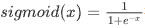

​	也称为逻辑函数。一种非线性函数，即可用于机器学习（逻辑回归），也能用于深度学习。

​	深度学习中主要使用的是矩阵和向量，因此numpy更为实用，对于使用math写的sigmid函数，如果传入向量或者矩阵会报类型不匹配的错误，因此使用np.exp()。

​	如果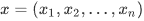是行向量，则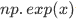会将指数函数应用于x的每个元素。输出为：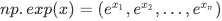

```python
import math 
import numpy as np

# example of np.exp
x = np.array([1, 2, 3])
print(np.exp(x)) # result is (exp(1), exp(2), exp(3))
```

output:

```python
[ 2.71828183  7.3890561  20.08553692]
```

如果x是向量，则𝑠=𝑥+3或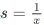之类的Python运算将输出与x维度大小相同的向量s。

```PY
x = np.array([1, 2, 3])
print (x + 3)
```

output：

```python
[4 5 6]
```

综上，对于np.exp()所实现的sigmoid函数，可以输入矩阵，向量等，输出输入如下所示。


```python
def sigmoid(x):

    s = 1 / (1 + np.exp(-x))
    
    return s
```


### 1.2- Sigmoid gradient

**练习**：创建函数sigmoid_grad（）计算sigmoid函数相对于其输入x的梯度。 公式为：

​	此处对应于二分法，x一般为w^T*x+b，使用梯度下降法的时候会从成本函数一步步向前求偏导，以找到成本函数最小的值与点，合理利用链式法则以求得相应的导数。

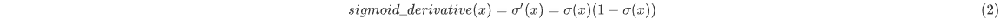

```python
def sigmoid_derivative(x):
    s = sigmoid(x)
    ds = s * (1-s)
    return ds

x = np.array([1, 2, 3])
print ("sigmoid_derivative(x) = " + str(sigmoid_derivative(x)))
```

output:

```PYTHON
sigmoid_derivative(x) = [0.19661193 0.10499359 0.04517666]
```

### 1.3- 重塑数组

深度学习中两个常用的numpy函数是np.shape()和np.reshape()。
-X.shape用于获取矩阵/向量X的shape（维度）。
-X.reshape（...）用于将X重塑为其他尺寸。

例如，在计算机科学中，图像由shape为(𝑙𝑒𝑛𝑔𝑡ℎ,ℎ𝑒𝑖𝑔ℎ𝑡,𝑑𝑒𝑝𝑡ℎ=3)的3D数组表示，（长，宽，RGB=3）但是，当你读取图像作为算法的输入时，会将其转换为维度为(𝑙𝑒𝑛𝑔𝑡ℎ∗ℎ𝑒𝑖𝑔ℎ𝑡∗3,1)的向量。换句话说，将3D阵列“展开”或重塑为1D向量。

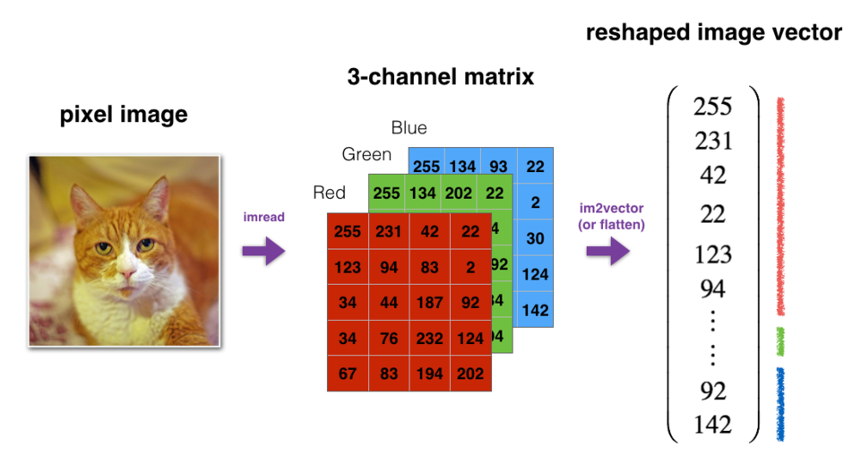

**练习**：实现`image2vector()` ,该输入采用维度为(length, height, 3)的输入，并返回维度为(length\*height\*3 , 1)的向量。例如，如果你想将形为（a，b，c）的数组v重塑为维度为(a*b, 3)的向量，则可以执行以下操作：

```python
v = v.reshape((v.shape[0]*v.shape[1], v.shape[2])) # v.shape[0] = a ; v.shape[1] = b ; v.shape[2] = c
```

-请不要将图像的尺寸硬编码为常数。而是通过image.shape [0]等来查找所需的数量。

```python
def image2vector(image):

    v = image.reshape(image.shape[0] * image.shape[1] * image.shape[2], 1)

    return v


image = np.array([[[ 0.67826139,  0.29380381],
        [ 0.90714982,  0.52835647],
        [ 0.4215251 ,  0.45017551]],

       [[ 0.92814219,  0.96677647],
        [ 0.85304703,  0.52351845],
        [ 0.19981397,  0.27417313]],

       [[ 0.60659855,  0.00533165],
        [ 0.10820313,  0.49978937],
        [ 0.34144279,  0.94630077]]])

print ("image2vector(image) = " + str(image2vector(image)))
```

output:

```python
image2vector(image) = [[0.67826139]
 [0.29380381]
 [0.90714982]
 [0.52835647]
 [0.4215251 ]
 [0.45017551]
 [0.92814219]
 [0.96677647]
 [0.85304703]
 [0.52351845]
 [0.19981397]
 [0.27417313]
 [0.60659855]
 [0.00533165]
 [0.10820313]
 [0.49978937]
 [0.34144279]
 [0.94630077]]
```

### 1.4-行标准化

​	对数据进行标准化（归一化）。 由于归一化后梯度下降的收敛速度更快，通常会表现出更好的效果。 通过归一化，也就是将x更改为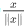（将x的每个行向量除以其范数（模值）)。

例如：

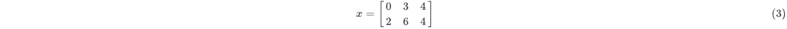

then

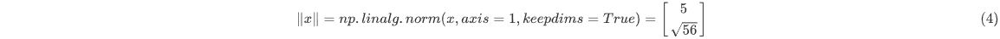

and

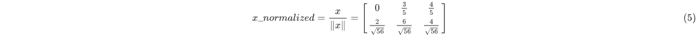

**练习**：执行 normalizeRows（）来标准化矩阵的行。 将此函数应用于输入矩阵x之后，x的每一行应为单位长度（即长度为1）向量。

```python
#linalg = linear（线性）+ algebra（代数），norm则表示范数。
#x_norm=np.linalg.norm(x, ord=None, axis=None, keepdims=False)
```

- x: 表示矩阵（也可以是一维）

- ord：范数类型

  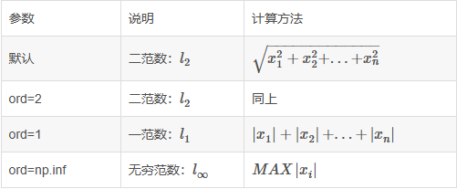

- axis, axis=0 表示按列向量来进行处理，求多个列向量的范数; axis =1 表示按行向量来进行处理，求多个行向量的范数

- keepdims：表示是否保持矩阵的二维特性，True表示保持，False表示不保持，默认为False

```python
def normalizeRows(x):
    x_norm = np.linalg.norm(x, axis = 1, keepdims = True)
    # Divide x by its norm.
    x = x / x_norm
    ### END CODE HERE ###

    return x

x = np.array([
    [0, 3, 4],
    [1, 6, 4]])
print("normalizeRows(x) = " + str(normalizeRows(x)))
```

output：

```PYTHON
normalizeRows(x) = [[0.         0.6        0.8       ]
 [0.13736056 0.82416338 0.54944226]]
```

**注意**：
在normalizeRows（）中，尝试print查看 x_norm和x的维度， 会发现它们具有不同的w维度。 鉴于x_norm采用x的每一行的范数，这是正常的。 因此，x_norm具有相同的行数，但只有1列。 那么，当你将x除以x_norm时，它是如何工作的？ 这就是所谓的广播broadcasting，我们现在将讨论它！

此处对应的是笔记中的广播，通俗来讲就是会智能化解决维度不匹配的问题。

### 1.5- 广播和softmax函数

在numpy中要理解的一个非常重要的概念是“广播”。 这对于在不同形状的数组之间执行数学运算非常有用。

**练习**: 使用numpy实现softmax函数。 你可以将softmax理解为算法需要对两个或多个类进行分类时使用的标准化函数。

​	简而言之，输入一个矩阵，取e指数后每行进行单位化，对于这个函数有什么作用将在本专业的第二门课中了解有关softmax的更多信息。

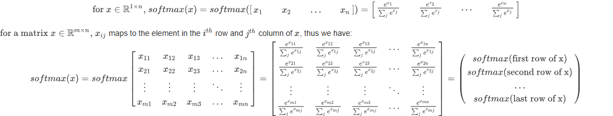

```python
def softmax(x):

    x_exp = np.exp(x)

    x_sum = np.sum(x_exp, axis = 1, keepdims = True)

    s = x_exp / x_sum
    
    return s


x = np.array([
    [9, 2, 5, 0, 0],
    [7, 5, 0, 0 ,0]])
print("softmax(x) = " + str(softmax(x)))
```

output:

```PYTHON
softmax(x) = [[9.80897665e-01 8.94462891e-04 1.79657674e-02 1.21052389e-04
  1.21052389e-04]
 [8.78679856e-01 1.18916387e-01 8.01252314e-04 8.01252314e-04
  8.01252314e-04]]
```

## 2-向量化

​	在深度学习中，通常需要处理非常大的数据集。 因此，非计算最佳函数可能会成为算法中的巨大瓶颈，并可能使模型运行一段时间。 为了确保代码的高效计算，我们将使用向量化。 例如，尝试区分点/外部/元素乘积之间的区别。

​	下方运算时间为0，dic、doc相同，电脑运算太快，代码太少，format函数精确到后八位都是0。

​	但大运算量避免使用显示for，使用np函数库。

### **点积(dot product)**

又叫标量积、数量积。

​	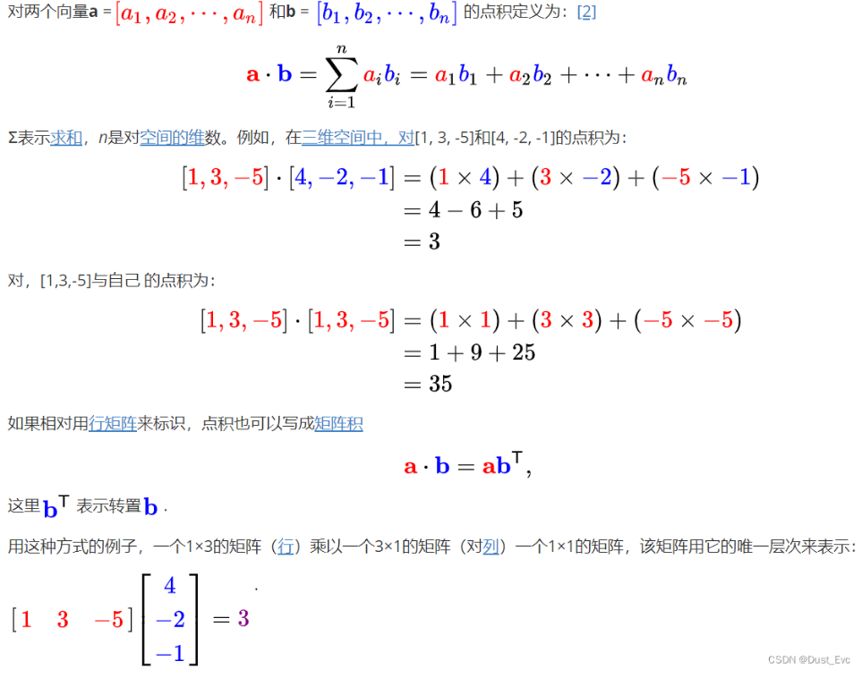

for版本：

```python
import time

x1 = [9, 2, 5, 0, 0, 7, 5, 0, 0, 0, 9, 2, 5, 0, 0]
x2 = [9, 2, 2, 9, 0, 9, 2, 5, 0, 0, 9, 2, 5, 0, 0]

### CLASSIC DOT PRODUCT OF VECTORS IMPLEMENTATION ###
tic = time.process_time()
dot = 0
for i in range(len(x1)):
    dot+= x1[i]*x2[i]
toc = time.process_time()
print ("dot = " + str(dot) + "\n ----- Computation time = " + str(1000*(toc - tic)) + "ms")
```

np版本：

```PYTHON
x1 = [9, 2, 5, 0, 0, 7, 5, 0, 0, 0, 9, 2, 5, 0, 0]
x2 = [9, 2, 2, 9, 0, 9, 2, 5, 0, 0, 9, 2, 5, 0, 0]

### VECTORIZED DOT PRODUCT OF VECTORS ###
tic = time.process_time()
dot = np.dot(x1,x2)
toc = time.process_time()
print ("dot = " + str(dot) + "\n ----- Computation time = " + str(1000*(toc - tic)) + "ms")
```


output:

```PYTHON
dot = 278
 ----- Computation time = 0.0ms
```


### **叉积(corss product)**

​	或向量积(vector product )

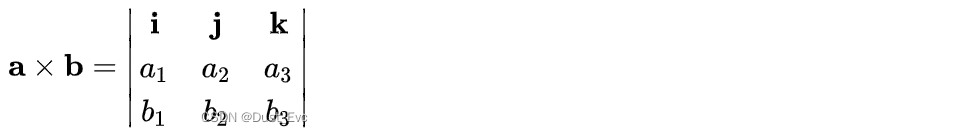

### **外积(outer product)**

在线性代数中，两个坐标向量的外积是一个矩阵。如果这两个向量的维度是*n*和*m*，那么它们的外积是一个*n* × *m*矩阵。更一般地说，给定两个张量（多维数字数组），它们的外积是张量。张量的外积也称为张量积，可用于定义张量代数。

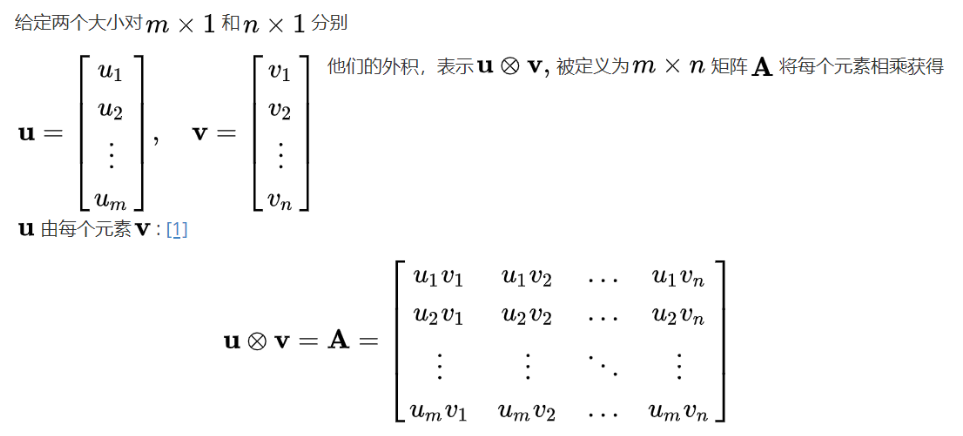

for版本:

```PYTHON
### CLASSIC OUTER PRODUCT IMPLEMENTATION ###
tic = time.process_time()
outer = np.zeros((len(x1),len(x2))) # we create a len(x1)*len(x2) matrix with only zeros
for i in range(len(x1)):
    for j in range(len(x2)):
        outer[i,j] = x1[i]*x2[j]
toc = time.process_time()
print ("outer = " + str(outer) + "\n ----- Computation time = " + str(1000*(toc - tic)) + "ms")
```

np版本：

```PYTHON
### VECTORIZED OUTER PRODUCT ###
tic = time.process_time()
outer = np.outer(x1,x2)
toc = time.process_time()
print ("outer = " + str(outer) + "\n ----- Computation time = " + str(1000*(toc - tic)) + "ms")
```


output:

```PYTHON
outer = [[81. 18. 18. 81.  0. 81. 18. 45.  0.  0. 81. 18. 45.  0.  0.]
 [18.  4.  4. 18.  0. 18.  4. 10.  0.  0. 18.  4. 10.  0.  0.]
 [45. 10. 10. 45.  0. 45. 10. 25.  0.  0. 45. 10. 25.  0.  0.]
 [ 0.  0.  0.  0.  0.  0.  0.  0.  0.  0.  0.  0.  0.  0.  0.]
 [ 0.  0.  0.  0.  0.  0.  0.  0.  0.  0.  0.  0.  0.  0.  0.]
 [63. 14. 14. 63.  0. 63. 14. 35.  0.  0. 63. 14. 35.  0.  0.]
 [45. 10. 10. 45.  0. 45. 10. 25.  0.  0. 45. 10. 25.  0.  0.]
 [ 0.  0.  0.  0.  0.  0.  0.  0.  0.  0.  0.  0.  0.  0.  0.]
 [ 0.  0.  0.  0.  0.  0.  0.  0.  0.  0.  0.  0.  0.  0.  0.]
 [ 0.  0.  0.  0.  0.  0.  0.  0.  0.  0.  0.  0.  0.  0.  0.]
 [81. 18. 18. 81.  0. 81. 18. 45.  0.  0. 81. 18. 45.  0.  0.]
 [18.  4.  4. 18.  0. 18.  4. 10.  0.  0. 18.  4. 10.  0.  0.]
 [45. 10. 10. 45.  0. 45. 10. 25.  0.  0. 45. 10. 25.  0.  0.]
 [ 0.  0.  0.  0.  0.  0.  0.  0.  0.  0.  0.  0.  0.  0.  0.]
 [ 0.  0.  0.  0.  0.  0.  0.  0.  0.  0.  0.  0.  0.  0.  0.]]
 ----- Computation time = 0.0ms
```

​	不同于`np.multiply()`和`*` 操作符（相当于Matlab / Octave中的 `.*`）执行逐元素的乘法，`np.dot()`执行的是矩阵-矩阵或矩阵向量乘法，

### 2.1-实现L1和L2损失函数

**练习**：实现L1损失函数的Numpy向量化版本。 我们会发现函数abs（x）（x的绝对值）很有用。

**提示**：
-损失函数用于评估模型的性能。 损失越大，预测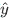 与真实值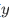的差异也就越大。 在深度学习中，我们使用诸如Gradient Descent之类的优化算法来训练模型并最大程度地降低成本。

- L1损失函数定义为：

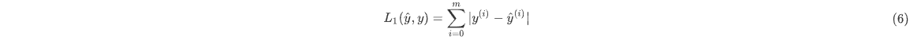

```PYTHON
def L1(yhat, y):
    loss = np.sum(np.abs(y - yhat))
    return loss

yhat = np.array([.9, 0.2, 0.1, .4, .9])
y = np.array([1, 0, 0, 1, 1])
print("L1 = " + str(L1(yhat,y)))
```

output:

```python
L1 = 1.1
```

**练习**：实现L2损失函数的Numpy向量化版本。 有好几种方法可以实现L2损失函数，但是还是np.dot（）函数更好用。 提醒一下，如果𝑥=[𝑥1,𝑥2,...,𝑥𝑛]，则`np.dot（x，x）`=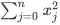

- L2损失函数定义为：

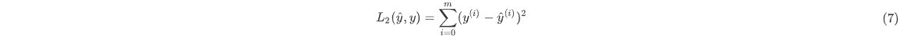

此种算法是上述提到的矩阵的点积算法。

```python
def L2(yhat, y):
    loss = np.dot((y - yhat),(y - yhat).T)
    return loss


yhat = np.array([.9, 0.2, 0.1, .4, .9])
y = np.array([1, 0, 0, 1, 1])
print("L2 = " + str(L2(yhat,y)))
```

output:

```python
L2 = 0.43
```

# 用神经网络思想实现Logistic回归

## 1- 安装包

**你将学习以下内容：**

- 建立学习算法的一般架构，包括：
  - 初始化参数
  - 计算损失函数及其梯度
  - 使用优化算法（梯度下降）
- 按正确的顺序将以上所有三个功能集成到一个主模型上。

```python
import numpy as np
import matplotlib.pyplot as plt
import h5py
import scipy
from PIL import Image
from scipy import ndimage
from lr_utils import load_dataset #自建库，不大很小，网上可找到。
```

## 2- 数据集

**问题说明**：你将获得一个包含以下内容的数据集（"data.h5"）：

-    标记为cat（y = 1）或非cat（y = 0）的**m_train**训练图像集
-    标记为cat或non-cat的**m_test**测试图像集
-    图像维度为（num_px，num_px，3），其中3表示3个通道（RGB）。 因此，每个图像都是正方形（高度= num_px）和（宽度= num_px）。

你将构建一个简单的图像识别算法，该算法可以将图片正确分类为猫和非猫。
让我们熟悉一下数据集吧， 首先通过运行以下代码来加载数据。

```python
# Loading the data (cat/non-cat)
train_set_x_orig, train_set_y, test_set_x_orig, test_set_y, classes = load_dataset()

print("train_set_x shape: " + str(train_set_x_orig.shape))
print("train_set_y shape: " + str(train_set_y.shape))
print("test_set_x shape: " + str(test_set_x_orig.shape))
print("test_set_y shape: " + str(test_set_y.shape))
```

我们在图像数据集（训练和测试）的末尾添加了"_orig"，以便对其进行预处理。 预处理后，我们将得到train_set_x和test_set_x（标签train_set_y和test_set_y不需要任何预处理）。

- **train_set_x_orig** ：保存的是训练集里面的图像数据（本训练集有209张64x64的图像）。
- **train_set_y_orig** ：保存的是训练集的图像对应的分类值（【0 | 1】，0表示不是猫，1表示是猫）。
- **test_set_x_orig** ：保存的是测试集里面的图像数据（本训练集有50张64x64的图像）。
- **test_set_y_orig** ： 保存的是测试集的图像对应的分类值（【0 | 1】，0表示不是猫，1表示是猫）。
- **classes** ： 保存的是以bytes类型保存的两个字符串数据，数据为：[b’non-cat’ b’cat’]。

train_set_x_orig和test_set_x_orig的每一行都是代表图像的数组。 你可以通过运行以下代码来可视化示例。 还可以随意更改`index`值并重新运行以查看其他图像。

```python
# Example of a picture
index = 5
plt.imshow(train_set_x_orig[index])
plt.show()  #使用vscode时，添加这个才会显示，并非在ipythonnote中运行。
print ("y = " + str(train_set_y[:, index]) + ", it's a '" + classes[np.squeeze(train_set_y[:, index])].decode("utf-8") +  "' picture.")
```

output：

```python
y = [0], it's a 'non-cat' picture.
```

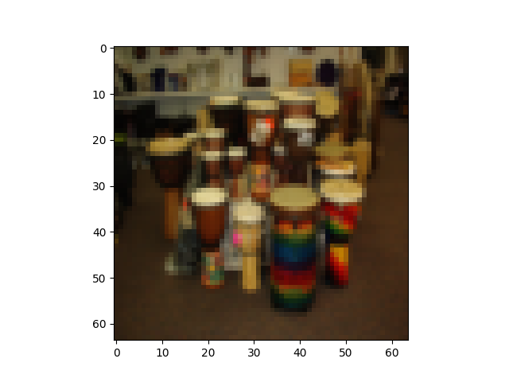

深度学习中的许多报错都来自于矩阵/向量尺寸不匹配。 如果你可以保持矩阵/向量的尺寸不变，那么将消除大多错误。

**练习：** 查找以下各项的值：

-    m_train（训练集示例数量）
-    m_test（测试集示例数量）
-    num_px（=训练图像的高度=训练图像的宽度）

“ train_set_x_orig”是一个维度为（m_train，num_px，num_px，3）的numpy数组。

```python
### START CODE HERE ### (≈ 3 lines of code)
m_train = train_set_x_orig.shape[0]
m_test = test_set_x_orig.shape[0]
num_px = train_set_x_orig.shape[1]
### END CODE HERE ###

print ("Number of training examples: m_train = " + str(m_train))
print ("Number of testing examples: m_test = " + str(m_test))
print ("Height/Width of each image: num_px = " + str(num_px))
print ("Each image is of size: (" + str(num_px) + ", " + str(num_px) + ", 3)")
print ("train_set_x shape: " + str(train_set_x_orig.shape))
print ("train_set_y shape: " + str(train_set_y.shape))
print ("test_set_x shape: " + str(test_set_x_orig.shape))
print ("test_set_y shape: " + str(test_set_y.shape))
```

output：

```python
Number of training examples: m_train = 209
Number of testing examples: m_test = 50
Height/Width of each image: num_px = 64
Each image is of size: (64, 64, 3)
train_set_x shape: (209, 64, 64, 3)
train_set_y shape: (1, 209)
test_set_x shape: (50, 64, 64, 3)
test_set_y shape: (1, 50)
```

为了方便起见，你现在应该以维度(num_px ∗ num_px ∗ 3, 1)的numpy数组重塑维度（num_px，num_px，3）的图像。 此后，我们的训练（和测试）数据集是一个numpy数组，其中每列代表一个展平的图像。 应该有m_train（和m_test）列。

## 3-预处理数据集

**练习：** 重塑训练和测试数据集，以便将大小（num_px，num_px，3）的图像展平为单个形状的向量(num_px ∗ num_px ∗ 3, 1)。

将维度为（a，b，c，d）的矩阵X展平为形状为(b∗c∗d, a)的矩阵X_flatten时的一个技巧是：

​	在指定目标 shape 时存在一些技巧：

> - 1. -1 表示这个维度的值是从 x 的元素总数和剩余维度推断出来的。因此，有且只有一个维度可以被设置为-1,利用变换前后的元素数值相等推测出来。
> - 1. 0 表示实际的维数是从 x 的对应维数中复制出来的，因此 shape 中 0 的索引值不能超过 x 的维度，直接复制即可。

这里有一些例子来解释它们：

> - 1。给定一个形状为[2,4,6]的三维 Tensor x，目标形状为[6,8]，则将 x 变换为形状为[6,8]的 2-D Tensor，且 x 的数据保持不变。
> - 2。给定一个形状为[2,4,6]的三维 Tensor x，目标形状为[2,3,-1,2]，则将 x 变换为形状为[2,3,4,2]的 4-D Tensor，且 x 的数据保持不变。在这种情况下，目标形状的一个维度被设置为-1，这个维度的值是从 x 的元素总数和剩余维度推断出来的。
> - 3。给定一个形状为[2,4,6]的三维 Tensor x，目标形状为[-1,0,3,2]，则将 x 变换为形状为[2,4,3,2]的 4-D Tensor，且 x 的数据保持不变。在这种情况下，0 对应位置的维度值将从 x 的对应维数中复制，-1 对应位置的维度值由 x 的元素总数和剩余维度推断出来。

```python
X_flatten = X.reshape(X.shape [0]，-1).T     # 其中X.T是X的转置矩阵
```

多数机器学习以行为特征列为样本数。

```python
# Reshape the training and test examples

### START CODE HERE ### (≈ 2 lines of code)
train_set_x_flatten = train_set_x_orig.reshape(train_set_x_orig.shape[0], -1).T
test_set_x_flatten = test_set_x_orig.reshape(test_set_x_orig.shape[0], -1).T
### END CODE HERE ###

print ("train_set_x_flatten shape: " + str(train_set_x_flatten.shape))
print ("train_set_y shape: " + str(train_set_y.shape))
print ("test_set_x_flatten shape: " + str(test_set_x_flatten.shape))
print ("test_set_y shape: " + str(test_set_y.shape))
print ("sanity check after reshaping: " + str(train_set_x_flatten[0:5,0]))
```

output：

```python
train_set_x_flatten shape: (12288, 209)
train_set_y shape: (1, 209)
test_set_x_flatten shape: (12288, 50)
test_set_y shape: (1, 50)
sanity check after reshaping: [17 31 56 22 33] #“理智检查”（sanity check），用于验证数据是否按预期进行了重塑。 通过打印数组一小部分，通过视觉检查是否符合预期，选取前五个样本的第一个特征值。
```

机器学习中一个常见的预处理步骤是对数据集进行居中和标准化，这意味着你要从每个示例中减去整个numpy数组的均值，然后除以整个numpy数组的标准差。但是图片数据集则更为简单方便，并且只要将数据集的每一行除以255（像素通道的最大值），效果也差不多。

在训练模型期间，将要乘以权重并向一些初始输入添加偏差以观察神经元的激活。然后，使用反向梯度传播以训练模型。但是，让特征具有相似的范围以至渐变不会爆炸是非常重要的（后续章节）。

```python
train_set_x = train_set_x_flatten/255.
test_set_x = test_set_x_flatten/255.
```

预处理数据集的常见步骤是：

- 找出数据的尺寸和维度（m_train，m_test，num_px等）
- 重塑数据集，以使每个示例都是大小为（num_px \*num_px \* 3，1）的向量
- “标准化”数据

## 4-算法的一般框架

使用神经网络思维方式建立Logistic回归。 下图说明了为什么“逻辑回归实际上是一个非常简单的神经网络！”

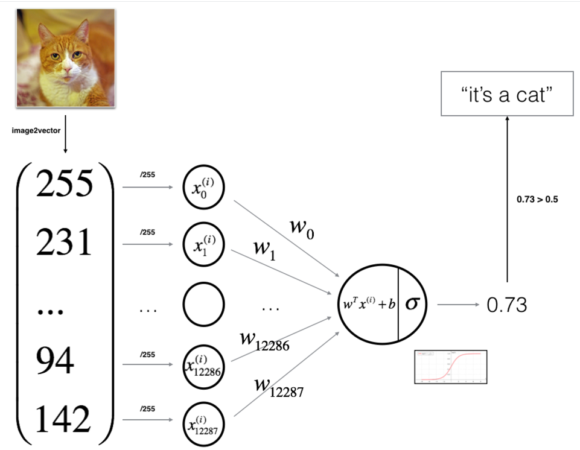

**算法的数学表达式**：

​	前方都是在预测，似乎只有损失函数和成本函数是与训练有关系，成本函数最终是要求偏导成w和b的函数，因此就是通过成本函数和损失函数来找寻使得J最小的w和b函数。

For one example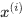：

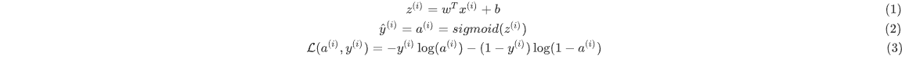

The cost is then computed by summing over all training examples:

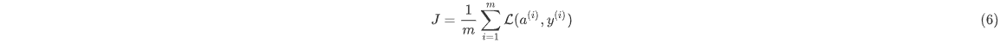

**关键步骤**：

-    初始化模型参数
-    通过最小化损失来学习模型的参数
-    使用学习到的参数进行预测（在测试集上）
-    分析结果并得出结论

## 5-构建算法

建立神经网络的主要步骤是：
1.定义模型结构（例如输入特征的数量）
2.初始化模型的参数
3.循环：

-    计算当前损失（正向传播）
-    计算当前梯度（向后传播）
-    更新参数（梯度下降）

构建1-3，集成到一个称为“ model（）”的函数中。

### 5.1- sigmoid函数(辅助函数)

```python
def sigmoid(z):
    s = 1 / (1 + np.exp(-z))
    return s
```

### 5.2- 初始化参数

**练习：** 实现参数初始化。 你必须将w初始化为零的向量使用np.zeros（）。

```python
def initialize_with_zeros(dim):
    w = np.zeros((dim, 1))
    b = 0

    assert(w.shape == (dim, 1))
    assert(isinstance(b, float) or isinstance(b, int))
    
    return w, b

dim = 2
w, b = initialize_with_zeros(dim)
print ("w = " + str(w))
print ("b = " + str(b))
```

output：

```PYTHON
w = [[0.]
 [0.]]
b = 0
```

### 5.3 前向和后向传播函数

**练习：** 实现函数propagate（）来计算损失函数及其梯度。

正向传播：

- 得到X
- 计算
- 计算损失函数：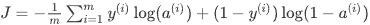

使用到以下两个公式：可从笔记中一步步推出来。

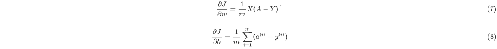

```python
def propagate(w, b, X, Y):
    m = X.shape[1]
    A = sigmoid(np.dot(w.T, X) + b)         
    cost = -1 / m * np.sum(Y * np.log(A) + (1 - Y) * np.log(1 - A))
    dw = 1 / m * np.dot(X, (A - Y).T)
    db = 1 / m * np.sum(A - Y)
    assert(dw.shape == w.shape)
    assert(db.dtype == float)
    cost = np.squeeze(cost) #从数组的形状中移除单维度的条目。如一些数组为[2,2，1]，其实质就为一个二维数组，但这样写会表现为三维数组，因此可以用squeeze函数将其变为[2,2]
    assert(cost.shape == ())
    
    grads = {"dw": dw,
             "db": db}
    
    return grads, cost

w, b, X, Y = np.array([[1],[2]]), 2, np.array([[1,2],[3,4]]), np.array([[1,0]])
#w, b, X, Y = np.array([[1],[2],[3]]), 2, np.array([[1,2,3],[3,4,3],[5,6,3]]), np.array([[1,0,1]])
grads, cost = propagate(w, b, X, Y)
print ("dw = " + str(grads["dw"]))
print ("db = " + str(grads["db"]))
print ("cost = " + str(cost))
```

output：

```python
dw = [[0.99993216]
 [1.99980262]]
db = 0.49993523062470574
cost = 6.000064773192205
```

### 5.4-优化函数

- 初始化参数。
- 计算损失函数及其梯度。
- 使用梯度下降来更新参数。

**练习：** 通过最小化损失函数 𝐽 来学习 𝑤 和 𝑏。 对于参数𝜃，更新规则为𝜃=𝜃−𝛼 𝑑𝜃，其中𝛼是学习率。

```python
def optimize(w, b, X, Y, num_iterations, learning_rate, print_cost = False):
    
    costs = []
    
    for i in range(num_iterations): #迭代次数
        

        grads, cost = propagate(w, b, X, Y)


        dw = grads["dw"]
        db = grads["db"]

        w = w - learning_rate * dw
        b = b - learning_rate * db

        if i % 100 == 0:#记录每隔一定步骤（每 100 步）的损失值。
            costs.append(cost)#将损失值（cost）添加到名为costs的列表中。

        if print_cost and i % 100 == 0:
            print ("Cost after iteration %i: %f" %(i, cost))
    
    params = {"w": w,
              "b": b}
    
    grads = {"dw": dw,
             "db": db}
    
    return params, grads, costs

params, grads, costs = optimize(w, b, X, Y, num_iterations= 101, learning_rate = 0.009, print_cost = False)

print ("w = " + str(params["w"]))
print ("b = " + str(params["b"]))
print ("dw = " + str(grads["dw"]))
print ("db = " + str(grads["db"]))
print(costs)
```

output：

```PYTHON
w = [[0.10440664]
 [0.21535171]]
b = 1.5554725342883116
dw = [[0.89458411]
 [1.74622645]]
db = 0.4258211729530607
[6.000064773192205, 1.4313999565615696]
```

**练习：** 上一个函数将输出学习到的w和b。 我们能够使用w和b来预测数据集X的标签。实现`predict（）`函数。 预测分类有两个步骤：
1.计算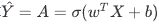
2.将a的项转换为0（如果激活<= 0.5）或1（如果激活> 0.5)，并将预测结果存储在向量“ Y_prediction”中。 如果愿意，可以在for循环中使用if / else语句。

```python
def predict(w, b, X):
    #此处的X已经是被预处理过后的，即大小为(X.shape[0],X.shape[1])而不再是RGB三维数组。
    m = X.shape[1]  #获取样本数
    Y_prediction = np.zeros((1,m)) #1行m列
    w = w.reshape(X.shape[0], 1)#w为x对应的行，1列（后续要转置）
    A = sigmoid(np.dot(w.T, X) + b)#y_hat

    for i in range(A.shape[1]):
        if A[0, i] <= 0.5:
            Y_prediction[0, i] = 0 #不是猫
        else:
            Y_prediction[0, i] = 1 #猫
    
    assert(Y_prediction.shape == (1, m)) 
    
    return Y_prediction

print ("predictions = " + str(predict(w, b, X)))
```

output：

```python
predictions = [[1. 1.]] #结果表示测试了两张图片，都为猫。
```

## 6- 将所有功能合并到模型中

现在，将所有构件（在上一部分中实现的功能）以正确的顺序放在一起，从而得到整体的model()函数。

**练习：** 实现函数功能，使用以下符号：

-    Y_prediction对测试集的预测
-    Y_prediction_train对训练集的预测
-    w，损失，optimize（）输出的梯度

```python
def model(X_train, Y_train, X_test, Y_test, num_iterations = 2000, learning_rate = 0.5, print_cost = False):

    w, b = initialize_with_zeros(X_train.shape[0]) #对w和b进行以X行为数的初始化[dim，1]

    parameters, grads, costs = optimize(w, b, X_train, Y_train, num_iterations, learning_rate, print_cost)

    w = parameters["w"]
    b = parameters["b"]#训练后的

    Y_prediction_test = predict(w, b, X_test)
    Y_prediction_train = predict(w, b, X_train)

    print("train accuracy: {} %".format(100 - np.mean(np.abs(Y_prediction_train - Y_train)) * 100)) #100-绝对误差（此处误差归一化了，因此乘以100）
    print("test accuracy: {} %".format(100 - np.mean(np.abs(Y_prediction_test - Y_test)) * 100))

    
    d = {"costs": costs,
         "Y_prediction_test": Y_prediction_test, 
         "Y_prediction_train" : Y_prediction_train, 
         "w" : w, #w从0通过梯度来计算权重矩阵，dw的值通过照片计算不一样。
         "b" : b,
         "learning_rate" : learning_rate,
         "num_iterations": num_iterations}
    
    return d

```

​	通过训练集得到每张照片dw，然后计算损失函数，进而得到成本函数，dw的不同导致了损失函数不同，从而使得更新的w权重矩阵不同。

## 7- 学习率的选择

为了使梯度下降起作用，你必须明智地选择学习率。 学习率𝛼决定我们更新参数的速度。 如果学习率太大，我们可能会“超出”最佳值。 同样，如果太小，将需要更多的迭代才能收敛到最佳值。 这也是为什么调整好学习率至关重要。

让我们将模型的学习曲线与选择的几种学习率进行比较。 运行下面的单元格。 这大约需要1分钟。 还可以尝试与我们初始化要包含的“ learning_rates”变量的三个值不同的值，然后看看会发生什么。

```python
learning_rates = [0.01, 0.001, 0.0001]
models = {}
for i in learning_rates:
    print ("learning rate is: " + str(i))
    models[str(i)] = model(train_set_x, train_set_y, test_set_x, test_set_y, num_iterations = 1500, learning_rate = i, print_cost = False)
    print ('\n' + "-------------------------------------------------------" + '\n')

for i in learning_rates:
    plt.plot(np.squeeze(models[str(i)]["costs"]), label= str(models[str(i)]["learning_rate"]))

plt.ylabel('cost')
plt.xlabel('iterations')

legend = plt.legend(loc='upper center', shadow=True)
frame = legend.get_frame()
frame.set_facecolor('0.90')
plt.show()
```

output：

```python
learning rate is: 0.01
train accuracy: 99.52153110047847 %
test accuracy: 68.0 %

-------------------------------------------------------

learning rate is: 0.001
train accuracy: 88.99521531100478 %
test accuracy: 64.0 %

-------------------------------------------------------

learning rate is: 0.0001
train accuracy: 68.42105263157895 %
test accuracy: 36.0 %

-------------------------------------------------------
```

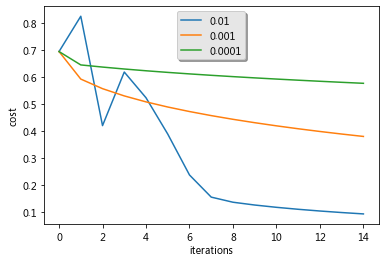

## 8-使用自己的图像进行测试

祝贺你完成此作业。 你可以使用自己的图像并查看模型的预测输出。 要做到这一点：
   1.单击此笔记本上部栏中的 "File"，然后单击"Open" 以在Coursera Hub上运行。
   2.将图像添加到Jupyter Notebook的目录中，在"images"文件夹中
   3.在以下代码中更改图像的名称
   4.运行代码，检查算法是否正确（1 = cat，0 = non-cat）！

```python
fname = '/home/kesci/input/deeplearningai17761/cat_in_iran.jpg'#文件路径
image = np.array(plt.imread(fname))
my_image = scipy.misc.imresize(image, size=(num_px,num_px)).reshape((1, num_px*num_px*3)).T
my_predicted_image = predict(d["w"], d["b"], my_image)

plt.imshow(image)
print("y = " + str(np.squeeze(my_predicted_image)) + ", your algorithm predicts a \"" + classes[int(np.squeeze(my_predicted_image)),].decode("utf-8") +  "\" picture.")
```

# 单隐层的神经网络分类二维数据

## 1-安装包

- [numpy](https://www.heywhale.com/api/notebooks/5e85d6bf95b029002ca7e7e6/www.numpy.org)是Python科学计算的基本包。

- [sklearn](http://scikit-learn.org/stable/)提供了用于数据挖掘和分析的简单有效的工具。

- [matplotlib](http://matplotlib.org/) 是在Python中常用的绘制图形的库。

- testCases提供了一些测试示例用以评估函数的正确性

- planar_utils提供了此作业中使用的各种函数

  导入以下依赖库。

```python
# Package imports
import numpy as np
import matplotlib.pyplot as plt
from testCases import *
import sklearn
import sklearn.datasets
import sklearn.linear_model
from planar_utils import plot_decision_boundary, sigmoid, load_planar_dataset, load_extra_datasets

%matplotlib inline

np.random.seed(1) # set a seed so that the results are consistent
```

## 2-数据集

`plt.scatter` 是 Matplotlib 库中用于绘制散点图的函数。它的语法和参数如下：

```python
plt.scatter(x, y, s=None, c=None, marker=None, cmap=None, norm=None, vmin=None, vmax=None, alpha=None, linewidths=None, edgecolors=None, plotnonfinite=False, data=None, **kwargs)
```

将“flower” 2分类数据集加载到变量 `X` 和 `Y`中。

  \- 包含特征（x1，x2）的numpy数组（矩阵）X
  \- 包含标签（红色：0，蓝色：1）的numpy数组（向量）Y。

这里的X是[2,N]矩阵，第一行为横坐标，第二行为纵坐标。

```python
X, Y = load_planar_dataset() 
```

使用matplotlib可视化数据集。 数据看起来像是带有一些红色（标签y = 0）和一些蓝色（y = 1）点的“花”。 我们的目标是建立一个适合该数据的分类模型。

- `X[0, :]` 和 `X[1, :]`：这两个是散点图中点的横纵坐标。`X[0, :]` 是所有点的横坐标集合，`X[1, :]` 是所有点的纵坐标集合。
- `c=Y.reshape(X[0,:].shape)`：这里的 `c` 参数代表颜色。`Y` 是一个颜色标签数组，通过 `reshape` 方法将其形状调整为与 `X[0,:]` 相同，这样每个点都会根据 `Y` 中的标签被着色。
- `s=40`：这是设置散点的大小，这里设置为40。
- `cmap=plt.cm.Spectral`：`cmap` 参数指定了一个颜色映射，`plt.cm.Spectral` 是一个颜色映射的名称，它包含了从红色到蓝色的一系列颜色，用于根据 `c` 参数给点着色。

```python
# Visualize the data:
plt.scatter(X[0, :], X[1, :], c=Y.reshape(X[0,:].shape), s=40, cmap=plt.cm.Spectral)
```

output：

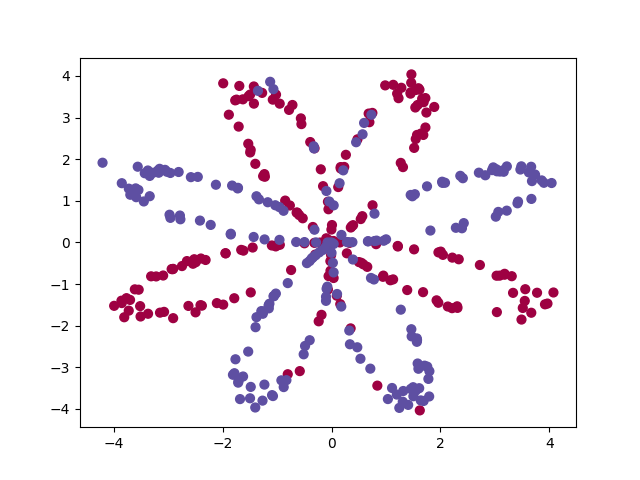

了解一下我们的数据。

```PYTHON
### START CODE HERE ### (≈ 3 lines of code)
shape_X = X.shape
shape_Y = Y.shape

m = shape_X[1]  # training set size
### END CODE HERE ###

print ('The shape of X is: ' + str(shape_X))
print ('The shape of Y is: ' + str(shape_Y))
print ('I have m = %d training examples!' % (m))
```

output：

```PYTHON
The shape of X is: (2, 400)
The shape of Y is: (1, 400)
I have m = 400 training examples!
```

## 3-简单Logistic回归

​	在构建完整的神经网络之前，首先让我们看看逻辑回归在此问题上的表现。 你可以使用sklearn的内置函数来执行此操作。 运行以下代码以在数据集上训练逻辑回归分类器。

```PYTHON
# Train the logistic regression classifier
clf = sklearn.linear_model.LogisticRegressionCV();
clf.fit(X.T, Y.T);
```

运行下面的代码以绘制此模型的决策边界：

```PYTHON
# Plot the decision boundary for logistic regression
plot_decision_boundary(lambda x: clf.predict(x), X, Y)
plt.title("Logistic Regression")

# Print accuracy
LR_predictions = clf.predict(X.T)
print ('Accuracy of logistic regression: %d ' % float((np.dot(Y,LR_predictions) + np.dot(1-Y,1-LR_predictions))/float(Y.size)*100) +
       '% ' + "(percentage of correctly labelled datapoints)")
```

output：

```PYTHON
Accuracy of logistic regression: 47 % (percentage of correctly labelled datapoints)
```


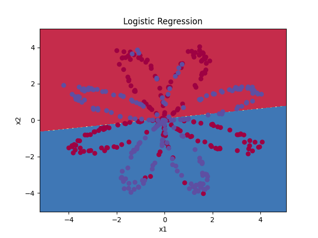

​	可以看到分类的效果并不好，这是由于数据集不是线性可分类的，因此逻辑回归效果不佳。

## 4-神经网络


**数学原理**，a<sup>[1]</sup><sup>(1)</sup><sub>1</sub>(上标：[第一层]（第一个样本）下标：第一个隐藏层神经元)；其余以此类推。
$$
z^{[1] (i)} =  W^{[1]} x^{(i)} + b^{[1] (i)}\tag{1}
$$

$$
a^{[1] (i)} = \tanh(z^{[1] (i)})\tag{2}
$$

$$
z^{[2] (i)} = W^{[2]} a^{[1] (i)} + b^{[2] (i)}\tag{3}
$$

$$
\hat{y}^{(i)} = a^{[2] (i)} = \sigma(z^{ [2] (i)})\tag{4}
$$

$$
y^{(i)}_{prediction} = \begin{cases} 1 & \mbox{if } a^{[2](i)} > 0.5 \\ 0 & \mbox{otherwise } \end{cases}\tag{5}
$$

损失函数𝐽:
$$
J = - \frac{1}{m} \sum\limits_{i = 0}^{m} \large\left(\small y^{(i)}\log\left(a^{[2] (i)}\right) + (1-y^{(i)})\log\left(1- a^{[2] (i)}\right)  \large  \right) \small \tag{6}
$$
建立神经网络的一般方法是：
1.定义神经网络结构（输入单元数，隐藏单元数等）。
2.初始化模型的参数
3.循环：

- 实现前向传播
- 计算损失
- 后向传播以获得梯度
- 更新参数（梯度下降）

通常会构建辅助函数来计算第1-3步，然后将它们合并为`nn_model()`函数。一旦构建了`nn_model()`并学习了正确的参数，就可以对新数据进行预测。

### 4.1 定义神经网络结构

**练习**：定义三个变量：
   \- n_x：输入层的大小
   \- n_h：隐藏层的大小（将其设置为4）
   \- n_y：输出层的大小

**提示**：使用shape来找到n_x和n_y。 另外，将隐藏层大小硬编码为4。

```python
# GRADED FUNCTION: layer_sizes
# 一般X,Y会预处理为一个(N,1)矩阵。
def layer_sizes(X, Y):
    """
    Arguments:
    X -- input dataset of shape (input size, number of examples)
    Y -- labels of shape (output size, number of examples)
    
    Returns:
    n_x -- the size of the input layer
    n_h -- the size of the hidden layer
    n_y -- the size of the output layer
    """
    ### START CODE HERE ### (≈ 3 lines of code)
    n_x = X.shape[0] # size of input layer
    n_h = 4
    n_y = Y.shape[0] # size of output layer
    ### END CODE HERE ###
    return (n_x, n_h, n_y)

X_assess, Y_assess = layer_sizes_test_case()
(n_x, n_h, n_y) = layer_sizes(X_assess, Y_assess)
print("The size of the input layer is: n_x = " + str(n_x))
print("The size of the hidden layer is: n_h = " + str(n_h))
print("The size of the output layer is: n_y = " + str(n_y))
```

output：

```PYTHON
The size of the input layer is: n_x = 5
The size of the hidden layer is: n_h = 4
The size of the output layer is: n_y = 2
```

### 4.2随机初始化参数

​	如笔记中所说，单隐层神经网络需要随机初始化参数，避免训练无效果。

**练习**：实现函数 `initialize_parameters()`。

**说明**：

- 请确保参数大小正确。 如果需要，也可参考上面的神经网络图。
- 使用随机值初始化权重矩阵。
     \- 使用：`np.random.randn（a，b）* 0.01`随机初始化维度为（a，b）的矩阵。
- 将偏差向量初始化为零。
     \- 使用：`np.zeros((a,b))` 初始化维度为（a，b）零的矩阵。

```python
# GRADED FUNCTION: initialize_parameters

def initialize_parameters(n_x, n_h, n_y):
    """
    Argument:
    n_x -- size of the input layer
    n_h -- size of the hidden layer
    n_y -- size of the output layer
    
    Returns:
    params -- python dictionary containing your parameters:
                    W1 -- weight matrix of shape (n_h, n_x)
                    b1 -- bias vector of shape (n_h, 1)
                    W2 -- weight matrix of shape (n_y, n_h)
                    b2 -- bias vector of shape (n_y, 1)
    """
    
    np.random.seed(2) # we set up a seed so that your output matches ours although the initialization is random.
    
    ### START CODE HERE ### (≈ 4 lines of code)
    W1 = np.random.randn(n_h,n_x) * 0.01
    b1 = np.zeros((n_h,1))
    W2 = np.random.randn(n_y,n_h) * 0.01
    b2 = np.zeros((n_y,1))
    ### END CODE HERE ###
    #笔记中有记载，W1矩阵是一个是一个[n_h,n_x]的矩阵,这是向量化后的计算式，实际各分式子应参照笔记中可以直观看出。
    assert (W1.shape == (n_h, n_x))#与X（向量化后）相乘后，出现一个[n_h,1]的矩阵。
    assert (b1.shape == (n_h, 1))
    assert (W2.shape == (n_y, n_h))
    assert (b2.shape == (n_y, 1))
    
    parameters = {"W1": W1,
                  "b1": b1,
                  "W2": W2,
                  "b2": b2}
    
    return parameters


n_x, n_h, n_y = initialize_parameters_test_case()

parameters = initialize_parameters(n_x, n_h, n_y)
print("W1 = " + str(parameters["W1"]))
print("b1 = " + str(parameters["b1"]))
print("W2 = " + str(parameters["W2"]))
print("b2 = " + str(parameters["b2"]))
```

output：

```python
W1 = [[-0.00416758 -0.00056267]
 [-0.02136196  0.01640271]
 [-0.01793436 -0.00841747]
 [ 0.00502881 -0.01245288]]
b1 = [[0.]
 [0.]
 [0.]
 [0.]]
W2 = [[-0.01057952 -0.00909008  0.00551454  0.02292208]]
b2 = [[0.]]
```

### 4.3循环

**问题**：实现`forward_propagation（）`。

**说明**：

- 在上方查看分类器的数学表示形式。
- 你可以使用内置在笔记本中的`sigmoid()`函数。
- 你也可以使用numpy库中的`np.tanh（）`函数。
- 必须执行以下步骤：
     1.使用`parameters [“ ..”]`从字典“ parameters”（这是`initialize_parameters（）`的输出）中检索出每个参数。
     2.实现正向传播，计算𝑍[1],𝐴[1],𝑍[2] 和 𝐴[2] （所有训练数据的预测结果向量）。
- 向后传播所需的值存储在`cache`中， `cache`将作为反向传播函数的输入。

```python
# GRADED FUNCTION: forward_propagation

def forward_propagation(X, parameters):
    """
    Argument:
    X -- input data of size (n_x, m)
    parameters -- python dictionary containing your parameters (output of initialization function)
    
    Returns:
    A2 -- The sigmoid output of the second activation
    cache -- a dictionary containing "Z1", "A1", "Z2" and "A2"
    """
    # Retrieve each parameter from the dictionary "parameters"
    ### START CODE HERE ### (≈ 4 lines of code)
    W1 = parameters["W1"]
    b1 = parameters["b1"]
    W2 = parameters["W2"]
    b2 = parameters["b2"]
    ### END CODE HERE ###
    
    # Implement Forward Propagation to calculate A2 (probabilities)
    ### START CODE HERE ### (≈ 4 lines of code)
    Z1 = np.dot(W1,X) + b1
    A1 = np.tanh(Z1)
    Z2 = np.dot(W2,A1) + b2
    A2 = sigmoid(Z2)
    ### END CODE HERE ###
    
    assert(A2.shape == (1, X.shape[1]))
    
    cache = {"Z1": Z1,
             "A1": A1,
             "Z2": Z2,
             "A2": A2}
    
    return A2, cache

X_assess, parameters = forward_propagation_test_case()

A2, cache = forward_propagation(X_assess, parameters)

# Note: we use the mean here just to make sure that your output matches ours. 
print(np.mean(cache['Z1']) ,np.mean(cache['A1']),np.mean(cache['Z2']),np.mean(cache['A2']))
```

output：

```PYTHON
-0.0004997557777419913 -0.000496963353231779 0.00043818745095914653 0.500109546852431
```

现在，你已经计算了包含每个示例的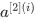的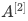（在Python变量“`A2`”中)，其中，你可以计算损失函数如下：
$$
J = - \frac{1}{m} \sum\limits_{i = 0}^{m} \large{(} \small y^{(i)}\log\left(a^{[2] (i)}\right) + (1-y^{(i)})\log\left(1- a^{[2] (i)}\right) \large{)} \small\tag{13}
$$
**练习**：实现`compute_cost（）`以计算损失𝐽的值。

**说明**：

- 有很多种方法可以实现交叉熵损失。 我们为你提供了实现方法：
  $$
  - \sum\limits_{i=0}^{m}  y^{(i)}\log(a^{[2](i)})
  $$

  ```python
  logprobs = np.multiply(np.log(A2),Y)  
  cost = - np.sum(logprobs)                # no need to use a for loop!
  ```

（你也可以使用np.multiply()然后使用np.sum()或直接使用np.dot()）。

```python
# GRADED FUNCTION: compute_cost

def compute_cost(A2, Y, parameters):
    """
    Computes the cross-entropy cost given in equation (13)
    
    Arguments:
    A2 -- The sigmoid output of the second activation, of shape (1, number of examples)
    Y -- "true" labels vector of shape (1, number of examples)
    parameters -- python dictionary containing your parameters W1, b1, W2 and b2
    
    Returns:
    cost -- cross-entropy cost given equation (13)
    """
    
    m = Y.shape[1] # number of example

    # Compute the cross-entropy cost
     ### START CODE HERE ### (≈ 2 lines of code)
    logprobs = Y*np.log(A2) + (1-Y)* np.log(1-A2)
    cost = -1/m * np.sum(logprobs)
    ### END CODE HERE ###
    
    cost = np.squeeze(cost)     # makes sure cost is the dimension we expect. 
                                # E.g., turns [[17]] into 17 
    assert(isinstance(cost, float))
    
    return cost

A2, Y_assess, parameters = compute_cost_test_case()

print("cost = " + str(compute_cost(A2, Y_assess, parameters)))
```

output：

```PYTHON
cost = 0.6929198937761265
```

现在，通过使用在正向传播期间计算的缓存，你可以实现后向传播。

**问题**：实现函数`backward_propagation（）`。

**说明**：
反向传播通常是深度学习中最难（最数学）的部分。为了帮助你更好地了解，我们提供了反向传播课程的幻灯片。你将要使用此幻灯片右侧的六个方程式以构建向量化实现。

这些都是通过合理运用导数和链式法则来计算。


- ∗ 表示元素乘法（由链式法则得来）。
- 深度学习中很常见的编码表示方法：
  - dW1 =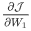
  - db1 = 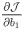
  - dW2 = 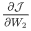
  - db2 = 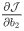
- 提示：
    -要计算dZ1，你首先需要计算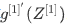。由于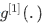是tanh激活函数，因此如果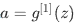𝑧) 则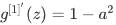。所以你可以使用`(1 - np.power(A1, 2))`计算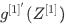。

```python
# GRADED FUNCTION: backward_propagation

def backward_propagation(parameters, cache, X, Y):
    """
    Implement the backward propagation using the instructions above.
    
    Arguments:
    parameters -- python dictionary containing our parameters 
    cache -- a dictionary containing "Z1", "A1", "Z2" and "A2".
    X -- input data of shape (2, number of examples)
    Y -- "true" labels vector of shape (1, number of examples)
    
    Returns:
    grads -- python dictionary containing your gradients with respect to different parameters
    """
    m = X.shape[1]
    
    # First, retrieve W1 and W2 from the dictionary "parameters".
    ### START CODE HERE ### (≈ 2 lines of code)
    W1 = parameters["W1"]
    W2 = parameters["W2"]
    ### END CODE HERE ###
        
    # Retrieve also A1 and A2 from dictionary "cache".
    ### START CODE HERE ### (≈ 2 lines of code)
    A1 = cache["A1"]
    A2 = cache["A2"]
    ### END CODE HERE ###
    
    # Backward propagation: calculate dW1, db1, dW2, db2. 
    ### START CODE HERE ### (≈ 6 lines of code, corresponding to 6 equations on slide above)
    dZ2= A2 - Y
    dW2 = 1 / m * np.dot(dZ2,A1.T)
    db2 = 1 / m * np.sum(dZ2,axis=1,keepdims=True)
    dZ1 = np.dot(W2.T,dZ2) * (1-np.power(A1,2))
    dW1 = 1 / m * np.dot(dZ1,X.T)
    db1 = 1 / m * np.sum(dZ1,axis=1,keepdims=True)
    ### END CODE HERE ###
    
    grads = {"dW1": dW1,
             "db1": db1,
             "dW2": dW2,
             "db2": db2}
    
    return grads

parameters, cache, X_assess, Y_assess = backward_propagation_test_case()

grads = backward_propagation(parameters, cache, X_assess, Y_assess)
print ("dW1 = "+ str(grads["dW1"]))
print ("db1 = "+ str(grads["db1"]))
print ("dW2 = "+ str(grads["dW2"]))
print ("db2 = "+ str(grads["db2"]))
```

output：

```PYTHON
dW1 = [[ 0.01018708 -0.00708701]
 [ 0.00873447 -0.0060768 ]
 [-0.00530847  0.00369379]
 [-0.02206365  0.01535126]]
db1 = [[-0.00069728]
 [-0.00060606]
 [ 0.000364  ]
 [ 0.00151207]]
dW2 = [[ 0.00363613  0.03153604  0.01162914 -0.01318316]]
db2 = [[0.06589489]]
```

**问题**：实现参数更新。 使用梯度下降，你必须使用（dW1，db1，dW2，db2）才能更新（W1，b1，W2，b2）。

**一般的梯度下降规则**：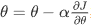其中𝛼是学习率，而𝜃 代表一个参数。

**图示**：具有良好的学习速率（收敛）和较差的学习速率（发散）的梯度下降算法。 图片由Adam Harley提供。


```python
# GRADED FUNCTION: update_parameters

def update_parameters(parameters, grads, learning_rate = 1.2):
    """
    Updates parameters using the gradient descent update rule given above
    
    Arguments:
    parameters -- python dictionary containing your parameters 
    grads -- python dictionary containing your gradients 
    
    Returns:
    parameters -- python dictionary containing your updated parameters 
    """
    # Retrieve each parameter from the dictionary "parameters"
    ### START CODE HERE ### (≈ 4 lines of code)
    W1 = parameters["W1"]
    b1 = parameters["b1"]
    W2 = parameters["W2"]
    b2 = parameters["b2"]
    ### END CODE HERE ###
    
    # Retrieve each gradient from the dictionary "grads"
    ### START CODE HERE ### (≈ 4 lines of code)
    dW1 = grads["dW1"]
    db1 = grads["db1"]
    dW2 = grads["dW2"]
    db2 = grads["db2"]
    ## END CODE HERE ###
    
    # Update rule for each parameter
    ### START CODE HERE ### (≈ 4 lines of code)
    W1 = W1 - learning_rate * dW1
    b1 = b1 - learning_rate * db1
    W2 = W2 - learning_rate * dW2
    b2 = b2 - learning_rate * db2
    ### END CODE HERE ###
    
    parameters = {"W1": W1,
                  "b1": b1,
                  "W2": W2,
                  "b2": b2}
    
    return parameters

parameters, grads = update_parameters_test_case()
parameters = update_parameters(parameters, grads)

print("W1 = " + str(parameters["W1"]))
print("b1 = " + str(parameters["b1"]))
print("W2 = " + str(parameters["W2"]))
print("b2 = " + str(parameters["b2"]))
```

output：

```PYTHON
W1 = [[-0.00643025  0.01936718]
 [-0.02410458  0.03978052]
 [-0.01653973 -0.02096177]
 [ 0.01046864 -0.05990141]]
b1 = [[-1.02420756e-06]
 [ 1.27373948e-05]
 [ 8.32996807e-07]
 [-3.20136836e-06]]
W2 = [[-0.01041081 -0.04463285  0.01758031  0.04747113]]
b2 = [[0.00010457]]
```

### 4.4nn_model()集成

```python
# GRADED FUNCTION: nn_model

def nn_model(X, Y, n_h, num_iterations = 10000, print_cost=False):
    """
    Arguments:
    X -- dataset of shape (2, number of examples)
    Y -- labels of shape (1, number of examples)
    n_h -- size of the hidden layer
    num_iterations -- Number of iterations in gradient descent loop
    print_cost -- if True, print the cost every 1000 iterations
    
    Returns:
    parameters -- parameters learnt by the model. They can then be used to predict.
    """
    
    np.random.seed(3)
    n_x = layer_sizes(X, Y)[0]
    n_y = layer_sizes(X, Y)[2]
    
    # Initialize parameters, then retrieve W1, b1, W2, b2. Inputs: "n_x, n_h, n_y". Outputs = "W1, b1, W2, b2, parameters".
    ### START CODE HERE ### (≈ 5 lines of code)
    parameters = initialize_parameters(n_x, n_h, n_y)
    W1 = parameters["W1"]
    b1 = parameters["b1"]
    W2 = parameters["W2"]
    b2 = parameters["b2"]
    ### END CODE HERE ###
    
    # Loop (gradient descent)

    for i in range(0, num_iterations):
         
        ### START CODE HERE ### (≈ 4 lines of code)
        # Forward propagation. Inputs: "X, parameters". Outputs: "A2, cache".
        A2, cache = forward_propagation(X, parameters)
        
        # Cost function. Inputs: "A2, Y, parameters". Outputs: "cost".
        cost = compute_cost(A2, Y, parameters)
 
        # Backpropagation. Inputs: "parameters, cache, X, Y". Outputs: "grads".
        grads = backward_propagation(parameters, cache, X, Y)
 
        # Gradient descent parameter update. Inputs: "parameters, grads". Outputs: "parameters".
        parameters = update_parameters(parameters, grads)
        
        ### END CODE HERE ###
        
        # Print the cost every 1000 iterations
        if print_cost and i % 1000 == 0:
            print ("Cost after iteration %i: %f" %(i, cost))

    return parameters

X_assess, Y_assess = nn_model_test_case()

parameters = nn_model(X_assess, Y_assess, 4, num_iterations=10000, print_cost=False)
print("W1 = " + str(parameters["W1"]))
print("b1 = " + str(parameters["b1"]))
print("W2 = " + str(parameters["W2"]))
print("b2 = " + str(parameters["b2"]))
```

output：

```PYTHON
W1 = [[-4.18503197  5.33214315]
 [-7.52988635  1.24306559]
 [-4.19302427  5.32627154]
 [ 7.52984762 -1.24308746]]
b1 = [[ 2.32926944]
 [ 3.79460252]
 [ 2.33002498]
 [-3.79466751]]
W2 = [[-6033.83668723 -6008.12983227 -6033.10091631  6008.06624417]]
b2 = [[-52.66610924]]
```

### 4.5- 预测[¶](https://www.heywhale.com/api/notebooks/5e85d6bf95b029002ca7e7e6/RenderedContent?cellcomment=1&cellbookmark=1#4.5--预测)

**问题**：使用你的模型通过构建predict()函数进行预测。
使用正向传播来预测结果。

**提示**： 
$$
y_{prediction} = \mathbb 1 \text{{activation > 0.5}} = \begin{cases}  
      1 & \text{if}\ activation > 0.5 \\  
      0 & \text{otherwise}  
    \end{cases}
$$

例如，如果你想基于阈值将矩阵X设为0和1，则可以执行以下操作： `X_new = (X > threshold)`

```python
# GRADED FUNCTION: predict

def predict(parameters, X):
    """
    Using the learned parameters, predicts a class for each example in X
    
    Arguments:
    parameters -- python dictionary containing your parameters 
    X -- input data of size (n_x, m)
    
    Returns
    predictions -- vector of predictions of our model (red: 0 / blue: 1)
    """
    
    # Computes probabilities using forward propagation, and classifies to 0/1 using 0.5 as the threshold.
  ### START CODE HERE ### (≈ 2 lines of code)
    A2, cache = forward_propagation(X, parameters)
    predictions = np.round(A2)#此函数的作用是将输入数组中的元素四舍五入到最接近的整数或指定的小数位数。
    ### END CODE HERE ###
    
    return predictions


parameters, X_assess = predict_test_case()

predictions = predict(parameters, X_assess)
print("predictions mean = " + str(np.mean(predictions)))#计算 predictions 数组中所有元素的平均值，即各个特征所给出的预测值的平均值。
```

output：

```PYTHON
predictions mean = 0.6666666666666666
```

现在运行模型以查看其如何在二维数据集上运行。 运行以下代码以使用含有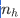隐藏单元的单个隐藏层测试模型。

```python
# Build a model with a n_h-dimensional hidden layer
parameters = nn_model(X, Y, n_h = 4, num_iterations = 10000, print_cost=True)

# Plot the decision boundary
plot_decision_boundary(lambda x: predict(parameters, x.T), X, Y)#绘制决策边界
plt.title("Decision Boundary for hidden layer size " + str(4))
```

output：

```python
Cost after iteration 0: 0.693048
Cost after iteration 1000: 0.288083
Cost after iteration 2000: 0.254385
Cost after iteration 3000: 0.233864
Cost after iteration 4000: 0.226792
Cost after iteration 5000: 0.222644
Cost after iteration 6000: 0.219731
Cost after iteration 7000: 0.217504
Cost after iteration 8000: 0.219467
Cost after iteration 9000: 0.218561
```

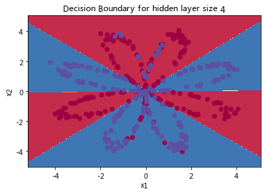

```python
# Print accuracy
predictions = predict(parameters, X)
print ('Accuracy: %d' % float((np.dot(Y,predictions.T) + np.dot(1-Y,1-predictions.T))/float(Y.size)*100) + '%')
```

output：

```python
Accuracy: 90%
```

#### lambda函数

- **Lambda函数**，也称为**匿名函数**，是Python中一种简洁的函数形式。它允许您在需要函数作为参数或返回值的地方快速定义一个简短的函数。下面让我详细解释一下：

  1. **Lambda函数的语法**：

     - Lambda函数的语法只包含一个表达式，形式如下：

       ```
       lambda [arg1 [, arg2, ...]]: expression
       ```

       

     - 其中，`lambda` 是Python的关键字，`[arg...]` 和 `expression` 由用户自定义。

  2. **Lambda函数的特点**：

     - **匿名性**：Lambda函数没有名字，通常用于简单的操作。
     - **输入和输出**：输入是传入到参数列表的值，输出是根据表达式计算得到的值。
     - **命名空间**：Lambda函数拥有自己的命名空间，不能访问参数列表之外或全局命名空间中的参数。

  3. **常见的Lambda函数示例**：

     - `lambda x, y: x * y`：输入是x和y，输出是它们的积。
     - `lambda: None`：没有输入参数，输出是None。
     - `lambda *args: sum(args)`：输入是任意个数的参数，输出是它们的和。
     - `lambda **kwargs: 1`：输入是任意键值对参数，输出是1。

### 4.6- 调整隐藏层大小

```python
# This may take about 2 minutes to run

plt.figure(figsize=(16, 32))
hidden_layer_sizes = [1, 2, 3, 4, 5, 10, 20]
for i, n_h in enumerate(hidden_layer_sizes):#enumerate(hidden_layer_sizes) 创建了一个可迭代的对象，它会返回一个 (index, value) 的元组。
#在每次迭代中，i 是索引，n_h 是对应的隐藏层大小。
    plt.subplot(5, 2, i+1)
    plt.title('Hidden Layer of size %d' % n_h)
    parameters = nn_model(X, Y, n_h, num_iterations = 5000)
    plot_decision_boundary(lambda x: predict(parameters, x.T), X, Y)
    predictions = predict(parameters, X)
    accuracy = float((np.dot(Y,predictions.T) + np.dot(1-Y,1-predictions.T))/float(Y.size)*100)
    print ("Accuracy for {} hidden units: {} %".format(n_h, accuracy))
```

output：

```python
Accuracy for 1 hidden units: 67.5 %
Accuracy for 2 hidden units: 67.25 %
Accuracy for 3 hidden units: 90.75 %
Accuracy for 4 hidden units: 90.5 %
Accuracy for 5 hidden units: 91.25 %
Accuracy for 10 hidden units: 90.25 %
Accuracy for 20 hidden units: 90.5 %
```

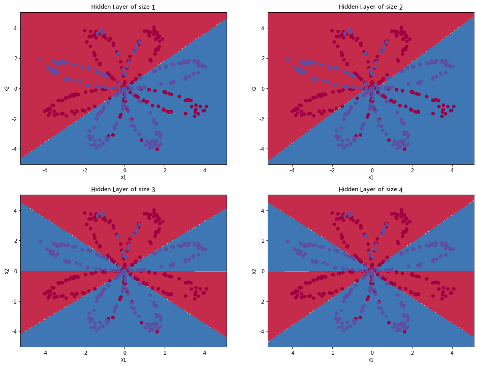

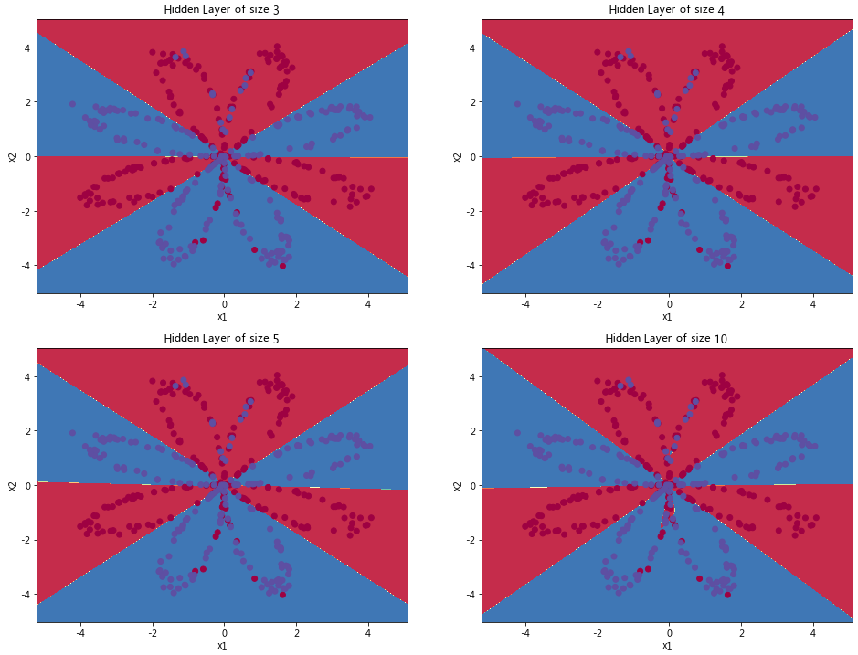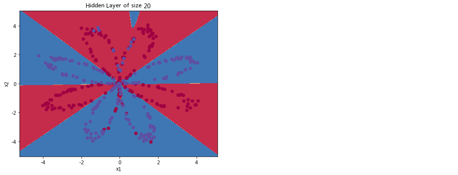

**说明**：

- 较大的模型（具有更多隐藏的单元）能够更好地拟合训练集，直到最终最大的模型过拟合数据为止。
- 隐藏层的最佳大小似乎在n_h = 5左右。的确，此值似乎很好地拟合了数据，而又不会引起明显的过度拟合。
- 稍后你还将学习正则化，帮助构建更大的模型（例如n_h = 50）而不会过度拟合。

# 深度神经网络

- 在此作业中，你将实现构建深度神经网络所需的所有函数。

**完成此任务后，你将能够：**

- 使用ReLU等非线性单位来改善模型
- 建立更深的神经网络（具有1个以上的隐藏层）
- 实现一个易于使用的神经网络类

## 符号说明

**符号说明**：

- 上标[𝑙] 表示与层相关的数量。
    \- 示例：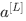是层的激活。和是层参数。
- 上标(𝑖) 表示与示例相关的数量。
    \- 示例：是第 的训练数据。
- 下标𝑖 表示的向量。
    \- 示例： 表示层激活的 输入。

## 1-安装包

```PYTHON
import numpy as np
import h5py
import matplotlib.pyplot as plt
from lib.testCases_v2 import *
from lib.dnn_utils_v2 import sigmoid, sigmoid_backward, relu, relu_backward

plt.rcParams['figure.figsize'] = (5.0, 4.0) # set default size of plots
plt.rcParams['image.interpolation'] = 'nearest'
plt.rcParams['image.cmap'] = 'gray'


np.random.seed(1)
```

- 初始化两层的网络和𝐿层的神经网络的参数。
- 实现正向传播模块（在下图中以紫色显示）。
     \- 完成模型正向传播步骤的LINEAR部分（）。
     \- 提供使用的ACTIVATION函数（relu / Sigmoid）。
     \- 将前两个步骤合并为新的[LINEAR-> ACTIVATION]前向函数。
     \- 堆叠[LINEAR-> RELU]正向函数L-1次（第1到L-1层），并在末尾添加[LINEAR-> SIGMOID]（最后的𝐿层)。这合成了一个新的L_model_forward函数。
- 计算损失。
- 实现反向传播模块（在下图中以红色表示）。
    \- 完成模型反向传播步骤的LINEAR部分。
    \- 提供的ACTIVATE函数的梯度（relu_backward / sigmoid_backward）
    \- 将前两个步骤组合成新的[LINEAR-> ACTIVATION]反向函数。
    \- 将[LINEAR-> RELU]向后堆叠L-1次，并在新的L_model_backward函数中后向添加[LINEAR-> SIGMOID]
- 最后更新参数。


**注意**：对于每个正向函数，都有一个对应的反向函数。 这也是为什么在正向传播模块的每一步都将一些值存储在缓存中的原因。缓存的值可用于计算梯度。 然后，在反向传导模块中，你将使用缓存的值来计算梯度。 此作业将指导说明如何执行这些步骤。

## 2-初始化

​	首先编写两个辅助函数用来初始化模型的参数。 第一个函数将用于初始化两层模型的参数。 第二个将把初始化过程推广到𝐿层模型上。

### 2.1-两层神经网络

创建并初始化2层神经网络的参数。

**说明**：

- 模型的结构为：*LINEAR -> RELU -> LINEAR -> SIGMOID*。
- 随机初始化权重矩阵。 确保准确的维度，使用`np.random.randn（shape）* 0.01`。
- 将偏差初始化为0。 使用`np.zeros（shape）`。

```python
# GRADED FUNCTION: initialize_parameters

def initialize_parameters(n_x, n_h, n_y):
    """
    Argument:
    n_x -- size of the input layer
    n_h -- size of the hidden layer
    n_y -- size of the output layer
    
    Returns:
    parameters -- python dictionary containing your parameters:
                    W1 -- weight matrix of shape (n_h, n_x)
                    b1 -- bias vector of shape (n_h, 1)
                    W2 -- weight matrix of shape (n_y, n_h)
                    b2 -- bias vector of shape (n_y, 1)
    """
    
    np.random.seed(1)
    
### START CODE HERE ### (≈ 4 lines of code)
#np.random.randn()函数用于生成一个符合标准正态分布（均值为0，方差为1）的随机样本数组。这里的randn函数后面的参数n_h和n_x指定了数组的形状，即生成一个n_h行n_x列的二维数组。
    W1 = np.random.randn(n_h, n_x)*0.01
    b1 = np.zeros((n_h,1))
    W2 = np.random.randn(n_y, n_h)*0.01
    b2 = np.zeros((n_y,1))
    ### END CODE HERE ###
    
    
    assert(W1.shape == (n_h, n_x))
    assert(b1.shape == (n_h, 1))
    assert(W2.shape == (n_y, n_h))
    assert(b2.shape == (n_y, 1))
    
    parameters = {"W1": W1,
                  "b1": b1,
                  "W2": W2,
                  "b2": b2}
    
    return parameters    
parameters = initialize_parameters(2,2,1)
print("W1 = " + str(parameters["W1"]))
print("b1 = " + str(parameters["b1"]))
print("W2 = " + str(parameters["W2"]))
print("b2 = " + str(parameters["b2"]))
```

output：

```PYTHON
W1 = [[ 0.01624345 -0.00611756]
 [-0.00528172 -0.01072969]]
b1 = [[0.]
 [0.]]
W2 = [[ 0.00865408 -0.02301539]]
b2 = [[0.]]
```

### 2.2-L层神经网络

对于L层深度神经网络的初始化因为存在更多的权重矩阵和偏差向量。 完成 `initialize_parameters_deep`后，应确保各层之间的维度匹配。 是𝑙层中的神经元数量。 因此，如果我们输入的 𝑋 的大小为(12288,209)（以𝑚=209为例)，则：


当我们在python中计算𝑊𝑋+𝑏时，使用广播，比如：
$$
W = \begin{bmatrix}      j  & k  & l\\      m  & n & o \\      p  & q & r     \end{bmatrix}\;\;\; X = \begin{bmatrix}      a  & b  & c\\      d  & e & f \\      g  & h & i    \end{bmatrix} \;\;\; b =\begin{bmatrix}      s  \\      t  \\      u   \end{bmatrix}\tag{2}
$$
Then 𝑊𝑋+𝑏 will be:
$$
WX + b = \begin{bmatrix}      (ja + kd + lg) + s  & (jb + ke + lh) + s  & (jc + kf + li)+ s\\      (ma + nd + og) + t & (mb + ne + oh) + t & (mc + nf + oi) + t\\      (pa + qd + rg) + u & (pb + qe + rh) + u & (pc + qf + ri)+ u   \end{bmatrix}\tag{3}
$$
**练习**：实现L层神经网络的初始化。

**说明**：

- 模型的结构为 *[LINEAR -> RELU] × (L-1) -> LINEAR -> SIGMOID*。也就是说，𝐿−1层使用ReLU作为激活函数，最后一层采用sigmoid激活函数输出。

- 随机初始化权重矩阵。使用`np.random.rand（shape）* 0.01`。

- 零初始化偏差。使用`np.zeros（shape）`。

- 我们将在不同的layer_dims变量中存储𝑛[𝑙]，即不同层中的神经元数。例如，上周“二维数据分类模型”的`layer_dims`为[2,4,1]：即有两个输入，一个隐藏层包含4个隐藏单元，一个输出层包含1个输出单元。因此，`W1`的维度为（4,2），`b1`的维度为（4,1），`W2`的维度为（1,4），而`b2`的维度为（1,1）。现在你将把它应用到𝐿层！

- 这是

  𝐿=1（一层神经网络）的实现。以启发你如何实现通用的神经网络（L层神经网络）。

  ```python
  if L == 1:  
        parameters["W" + str(L)] = np.random.randn(layer_dims[1], layer_dims[0]) * 0.01  
        parameters["b" + str(L)] = np.zeros((layer_dims[1], 1))
  ```

```PYTHON
# GRADED FUNCTION: initialize_parameters_deep

def initialize_parameters_deep(layer_dims):
    """
    Arguments:
    layer_dims -- python array (list) containing the dimensions of each layer in our network
    
    Returns:
    parameters -- python dictionary containing your parameters "W1", "b1", ..., "WL", "bL":
                    Wl -- weight matrix of shape (layer_dims[l], layer_dims[l-1])
                    bl -- bias vector of shape (layer_dims[l], 1)
    """
    
    np.random.seed(3)
    parameters = {}
    L = len(layer_dims)            # number of layers in the network

    for l in range(1, L):
        ### START CODE HERE ### (≈ 2 lines of code)
        parameters['W' + str(l)] = np.random.randn(layer_dims[l],layer_dims[l-1])*0.01
        parameters['b' + str(l)] = np.zeros((layer_dims[l],1))
        ### END CODE HERE ###
        
        assert(parameters['W' + str(l)].shape == (layer_dims[l], layer_dims[l-1]))
        assert(parameters['b' + str(l)].shape == (layer_dims[l], 1))

        
    return parameters
parameters = initialize_parameters_deep([5,4,3])
print("W1 = " + str(parameters["W1"]))
print("b1 = " + str(parameters["b1"]))
print("W2 = " + str(parameters["W2"]))
print("b2 = " + str(parameters["b2"]))
```

output:

```PYTHON
W1 = [[ 0.01788628  0.0043651   0.00096497 -0.01863493 -0.00277388]
 [-0.00354759 -0.00082741 -0.00627001 -0.00043818 -0.00477218]
 [-0.01313865  0.00884622  0.00881318  0.01709573  0.00050034]
 [-0.00404677 -0.0054536  -0.01546477  0.00982367 -0.01101068]]
b1 = [[0.]
 [0.]
 [0.]
 [0.]]
W2 = [[-0.01185047 -0.0020565   0.01486148  0.00236716]
 [-0.01023785 -0.00712993  0.00625245 -0.00160513]
 [-0.00768836 -0.00230031  0.00745056  0.01976111]]
b2 = [[0.]
 [0.]
 [0.]]
```

## 3-正向传播模块

### 3.1-线性正向

接下来将执行正向传播模块。 首先实现一些基本函数，用于稍后的模型实现。按以下顺序完成三个函数：

- LINEAR
- LINEAR -> ACTIVATION，其中激活函数采用ReLU或Sigmoid。
- [LINEAR -> RELU] × (L-1) -> LINEAR -> SIGMOID（整个模型）

线性正向模块（在所有数据中均进行向量化）的计算按照以下公式：
$$
Z^{[l]} = W^{[l]}A^{[l-1]} +b^{[l]}\tag{4}
$$
其中

该单元的数学表示为 ，你可能会发现`np.dot（）`有用。 如果维度不匹配，则可以print（`W.shape`)查看修改。

```PYTHON
# GRADED FUNCTION: linear_forward

def linear_forward(A, W, b):
    """
    Implement the linear part of a layer's forward propagation.

    Arguments:
    A -- activations from previous layer (or input data): (size of previous layer, number of examples)
    W -- weights matrix: numpy array of shape (size of current layer, size of previous layer)
    b -- bias vector, numpy array of shape (size of the current layer, 1)

    Returns:
    Z -- the input of the activation function, also called pre-activation parameter 
    cache -- a python dictionary containing "A", "W" and "b" ; stored for computing the backward pass efficiently
    """
    
    ### START CODE HERE ### (≈ 1 line of code)
    Z = np.dot(W,A) + b
    ### END CODE HERE ###
    
    assert(Z.shape == (W.shape[0], A.shape[1]))
    cache = (A, W, b)
    
    return Z, cache

A, W, b = linear_forward_test_case()

Z, linear_cache = linear_forward(A, W, b)
print("Z = " + str(Z))
```

output：

```PYTHON
Z = [[ 3.26295337 -1.23429987]]
```

### 3.2-正向线性激活

使用两个激活函数：

**Sigmoid**： 。 该函数返回**两项值**：激活值"`a`"和包含"`Z`"的"`cache`"（这是我们将馈入到相应的反向函数的内容)。 

```python
A, activation_cache = sigmoid(Z)
```

**ReLU**：ReLu的数学公式为。我们为你提供了`relu`函数。 该函数返回**两项值**：激活值“`A`”和包含“`Z`”的“`cache`”（这是我们将馈入到相应的反向函数的内容)。 你可以按下述方式得到两项值：

```python
A, activation_cache = relu(Z)
```

为了更加方便，我们把两个函数（线性和激活）组合为一个函数（LINEAR-> ACTIVATION）。 因此，我们将实现一个函数用以执行LINEAR正向步骤和ACTIVATION正向步骤。

**练习**：实现 *LINEAR->ACTIVATION* 层的正向传播。 数学表达式为：，其中激活"g" 可以是sigmoid（）或relu（）。 使用linear_forward（)和正确的激活函数。

```python
# GRADED FUNCTION: linear_activation_forward

def linear_activation_forward(A_prev, W, b, activation):
    """
    Implement the forward propagation for the LINEAR->ACTIVATION layer

    Arguments:
    A_prev -- activations from previous layer (or input data): (size of previous layer, number of examples)
    W -- weights matrix: numpy array of shape (size of current layer, size of previous layer)
    b -- bias vector, numpy array of shape (size of the current layer, 1)
    activation -- the activation to be used in this layer, stored as a text string: "sigmoid" or "relu"

    Returns:
    A -- the output of the activation function, also called the post-activation value 
    cache -- a python dictionary containing "linear_cache" and "activation_cache";
             stored for computing the backward pass efficiently
    """
    
    if activation == "sigmoid":
        # Inputs: "A_prev, W, b". Outputs: "A, activation_cache".
        ### START CODE HERE ### (≈ 2 lines of code)
        Z, linear_cache = linear_forward(A_prev,W,b)
        A, activation_cache = sigmoid(Z)
        ### END CODE HERE ###
    
    elif activation == "relu":
        # Inputs: "A_prev, W, b". Outputs: "A, activation_cache".
        ### START CODE HERE ### (≈ 2 lines of code)
        Z, linear_cache = linear_forward(A_prev,W,b)
        A, activation_cache = relu(Z)
        ### END CODE HERE ###
    
    assert (A.shape == (W.shape[0], A_prev.shape[1]))
    cache = (linear_cache, activation_cache)

    return A, cache

A_prev, W, b = linear_activation_forward_test_case()

A, linear_activation_cache = linear_activation_forward(A_prev, W, b, activation = "sigmoid")
print("With sigmoid: A = " + str(A))

A, linear_activation_cache = linear_activation_forward(A_prev, W, b, activation = "relu")
print("With ReLU: A = " + str(A))
```

output：

```PYTHON
With sigmoid: A = [[0.96890023 0.11013289]]
With ReLU: A = [[3.43896131 0.        ]]
```

### 3.3-L层模型

为了方便实现𝐿层神经网络，你将需要一个函数来复制前一个函数（使用RELU的`linear_activation_forward`）𝐿−1次，以及复制带有SIGMOID的`linear_activation_forward`。

*[LINEAR -> RELU] × (L-1) -> LINEAR -> SIGMOID* 模型


**说明**：在下面的代码中，变量`AL`表示（有时也称为`Yhat`，即𝑌^。)

**提示**：

- 使用你先前编写的函数
- 使用for循环复制[LINEAR-> RELU]（L-1）次
- 不要忘记在“cache”列表中更新缓存。 要将新值 `c`添加到`list`中，可以使用`list.append(c)`。

```python
# GRADED FUNCTION: L_model_forward

def L_model_forward(X, parameters):
    """
    Implement forward propagation for the [LINEAR->RELU]*(L-1)->LINEAR->SIGMOID computation
    
    Arguments:
    X -- data, numpy array of shape (input size, number of examples)
    parameters -- output of initialize_parameters_deep()
    
    Returns:
    AL -- last post-activation value
    caches -- list of caches containing:
                every cache of linear_relu_forward() (there are L-1 of them, indexed from 0 to L-2)
                the cache of linear_sigmoid_forward() (there is one, indexed L-1)
    """

    caches = []
    A = X
    L = len(parameters) // 2                  # number of layers in the neural network
    
    # Implement [LINEAR -> RELU]*(L-1). Add "cache" to the "caches" list.
    #这行代码会执行 L-1 次循环，包括1不包括L。
    for l in range(1, L):
        A_prev = A 
         ### START CODE HERE ### (≈ 2 lines of code)
        A, cache = linear_activation_forward(A_prev,parameters['W' + str(l)],parameters['b' + str(l)],activation = "relu")
        caches.append(cache)
        ### END CODE HERE ###
    
    # Implement LINEAR -> SIGMOID. Add "cache" to the "caches" list.
    ### START CODE HERE ### (≈ 2 lines of code)
    #最后一层激活函数使用sigmoid函数。
    #此处传入的A是上一层的输出。
    AL, cache = linear_activation_forward(A,parameters['W' + str(L)],parameters['b' + str(L)],activation = "sigmoid")
    caches.append(cache)
    ### END CODE HERE ###
    
    assert(AL.shape == (1,X.shape[1]))
            
    return AL, caches

X, parameters = L_model_forward_test_case()
AL, caches = L_model_forward(X, parameters)
print("AL = " + str(AL))
print("Length of caches list = " + str(len(caches)))
```

output：

```python
AL = [[0.17007265 0.2524272 ]]
Length of caches list = 2
```

## 4-损失函数

计算损失，以检查模型是否在学习。

**练习**：使用以下公式计算交叉熵损失𝐽：
$$
-\frac{1}{m} \sum\limits_{i = 1}^{m} (y^{(i)}\log\left(a^{[L] (i)}\right) + (1-y^{(i)})\log\left(1- a^{[L](i)}\right)) \tag{7}
$$

```python
# GRADED FUNCTION: compute_cost

def compute_cost(AL, Y):
    """
    Implement the cost function defined by equation (7).

    Arguments:
    AL -- probability vector corresponding to your label predictions, shape (1, number of examples)
    Y -- true "label" vector (for example: containing 0 if non-cat, 1 if cat), shape (1, number of examples)

    Returns:
    cost -- cross-entropy cost
    """
    
    m = Y.shape[1]

    # Compute loss from aL and y.
    ### START CODE HERE ### (≈ 1 lines of code)
    #每一行代表一个样本，每一列代表一个类别的预测概率。对行求和的目的是为了计算每个样本的损失，然后将这些损失加起来得到整个批量的总损失。
    #因此此处是axis为1，表示对行求和，即计算每个样本的损失，其cost也是一个矩阵。
    cost = -1 / m * np.sum(Y * np.log(AL) + (1-Y) * np.log(1-AL),axis=1,keepdims=True)
    #cost是一个列向量
    ### END CODE HERE ###
    
    cost = np.squeeze(cost)      # To make sure your cost's shape is what we expect (e.g. this turns [[17]] into 17).
    assert(cost.shape == ())
    
    return cost
Y, AL = compute_cost_test_case()

print("cost = " + str(compute_cost(AL, Y)))
```

output：

```PYTHON
cost = 0.41493159961539694
```
