# 神经网络初始化

欢迎来到“改善深度神经网络”的第一项作业。

训练神经网络需要指定权重的初始值，而一个好的初始化方法将有助于网络学习。

如果你完成了本系列的上一课程，则可能已经按照我们的说明完成了权重初始化。但是，如何为新的神经网络选择初始化？在本笔记本中，你能学习看到不同的初始化导致的不同结果。

好的初始化可以：

- 加快梯度下降、模型收敛
- 减小梯度下降收敛过程中训练（和泛化）出现误差的几率

首先，运行以下单元格以加载包和用于分类的二维数据集。

对于load_dataset()函数解析

```PYTHON
def load_dataset():
    np.random.seed(1)  # 设置随机种子以确保结果的可重复性
    train_X, train_Y = sklearn.datasets.make_circles(n_samples=300, noise=.05)# 生成300个训练样本
    np.random.seed(2)
    test_X, test_Y = sklearn.datasets.make_circles(n_samples=100, noise=.05)
    # train_X[:, 0] 和 train_X[:, 1] 代表数据点的 x 和 y 坐标，c=train_Y 表示颜色，根据train_Y为不同类别的点着色，s=40点的大小，cmap=plt.cm.Spectral 指定了一个颜色映射，用于给不同类别的点着不同的颜色。
    #train_X[:, 0] 表示获取 train_X 数组中所有行的第0列的元素。这里的 : 表示选择所有行，而 0 表示选择第0列。train_X 是一个二维数组，其中每一行代表一个数据点，第0列和第1列分别代表数据点的x坐标和y坐标。
 #    [[x1, y1],
 #    [x2, y2],
 #    [x3, y3],
 #        ...]
    #那么 train_X[:, 0] 将会是 [x1, x2, x3, ...]，而 train_X[:, 1] 将会是 [y1, y2, y3, ...]。
train_X[:, 1] 表示获取 train_X 数组中所有行的第1列的元素。同样地，: 表示选择所有行，1 表示选择第1列。
    plt.scatter(train_X[:, 0], train_X[:, 1], c=train_Y, s=40, cmap=plt.cm.Spectral);
    train_X = train_X.T
    train_Y = train_Y.reshape((1, train_Y.shape[0]))
    test_X = test_X.T
    test_Y = test_Y.reshape((1, test_Y.shape[0]))
    return train_X, train_Y, test_X, test_Y
```

in：

```python
import numpy as np
import matplotlib.pyplot as plt
import sklearn
import sklearn.datasets
from lib.init_utils import sigmoid, relu, compute_loss, forward_propagation, backward_propagation
from lib.init_utils import update_parameters, predict, load_dataset, plot_decision_boundary, predict_dec


plt.rcParams['figure.figsize'] = (7.0, 4.0) # 图表的默认大小设置为宽7英寸、高4英寸。
plt.rcParams['image.interpolation'] = 'nearest'#将图像缩放时使用的插值方法设置为’nearest’，意味着在缩放图像的区域内，将使用原始像素值，这会导致图像看起来像块状，没有平滑处理。
plt.rcParams['image.cmap'] = 'gray' #将图像的默认色彩映射设置为’gray’，即以灰度模式显示图像。

# load image dataset: blue/red dots in circles
train_X, train_Y, test_X, test_Y = load_dataset() #上方解析
plt.show()
```

output:

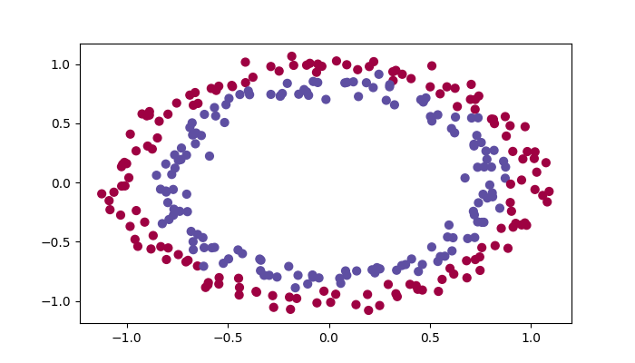

使用分类器希望将蓝点和红点分开。

## 1-神经网络模型

使用已经实现了的3层神经网络。将尝试的初始化方法：

- *零初始化* ：在输入参数中设置`initialization = "zeros"`。
- *随机初始化* ：在输入参数中设置`initialization = "random"`，这会将权重初始化为较大的随机值。
- *He初始化* ：在输入参数中设置`initialization = "he"`，He初始化。

**说明**：请快速阅读并运行以下代码，在下一部分中，你将实现此`model()`调用的三种初始化方法。

```PYTHON
def model(X, Y, learning_rate = 0.01, num_iterations = 15000, print_cost = True, initialization = "he"):
    """
    Implements a three-layer neural network: LINEAR->RELU->LINEAR->RELU->LINEAR->SIGMOID.
    
    Arguments:
    X -- input data, of shape (2, number of examples)
    Y -- true "label" vector (containing 0 for red dots; 1 for blue dots), of shape (1, number of examples)
    learning_rate -- learning rate for gradient descent 
    num_iterations -- number of iterations to run gradient descent
    print_cost -- if True, print the cost every 1000 iterations
    initialization -- flag to choose which initialization to use ("zeros","random" or "he")
    
    Returns:
    parameters -- parameters learnt by the model
    """
        
    grads = {} # to keep track of the gradients 梯度
    costs = [] # to keep track of the loss 损失函数
    m = X.shape[1] # number of examples  样本数
    layers_dims = [X.shape[0], 10, 5, 1] #三层神经网络
    
    # Initialize parameters dictionary.
    if initialization == "zeros":
        parameters = initialize_parameters_zeros(layers_dims)
    elif initialization == "random":
        parameters = initialize_parameters_random(layers_dims)
    elif initialization == "he":
        parameters = initialize_parameters_he(layers_dims)

    # Loop (gradient descent)
    #梯度下降算法
    for i in range(0, num_iterations):

        # Forward propagation: LINEAR -> RELU -> LINEAR -> RELU -> LINEAR -> SIGMOID.
        a3, cache = forward_propagation(X, parameters) #前向传播
        
        # Loss
        cost = compute_loss(a3, Y)#损失函数

        # Backward propagation.
        grads = backward_propagation(X, Y, cache) #反向传播
        
        # Update parameters.
        parameters = update_parameters(parameters, grads, learning_rate)#梯度下降更新参数
        
        # Print the loss every 1000 iterations
        if print_cost and i % 1000 == 0:
            print("Cost after iteration {}: {}".format(i, cost))
            costs.append(cost)
            
    # plot the loss
    plt.plot(costs)
    plt.ylabel('cost')
    plt.xlabel('iterations (per hundreds)')
    plt.title("Learning rate =" + str(learning_rate))
    plt.show()
    
    return parameters
```

### 1.1-零初始化

在神经网络中有两种类型的参数要初始化：

- 权重矩阵$(W^{[1]}, W^{[2]}, W^{[3]}, ..., W^{[L-1]}, W^{[L]})$
- 偏差向量 $(b^{[1]}, b^{[2]}, b^{[3]}, ..., b^{[L-1]}, b^{[L]})$

**练习**：实现以下函数以将所有参数初始化为零。 稍后你会看到此方法会报错，因为它无法“打破对称性”。总之先尝试一下，看看会发生什么。确保使用正确维度的np.zeros（（..，..））。

​	在神经网络中，如果将所有参数初始化为零，会导致一个问题称为“对称性破坏”。意味着在网络的每一层，所有神经元的权重更新将是相同的。这是因为，如果权重相同，那么在前向传播过程中，每个神经元接收到的输入和梯度将是相同的，因此在反向传播时它们的权重更新也会相同。这样，无论网络有多少层或多少神经元，每一层的所有神经元都会执行相同的操作，相当于网络没有多个神经元的学习能力。

```PYTHON
def initialize_parameters_zeros(layers_dims):
    """
    Arguments:
    layer_dims -- python array (list) containing the size of each layer.
    
    Returns:
    parameters -- python dictionary containing your parameters "W1", "b1", ..., "WL", "bL":
                    W1 -- weight matrix of shape (layers_dims[1], layers_dims[0])
                    b1 -- bias vector of shape (layers_dims[1], 1)
                    ...
                    WL -- weight matrix of shape (layers_dims[L], layers_dims[L-1])
                    bL -- bias vector of shape (layers_dims[L], 1)
    """
    
    parameters = {}
    L = len(layers_dims)            # number of layers in the network
    
    for l in range(1, L): #到L-1
        ### START CODE HERE ### (≈ 2 lines of code)
        parameters['W' + str(l)] = np.zeros((layers_dims[l],layers_dims[l-1])) #维度，[当前层，前一层]，通常依靠预处理后的X来确定
        parameters['b' + str(l)] = np.zeros((layers_dims[l],1))#参数b的维度，[当前层，1]
        ### END CODE HERE ###
    return parameters

parameters = initialize_parameters_zeros([3,2,1])
print("W1 = " + str(parameters["W1"]))
print("b1 = " + str(parameters["b1"]))
print("W2 = " + str(parameters["W2"]))
print("b2 = " + str(parameters["b2"]))
```

output：

```PYTHON
W1 = [[0. 0. 0.]
 [0. 0. 0.]]
b1 = [[0.]
 [0.]]
W2 = [[0. 0.]]
b2 = [[0.]]
```

运行以下代码使用零初始化并迭代15,000次以训练模型。

```python
parameters = model(train_X, train_Y, initialization = "zeros")
print ("On the train set:")
predictions_train = predict(train_X, train_Y, parameters)
print ("On the test set:")
predictions_test = predict(test_X, test_Y, parameters)
```

output:

```python
Cost after iteration 0: 0.6931471805599453
Cost after iteration 1000: 0.6931471805599453
Cost after iteration 2000: 0.6931471805599453
Cost after iteration 3000: 0.6931471805599453
Cost after iteration 4000: 0.6931471805599453
Cost after iteration 5000: 0.6931471805599453
Cost after iteration 6000: 0.6931471805599453
Cost after iteration 7000: 0.6931471805599453
Cost after iteration 8000: 0.6931471805599453
Cost after iteration 9000: 0.6931471805599453
Cost after iteration 10000: 0.6931471805599455
Cost after iteration 11000: 0.6931471805599453
Cost after iteration 12000: 0.6931471805599453
Cost after iteration 13000: 0.6931471805599453
Cost after iteration 14000: 0.6931471805599453
On the train set:
Accuracy: 0.5
On the test set:
Accuracy: 0.5
```

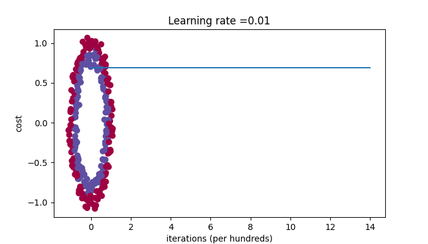

性能确实很差，损失也没有降低，为什么呢？让我们看一下预测的详细信息和决策边界：

```python
print ("predictions_train = " + str(predictions_train))
print ("predictions_test = " + str(predictions_test))
```

output:

```python
predictions_train = [[0 0 0 0 0 0 0 0 0 0 0 0 0 0 0 0 0 0 0 0 0 0 0 0 0 0 0 0 0 0 0 0 0 0 0 0
  0 0 0 0 0 0 0 0 0 0 0 0 0 0 0 0 0 0 0 0 0 0 0 0 0 0 0 0 0 0 0 0 0 0 0 0
  0 0 0 0 0 0 0 0 0 0 0 0 0 0 0 0 0 0 0 0 0 0 0 0 0 0 0 0 0 0 0 0 0 0 0 0
  0 0 0 0 0 0 0 0 0 0 0 0 0 0 0 0 0 0 0 0 0 0 0 0 0 0 0 0 0 0 0 0 0 0 0 0
  0 0 0 0 0 0 0 0 0 0 0 0 0 0 0 0 0 0 0 0 0 0 0 0 0 0 0 0 0 0 0 0 0 0 0 0
  0 0 0 0 0 0 0 0 0 0 0 0 0 0 0 0 0 0 0 0 0 0 0 0 0 0 0 0 0 0 0 0 0 0 0 0
  0 0 0 0 0 0 0 0 0 0 0 0 0 0 0 0 0 0 0 0 0 0 0 0 0 0 0 0 0 0 0 0 0 0 0 0
  0 0 0 0 0 0 0 0 0 0 0 0 0 0 0 0 0 0 0 0 0 0 0 0 0 0 0 0 0 0 0 0 0 0 0 0
  0 0 0 0 0 0 0 0 0 0 0 0]]
predictions_test = [[0 0 0 0 0 0 0 0 0 0 0 0 0 0 0 0 0 0 0 0 0 0 0 0 0 0 0 0 0 0 0 0 0 0 0 0
  0 0 0 0 0 0 0 0 0 0 0 0 0 0 0 0 0 0 0 0 0 0 0 0 0 0 0 0 0 0 0 0 0 0 0 0
  0 0 0 0 0 0 0 0 0 0 0 0 0 0 0 0 0 0 0 0 0 0 0 0 0 0 0 0]]
```

```python
plt.title("Model with Zeros initialization")
axes = plt.gca()
axes.set_xlim([-1.5,1.5])
axes.set_ylim([-1.5,1.5])
plot_decision_boundary(lambda x: predict_dec(parameters, x.T), train_X, train_Y)#绘制决策边界。
```

output:

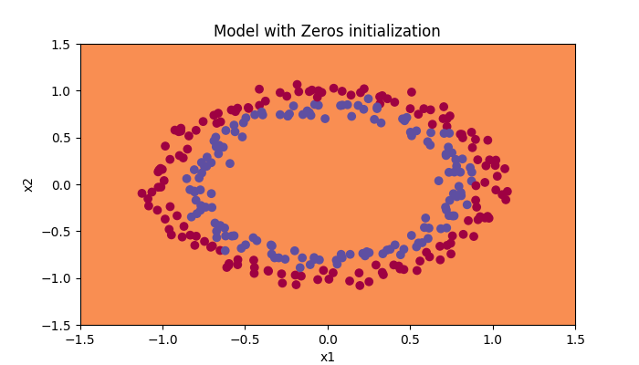

该模型预测的每个示例都为0。

背景被涂成黄色，代表决策边界区域,由于没有可见的线条或曲线来分隔这两类数据点，这表明模型没有学会区分它们。

通常，将所有权重初始化为零会导致网络无法打破对称性。 这意味着每一层中的每个神经元都将学习相同的东西，并且你不妨训练每一层$n^{[l]}=1$的神经网络，且该网络的性能不如线性分类器，例如逻辑回归。

**因此结论如下**：

- 权重$W^{[l]}$应该随机初始化以打破对称性。
- 将偏差$b^{[l]}$初始化为零是可以的。只要随机初始化了$W^{[l]}$，对称性仍然会破坏。

### 1.2-随机初始化

​	为了打破对称性，让我们随机设置权重。 在随机初始化之后，每个神经元可以继续学习其输入的不同特征。 在本练习中，你将看到如果将权重随机初始化为非常大的值会发生什么。

​	**练习**：实现以下函数，将权重初始化为较大的随机值（按*10缩放），并将偏差设为0。 将 `np.random.randn(..,..) * 10`用于权重，将`np.zeros((.., ..))`用于偏差。

```python
# GRADED FUNCTION: initialize_parameters_random

def initialize_parameters_random(layers_dims):
    """
    Arguments:
    layer_dims -- python array (list) containing the size of each layer.
    
    Returns:
    parameters -- python dictionary containing your parameters "W1", "b1", ..., "WL", "bL":
                    W1 -- weight matrix of shape (layers_dims[1], layers_dims[0])
                    b1 -- bias vector of shape (layers_dims[1], 1)
                    ...
                    WL -- weight matrix of shape (layers_dims[L], layers_dims[L-1])
                    bL -- bias vector of shape (layers_dims[L], 1)
    """
    
    np.random.seed(3)               # This seed makes sure your "random" numbers will be the as ours
    parameters = {}
    L = len(layers_dims)            # integer representing the number of layers
    
    for l in range(1, L):
        ### START CODE HERE ### (≈ 2 lines of code)
        parameters['W' + str(l)] = np.random.randn(layers_dims[l],layers_dims[l-1])*10
        parameters['b' + str(l)] = np.zeros((layers_dims[l],1))
        ### END CODE HERE ###

    return parameters

parameters = initialize_parameters_random([3, 2, 1])
print("W1 = " + str(parameters["W1"]))
print("b1 = " + str(parameters["b1"]))
print("W2 = " + str(parameters["W2"]))
print("b2 = " + str(parameters["b2"]))
```

output:

```python
W1 = [[ 17.88628473   4.36509851   0.96497468]
 [-18.63492703  -2.77388203  -3.54758979]]
b1 = [[0.]
 [0.]]
W2 = [[-0.82741481 -6.27000677]]
b2 = [[0.]]
```

运行以下代码使用随机初始化迭代15,000次以训练模型。

```python
parameters = model(train_X, train_Y, initialization = "random")
print ("On the train set:")
predictions_train = predict(train_X, train_Y, parameters)
print ("On the test set:")
predictions_test = predict(test_X, test_Y, parameters)
```

output:

```PYTHON
Cost after iteration 0: inf
Cost after iteration 1000: 0.6247924745506072
Cost after iteration 2000: 0.5980258056061102
Cost after iteration 3000: 0.5637539062842213
Cost after iteration 4000: 0.5501256393526495
Cost after iteration 5000: 0.5443826306793814
Cost after iteration 6000: 0.5373895855049121
Cost after iteration 7000: 0.47157999220550006
Cost after iteration 8000: 0.39770475516243037
Cost after iteration 9000: 0.3934560146692851
Cost after iteration 10000: 0.3920227137490125
Cost after iteration 11000: 0.38913700035966736
Cost after iteration 12000: 0.3861358766546214
Cost after iteration 13000: 0.38497629552893475
Cost after iteration 14000: 0.38276694641706693
On the train set:
Accuracy: 0.83
On the test set:
Accuracy: 0.86
```

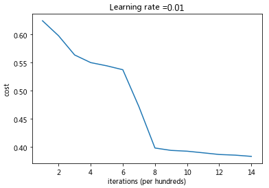

因为数值舍入，你可能在0迭代之后看到损失为"inf"(infinite 无限)，我们会在之后用更复杂的数字实现解决此问题。

```python
print (predictions_train)
print (predictions_test)
```
output：
```python
[[1 0 1 1 0 0 1 1 1 1 1 0 1 0 0 1 0 1 1 0 0 0 1 0 1 1 1 1 1 1 0 1 1 0 0 1
  1 1 1 1 1 1 1 0 1 1 1 1 0 1 0 1 1 1 1 0 0 1 1 1 1 0 1 1 0 1 0 1 1 1 1 0
  0 0 0 0 1 0 1 0 1 1 1 0 0 1 1 1 1 1 1 0 0 1 1 1 0 1 1 0 1 0 1 1 0 1 1 0
  1 0 1 1 0 0 1 0 0 1 1 0 1 1 1 0 1 0 0 1 0 1 1 1 1 1 1 1 0 1 1 0 0 1 1 0
  0 0 1 0 1 0 1 0 1 1 1 0 0 1 1 1 1 0 1 1 0 1 0 1 1 0 1 0 1 1 1 1 0 1 1 1
  1 0 1 0 1 0 1 1 1 1 0 1 1 0 1 1 0 1 1 0 1 0 1 1 1 0 1 1 1 0 1 0 1 0 0 1
  0 1 1 0 1 1 0 1 1 0 1 1 1 0 1 1 1 1 0 1 0 0 1 1 0 1 1 1 0 0 0 1 1 0 1 1
  1 1 0 1 1 0 1 1 1 0 0 1 0 0 0 1 0 0 0 1 1 1 1 0 0 0 0 1 1 1 1 0 0 1 1 1
  1 1 1 1 0 0 0 1 1 1 1 0]]
[[1 1 1 1 0 1 0 1 1 0 1 1 1 0 0 0 0 1 0 1 0 0 1 0 1 0 1 1 1 1 1 0 0 0 0 1
  0 1 1 0 0 1 1 1 1 1 0 1 1 1 0 1 0 1 1 0 1 0 1 0 1 1 1 1 1 1 1 1 1 0 1 0
  1 1 1 1 1 0 1 0 0 1 0 0 0 1 1 0 1 1 0 0 0 1 1 0 1 1 0 0]]
```

```python
plt.title("Model with large random initialization")
axes = plt.gca()
axes.set_xlim([-1.5,1.5])
axes.set_ylim([-1.5,1.5])
plot_decision_boundary(lambda x: predict_dec(parameters, x.T), train_X, train_Y)
```

output：

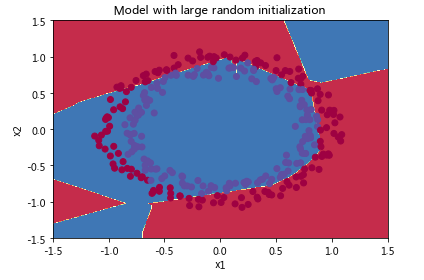

- 损失一开始很高是因为较大的随机权重值，对于某些数据，最后一层激活函数sigmoid输出的结果非常接近0或1，并且当该示例数据预测错误时，将导致非常高的损失。当$\log(a^{[3]}) = \log(0)$时，损失达到无穷大。
- 初始化不当会导致梯度消失/爆炸，同时也会减慢优化算法的速度。
- 训练较长时间的网络，将会看到更好的结果，但是使用太大的随机数进行初始化会降低优化速度。

**总结**：

- 将权重初始化为非常大的随机值效果不佳。
- 初始化为较小的随机值会更好。重要的问题是：这些随机值应为多小？让我们在下一部分中找到答案！

### 1.3-He初始化

​	尝试“He 初始化”，该名称以He等人的名字命名（类似于“Xavier初始化”，但Xavier初始化使用比例因子 `sqrt(1./layers_dims[l-1])`来表示权重𝑊[𝑙] ，而He初始化使用`sqrt(2./layers_dims[l-1])`）。

​	**练习**：实现以下函数，以He初始化来初始化参数。

​	**提示**：此函数类似于先前的`initialize_parameters_random(...)`。 唯一的不同是，无需将`np.random.randn(..,..)`乘以10，而是将其乘以2dimension of the previous layer，这是He初始化建议使用的ReLU激活层。

```python
def initialize_parameters_he(layers_dims):
    """
    Arguments:
    layer_dims -- python array (list) containing the size of each layer. 包含每层大小的 python 数组（列表）。
    
    Returns:
    parameters -- python dictionary containing your parameters "W1", "b1", ..., "WL", "bL":
                    W1 -- weight matrix of shape (layers_dims[1], layers_dims[0])
                    b1 -- bias vector of shape (layers_dims[1], 1)
                    ...
                    WL -- weight matrix of shape (layers_dims[L], layers_dims[L-1])
                    bL -- bias vector of shape (layers_dims[L], 1)
    """
    
    np.random.seed(3)
    parameters = {}
    L = len(layers_dims) - 1 # integer representing the number of layers  此处是包含每层大小的python数组，而并非直接定义的层数。
     
    for l in range(1, L + 1): #从1到L
        ### START CODE HERE ### (≈ 2 lines of code)
        parameters['W' + str(l)] = np.random.randn(layers_dims[l],layers_dims[l-1])*np.sqrt(2./layers_dims[l-1])
        parameters['b' + str(l)] = np.zeros((layers_dims[l],1))
        ### END CODE HERE ###
        
    return parameters
parameters = initialize_parameters_he([2, 4, 1])
print("W1 = " + str(parameters["W1"]))
print("b1 = " + str(parameters["b1"]))
print("W2 = " + str(parameters["W2"]))
print("b2 = " + str(parameters["b2"]))
```

output：

```python
W1 = [[ 1.78862847  0.43650985]
 [ 0.09649747 -1.8634927 ]
 [-0.2773882  -0.35475898]
 [-0.08274148 -0.62700068]]
b1 = [[0.]
 [0.]
 [0.]
 [0.]]
W2 = [[-0.03098412 -0.33744411 -0.92904268  0.62552248]]
b2 = [[0.]]
```

运行以下代码，使用He初始化并迭代15,000次以训练你的模型。

```py
parameters = model(train_X, train_Y, initialization = "he")
print ("On the train set:")
predictions_train = predict(train_X, train_Y, parameters)
print ("On the test set:")
predictions_test = predict(test_X, test_Y, parameters)
```

output：

```python
Cost after iteration 0: 0.8830537463419761
Cost after iteration 1000: 0.6879825919728063
Cost after iteration 2000: 0.6751286264523371
Cost after iteration 3000: 0.6526117768893805
Cost after iteration 4000: 0.6082958970572938
Cost after iteration 5000: 0.5304944491717495
Cost after iteration 6000: 0.4138645817071794
Cost after iteration 7000: 0.3117803464844441
Cost after iteration 8000: 0.23696215330322562
Cost after iteration 9000: 0.1859728720920684
Cost after iteration 10000: 0.15015556280371808
Cost after iteration 11000: 0.12325079292273551
Cost after iteration 12000: 0.09917746546525937
Cost after iteration 13000: 0.08457055954024283
Cost after iteration 14000: 0.07357895962677366
On the train set:
Accuracy: 0.9933333333333333
On the test set:
Accuracy: 0.96
```

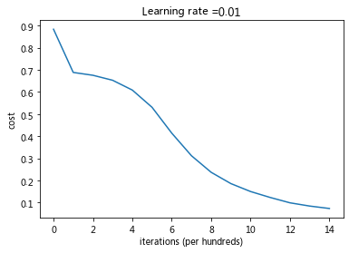

```python
plt.title("Model with He initialization")
axes = plt.gca()
axes.set_xlim([-1.5,1.5])
axes.set_ylim([-1.5,1.5])
# plot_decision_boundary 的函数，它用于绘制决策边界。这个函数接受三个参数：
	#一个 lambda 函数：lambda x: predict_dec(parameters, x.T)，它是一个匿名函数，用于对输入的 x 应用 predict_dec 函数。这里的 parameters 是预先定义的模型参数，而 x.T 是将输入的 x 转置。
    #train_X：这通常是一个包含训练数据特征的数组。
	#train_Y：这通常是一个包含训练数据标签的数组。
plot_decision_boundary(lambda x: predict_dec(parameters, x.T), train_X, train_Y)
```

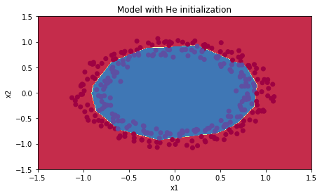

# 神经网络正则化

​	深度学习模型具有很高的灵活性和能力，如果训练数据集不够大，**将会造成一个严重的问题--过拟合**。尽管它在训练集上效果很好，但是学到的网络**不能应用到测试集中！**

​	首先导入要使用的包。

```python
# import packages
import numpy as np
import matplotlib.pyplot as plt
from lib.reg_utils import sigmoid, relu, plot_decision_boundary, initialize_parameters, load_2D_dataset, predict_dec
from lib.reg_utils import compute_cost, predict, forward_propagation, backward_propagation, update_parameters
import sklearn
import sklearn.datasets
import scipy.io
from lib.testCases import *

plt.rcParams['figure.figsize'] = (7.0, 4.0) # set default size of plots
plt.rcParams['image.interpolation'] = 'nearest'
plt.rcParams['image.cmap'] = 'gray'
```

**问题陈述**：你刚刚被法国足球公司聘为AI专家。他们希望你推荐预测法国守门员将球踢出的位置，以便法国队的球员可以用头将球击中。

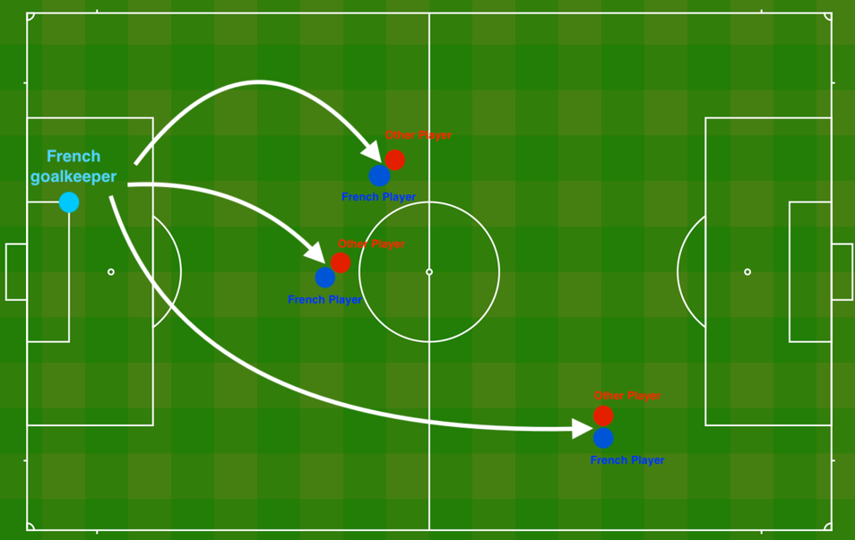
	守门员将球踢到空中，每支球队的球员都在尽力用头击球

​	以下提供了法国过去10场比赛的二维数据集。

```python
train_X, train_Y, test_X, test_Y = load_2D_dataset()
```

output:

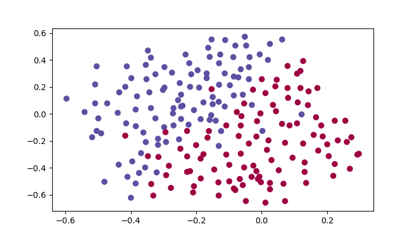

数据中每个点对应于足球场上的位置，在该位置上，法国守门员从足球场左侧射出球后，足球运动员用他/她的头部击中了球。

- 如果圆点为蓝色，则表示法国球员设法用头部将球击中
- 如果圆点为红色，则表示另一支球队的球员用头撞球

**你的目标**：运用深度学习模型预测守门员应将球踢到球场上的位置。

**数据集分析**：该数据集含有噪声，但一条将左上半部分（蓝色）与右下半部分（红色）分开的对角线会很比较有效。

首先尝试非正则化模型。然后学习如何对其进行正则化，并决定选择哪种模型来解决法国足球公司的问题。

## 1-非正则化模型

你将使用以下神经网络（已为你实现），可以如下使用此模型：

- 在*regularization mode*中，通过`lambd`将输入设置为非零值。我们使用`lambd`代替`lambda`，因为`lambda`是Python中的保留关键字。
- 在*dropout mode*中，将`keep_prob`设置为小于1的值

首先，你将尝试不进行任何正则化的模型。然后，你将实现：

- *L2 正则化* 函数：`compute_cost_with_regularization()`和`backward_propagation_with_regularization()`
- *Dropout* 函数：`forward_propagation_with_dropout()`和`backward_propagation_with_dropout()`

```PYTHON
def model(X, Y, learning_rate = 0.3, num_iterations = 30000, print_cost = True, lambd = 0, keep_prob = 1):
    """
    Implements a three-layer neural network: LINEAR->RELU->LINEAR->RELU->LINEAR->SIGMOID.
    
    Arguments:
    X -- input data, of shape (input size, number of examples)
    Y -- true "label" vector (1 for blue dot / 0 for red dot), of shape (output size, number of examples)
    learning_rate -- learning rate of the optimization
    num_iterations -- number of iterations of the optimization loop
    print_cost -- If True, print the cost every 10000 iterations
    lambd -- regularization hyperparameter, scalar
    keep_prob - probability of keeping a neuron active during drop-out, scalar.
    
    Returns:
    parameters -- parameters learned by the model. They can then be used to predict.
    """
        
    grads = {}
    costs = []                            # to keep track of the cost
    m = X.shape[1]                        # number of examples 样本数
    layers_dims = [X.shape[0], 20, 3, 1] #三层神经网络，第一层为预处理后的样本
    
    # Initialize parameters dictionary.
    parameters = initialize_parameters(layers_dims) #初始化参数w和b（多个）

    # Loop (gradient descent)

    for i in range(0, num_iterations):

        # Forward propagation: LINEAR -> RELU -> LINEAR -> RELU -> LINEAR -> SIGMOID.
        if keep_prob == 1:
            a3, cache = forward_propagation(X, parameters)
        elif keep_prob < 1:
            a3, cache = forward_propagation_with_dropout(X, parameters, keep_prob) #a3是最后一层的输出
        
        # Cost function
        if lambd == 0: #补偿学习率
            cost = compute_cost(a3, Y)
        else:
            cost = compute_cost_with_regularization(a3, Y, parameters, lambd)  #是对用w对成本函数进行修正，因此传入parameters获取w参数
            
        # Backward propagation.
        assert(lambd==0 or keep_prob==1)    # it is possible to use both L2 regularization and dropout, 
                                            # but this assignment will only explore one at a time
        if lambd == 0 and keep_prob == 1:
            grads = backward_propagation(X, Y, cache) #正常反向传播
        elif lambd != 0:
            grads = backward_propagation_with_regularization(X, Y, cache, lambd)
        elif keep_prob < 1:
            grads = backward_propagation_with_dropout(X, Y, cache, keep_prob)
        
        # Update parameters.
        parameters = update_parameters(parameters, grads, learning_rate)
        
        # Print the loss every 10000 iterations
        if print_cost and i % 10000 == 0:
            print("Cost after iteration {}: {}".format(i, cost))
        if print_cost and i % 1000 == 0:
            costs.append(cost)
    
    # plot the cost
    plt.plot(costs)
    plt.ylabel('cost')
    plt.xlabel('iterations (x1,000)')
    plt.title("Learning rate =" + str(learning_rate))
    plt.show()
    
    return parameters
parameters = model(train_X, train_Y)
print ("On the training set:")
predictions_train = predict(train_X, train_Y, parameters)
print ("On the test set:")
predictions_test = predict(test_X, test_Y, parameters)
plt.title("Model without regularization")
axes = plt.gca()
axes.set_xlim([-0.75,0.40])
axes.set_ylim([-0.75,0.65])
plot_decision_boundary(lambda x: predict_dec(parameters, x.T), train_X, train_Y)
plt.show()
```


在不进行任何正则化的情况下训练模型，并观察训练/测试集的准确性。

output：

```PYTHON
Cost after iteration 0: 0.6557412523481002
Cost after iteration 10000: 0.1632998752572417
Cost after iteration 20000: 0.13851642423284755
```

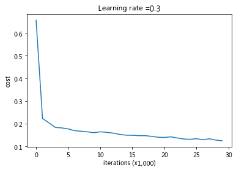


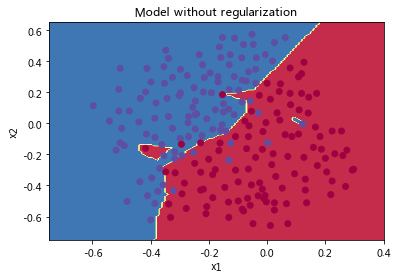

非正则化模型显然过度拟合了训练集，拟合了一些噪声点！现在让我们看一下减少过拟合的两种手段。

## 2-L2正则化	

避免过拟合的标准方法称为 **L2正则化**，它将损失函数从：
$$
J = -\frac{1}{m} \sum\limits_{i = 1}^{m} \large{(}\small  y^{(i)}\log\left(a^{[L](i)}\right) + (1-y^{(i)})\log\left(1- a^{[L](i)}\right) \large{)} \tag{1}
$$
修改到：
$$
J_{regularized} = \small \underbrace{-\frac{1}{m} \sum\limits_{i = 1}^{m} \large{(}\small y^{(i)}\log\left(a^{[L](i)}\right) + (1-y^{(i)})\log\left(1- a^{[L](i)}\right) \large{)} }_\text{cross-entropy cost} + \underbrace{\frac{1}{m} \frac{\lambda}{2} \sum\limits_l\sum\limits_k\sum\limits_j W_{k,j}^{[l]2} }_\text{L2 regularization cost} \tag{2}
$$
在神经网络中，这个公式中的 **k** 和 **j** 代表以下内容：

- **k** 表示神经网络中的第 **k** 个神经元或节点。
- **j** 表示与第 **k** 个神经元相连的权重。

假设有一个神经网络，隐藏层有3个神经元，每个神经元与输入层的4个特征相连。我们可以表示这个隐藏层的权重矩阵为：
$$
W^{[1]} = \begin{bmatrix}
0.5  ; -0.2 ; 0.8 ; 0.3 \\
-0.1 ; 0.6  ; -0.4; 0.7 \\
0.2  ; 0.4  ; 0.1 ; -0.5 \\
\end{bmatrix}
$$
现在，我们可以计算每个权重的平方并求和：
$$
\sum_{k}\sum_{j} W_{k,j}^{[1]2} = (0.5)^2 + (-0.2)^2 + 0.8^2 + 0.3^2 + (-0.1)^2 + 0.6^2 + (-0.4)^2 + 0.7^2 + 0.2^2 + 0.4^2 + 0.1^2 + (-0.5)^2
$$
计算结果为：
$$
\sum_{k}\sum_{j} W_{k,j}^{[1]2} = 2.63
$$
​	**练习**：实现`compute_cost_with_regularization（）`，以计算公式（2）的损失。要计算$\sum\limits_k\sum\limits_j W_{k,j}^{[l]2}$ ，请使用：

```python
np.sum(np.square(Wl))
```

必须对$W^{[1]}$，$W^{[2]}$和$W^{[3]}$执行此操作，然后将三个项相加并乘以$\frac{1}{m}\frac{\lambda}{2}$。

```PYTHON
def compute_cost_with_regularization(A3, Y, parameters, lambd):
    """
    Implement the cost function with L2 regularization. See formula (2) above.
    
    Arguments:
    A3 -- post-activation, output of forward propagation, of shape (output size, number of examples)
    Y -- "true" labels vector, of shape (output size, number of examples)
    parameters -- python dictionary containing parameters of the model
    
    Returns:
    cost - value of the regularized loss function (formula (2))
    """
    m = Y.shape[1]
    W1 = parameters["W1"]
    W2 = parameters["W2"]
    W3 = parameters["W3"]
    
    cross_entropy_cost = compute_cost(A3, Y) # This gives you the cross-entropy part of the cost 计算损失函数
    
    ### START CODE HERE ### (approx. 1 line)
    L2_regularization_cost = (1./m*lambd/2)*(np.sum(np.square(W1)) + np.sum(np.square(W2)) + np.sum(np.square(W3))) #计算L2正则化项
    ### END CODER HERE ###
    
    cost = cross_entropy_cost + L2_regularization_cost
    
    return cost

A3, Y_assess, parameters = compute_cost_with_regularization_test_case()

print("cost = " + str(compute_cost_with_regularization(A3, Y_assess, parameters, lambd = 0.1)))
```

output:

```PYTHON
cost = 1.7864859451590758
```

当然，因为你更改了损失，所以还必须更改反向传播！ 必须针对新损失函数计算所有梯度。

**练习**：实现正则化后的反向传播。更改仅涉及dW1，dW2和dW3。对于每一个，你必须添加正则化项的梯度$\frac{d}{dW} ( \frac{1}{2}\frac{\lambda}{m}  W^2) = \frac{\lambda}{m} W$。

非常容易、根据导数四则运算、求导后依旧相加，即在dw后方添加$\frac{\lambda}{m} W$即可。

```PYTHON

def backward_propagation_with_regularization(X, Y, cache, lambd):
    #导数都是从传导图中直接推算得到
    """
    Implements the backward propagation of our baseline model to which we added an L2 regularization.

    Arguments:
    X -- input dataset, of shape (input size, number of examples)
    Y -- "true" labels vector, of shape (output size, number of examples)
    cache -- cache output from forward_propagation()
    lambd -- regularization hyperparameter, scalar

    Returns:
    gradients -- A dictionary with the gradients with respect to each parameter, activation and pre-activation variables
    """

    m = X.shape[1] #样本数
    (Z1, A1, W1, b1, Z2, A2, W2, b2, Z3, A3, W3, b3) = cache

    dZ3 = A3 - Y

    ### START CODE HERE ### (approx. 1 line)
    dW3 = 1./m * np.dot(dZ3, A2.T) + lambd/m * W3
    ### END CODE HERE ###
    db3 = 1./m * np.sum(dZ3, axis=1, keepdims = True)

    dA2 = np.dot(W3.T, dZ3)
    dZ2 = np.multiply(dA2, np.int64(A2 > 0))
    ### START CODE HERE ### (approx. 1 line)
    dW2 = 1./m * np.dot(dZ2, A1.T) + lambd/m * W2
    ### END CODE HERE ###
    db2 = 1./m * np.sum(dZ2, axis=1, keepdims = True)

    dA1 = np.dot(W2.T, dZ2)
    dZ1 = np.multiply(dA1, np.int64(A1 > 0))
    ### START CODE HERE ### (approx. 1 line)
    dW1 = 1./m * np.dot(dZ1, X.T) + lambd/m * W1
    ### END CODE HERE ###
    db1 = 1./m * np.sum(dZ1, axis=1, keepdims = True)

    gradients = {"dZ3": dZ3, "dW3": dW3, "db3": db3,"dA2": dA2,
                 "dZ2": dZ2, "dW2": dW2, "db2": db2, "dA1": dA1, 
                 "dZ1": dZ1, "dW1": dW1, "db1": db1}

    return gradients

X_assess, Y_assess, cache = backward_propagation_with_regularization_test_case()

grads = backward_propagation_with_regularization(X_assess, Y_assess, cache, lambd = 0.7)
print ("dW1 = "+ str(grads["dW1"]))
print ("dW2 = "+ str(grads["dW2"]))
print ("dW3 = "+ str(grads["dW3"]))
```

output：

```PYTHON
dW1 = [[-0.25604646  0.12298827 -0.28297129]
 [-0.17706303  0.34536094 -0.4410571 ]]
dW2 = [[ 0.79276486  0.85133918]
 [-0.0957219  -0.01720463]
 [-0.13100772 -0.03750433]]
dW3 = [[-1.77691347 -0.11832879 -0.09397446]]
```

现在让我们使用L2正则化(𝜆=0.7)运行的模型。`model（）`函数将调用：

- `compute_cost_with_regularization`代替`compute_cost`
- `backward_propagation_with_regularization`代替`backward_propagation`

```PYTHON
parameters = model(train_X, train_Y, lambd = 0.7)
print ("On the train set:")
predictions_train = predict(train_X, train_Y, parameters)
print ("On the test set:")
predictions_test = predict(test_X, test_Y, parameters)
```

output：

```python
Cost after iteration 0: 0.6974484493131264
Cost after iteration 10000: 0.2684918873282239
Cost after iteration 20000: 0.2680916337127301
On the train set:
Accuracy: 0.9383886255924171
On the test set:
Accuracy: 0.93
```

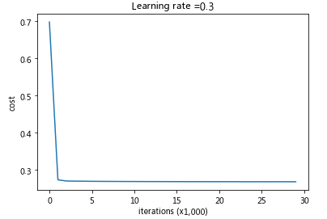

决策边界：

```python
plt.title("Model with L2-regularization")
axes = plt.gca()
axes.set_xlim([-0.75,0.40])
axes.set_ylim([-0.75,0.65])
plot_decision_boundary(lambda x: predict_dec(parameters, x.T), train_X, train_Y)
```

output：

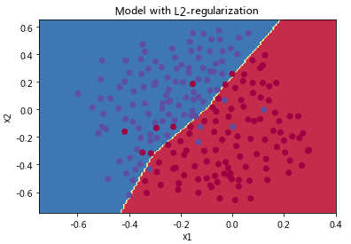

- 𝜆  的值是你可以调整开发集的超参数。
- L2正则化使决策边界更平滑。如果𝜆 太大，则也可能“过度平滑”，从而使模型偏差较高。

### 2.1-L2正则化的原理

L2正则化基于以下假设：权重较小的模型比权重较大的模型更简单。因此，通过对损失函数中权重的平方值进行惩罚，可以将所有权重驱动为较小的值。比重太大会使损失过高！这将导致模型更平滑，输出随着输入的变化而变化得更慢。

 L2正则化的影响：

- 损失计算：
    \- 正则化条件会添加到损失函数中
- 反向传播函数：
    \- 有关权重矩阵的渐变中还有其他术语
- 权重最终变小（“权重衰减”）：
    \- 权重被推到较小的值。

## 3-Dropout

**Dropout**是广泛用于深度学习的正则化技术。
**它会在每次迭代中随机关闭一些神经元。**

```
要了解Dropout，可以思考与朋友进行以下对话：  
- 朋友：“为什么你需要所有神经元来训练你的网络以分类图像？”。  
- 你：“因为每个神经元都有权重，并且可以学习图像的特定特征/细节/形状。我拥有的神经元越多，模型学习的特征就越丰富！”  
- 朋友：“我知道了，但是你确定你的神经元学习的是不同的特征而不是全部相同的特征吗？”  
- 你：“这是个好问题……同一层中的神经元实际上并不关联。应该绝对有可能让他们学习相同的图像特征/形状/形式/细节...这是多余的。为此应该有一个解决方案。”
```

​	在每次迭代中，以概率$1 - keep\_prob$或以概率$keep\_prob$（此处为50％）关闭此层的每个神经元。关闭的神经元对迭代的正向和反向传播均无助于训练。


$1^{st}$层：我们平均关闭了40％的神经元。$3^{rd}$层：我们平均关闭了20％的神经元。

​	当你关闭某些神经元时，实际上是在修改模型。Dropout背后的想法是，在每次迭代中，你将训练仅使用神经元子集的不同模型。通过Dropout，你的神经元对另一种特定神经元的激活变得不那么敏感，因为另一神经元可能随时关闭。


### 3.1-Dropout正向传播

​	**练习**：实现带有Dropout的正向传播。你正在使用3层的神经网络，并将为第一和第二隐藏层添加Dropout。我们不会将Dropout应用于输入层或输出层。

**说明**：
关闭第一层和第二层中的某些神经元。为此，将执行4个步骤：

1. 我们讨论了使用`np.random.rand（）`创建与$a^{[1]}$形状相同的变量$d^{[1]}$的方法，以随机获取0到1之间的数。在这里，你将使用向量化的实现，创建一个与$A^{[1]}$的矩阵维度相同的随机矩阵$D^{[1]} = [d^{[1](1)} d^{[1](2)} ... d^{[1](m)}]$。
2. 通过对𝐷[1]中的值进行阈值设置，将$D^{[1]}$的每个条目设置为0（概率为`1-keep_prob`）或1（概率为`keep_prob`）。提示：将矩阵X的所有条目设置为0（如果概率小于0.5）或1（如果概率大于0.5），则可以执行：`X = (X < 0.5)`。注意0和1分别对应False和True。
3. 将$A^{[1]}$设置为$A^{[1]} * D^{[1]}$（关闭一些神经元）。你可以将$D^{[1]}$ 视为掩码，这样当它与另一个矩阵相乘时，关闭某些值。
4. 将$A^{[1]}$除以`keep_prob`。通过这样做，你可以确保损失结果仍具有与dropout相同的期望值，相当于原来的有`keep_prob`的概率被留下来，即期望乘keep_prob，此处再除了就保持原期望。（此技术也称为反向dropout）

```PYTHON

def forward_propagation_with_dropout(X, parameters, keep_prob = 0.5):
    """
    Implements the forward propagation: LINEAR -> RELU + DROPOUT -> LINEAR -> RELU + DROPOUT -> LINEAR -> SIGMOID.
    
    Arguments:
    X -- input dataset, of shape (output size, number of examples)
    parameters -- python dictionary containing your parameters "W1", "b1", "W2", "b2", "W3", "b3":
    keep_prob - probability of keeping a neuron active during drop-out, scalar
    
    Returns:
    A3 -- last activation value, output of the forward propagation, of shape (1,1)
    cache -- tuple, information stored for computing the backward propagation
    """
    
    np.random.seed(1)
    
    # retrieve parameters
    W1 = parameters["W1"]
    b1 = parameters["b1"]
    W2 = parameters["W2"]
    b2 = parameters["b2"]
    W3 = parameters["W3"]
    b3 = parameters["b3"]
    
    # LINEAR -> RELU -> LINEAR -> RELU -> LINEAR -> SIGMOID
    Z1 = np.dot(W1, X) + b1
    A1 = relu(Z1)
    ### START CODE HERE ### (approx. 4 lines)         # Steps 1-4 below correspond to the Steps 1-4 described above. 
    D1 = np.random.rand(A1.shape[0],A1.shape[1])               # Step 1: initialize matrix D1 = np.random.rand(..., ...)
    D1 = D1 < keep_prob                                      # Step 2: convert entries of D1 to 0 or 1 (using keep_prob as the threshold)
    A1 = A1 * D1                                         # Step 3: shut down some neurons of A1
    A1 = A1 / keep_prob                                        # Step 4: scale the value of neurons that haven't been shut down
    ### END CODE HERE ###
    Z2 = np.dot(W2, A1) + b2
    A2 = relu(Z2)
    ### START CODE HERE ### (approx. 4 lines)
    D2 = np.random.rand(A2.shape[0],A2.shape[1])               # Step 1: initialize matrix D2 = np.random.rand(..., ...)
    D2 = D2 < keep_prob                                         # Step 2: convert entries of D2 to 0 or 1 (using keep_prob as the threshold)
    A2 = A2 * D2                                         # Step 3: shut down some neurons of A2
    A2 = A2 / keep_prob                                      # Step 4: scale the value of neurons that haven't been shut down
    ### END CODE HERE ###
    Z3 = np.dot(W3, A2) + b3
    A3 = sigmoid(Z3)

    cache = (Z1, D1, A1, W1, b1, Z2, D2, A2, W2, b2, Z3, A3, W3, b3)

    return A3, cache

X_assess, parameters = forward_propagation_with_dropout_test_case()

A3, cache = forward_propagation_with_dropout(X_assess, parameters, keep_prob = 0.7)
print ("A3 = " + str(A3))
```

output：

```PYTHON
X_assess, parameters = forward_propagation_with_dropout_test_case()

A3, cache = forward_propagation_with_dropout(X_assess, parameters, keep_prob = 0.7)
print ("A3 = " + str(A3))
```

### 3.2-Dropout反向传播

**练习**：实现带有dropout的反向传播。和之前一样，训练一个3层的网络。使用存储在缓存中的掩码$D^{[1]}$和$D^{[2]}$，添加dropout到第一和第二个隐藏层。

**说明**：
带有dropout的反向传播实现上非常容易。你将必须执行2个步骤：
1.在上方通过在$A^{[1]}$上应用掩码$D^{[1]}$来关闭正向传播过程中的某些神经元。在反向传播中，必须将相同的掩码$D^{[1]}$重新应用于$dA^{[1]}$来关闭相同的神经元。
2.在正向传播过程中，你已将$A^{[1]}$除以`keep_prob`。 因此，在反向传播中，必须再次将`dA1`除以`keep_prob`（计算的解释是，如果𝐴[1]被`keep_prob`缩放，则其派生的𝑑𝐴[1]也由相同的`keep_prob`缩放）。

```PYTHON
def backward_propagation_with_dropout(X, Y, cache, keep_prob):
    """
    Implements the backward propagation of our baseline model to which we added dropout.
    
    Arguments:

    X -- input dataset, of shape (output size, number of examples)
    Y -- "true" labels vector, of shape (output size, number of examples)
    cache -- cache output from forward_propagation_with_dropout()
    keep_prob - probability of keeping a neuron active during drop-out, scalar
    
    Returns:
    gradients -- A dictionary with the gradients with respect to each parameter, activation and pre-activation variables
    """
    
    m = X.shape[1] #样本数
    (Z1, D1, A1, W1, b1, Z2, D2, A2, W2, b2, Z3, A3, W3, b3) = cache
    
    dZ3 = A3 - Y
    dW3 = 1./m * np.dot(dZ3, A2.T)
    db3 = 1./m * np.sum(dZ3, axis=1, keepdims = True)
    dA2 = np.dot(W3.T, dZ3)
    ### START CODE HERE ### (≈ 2 lines of code)
    dA2 = dA2 * D2              # Step 1: Apply mask D2 to shut down the same neurons as during the forward propagation
    dA2 = dA2 / keep_prob           # Step 2: Scale the value of neurons that haven't been shut down
    ### END CODE HERE ###
    dZ2 = np.multiply(dA2, np.int64(A2 > 0))
    dW2 = 1./m * np.dot(dZ2, A1.T)
    db2 = 1./m * np.sum(dZ2, axis=1, keepdims = True)

    dA1 = np.dot(W2.T, dZ2)
    ### START CODE HERE ### (≈ 2 lines of code)
    dA1 = dA1 * D1              # Step 1: Apply mask D1 to shut down the same neurons as during the forward propagation
    dA1 = dA1 / keep_prob             # Step 2: Scale the value of neurons that haven't been shut down
    ### END CODE HERE ###
    dZ1 = np.multiply(dA1, np.int64(A1 > 0))
    dW1 = 1./m * np.dot(dZ1, X.T)
    db1 = 1./m * np.sum(dZ1, axis=1, keepdims = True)

    gradients = {"dZ3": dZ3, "dW3": dW3, "db3": db3,"dA2": dA2,
                 "dZ2": dZ2, "dW2": dW2, "db2": db2, "dA1": dA1, 
                 "dZ1": dZ1, "dW1": dW1, "db1": db1}
    
    return gradients

X_assess, Y_assess, cache = backward_propagation_with_dropout_test_case()

gradients = backward_propagation_with_dropout(X_assess, Y_assess, cache, keep_prob = 0.8)

print ("dA1 = " + str(gradients["dA1"]))
print ("dA2 = " + str(gradients["dA2"]))
```

output：

```PYTHON
dA1 = [[ 0.36544439  0.         -0.00188233  0.         -0.17408748]
 [ 0.65515713  0.         -0.00337459  0.         -0.        ]]
dA2 = [[ 0.58180856  0.         -0.00299679  0.         -0.27715731]
 [ 0.          0.53159854 -0.          0.53159854 -0.34089673]
 [ 0.          0.         -0.00292733  0.         -0.        ]]
```

现在让我们使用dropout（`keep_prob = 0.86`）运行模型。 这意味着在每次迭代中，你都以24％的概率关闭第1层和第2层的每个神经元。 函数`model()`将调用：

- `forward_propagation_with_dropout`而不是`forward_propagation`。
- `backward_propagation_with_dropout`，而不是`backward_propagation`。

```PYTHON
parameters = model(train_X, train_Y, keep_prob = 0.86, learning_rate = 0.3)

print ("On the train set:")
predictions_train = predict(train_X, train_Y, parameters)
print ("On the test set:")
predictions_test = predict(test_X, test_Y, parameters)
```

output：

```PYTHON
Cost after iteration 0: 0.6543912405149825
Cost after iteration 10000: 0.0610169865749056
Cost after iteration 20000: 0.060582435798513114
On the train set:
Accuracy: 0.9289099526066351
On the test set:
Accuracy: 0.95
```

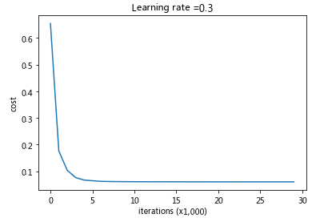

决策边界

```python
plt.title("Model with dropout")
axes = plt.gca()
axes.set_xlim([-0.75,0.40])
axes.set_ylim([-0.75,0.65])
plot_decision_boundary(lambda x: predict_dec(parameters, x.T), train_X, train_Y)
```


**注意**：

- 使用dropout时的**常见错误**是在训练和测试中都使用。你只能在训练中使用dropout（随机删除节点）。
- 深度学习框架，例如[tensorflow](https://www.tensorflow.org/api_docs/python/tf/nn/dropout), [PaddlePaddle](http://doc.paddlepaddle.org/release_doc/0.9.0/doc/ui/api/trainer_config_helpers/attrs.html), [keras](https://keras.io/layers/core/#dropout)或者 [caffe](http://caffe.berkeleyvision.org/tutorial/layers/dropout.html) 附带dropout层的实现。

**关dropout应该记住的事情：**

- dropout是一种正则化技术。
- 仅在训练期间使用dropout，在测试期间不要使用。
- 在正向和反向传播期间均应用dropout。
- 在训练期间，将每个dropout层除以keep_prob，以保持激活的期望值相同。例如，如果keep_prob为0.5，则平均而言，我们将关闭一半的节点，因此输出将按0.5缩放，因为只有剩余的一半对解决方案有所贡献。除以0.5等于乘以2，因此输出现在具有相同的期望值。你可以检查此方法是否有效，即使keep_prob的值不是0.5。

**从此笔记本中记住的内容**：

- 正则化将帮助减少过拟合。
- 正则化将使权重降低到较低的值。
- L2正则化和Dropout是两种非常有效的正则化技术。

# 神经网络梯度检验

​	假设你是致力于在全球范围内提供移动支付的团队的一员，被上级要求建立深度学习模型来检测欺诈行为--每当有人进行支付时，你都应该确认该支付是否可能是欺诈性的，例如用户的帐户已被黑客入侵。

​	但是模型的反向传播很难实现，有时还会有错误。因为这是关键的应用任务，所以你公司的CEO要反复确定反向传播的实现是正确的。CEO要求你证明你的反向传播实际上是有效的！为了保证这一点，你将应用到“梯度检验”。

```python
import numpy as np
from lib.testCases import *
from lib.gc_utils import sigmoid, relu, dictionary_to_vector, vector_to_dictionary, gradients_to_vector
```

## 1-梯度检验原理

反向传播计算梯度$\frac{\partial J}{\partial \theta}$，其中𝜃表示模型的参数。使用正向传播和损失函数来计算$𝐽$。

由于正向传播相对容易实现，相信你有信心能做到这一点，确定100％计算正确的损失$𝐽$。为此，你可以使用$𝐽$来验证代码$\frac{\partial J}{\partial \theta}$。

让我们回顾一下导数（或者说梯度）的定义：
$$
\frac{\partial J}{\partial \theta} = \lim_{\varepsilon \to 0} \frac{J(\theta + \varepsilon) - J(\theta - \varepsilon)}{2 \varepsilon} \tag{1}
$$
我们知道以下内容：

- $\frac{\partial J}{\partial \theta}$是你要确保计算正确的对象。
- 你可以计算$J(\theta + \varepsilon)$和$J(\theta - \varepsilon)$（在𝜃是实数的情况下），因为要保证𝐽的实现是正确的。

让我们使用方程式（1）和 𝜀的一个小值来说服CEO你计算∂𝐽∂𝜃的代码是正确的！

## 2-一维梯度检查

思考一维线性函数$J(\theta) = \theta x$，该模型仅包含一个实数值参数$\theta$，并以$𝑥$作为输入。

你将实现代码以计算$ 𝐽(.)$及其派生$\frac{\partial J}{\partial \theta}$，然后，你将使用梯度检验来确保$𝐽$的导数计算正确。

下图显示了关键的计算步骤：首先从$𝑥$开始，再评估函数$𝐽(𝑥)$（正向传播），然后计算导数$\frac{\partial J}{\partial \theta}$（反向传播）。

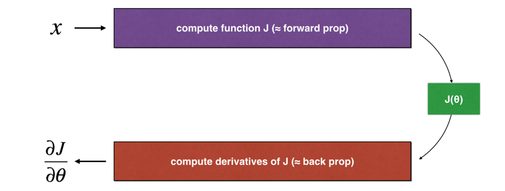

**练习**：为此简单函数实现“正向传播”和“向后传播”。 即在两个单独的函数中，计算$𝐽(.)$ （正向传播）及其相对于$\theta$(反向传播）的导数。

```PYTHON
# GRADED FUNCTION: forward_propagation

def forward_propagation(x, theta):
    """
    Implement the linear forward propagation (compute J) presented in Figure 1 (J(theta) = theta * x)
    
    Arguments:
    x -- a real-valued input
    theta -- our parameter, a real number as well
    
    Returns:
    J -- the value of function J, computed using the formula J(theta) = theta * x
    """
    
    ### START CODE HERE ### (approx. 1 line)
    J = theta * x
    ### END CODE HERE ###
    
    return J
```

**练习**：现在，执行图1的反向传播步骤（导数计算）。也就是说，计算𝐽(𝜃)=𝜃𝑥 相对于 𝜃的导数。为避免进行演算，你应该得到$d\theta = \frac { \partial J }{ \partial \theta} = x$。

```PYTHON
# GRADED FUNCTION: backward_propagation

def backward_propagation(x, theta):
    """
    Computes the derivative of J with respect to theta (see Figure 1).
    
    Arguments:
    x -- a real-valued input
    theta -- our parameter, a real number as well
    
    Returns:
    dtheta -- the gradient of the cost with respect to theta
    """
    
    ### START CODE HERE ### (approx. 1 line)
    dtheta = x
    ### END CODE HERE ###

    
    return dtheta
```

**练习**：为了展示`backward_propagation（）`函数正确计算了梯度$\frac { \partial J }{ \partial \theta}$，让我们实施梯度检验。

**说明**：

- 首先使用上式（1）和$\varepsilon$的极小值计算“gradapprox”。以下是要遵循的步骤

$$
\theta^{+} = \theta + \varepsilon
$$

$$
\theta^{+} = \theta - \varepsilon
$$

$$
J^{+} = J(\theta^{+})
$$

$$
J^{-} = J(\theta^{-})
$$

$$
gradapprox = \frac{J^{+} - J^{-}}{2  \varepsilon}
$$

- 然后使用反向传播计算梯度，并将结果存储在变量“grad”中
- 最后，使用以下公式计算“gradapprox”和“grad”之间的相对差：

$$
difference = \frac {\mid\mid grad - gradapprox \mid\mid_2}{\mid\mid grad \mid\mid_2 + \mid\mid gradapprox \mid\mid_2} \tag{2}
$$

- `np.linalg.norm()` 是 NumPy 库中的一个函数，用于计算一个向量的范数。它可以计算不同维度的向量的不同范数，比如向量的 L1 范数、L2 范数等。
  1. **基本用法**：
     - `np.linalg.norm(x, ord=None, axis=None, keepdims=False)`
     - `x`：表示要计算范数的向量或矩阵。
     - `ord`：表示范数的类型。
     - `axis`：表示计算范数的轴。
     - 向量的范数：
       - L1 范数：表示求列和的最大值。
       - L2 范数：表示求特征值，然后求最大特征值的算术平方根。
       - L∞ 范数：表示求行和的最大值。
       - `ord=None`：表示求整体的矩阵元素平方和，再开根号。
- 你需要3个步骤来计算此公式：
  - 1. 使用np.linalg.norm（...）计算分子
  - 2. 计算分母，调用np.linalg.norm（...）两次
  - 3. 相除
- 如果差异很小（例如小于$10^{-7}$），则可以确信正确计算了梯度。否则，梯度计算可能会出错。

```python
# GRADED FUNCTION: gradient_check

def gradient_check(x, theta, epsilon = 1e-7):
    """
    Implement the backward propagation presented in Figure 1.
    
    Arguments:
    x -- a real-valued input
    theta -- our parameter, a real number as well
    epsilon -- tiny shift to the input to compute approximated gradient with formula(1)
    
    Returns:
    difference -- difference (2) between the approximated gradient and the backward propagation gradient
    """
    
    # Compute gradapprox using left side of formula (1). epsilon is small enough, you don't need to worry about the limit.
    ### START CODE HERE ### (approx. 5 lines)
    thetaplus = theta + epsilon                               # Step 1
    thetaminus = theta - epsilon                              # Step 2
    J_plus = forward_propagation(x, thetaplus)                                  # Step 3
    J_minus = forward_propagation(x, thetaminus)                                 # Step 4
    gradapprox = (J_plus - J_minus) / (2 * epsilon)                              # Step 5
    ### END CODE HERE ###

    # Check if gradapprox is close enough to the output of backward_propagation()
    ### START CODE HERE ### (approx. 1 line)
    grad = backward_propagation(x, theta)
    ### END CODE HERE ###

    ### START CODE HERE ### (approx. 1 line)
    numerator = np.linalg.norm(grad - gradapprox)                               # Step 1'
    denominator = np.linalg.norm(grad) + np.linalg.norm(gradapprox)                            # Step 2'
    difference = numerator / denominator                              # Step 3'
    ### END CODE HERE ###
    
    if difference < 1e-7:
        print ("The gradient is correct!")
    else:
        print ("The gradient is wrong!")
    
    return difference
x, theta = 2, 4
difference = gradient_check(x, theta)
print("difference = " + str(difference))
```

output：

```PYTHON
The gradient is correct!
difference = 2.919335883291695e-10
```

## 3-N维梯度检验

在更一般的情况下，损失函数$𝐽$具有多个单个输入。当你训练神经网络时，$𝜃$实际上由多个矩阵$W^{[l]}$组成，并加上偏差$b^{[l]}$！重要的是要知道如何对高维输入进行梯度检验。

下图描述了欺诈检测模型的正向传播和反向传播：

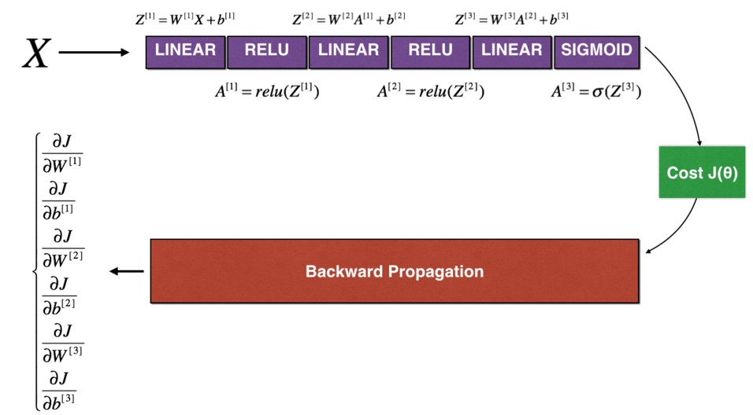

让我们看一下正向传播和反向传播的实现。

```PYTHON
def forward_propagation_n(X, Y, parameters):
    """
    Implements the forward propagation (and computes the cost) presented in Figure 3.
    
    Arguments:
    X -- training set for m examples
    Y -- labels for m examples 
    parameters -- python dictionary containing your parameters "W1", "b1", "W2", "b2", "W3", "b3":
    
    Returns:
    cost -- the cost function (logistic cost for one example)
    """
    
    # retrieve parameters
    m = X.shape[1]
    W1 = parameters["W1"]
    b1 = parameters["b1"]
    W2 = parameters["W2"]
    b2 = parameters["b2"]
    W3 = parameters["W3"]
    b3 = parameters["b3"]

    # LINEAR -> RELU -> LINEAR -> RELU -> LINEAR -> SIGMOID
    Z1 = np.dot(W1, X) + b1
    A1 = relu(Z1)
    Z2 = np.dot(W2, A1) + b2
    A2 = relu(Z2)
    Z3 = np.dot(W3, A2) + b3
    A3 = sigmoid(Z3)

    # Cost
    logprobs = np.multiply(-np.log(A3),Y) + np.multiply(-np.log(1 - A3), 1 - Y)
    cost = 1./m * np.sum(logprobs)
    
    cache = (Z1, A1, W1, b1, Z2, A2, W2, b2, Z3, A3, W3, b3)
    
    return cost, cache
```

```PYTHON
def backward_propagation_n(X, Y, cache):
    """
    Implement the backward propagation presented in figure 2.
    
    Arguments:
    X -- input datapoint, of shape (input size, 1)
    Y -- true "label"
    cache -- cache output from forward_propagation_n()
    
    Returns:
    gradients -- A dictionary with the gradients of the cost with respect to each parameter, activation and pre-activation variables.
    """
    
    m = X.shape[1]
    (Z1, A1, W1, b1, Z2, A2, W2, b2, Z3, A3, W3, b3) = cache
    
    dZ3 = A3 - Y
    dW3 = 1./m * np.dot(dZ3, A2.T)
    db3 = 1./m * np.sum(dZ3, axis=1, keepdims = True)
    
    dA2 = np.dot(W3.T, dZ3)
    dZ2 = np.multiply(dA2, np.int64(A2 > 0))
    dW2 = 1./m * np.dot(dZ2, A1.T) * 2
    db2 = 1./m * np.sum(dZ2, axis=1, keepdims = True)
    
    dA1 = np.dot(W2.T, dZ2)
    dZ1 = np.multiply(dA1, np.int64(A1 > 0))
    dW1 = 1./m * np.dot(dZ1, X.T)
    db1 = 4./m * np.sum(dZ1, axis=1, keepdims = True)
    
    gradients = {"dZ3": dZ3, "dW3": dW3, "db3": db3,
                 "dA2": dA2, "dZ2": dZ2, "dW2": dW2, "db2": db2,
                 "dA1": dA1, "dZ1": dZ1, "dW1": dW1, "db1": db1}
    
    return gradients
```

### 3.1-N维梯度检验原理

你想将“gradapprox”与通过反向传播计算的梯度进行比较。公式仍然是：
$$
\frac{\partial J}{\partial \theta} = \lim_{\varepsilon \to 0} \frac{J(\theta + \varepsilon) - J(\theta - \varepsilon)}{2 \varepsilon} \tag{1}
$$
但是，$𝜃$不再是标量。 而是一个叫做“参数”的字典。 我们为你实现了一个函数"`dictionary_to_vector()`"。它将“参数”字典转换为称为“值”的向量，该向量是通过将所有参数($W^{[1]}$,$b^{[1]}$, $W^{[2]}$, $b^{[2]}$,$W^{[3]}$, $b^{[3]}$)重塑为向量并将它们串联而获得的。（此处生成的行为数量，列为1）

反函数是“`vector_to_dictionary`”，它输出回“parameters”字典。

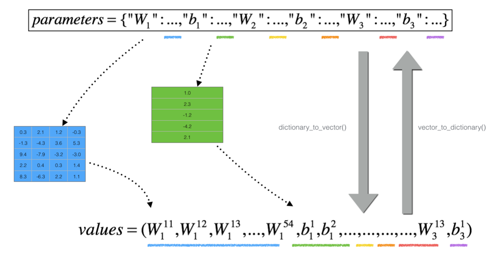

将在 gradient_check_n()中用到这些函数

我们还使用gradients_to_vector()将“gradients”字典转换为向量“grad”。

- `np.copy()` 的主要功能是创建一个数组或矩阵的副本。
- 这个副本与原始数组或矩阵在内存中是独立的，对副本的修改不会影响到原始数据。

**练习**：实现gradient_check_n()。

**说明**：这是伪代码，可帮助你实现梯度检验。

For each i in num_parameters:

- 计算

  `J_plus [i] `:

  1. 将$\theta^{+}$设为 `np.copy(parameters_values)`  
  
  2. 将$\theta^{+}_i$设为$\theta^{+}_i + \varepsilon$
  
- 计算`J_minus [i]`：

    1.将$\theta^{-}$设为 `np.copy(parameters_values)`  

    2.将$\theta^{-}_i$设为$\theta^{-}_i - \varepsilon$


- $gradapprox[i] = \frac{J^{+}_i - J^{-}_i}{2 \varepsilon}$

因此，你将获得向量`gradapprox`，其中`gradapprox[i]`是相对于`parameter_values[i]`的梯度的近似值。现在，你可以将此`gradapprox`向量与反向传播中的梯度向量进行比较。就像一维情况（步骤1'，2'，3'）一样计算：
$$
difference = \frac {\| grad - gradapprox \|_2}{\| grad \|_2 + \| gradapprox \|_2 } \tag{3}
$$

```PYTHON

def gradient_check_n(parameters, gradients, X, Y, epsilon = 1e-7):
    """
    Checks if backward_propagation_n computes correctly the gradient of the cost output by forward_propagation_n
    
    Arguments:
    parameters -- python dictionary containing your parameters "W1", "b1", "W2", "b2", "W3", "b3":
    grad -- output of backward_propagation_n, contains gradients of the cost with respect to the parameters. 
    x -- input datapoint, of shape (input size, 1)
    y -- true "label"
    epsilon -- tiny shift to the input to compute approximated gradient with formula(1)
    
    Returns:
    difference -- difference (2) between the approximated gradient and the backward propagation gradient
    """
    
    # Set-up variables
    parameters_values, _ = dictionary_to_vector(parameters)
    grad = gradients_to_vector(gradients)
    num_parameters = parameters_values.shape[0] # number of parameters （47，1） 行为数量
    J_plus = np.zeros((num_parameters, 1))
    J_minus = np.zeros((num_parameters, 1))
    gradapprox = np.zeros((num_parameters, 1))
    
    # Compute gradapprox
    for i in range(num_parameters):
        
        # Compute J_plus[i]. Inputs: "parameters_values, epsilon". Output = "J_plus[i]".
        # "_" is used because the function you have to outputs two parameters but we only care about the first one
        ### START CODE HERE ### (approx. 3 lines)
        thetaplus = np.copy(parameters_values)                                      # Step 1
        thetaplus[i][0] = thetaplus[i][0] + epsilon                                # Step 2
        J_plus[i], _ = forward_propagation_n(X, Y, vector_to_dictionary(thetaplus))    #成本函数     # Step 3
        ### END CODE HERE ###

        # Compute J_minus[i]. Inputs: "parameters_values, epsilon". Output = "J_minus[i]".
        ### START CODE HERE ### (approx. 3 lines)
        thetaminus = np.copy(parameters_values)                                     # Step 1
        thetaminus[i][0] = thetaminus[i][0] - epsilon                            # Step 2        
        J_minus[i], _ = forward_propagation_n(X, Y, vector_to_dictionary(thetaminus))                                  # Step 3
        ### END CODE HERE ###

        # Compute gradapprox[i]
        ### START CODE HERE ### (approx. 1 line)
        gradapprox[i] = (J_plus[i] - J_minus[i]) / (2.* epsilon)
        ### END CODE HERE ###

    # Compare gradapprox to backward propagation gradients by computing difference.
    ### START CODE HERE ### (approx. 1 line)
    numerator = np.linalg.norm(grad - gradapprox)                                           # Step 1'
    denominator = np.linalg.norm(grad) + np.linalg.norm(gradapprox)                                         # Step 2'
    difference = numerator / denominator                                          # Step 3'
    ### END CODE HERE ###

    if difference > 1e-7:
        print ("\033[93m" + "There is a mistake in the backward propagation! difference = " + str(difference) + "\033[0m")
    else:
        print ("\033[92m" + "Your backward propagation works perfectly fine! difference = " + str(difference) + "\033[0m")
    
    return difference

X, Y, parameters = gradient_check_n_test_case()

cost, cache = forward_propagation_n(X, Y, parameters)
gradients = backward_propagation_n(X, Y, cache)
difference = gradient_check_n(parameters, gradients, X, Y)
```

output：

```PYTHON
There is a mistake in the backward propagation! difference = 0.2850931567761624
```

​	看起来`backward_propagation_n`代码似乎有错误！很好，你已经实现了梯度检验。返回到`backward_propagation`并尝试查找/更正错误*（提示：检查dW2和db1）*。如果你已解决问题，请重新运行梯度检验。

你可以进行梯度检验来证明你的导数计算的正确吗？即使作业的这一部分没有评分，我们也强烈建议你尝试查找错误并重新运行梯度检验，直到确信实现了正确的反向传播。

**注意**

- 梯度检验很慢！用$\frac{\partial J}{\partial \theta} \approx  \frac{J(\theta + \varepsilon) - J(\theta - \varepsilon)}{2 \varepsilon}$逼近梯度在计算上是很耗费资源的。因此，我们不会在训练期间的每次迭代中都进行梯度检验。只需检查几次梯度是否正确。
- 至少如我们介绍的那样，梯度检验不适用于dropout。通常，你将运行不带dropout的梯度检验算法以确保你的backprop是正确的，然后添加dropout。
- 梯度检验可验证反向传播的梯度与梯度的数值近似值之间的接近度（使用正向传播进行计算）。
- 梯度检验很慢，因此我们不会在每次训练中都运行它。通常，你仅需确保其代码正确即可运行它，然后将其关闭并将backprop用于实际的学习过程。
