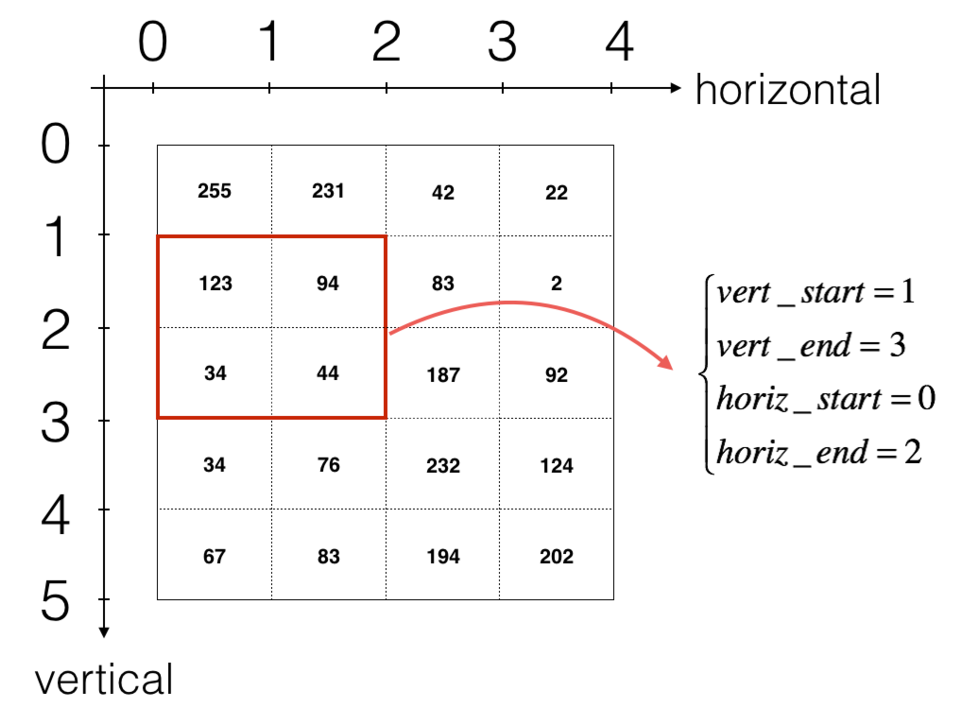

# 逐步实现卷积神经网络

使用numpy实现卷积（CONV）和池化（POOL）层，包括正向传播和反向传播（可选）。

**符号**：

- 上标$[l]$表示第$l^{th}$层的对象。
    \- 例如：$a^{[4]}$是$4^{th}$层的激活。 $W^{[5]}$和$b^{[5]}$是$5^{th}$层的参数。
- 上标$(i)$表示第$i^{th}$个示例中的对象。
    \- 示例：$x^{(i)}$是$i^{th}$个训练数据的输入。     
- 下标i表示$i^{th}$的向量输入。
    \- 示例：$a_i^{[l]}$表示$l$层中的$i^{th}$个激活，假设这是全连接层（FC）。      
- $n_H, n_W和n_C$分别表示给定层的通道的高度，宽度和数量。如果要引用特定层l，则还可以写入 $n_H^{[l]},n_W^{[l]},n_C^{[l]}。$
- $n_{H_{prev}}, n_{W_{prev}}和n_{C_{prev}}$ 分别表示前一层的高度，宽度和通道数。如果引用特定层l，则也可以表示为$n_H^{[l-1]}, n_W^{[l-1]}, n_C^{[l-1]}$。

## 作业大纲

- 卷积函数，包括：
    \- 零填充
    \- 卷积窗口
    \- 正向卷积
    \- 反向卷积（可选）
- 池化函数，包括：
    \- 正向池化
    \- 创建mask
    \- 分配值
    \- 反向池化（可选）

​	使用 `numpy`从头开始实现这些函数。对于每个正向函数，都有其对应的反向等式。因此，在正向传播模块的每一步中，都将一些参数存储在缓存中。这些参数用于在反向传播时计算梯度。


## 1 卷积神经网络

​	卷积层将输入体积转换为不同大小的输出体积


​	首先实现两个辅助函数：一个用于零填充，另一个用于计算卷积函数本身。

### 1.1 零填充

零填充将在图像的边界周围添加零：


填充的主要好处有：

- 允许使用CONV层而不必缩小其高度和宽度。这对于构建更深的网络很重要，因为高度/宽度会随着更深的层而缩小。一个重要、特殊的例子是"same"卷积，其中高度/宽度在一层之后被精确保留。
- 有助于我们将更多信息保留在图像边缘。如果不进行填充，下一层的一部分值将会受到图像边缘像素的干扰。

**练习**：实现以下函数，该功能将使用零填充处理一个批次X的所有图像数据。使用np.pad。注意，如果要填充维度为$(5,5,5,5,5)$的数组“a”，则第二维的填充为`pad = 1`，第四维的填充为`pad = 3`，其余为`pad = 0`，你可以这样做：

```python
a = np.pad(a, ((0,0), (1,1), (0,0), (3,3), (0,0)), 'constant', constant_values = (..,..))
```

```python
# GRADED FUNCTION: zero_pad

def zero_pad(X, pad):
    """
    Pad with zeros all images of the dataset X. The padding is applied to the height and width of an image, 
    as illustrated in Figure 1.
    
    Argument:
    X -- python numpy array of shape (m, n_H, n_W, n_C) representing a batch of m images
    pad -- integer, amount of padding around each image on vertical and horizontal dimensions
    m表示批次中的图像数量。
    Returns:
    X_pad -- padded image of shape (m, n_H + 2*pad, n_W + 2*pad, n_C)
	(pad1, pad2)：为相应维度在前后各填充 pad1和pad2 个单位。
	mode='constant'：指定填充模式为常数填充。在数组的边缘添加常数值。
	constant_values=0：指定填充值为0。在数组的边缘添加的值都是0。
    """
    
    ### START CODE HERE ### (≈ 1 line)
    X_pad = np.pad(X, ((0, 0),(pad, pad),(pad, pad),(0, 0)), 'constant', constant_values=0)
    ### END CODE HERE ###
    
    return X_pad
np.random.seed(1)
x = np.random.randn(4, 3, 3, 2)
x_pad = zero_pad(x, 2)
print ("x.shape =", x.shape)
print ("x_pad.shape =", x_pad.shape)
print ("x[1,1] =", x[1,1])
print ("x_pad[1,1] =", x_pad[1,1])

fig, axarr = plt.subplots(1, 2)
axarr[0].set_title('x')
axarr[0].imshow(x[0,:,:,0])
axarr[1].set_title('x_pad')
axarr[1].imshow(x_pad[0,:,:,0])
```

output：

```python
x.shape = (4, 3, 3, 2)
x_pad.shape = (4, 7, 7, 2)
x[1,1] = [[ 0.90085595 -0.68372786]
 [-0.12289023 -0.93576943]
 [-0.26788808  0.53035547]]
x_pad[1,1] = [[0. 0.]
 [0. 0.]
 [0. 0.]
 [0. 0.]
 [0. 0.]
 [0. 0.]
 [0. 0.]]
```


### 1.2 卷积的单个步骤

实现卷积的单个步骤，其中将滤波器（卷积核）应用于输入的单个位置。这将用于构建卷积单元，该卷积单元：

- 占用输入体积
- 在输入的每个位置都应用滤波器
- 输出另一个体积（通常大小不同）


​	滤波器大小为2x2，步幅为1（步幅=每次滑动时移动窗口的数量）

​	在计算机视觉应用中，左侧矩阵中的每个值都对应一个像素值，我们将3x3滤波器与图像进行卷积操作，首先将滤波器元素的值与原始矩阵相乘，然后将它们相加。在练习的第一步中，你将实现卷积的单个步骤，相当于仅对一个位置应用滤波器以获得单个实值输出。

```py
# GRADED FUNCTION: conv_single_step

def conv_single_step(a_slice_prev, W, b):
    """
    Apply one filter defined by parameters W on a single slice (a_slice_prev) of the output activation 
    of the previous layer.
    
    Arguments:
    a_slice_prev -- slice of input data of shape (f, f, n_C_prev)
    W -- Weight parameters contained in a window - matrix of shape (f, f, n_C_prev)
    b -- Bias parameters contained in a window - matrix of shape (1, 1, 1)
    
    Returns:
    Z -- a scalar value, result of convolving the sliding window (W, b) on a slice x of the input data
    """

    ### START CODE HERE ### (≈ 2 lines of code)
    # Element-wise product between a_slice and W. Add bias. 加偏移，w为卷积核
    s = np.multiply(a_slice_prev, W) + b
    # Sum over all entries of the volume s
    Z = np.sum(s)
    ### END CODE HERE ###

    return Z

np.random.seed(1)
a_slice_prev = np.random.randn(4, 4, 3)
W = np.random.randn(4, 4, 3)
b = np.random.randn(1, 1, 1)

Z = conv_single_step(a_slice_prev, W, b)
print("Z =", Z)
```

output：

```python
Z = -23.16021220252078
```

### 1.3 卷积神经网络--正向传递

​	在正向传递中，你将使用多个滤波器对输入进行卷积。每个“卷积”都会输出一个2D矩阵。然后，你将堆叠这些输出以获得输出：


​	使用滤波器W卷积输入A_prev。此函数将上一层的激活输出（对于一批m个输入）A_prev作为输入，F表示滤波器/权重（W）和偏置向量（b），其中每个滤波器都有自己的（单个）偏置。最后，你还可以访问包含stride和padding的超参数字典。

1.要在矩阵“a_prev”（5,5,3）的左上角选择一个2x2切片，请执行以下操作：

```python
a_slice_prev = a_prev[0:2,0:2,:]
```

使用定义的`start/end`索引定义`a_slice_prev`时将非常有用。
2.要定义a_slice，你需要首先定义其角点 `vert_start`, `vert_end`, `horiz_start` 和 `horiz_end`。该图可能有助于你找到如何在下面的代码中使用h，w，f和s定义每个角。



卷积的输出维度与输入维度相关公式为：
$$
n_H = \lfloor \frac{n_{H_{prev}} - f + 2 \times pad}{stride} \rfloor +1
$$

$$
n_W = \lfloor \frac{n_{W_{prev}} - f + 2 \times pad}{stride} \rfloor +1
$$

$$
n_C = \text{number of filters used in the convolution}
$$

不必考虑向量化，只使用for循环实现所有函数。

```python
# GRADED FUNCTION: conv_forward

def conv_forward(A_prev, W, b, hparameters):
    """
    Implements the forward propagation for a convolution function
    
    Arguments:
    A_prev -- output activations of the previous layer, numpy array of shape (m, n_H_prev, n_W_prev, n_C_prev)
    W -- Weights, numpy array of shape (f, f, n_C_prev, n_C)
    b -- Biases, numpy array of shape (1, 1, 1, n_C)
    hparameters -- python dictionary containing "stride" and "pad"
        
    Returns:
    Z -- conv output, numpy array of shape (m, n_H, n_W, n_C)
    cache -- cache of values needed for the conv_backward() function
    """
    
    ### START CODE HERE ###
    # Retrieve dimensions from A_prev's shape (≈1 line)  获取待卷积矩阵的形状
    (m, n_H_prev, n_W_prev, n_C_prev) = A_prev.shape
    
    # Retrieve dimensions from W's shape (≈1 line) 获取滤波器形状 储存大小、待卷积通道数、输出通道数（卷积核数）
    (f, f, n_C_prev, n_C) = W.shape
    
    # Retrieve information from "hparameters" (≈2 lines) 获得超参数
    stride = hparameters['stride']
    pad = hparameters['pad']
    
    # Compute the dimensions of the CONV output volume using the formula given above. Hint: use int() to floor. (≈2 lines)
    n_H = 1 + int((n_H_prev + 2 * pad - f) / stride) #依照上面公式
    n_W = 1 + int((n_W_prev + 2 * pad - f) / stride)
    
    # Initialize the output volume Z with zeros. (≈1 line)
    Z = np.zeros((m, n_H, n_W, n_C)) #定义输出大小，后方会返回
    
    # Create A_prev_pad by padding A_prev
    A_prev_pad = zero_pad(A_prev, pad) #填充 此处返回的是第一个参数是图片的张数，可以在下方循环中处理
    
    for i in range(m):                               # loop over the batch of training examples
        a_prev_pad = A_prev_pad[i]                               # Select ith training example's padded activation
        for h in range(n_H):                           # loop over vertical axis of the output volume
            for w in range(n_W):                       # loop over horizontal axis of the output volume
                for c in range(n_C):                   # loop over channels (= #filters) of the output volume
                    
                    # Find the corners of the current "slice" (≈4 lines)
                    vert_start = h * stride #列
                    vert_end = vert_start + f
                    horiz_start = w * stride #行
                    horiz_end = horiz_start + f
                    
                    # Use the corners to define the (3D) slice of a_prev_pad (See Hint above the cell). (≈1 line)
                    a_slice_prev = a_prev_pad[vert_start:vert_end, horiz_start:horiz_end, :]#给出卷积的范围
                  
                    # Convolve the (3D) slice with the correct filter W and bias b, to get back one output neuron. (≈1 line)
                    Z[i, h, w, c] = np.sum(np.multiply(a_slice_prev, W[:, :, :, c]) + b[:, :, :, c])#给输出矩阵填值
                                        
    ### END CODE HERE ###
    
    # Making sure your output shape is correct
    assert(Z.shape == (m, n_H, n_W, n_C))
    
    # Save information in "cache" for the backprop
    cache = (A_prev, W, b, hparameters)  #这些值都没有改变，都是参数传进来后传出去
    
    return Z, cache

np.random.seed(1)
A_prev = np.random.randn(10,4,4,3)
W = np.random.randn(2,2,3,8)
b = np.random.randn(1,1,1,8)
hparameters = {"pad" : 2,
               "stride": 1}

Z, cache_conv = conv_forward(A_prev, W, b, hparameters)
print("Z's mean =", np.mean(Z))
print("cache_conv[0][1][2][3] =", cache_conv[0][1][2][3])
```

output：

```PYTHON
Z's mean = 0.15585932488906465
cache_conv[0][1][2][3] = [-0.20075807  0.18656139  0.41005165]
```

最后，CONV层还应包含一个激活，此情况下，我们将添加以下代码行：

```
# Convolve the window to get back one output neuron  
Z[i, h, w, c] = ...  
# Apply activation  
A[i, h, w, c] = activation(Z[i, h, w, c])
```

在这里你不需要做这个。

## 2 池化层

### 2.1 正向池化

在同一函数中实现最大池化和平均池化。

池化层（如最大池化）处理多通道输入时，每个通道独立进行池化操作。假设输入特征图有 $(n_c)$ 个通道，每个通道的尺寸为$ (n_H \times n_W)$，池化窗口的尺寸为 $(f \times f)$，步长为 (s)。

**练习**：实现池化层的正向传播。请遵循下述提示。

**提示**：
由于没有填充，因此将池化的输出维度绑定到输入维度的公式为：
$$
n_H = \lfloor \frac{n_{H_{prev}} - f}{stride} \rfloor +1\\
n_W = \lfloor \frac{n_{W_{prev}} - f}{stride} \rfloor +1\\
n_C = n_{C_{prev}}
$$

```python
# GRADED FUNCTION: pool_forward

def pool_forward(A_prev, hparameters, mode = "max"):
    """
    Implements the forward pass of the pooling layer
    
    Arguments:
    A_prev -- Input data, numpy array of shape (m, n_H_prev, n_W_prev, n_C_prev)
    hparameters -- python dictionary containing "f" and "stride"
    mode -- the pooling mode you would like to use, defined as a string ("max" or "average")
    
    Returns:
    A -- output of the pool layer, a numpy array of shape (m, n_H, n_W, n_C)
    cache -- cache used in the backward pass of the pooling layer, contains the input and hparameters 
    """
    
    # Retrieve dimensions from the input shape
    (m, n_H_prev, n_W_prev, n_C_prev) = A_prev.shape
    
    # Retrieve hyperparameters from "hparameters"
    f = hparameters["f"]
    stride = hparameters["stride"]
    
    # Define the dimensions of the output
    n_H = int(1 + (n_H_prev - f) / stride) #整数向下取整
    n_W = int(1 + (n_W_prev - f) / stride)
    n_C = n_C_prev
    
    # Initialize output matrix A
    A = np.zeros((m, n_H, n_W, n_C))              #输出矩阵 下方返回
    
    ### START CODE HERE ###
    for i in range(m):                         # loop over the training examples
        for h in range(n_H):                     # loop on the vertical axis of the output volume
            for w in range(n_W):                 # loop on the horizontal axis of the output volume
                for c in range (n_C):            # loop over the channels of the output volume
                    
                    # Find the corners of the current "slice" (≈4 lines)
                    vert_start = h * stride
                    vert_end = vert_start + f
                    horiz_start = w * stride
                    horiz_end = horiz_start + f
                    
                    # Use the corners to define the current slice on the ith training example of A_prev, channel c. (≈1 line)
                    a_prev_slice = A_prev[i, vert_start:vert_end, horiz_start:horiz_end, c] #[张、列、行、通道]
                    
                    # Compute the pooling operation on the slice. Use an if statment to differentiate the modes. Use np.max/np.mean.
                    if mode == "max":
                        A[i, h, w, c] = np.max(a_prev_slice) #填值
                    elif mode == "average":
                        A[i, h, w, c] = np.mean(a_prev_slice)
    
    ### END CODE HERE ###
    
    # Store the input and hparameters in "cache" for pool_backward()
    cache = (A_prev, hparameters)
    
    # Making sure your output shape is correct
    assert(A.shape == (m, n_H, n_W, n_C))
    
    return A, cache
np.random.seed(1)
A_prev = np.random.randn(2, 4, 4, 3)
hparameters = {"stride" : 1, "f": 4}

A, cache = pool_forward(A_prev, hparameters)
print("mode = max")
print("A =", A)
print()
A, cache = pool_forward(A_prev, hparameters, mode = "average")
print("mode = average")
print("A =", A)
```

output：

```PYTHON
mode = max
A = [[[[1.74481176 1.6924546  2.10025514]]]


 [[[1.19891788 1.51981682 2.18557541]]]]

mode = average
A = [[[[-0.09498456  0.11180064 -0.14263511]]]


 [[[-0.09525108  0.28325018  0.33035185]]]]
```

# 卷积神经网络的应用

## 1 TensorFlow模型

```PY
import math
import numpy as np
import h5py
import matplotlib.pyplot as plt
import scipy
from PIL import Image
from scipy import ndimage
import tensorflow as tf
from tensorflow.python.framework import ops
from lib.cnn_utils import *


np.random.seed(1)
```

运行以下单元格以加载要使用的“SIGNS”数据集。

```python
# Loading the data (signs)
X_train_orig, Y_train_orig, X_test_orig, Y_test_orig, classes = load_dataset()
```

SIGNS数据集是6个手势符号的图片集，这些符号表示从0到5的数字。


以下单元格将显示数据集中标记图像的示例。随时更改`index`的值，然后重新运行以查看不同的示例。

```python
# Example of a picture
index = 6
plt.imshow(X_train_orig[index])
print ("y = " + str(np.squeeze(Y_train_orig[:, index])))
```

output：

```py
y = 2
```


​	检查数据的维度。

```python
X_train = X_train_orig/255.
X_test = X_test_orig/255. # 归一化训练和测试图像的像素值。
Y_train = convert_to_one_hot(Y_train_orig, 6).T#6个类别，每个标签将转换为长度为6的向量，其中对应类别的索引设置为1，其他索引设置为0。
Y_test = convert_to_one_hot(Y_test_orig, 6).T
print ("number of training examples = " + str(X_train.shape[0]))
print ("number of test examples = " + str(X_test.shape[0]))
print ("X_train shape: " + str(X_train.shape))
print ("Y_train shape: " + str(Y_train.shape))
print ("X_test shape: " + str(X_test.shape))
print ("Y_test shape: " + str(Y_test.shape))
conv_layers = {}
```

output:

```PYTHON
number of training examples = 1080
number of test examples = 120
X_train shape: (1080, 64, 64, 3)
Y_train shape: (1080, 6)
X_test shape: (120, 64, 64, 3)
Y_test shape: (120, 6)
```

### 1.1 创建占位符

TensorFlow需要为运行会话时输入的数据创建占位符。

**练习**：实现以下函数为输入图像X和输出Y创建占位符。暂时不用定义训练数据的数量。为此，你可以使用 "None" 作为批次大小，稍后灵活地选择它。因此，X的维度应为 **$[None, n_{H0}, n_{W0}, n_{C0}]$**，Y的尺寸应为 **$[None, n_y]$**。

```PYTHON
# GRADED FUNCTION: create_placeholders

def create_placeholders(n_H0, n_W0, n_C0, n_y):
    """
    Creates the placeholders for the tensorflow session.
    
    Arguments:
    n_H0 -- scalar, height of an input image
    n_W0 -- scalar, width of an input image
    n_C0 -- scalar, number of channels of the input
    n_y -- scalar, number of classes
        
    Returns:
    X -- placeholder for the data input, of shape [None, n_H0, n_W0, n_C0] and dtype "float"
    Y -- placeholder for the input labels, of shape [None, n_y] and dtype "float"
    """

    ### START CODE HERE ### (≈2 lines)
    X = tf.placeholder(tf.float32, shape=(None, n_H0, n_W0, n_C0))
    Y = tf.placeholder(tf.float32,shape=(None,n_y))
    ### END CODE HERE ###
    
    return X, Y


X, Y = create_placeholders(64, 64, 3, 6)
print ("X = " + str(X))
print ("Y = " + str(Y))
```

output:

```PYTHON
X = Tensor("Placeholder:0", shape=(?, 64, 64, 3), dtype=float32)
Y = Tensor("Placeholder_1:0", shape=(?, 6), dtype=float32)
```

### 1.2 初始化参数

使用`tf.contrib.layers.xavier_initializer（seed = 0）`初始化权重/滤波器$W1$和$W2$。你无需担心偏差变量，因为TensorFlow函数可以处理偏差。还要注意你只会为conv2d函数初始化权重/滤波器，TensorFlow将自动初始化全连接部分的层。在本作业的后面，我们将详细讨论。

**练习**:实现initialize_parameters(),下面提供了每组过滤器的尺寸。
**提示**：在Tensorflow中初始化维度为[1,2,3,4]的参数$W$，使用：

```python
W = tf.get_variable("W", [1,2,3,4], initializer = ...)
```

```python
# GRADED FUNCTION: initialize_parameters

def initialize_parameters():
    """
    Initializes weight parameters to build a neural network with tensorflow. The shapes are:
                        W1 : [4, 4, 3, 8]
                        W2 : [2, 2, 8, 16]
    Returns:
    parameters -- a dictionary of tensors containing W1, W2
    """
    
    tf.set_random_seed(1)                              # so that your "random" numbers match ours
        
    ### START CODE HERE ### (approx. 2 lines of code)
    #W1 的形状为 [4, 4, 3, 8]，表示一个 4x4卷积核 ，输入通道数为 3，输出通道数为 8。
	#W2 的形状为 [2, 2, 8, 16]，表示一个 2x2卷积核，输入通道数为 8，输出通道数为 16。
    W1 =tf.get_variable('W1',[4,4,3,8],initializer=tf.contrib.layers.xavier_initializer(seed = 0))
    W2 = tf.get_variable('W2',[2,2,8,16],initializer=tf.contrib.layers.xavier_initializer(seed = 0))
    ### END CODE HERE ###
    parameters = {"W1": W1,
                  "W2": W2}
    
    return parameters


tf.reset_default_graph()
with tf.Session() as sess_test: # 创建一个 TensorFlow 会话 sess_test。 with 语句确保会话在使用完毕后自动关闭。
    parameters = initialize_parameters()
    init = tf.global_variables_initializer()#创建一个操作，用于初始化所有全局变量。
    sess_test.run(init) #在会话中运行初始化操作，初始化所有变量。
    print("W1 = " + str(parameters["W1"].eval()[1,1,1])) # 这里返回的是第二个高度、第二个宽度、第二个通道的八个输出值，下方同理。
    print("W2 = " + str(parameters["W2"].eval()[1,1,1]))
```

output:

```python
WARNING: The TensorFlow contrib module will not be included in TensorFlow 2.0.
For more information, please see:
  * https://github.com/tensorflow/community/blob/master/rfcs/20180907-contrib-sunset.md
  * https://github.com/tensorflow/addons
If you depend on functionality not listed there, please file an issue.

WARNING:tensorflow:From /opt/conda/lib/python3.6/site-packages/tensorflow/python/framework/op_def_library.py:263: colocate_with (from tensorflow.python.framework.ops) is deprecated and will be removed in a future version.
Instructions for updating:
Colocations handled automatically by placer.
W1 = [ 0.00131723  0.1417614  -0.04434952  0.09197326  0.14984085 -0.03514394
 -0.06847463  0.05245192]
W2 = [-0.08566415  0.17750949  0.11974221  0.16773748 -0.0830943  -0.08058
 -0.00577033 -0.14643836  0.24162132 -0.05857408 -0.19055021  0.1345228
 -0.22779644 -0.1601823  -0.16117483 -0.10286498]
```

### 1.3 正向传播

在TensorFlow中，有内置函数为你执行卷积步骤。

- **tf.nn.conv2d(X,W1, strides = [1,s,s,1], padding = 'SAME'):** 给定输入$X$和一组滤波器$W1$，函数将使用$W1$的滤波器卷积X。第三个输入([1,f,f,1])表示输入的每个维度$(m, n_{H_{prev}}, n_{W_{prev}}, n_{C_{prev}})$的步幅。
  - **第一个 `1`**：表示在批量维度上的步幅。通常设置为 `1`
  - **第二个 `s\f`**：表示在高度维度上的步幅。`s\f` 是一个整数，表示卷积或池化操作在高度方向上每次移动的步数。
  - **第三个 `s\f`**：表示在宽度维度上的步幅。`s\f` 是一个整数，表示卷积或池化操作在宽度方向上每次移动的步数。
  - **第四个 `1`**：表示在通道维度上的步幅。通常设置为 `1`
- **tf.nn.max_pool(A, ksize = [1,f,f,1], strides = [1,s,s,1], padding = 'SAME'):** 给定输入A，此函数使用大小为（f，f）的窗口和大小为（s，s）的步幅在每个窗口上进行最大池化。
- **tf.nn.relu(Z1):** 计算Z1的ReLU激活输出（可以是任何形状）。
- **tf.contrib.layers.flatten(P)**: 给定输入P，此函数将每个示例展平为一维向量，同时保持批量大小。它返回维度为$[batch_{size}，k]$的展平张量。
- **tf.contrib.layers.fully_connected(F, num_outputs):** 给定展平的输入F，它将返回用全连接层计算出的输出。

在上面的最后一个函数（`tf.contrib.layers.fully_connected`）中，全连接层会自动初始化图中的权重，并在训练模型时继续对其进行训练。因此，初始化参数时无需初始化这些权重。

**练习**：

实现下面的`forward_propagation`函数以构建以下模型：`CONV2D-> RELU-> MAXPOOL-> CONV2D-> RELU-> MAXPOOL-> FLATTEN-> FULLYCONNECTED`。使用上面那些函数。

具体地，我们将在所有步骤中使用以下参数：
   \- Conv2D：步幅为1，填充为“SAME”
   \- ReLU
   \- Max pool：使用8x8的滤波器和8x8的步幅，填充为“SAME”
   \- Conv2D：步幅为1，填充为“SAME”
   \- ReLU
   \- Max pool：使用4x4的滤波器和4x4的步幅，填充为“SAME”
   \- 展平之前的输出。
   \- FULLYCONNECTED（FC）层：应用不含非线性激活函数的全连接层。请勿在此处调用softmax。这将在输出层中产生6个神经元，然后将其传递给softmax。在TensorFlow中，softmax和cost函数被合并为一个函数，在计算损失时将调用另一个函数。

```python
# GRADED FUNCTION: forward_propagation

def forward_propagation(X, parameters):
    """
    Implements the forward propagation for the model:
    CONV2D -> RELU -> MAXPOOL -> CONV2D -> RELU -> MAXPOOL -> FLATTEN -> FULLYCONNECTED

    Arguments:
    X -- input dataset placeholder, of shape (input size, number of examples)
    parameters -- python dictionary containing your parameters "W1", "W2"
                  the shapes are given in initialize_parameters

    Returns:
    Z3 -- the output of the last LINEAR unit
    """

    # Retrieve the parameters from the dictionary "parameters" 
    W1 = parameters['W1'] #获取滤波器
    W2 = parameters['W2']
    
    ### START CODE HERE ###
    # CONV2D: stride of 1, padding 'SAME'
    Z1 = tf.nn.conv2d(X,W1, strides = [1,1,1,1], padding = 'SAME') #用W1卷积核使用步长为1，1的进行卷积
    # RELU
    A1 = tf.nn.relu(Z1) #非线性激活函数
    # MAXPOOL: window 8x8, sride 8, padding 'SAME'
    P1 = tf.nn.max_pool(A1, ksize = [1,8,8,1], strides = [1,8,8,1], padding = 'SAME') #最大池化层 same填充
    # CONV2D: filters W2, stride 1, padding 'SAME'
    Z2 = tf.nn.conv2d(P1,W2, strides = [1,1,1,1], padding = 'SAME')
    # RELU
    A2 = tf.nn.relu(Z2)
    # MAXPOOL: window 4x4, stride 4, padding 'SAME'
    P2 = tf.nn.max_pool(A2, ksize = [1,4,4,1], strides = [1,4,4,1], padding = 'SAME')
    # FLATTEN
    P2 = tf.contrib.layers.flatten(P2) #展平
    # FULLY-CONNECTED without non-linear activation function (not not call softmax).
    # 6 neurons in output layer. Hint: one of the arguments should be "activation_fn=None"
    Z3 = tf.contrib.layers.fully_connected(P2, num_outputs = 6, activation_fn=None) #全连接层并softmax输出
    ### END CODE HERE ###


    return Z3


tf.reset_default_graph()

with tf.Session() as sess:
    np.random.seed(1)
    X, Y = create_placeholders(64, 64, 3, 6) #占位符
    parameters = initialize_parameters() #初始化
    Z3 = forward_propagation(X, parameters) #前向传播
    init = tf.global_variables_initializer()
    sess.run(init)
    """
    np.random.randn(2, 64, 64, 3) 生成形状为 [2, 64, 64, 3] 的随机输入数据。
	np.random.randn(2, 6) 生成形状为 [2, 6] 的随机标签。
	sess.run(Z3, {X: ..., Y: ...}) 计算 Z3 的值，并将结果存储在变量 a 中。
	相当于给占位符赋值
	"""
    a = sess.run(Z3, {X: np.random.randn(2,64,64,3), Y: np.random.randn(2,6)})
    print("Z3 = " + str(a))
```

output：

```PYTHON
WARNING:tensorflow:From /opt/conda/lib/python3.6/site-packages/tensorflow/contrib/layers/python/layers/layers.py:1624: flatten (from tensorflow.python.layers.core) is deprecated and will be removed in a future version.
Instructions for updating:
Use keras.layers.flatten instead.
Z3 = [[ 1.4416984  -0.24909666  5.450499   -0.2618962  -0.20669907  1.3654671 ]
 [ 1.4070846  -0.02573211  5.08928    -0.48669922 -0.40940708  1.2624859 ]]
```

### 1.4 计算损失

在下面实现损失函数的计算，你可能会发现以下两个函数很有帮助：

- **tf.nn.softmax_cross_entropy_with_logits(logits = Z3, labels = Y):** 计算softmax熵损失，该函数会计算softmax激活函数以及由此产生的损失。
- **tf.reduce_mean:** 计算张量各维度上元素的均值，用它来对所有训练示例的损失求和，以获得总损失。

**练习**：使用上面的函数计算下述损失。

```python
# GRADED FUNCTION: compute_cost 

def compute_cost(Z3, Y):
    """
    Computes the cost
    
    Arguments:
    Z3 -- output of forward propagation (output of the last LINEAR unit), of shape (6, number of examples)
    Y -- "true" labels vector placeholder, same shape as Z3
    
    Returns:
    cost - Tensor of the cost function
    """
    
    ### START CODE HERE ### (1 line of code)
    """
    tf.nn.softmax_cross_entropy_with_logits(logits=Z3, labels=Y) 计算每个样本的交叉熵损失。
	logits=Z3 前向传播的输出。
	labels=Y 真实的标签。
	tf.reduce_mean 计算所有样本的平均损失。
    """
    cost = tf.reduce_mean(tf.nn.softmax_cross_entropy_with_logits(logits=Z3, labels=Y))
    ### END CODE HERE ###
    
    return cost

tf.reset_default_graph()

with tf.Session() as sess:
    np.random.seed(1)
    X, Y = create_placeholders(64, 64, 3, 6)
    parameters = initialize_parameters()
    Z3 = forward_propagation(X, parameters)
    cost = compute_cost(Z3, Y)
    init = tf.global_variables_initializer()
    sess.run(init)
    a = sess.run(cost, {X: np.random.randn(4,64,64,3), Y: np.random.randn(4,6)})
    print("cost = " + str(a))
```

output：

```PYTHON
WARNING:tensorflow:From <ipython-input-12-ca0f1caf42c5>:16: softmax_cross_entropy_with_logits (from tensorflow.python.ops.nn_ops) is deprecated and will be removed in a future version.
Instructions for updating:

Future major versions of TensorFlow will allow gradients to flow
into the labels input on backprop by default.

See `tf.nn.softmax_cross_entropy_with_logits_v2`.

cost = 4.6648693
```

### 1.5 构建模型

最后，你将合并以上实现的辅助函数以构建模型并在SIGNS数据集上对其进行训练。

你已经在课程2的“优化算法”编程作业中实现了`random_mini_batches()`，记住此函数返回的是一个小批次的处理列表。

**练习**：完成以下函数：

以下模型应：

- 创建占位符
- 初始化参数
- 正向传播
- 计算损失
- 创建优化函数

最后，你将创建一个会话并为num_epochs运行一个for循环，获取小批次处理，然后针对每个小批次运行优化函数。

```python
# GRADED FUNCTION: model

def model(X_train, Y_train, X_test, Y_test, learning_rate = 0.009,
          num_epochs = 100, minibatch_size = 64, print_cost = True):
    """
    Implements a three-layer ConvNet in Tensorflow:
    CONV2D -> RELU -> MAXPOOL -> CONV2D -> RELU -> MAXPOOL -> FLATTEN -> FULLYCONNECTED
    
    Arguments:
    X_train -- training set, of shape (None, 64, 64, 3)
    Y_train -- test set, of shape (None, n_y = 6)
    X_test -- training set, of shape (None, 64, 64, 3)
    Y_test -- test set, of shape (None, n_y = 6)
    learning_rate -- learning rate of the optimization
    num_epochs -- number of epochs of the optimization loop
    minibatch_size -- size of a minibatch
    print_cost -- True to print the cost every 100 epochs
    
    Returns:
    train_accuracy -- real number, accuracy on the train set (X_train)
    test_accuracy -- real number, testing accuracy on the test set (X_test)
    parameters -- parameters learnt by the model. They can then be used to predict.
    """
    
    ops.reset_default_graph()                         # to be able to rerun the model without overwriting tf variables
    tf.set_random_seed(1)                             # to keep results consistent (tensorflow seed)
    seed = 3                                          # to keep results consistent (numpy seed)
    (m, n_H0, n_W0, n_C0) = X_train.shape              #获取训练集的形状数据
    n_y = Y_train.shape[1]                            #获取标签
    costs = []                                        # To keep track of the cost 追踪损失函数
    
    # Create Placeholders of the correct shape
    ### START CODE HERE ### (1 line)
    X, Y = create_placeholders(n_H0, n_W0, n_C0, n_y) #占位符
    ### END CODE HERE ###

    # Initialize parameters
    ### START CODE HERE ### (1 line)
    parameters = initialize_parameters() #初始化
    ### END CODE HERE ###
    
    # Forward propagation: Build the forward propagation in the tensorflow graph
    ### START CODE HERE ### (1 line)
    Z3 = forward_propagation(X, parameters) #前向传播
    ### END CODE HERE ###
    
    # Cost function: Add cost function to tensorflow graph
    ### START CODE HERE ### (1 line)
    cost = compute_cost(Z3, Y)  #损失函数
    ### END CODE HERE ###
    
    # Backpropagation: Define the tensorflow optimizer. Use an AdamOptimizer that minimizes the cost.
    ### START CODE HERE ### (1 line)
    optimizer = tf.train.AdamOptimizer(learning_rate=learning_rate).minimize(cost) # 使用 Adam 优化器来最小化损失函数 cost。
    ### END CODE HERE ###
    
    # Initialize all the variables globally
    init = tf.global_variables_initializer() #全局变量初始化
     
    # Start the session to compute the tensorflow graph
    with tf.Session() as sess:
        
        # Run the initialization
        sess.run(init)
        
        # Do the training loop
        for epoch in range(num_epochs):

            minibatch_cost = 0.
            num_minibatches = int(m / minibatch_size) # 一共64批次，计算每批次中多少数据集
            seed = seed + 1
            minibatches = random_mini_batches(X_train, Y_train, minibatch_size, seed)#用于将数据集 X_train 和 Y_train 分割成多个小批量数据集。 返回分的批次

            for minibatch in minibatches:

                # Select a minibatch
                (minibatch_X, minibatch_Y) = minibatch #选择批次
                # IMPORTANT: The line that runs the graph on a minibatch.
                # Run the session to execute the optimizer and the cost, the feedict should contain a minibatch for (X,Y).
                ### START CODE HERE ### (1 line)
                """
                feed_dict 参数用于将小批量数据集 minibatch_X 和 minibatch_Y 传递给占位符 X 和 Y。
				_ 表示我们不关心优化器的返回值，只关心损失 temp_cost。
				"""
                _ , temp_cost = sess.run([optimizer, cost], feed_dict={X:minibatch_X, Y:minibatch_Y})
                ### END CODE HERE ###
                #temp_cost 是当前小批量数据集的损失，将其除以小批量数据集的数量 num_minibatches，然后累加到 minibatch_cost 中。
                minibatch_cost += temp_cost / num_minibatches
                

            # Print the cost every epoch
            if print_cost == True and epoch % 5 == 0:
                print ("Cost after epoch %i: %f" % (epoch, minibatch_cost))
            if print_cost == True and epoch % 1 == 0:
                costs.append(minibatch_cost)
        
        
        # plot the cost
        plt.plot(np.squeeze(costs))
        plt.ylabel('cost')
        plt.xlabel('iterations (per tens)')
        plt.title("Learning rate =" + str(learning_rate))
        plt.show()

        # Calculate the correct predictions
        predict_op = tf.argmax(Z3, 1)
        correct_prediction = tf.equal(predict_op, tf.argmax(Y, 1))
        
        # Calculate accuracy on the test set
        accuracy = tf.reduce_mean(tf.cast(correct_prediction, "float"))
        print(accuracy)
        train_accuracy = accuracy.eval({X: X_train, Y: Y_train})
        test_accuracy = accuracy.eval({X: X_test, Y: Y_test})
        print("Train Accuracy:", train_accuracy)
        print("Test Accuracy:", test_accuracy)
                
        return train_accuracy, test_accuracy, parameters
    
    
_, _, parameters = model(X_train, Y_train, X_test, Y_test)
```

output：

```python
Cost after epoch 0: 1.921332
Cost after epoch 5: 1.904156
Cost after epoch 10: 1.904309
Cost after epoch 15: 1.904477
Cost after epoch 20: 1.901876
Cost after epoch 25: 1.784077
Cost after epoch 30: 1.681052
Cost after epoch 35: 1.618207
Cost after epoch 40: 1.597972
Cost after epoch 45: 1.566707
Cost after epoch 50: 1.554486
Cost after epoch 55: 1.502187
Cost after epoch 60: 1.461035
Cost after epoch 65: 1.304477
Cost after epoch 70: 1.201501
Cost after epoch 75: 1.144230
Cost after epoch 80: 1.098368
Cost after epoch 85: 1.077411
Cost after epoch 90: 1.043173
Cost after epoch 95: 1.022620
Tensor("Mean_1:0", shape=(), dtype=float32)
Train Accuracy: 0.6638889
Test Accuracy: 0.55
```


# 残差网络

**在此作业中，你将：**

- 实现ResNets的基本构建块。
- 将这些模块放在一起，以实现和训练用于图像分类的最新神经网络。

这项作业将使用Keras完成。

​	注意，此处的Keras的导入因为版本问题有所改动，需要研究。

```python
import numpy as np
import tensorflow as tf
from keras import layers
from keras.layers import Input, Add, Dense, Activation, ZeroPadding2D, BatchNormalization, Flatten, Conv2D, AveragePooling2D, MaxPooling2D, GlobalMaxPooling2D
from keras.models import Model, load_model
from keras.preprocessing import image
from keras.utils import layer_utils
from keras.utils.data_utils import get_file
from keras.applications.imagenet_utils import preprocess_input
import pydot
from IPython.display import SVG
from keras.utils.vis_utils import model_to_dot
from keras.utils import plot_model
from resnets_utils import *
from keras.initializers import glorot_uniform
import scipy.misc
from matplotlib.pyplot import imshow


import keras.backend as K
K.set_image_data_format('channels_last')
K.set_learning_phase(1)
```

## 1 深层神经网络带来的问题

深层网络的主要好处是可以表示非常复杂的特征。它还可以学习许多不同抽象级别的特征，从边缘（较低层）到非常复杂的特征（较深层）。但是，使用更深的网络并不总是好的。训练它们的一个巨大障碍是梯度的消失：非常深的网络通常具有迅速变为零的梯度信号，因此使梯度下降的速度令人难以忍受。更具体地说，在梯度下降过程中，当你从最后一层反向传播回第一层时，你需要在每一步上乘以权重矩阵，因此，梯度可以快速指数下降至零（或者在极少数情况下呈指数增长并“爆炸”为非常大的值）。

因此，在训练过程中，随着训练的进行，你可能会看到较早层的梯度的大小（或范数）非常快地减小到零：


随着训练，网络学习的速度开始迅速下降
你现在将通过构建残差网络来解决此问题！

## 2 建立残差网络

在ResNets中，"shortcut" 或者 "skip connection"允许将梯度直接反向传播到较早的层：


​	左图显示了通过网络的“主要路径”。右图为主路径添加了shortcut。通过将这些ResNet块彼此堆叠，可以形成一个非常深的网络。

​	我们在教程中还看到，使用带有shortcut的ResNet块可以非常容易学习标识功能。这意味着你可以堆叠在其他ResNet块上，而几乎不会损害训练集性能。（还有一些证据表明，学习标识功能甚至比skip connections有助于解决梯度消失问题--也说明了ResNets的出色性能。）

​	ResNet中主要使用两种类型的块，这主要取决于输入/输出尺寸是相同还是不同。

### 2.1 The identity block

​	The identity block是ResNets中使用的标准块，它对应于输入激活（例如$a^{[l]}$）与输出激活（例如$a^{[l+2]}$）。为了充实ResNet标识块中发生的不同步骤，下面是显示各个步骤的替代图：


​	上部路径是“shortcut path”。下部路径是“main path”。在此图中，我们还明确了每一层中的CONV2D和ReLU步骤。为了加快训练速度，我们还添加了BatchNorm步骤。

​	在本练习中，你实际上将实现此识别块的功能稍强的版本，其中跳过连接将"skips over"3个隐藏层而不是2个。看起来像这样：


主路径的第一部分：

- 第一个CONV2D具有形状为（1,1）和步幅为（1,1）的$F_1$个滤波器。其填充为“valid”，其名称应为`conv_name_base + '2a'`。使用0作为随机初始化的种子。
- 第一个BatchNorm标准化通道轴。它的名字应该是`bn_name_base + '2a'`。
- 然后应用ReLU激活函数。

主路径的第二部分：

- 第二个CONV2D具有形状为$(f,f)$ 的步幅为（1,1）的$F_2$个滤波器。其填充为“same”，其名称应为`conv_name_base + '2b'`。使用0作为随机初始化的种子。
- 第二个BatchNorm标准化通道轴。它的名字应该是`bn_name_base + '2b'`。
- 然后应用ReLU激活函数。

主路径的第三部分：

- 第三个CONV2D具有形状为（1,1）和步幅为（1,1）的$F_3$个滤波器。其填充为“valid”，其名称应为`conv_name_base + '2c'`。使用0作为随机初始化的种子。
- 第三个BatchNorm标准化通道轴。它的名字应该是`bn_name_base + '2c'`。请注意，此组件中没有ReLU激活函数。

最后一步：

- 将shortcut和输入添加在一起。
- 然后应用ReLU激活函数。

**练习**：实现ResNet的identity block。我们已经实现了主路径的第一部分，请仔细阅读此内容，以确保你知道它在做什么。你应该执行其余的工作。

- 要实现Conv2D步骤：[See reference](https://keras.io/layers/convolutional/#conv2d)
- 要实现BatchNorm： [See reference](https://faroit.github.io/keras-docs/1.2.2/layers/normalization/)（axis：整数，需要标准化的轴（通常是通道轴） ）
- 对于激活，请使用：`Activation('relu')(X)`
- 要添加shortcut传递的值：[See reference](https://keras.io/layers/merge/#add)

```python
# GRADED FUNCTION: identity_block

def identity_block(X, f, filters, stage, block):
    """
    Implementation of the identity block as defined in Figure 4
    
    Arguments:
    X -- input tensor of shape (m, n_H_prev, n_W_prev, n_C_prev)
    f -- integer, specifying the shape of the middle CONV's window for the main path
    filters -- python list of integers, defining the number of filters in the CONV layers of the main path
    stage -- integer, used to name the layers, depending on their position in the network
    block -- string/character, used to name the layers, depending on their position in the network
    
    Returns:
    X -- output of the identity block, tensor of shape (n_H, n_W, n_C)
    """
    
    # defining name basis
    conv_name_base = 'res' + str(stage) + block + '_branch'
    bn_name_base = 'bn' + str(stage) + block + '_branch'  #批次归一化
    
    # Retrieve Filters
    F1, F2, F3 = filters #过滤器
    
    # Save the input value. You'll need this later to add back to the main path. 
    X_shortcut = X #将输入 X 保存到 X_shortcut 中，在后续步骤中将其添加回主路径。确保输入可以直接跳跃到输出。
    
    # First component of main path
    X = Conv2D(filters = F1, kernel_size = (1, 1), strides = (1,1), padding = 'valid', name = conv_name_base + '2a', kernel_initializer = glorot_uniform(seed=0))(X)  # Glorot(Xavier均匀初始化器) 均匀初始化器  vaild表示在有效值进行卷积，即不填充
    X = BatchNormalization(axis = 3, name = bn_name_base + '2a')(X)
    #在通道维度（axis=3）上进行批量归一化，名称为 bn_name_base + '2a'。输入数据通常是四维张量，形状为 [batch_size, height, width, channels]。
    X = Activation('relu')(X)
    
    ### START CODE HERE ###
    
    # Second component of main path (≈3 lines)
    X = Conv2D(filters = F2, kernel_size = (f, f), strides = (1,1), padding = 'same', name = conv_name_base + '2b', kernel_initializer = glorot_uniform(seed=0))(X)
    X = BatchNormalization(axis=3, name = bn_name_base + '2b')(X)
    X = Activation('relu')(X)

    # Third component of main path (≈2 lines)
    X = Conv2D(filters = F3, kernel_size = (1, 1), strides = (1,1), padding = 'valid', name = conv_name_base + '2c', kernel_initializer = glorot_uniform(seed=0))(X)
    X = BatchNormalization(axis=3, name = bn_name_base + '2c')(X)

    # Final step: Add shortcut value to main path, and pass it through a RELU activation (≈2 lines)
    X = layers.add([X, X_shortcut]) #将输入与 X 相加，并通过 ReLU 激活函数。
    X = Activation('relu')(X)
    
    ### END CODE HERE ###
    
    return X


tf.reset_default_graph()

with tf.Session() as test:
    np.random.seed(1)
    A_prev = tf.placeholder("float", [3, 4, 4, 6])
    X = np.random.randn(3, 4, 4, 6)
    A = identity_block(A_prev, f = 2, filters = [2, 4, 6], stage = 1, block = 'a')
    test.run(tf.global_variables_initializer())
    out = test.run([A], feed_dict={A_prev: X, K.learning_phase(): 0})
    print("out = " + str(out[0][1][1][0]))
```

output：

```python
WARNING:tensorflow:From /opt/conda/lib/python3.6/site-packages/tensorflow/python/framework/op_def_library.py:263: colocate_with (from tensorflow.python.framework.ops) is deprecated and will be removed in a future version.
Instructions for updating:
Colocations handled automatically by placer.
out = [0.19716819 0.         1.3561226  2.1713073  0.         1.3324987 ]
```

### 2.2 The convolutional block

你已经实现了ResNet中的识别块。接下来，ResNet“卷积块”是另一种类型的块。当输入和输出尺寸不匹配时，可以使用这种类型的块。与标识块的区别在于，shortcut路径中有一个CONV2D层：

shortcut路径中的CONV2D层用于将输入$x$调整为另一个维度的大小，以便维度与最终需要添加到shortcut主路径所用的维度匹配。（这与讲座中讨论的矩阵$W_s$起到类似的作用。）例如，要将激活尺寸的高度和宽度减小2倍，可以使用步幅为2的1x1卷积。CONV2D层位于shortcut路径不使用任何非线性激活函数。它的主要作用是仅应用（学习的）线性函数来减小输入的维度，以使维度与之后的步骤匹配。

卷积块的细节如下：


主路径的第一部分：

- 第一个CONV2D具有形状为（1,1）和步幅为（s，s）的$F_1$个滤波器。其填充为"valid"，其名称应为`conv_name_base + '2a'`。
- 第一个BatchNorm标准化通道轴。其名字是`bn_name_base + '2a'`。
- 然后应用ReLU激活函数。

主路径的第二部分：

- 第二个CONV2D具有（f，f）的$F_2$滤波器和（1,1）的步幅。其填充为"same"，并且名称应为`conv_name_base + '2b'`。
- 第二个BatchNorm标准化通道轴。它的名字应该是`bn_name_base + '2b'`。
- 然后应用ReLU激活函数。

主路径的第三部分：

- 第三个CONV2D的$F_3$滤波器为（1,1），步幅为（1,1）。其填充为"valid"，其名称应为`conv_name_base + '2c'`。
- 第三个BatchNorm标准化通道轴。它的名字应该是`bn_name_base + '2c'`。请注意，此组件中没有ReLU激活函数。

Shortcut path：

- CONV2D具有形状为（1,1）和步幅为（s，s）的$F_3$个滤波器。其填充为"valid"，其名称应为`conv_name_base + '1'`。
- BatchNorm标准化通道轴。它的名字应该是`bn_name_base + '1'`。

最后一步：

- 将Shortcut路径和主路径添加在一起。
- 然后应用ReLU激活函数。

**练习**：实现卷积模块。我们已经实现了主路径的第一部分；你应该执行其余的工作。和之前一样，使用0作为随机初始化的种子，以确保与评分器的一致性。

- [Conv Hint](https://keras.io/layers/convolutional/#conv2d)
- [BatchNorm Hint](https://keras.io/layers/normalization/#batchnormalization) （axis：整数，需要标准化的轴（通常是特征轴））
- 激活函数请使用：`Activation('relu')(X)`
- [Addition Hint](https://keras.io/layers/merge/#add)

```python
# GRADED FUNCTION: convolutional_block

def convolutional_block(X, f, filters, stage, block, s = 2):
    """
    Implementation of the convolutional block as defined in Figure 4
    
    Arguments:
    X -- input tensor of shape (m, n_H_prev, n_W_prev, n_C_prev)
    f -- integer, specifying the shape of the middle CONV's window for the main path
    filters -- python list of integers, defining the number of filters in the CONV layers of the main path
    stage -- integer, used to name the layers, depending on their position in the network
    block -- string/character, used to name the layers, depending on their position in the network
    s -- Integer, specifying the stride to be used
    
    Returns:
    X -- output of the convolutional block, tensor of shape (n_H, n_W, n_C)
    """
    
    # defining name basis
    conv_name_base = 'res' + str(stage) + block + '_branch'
    bn_name_base = 'bn' + str(stage) + block + '_branch'
    
    # Retrieve Filters
    F1, F2, F3 = filters
    
    # Save the input value
    X_shortcut = X


    ##### MAIN PATH #####
    # First component of main path 
    X = Conv2D(F1, (1, 1), strides = (s,s), name = conv_name_base + '2a', padding='valid', kernel_initializer = glorot_uniform(seed=0))(X)
    X = BatchNormalization(axis = 3, name = bn_name_base + '2a')(X)
    X = Activation('relu')(X)
    
    ### START CODE HERE ###

    # Second component of main path (≈3 lines)
    X = Conv2D(F2, (f, f), strides = (1, 1), name = conv_name_base + '2b',padding='same', kernel_initializer = glorot_uniform(seed=0))(X)
    X = BatchNormalization(axis = 3, name = bn_name_base + '2b')(X)
    X = Activation('relu')(X)

    # Third component of main path (≈2 lines)
    X = Conv2D(F3, (1, 1), strides = (1, 1), name = conv_name_base + '2c',padding='valid', kernel_initializer = glorot_uniform(seed=0))(X)
    X = BatchNormalization(axis = 3, name = bn_name_base + '2c')(X)

    ##### SHORTCUT PATH #### (≈2 lines)
    X_shortcut = Conv2D(F3, (1, 1), strides = (s, s), name = conv_name_base + '1',padding='valid', kernel_initializer = glorot_uniform(seed=0))(X_shortcut)
    X_shortcut = BatchNormalization(axis = 3, name = bn_name_base + '1')(X_shortcut)

    # Final step: Add shortcut value to main path, and pass it through a RELU activation (≈2 lines)
    X = layers.add([X, X_shortcut])
    X = Activation('relu')(X)
    
    ### END CODE HERE ###
    
    return X


tf.reset_default_graph()

with tf.Session() as test:
    np.random.seed(1)
    A_prev = tf.placeholder("float", [3, 4, 4, 6])
    X = np.random.randn(3, 4, 4, 6)
    A = convolutional_block(A_prev, f = 2, filters = [2, 4, 6], stage = 1, block = 'a')
    test.run(tf.global_variables_initializer())
    out = test.run([A], feed_dict={A_prev: X, K.learning_phase(): 0})
    print("out = " + str(out[0][1][1][0]))
```

output:

```python
out = [0.09018463 1.2348979 0.46822023 0.03671762 0. 0.65516603]
```

## 3 建立ResNet模型（50层）

​	下图详细描述了此神经网络的体系结构。图中的“ID BLOCK”代表“识别块”，“ID BLOCK x3”表示你应该将3个识别块堆叠在一起。


此ResNet-50模型的详细结构是：

- 零填充填充（3,3）的输入
- 阶段1：
    \- 2D卷积具有64个形状为（7,7）的滤波器，并使用（2,2）步幅，名称是“conv1”。
    \- BatchNorm应用于输入的通道轴。
    \- MaxPooling使用（3,3）窗口和（2,2）步幅。
- 阶段2：
    \- 卷积块使用三组大小为[64,64,256]的滤波器，“f”为3，“s”为1，块为“a”。
    \- 2个标识块使用三组大小为[64,64,256]的滤波器，“f”为3，块为“b”和“c”。
- 阶段3：
    \- 卷积块使用三组大小为[128,128,512]的滤波器，“f”为3，“s”为2，块为“a”。
    \- 3个标识块使用三组大小为[128,128,512]的滤波器，“f”为3，块为“b”，“c”和“d”。
- 阶段4：
    \- 卷积块使用三组大小为[256、256、1024]的滤波器，“f”为3，“s”为2，块为“a”。
    \- 5个标识块使用三组大小为[256、256、1024]的滤波器，“f”为3，块为“b”，“c”，“d”，“e”和“f”。
- 阶段5：
    \- 卷积块使用三组大小为[512、512、2048]的滤波器，“f”为3，“s”为2，块为“a”。
    \- 2个标识块使用三组大小为[256、256、2048]的滤波器，“f”为3，块为“b”和“c”。
- 2D平均池使用形状为（2,2）的窗口，其名称为“avg_pool”。
- Flatten层没有任何超参数或名称。
- 全连接（密集）层使用softmax激活将其输入减少为类数。名字是`'fc' + str(classes)`。

**练习**：使用上图中的描述实现50层的ResNet。我们已经执行了第一阶段和第二阶段。请执行其余的步骤。（实现阶段3-5的语法应与阶段2的语法相似）请确保遵循上面文本中的命名。

你需要使用以下函数：

- Average pooling [see reference](https://keras.io/layers/pooling/#averagepooling2d)

这是我们在以下代码中使用的其他函数：

- Conv2D: [See reference](https://keras.io/layers/convolutional/#conv2d)
- BatchNorm: [See reference](https://keras.io/layers/normalization/#batchnormalization) (axis: Integer, the axis that should be normalized (typically the features axis))
- Zero padding: [See reference](https://keras.io/layers/convolutional/#zeropadding2d)
- Max pooling: [See reference](https://keras.io/layers/pooling/#maxpooling2d)
- Fully conected layer: [See reference](https://keras.io/layers/core/#dense)
- Addition: [See reference](https://keras.io/layers/merge/#add)

```py
# GRADED FUNCTION: ResNet50

def ResNet50(input_shape = (64, 64, 3), classes = 6):
    """
    Implementation of the popular ResNet50 the following architecture:
    CONV2D -> BATCHNORM -> RELU -> MAXPOOL -> CONVBLOCK -> IDBLOCK*2 -> CONVBLOCK -> IDBLOCK*3
    -> CONVBLOCK -> IDBLOCK*5 -> CONVBLOCK -> IDBLOCK*2 -> AVGPOOL -> TOPLAYER

    Arguments:
    input_shape -- shape of the images of the dataset
    classes -- integer, number of classes

    Returns:
    model -- a Model() instance in Keras
    """
    
    # Define the input as a tensor with shape input_shape
    X_input = Input(input_shape)

    
    # Zero-Padding
    X = ZeroPadding2D((3, 3))(X_input)
    
    # Stage 1
    X = Conv2D(64, (7, 7), strides = (2, 2), name = 'conv1', kernel_initializer = glorot_uniform(seed=0))(X)
    X = BatchNormalization(axis = 3, name = 'bn_conv1')(X)
    X = Activation('relu')(X)
    X = MaxPooling2D((3, 3), strides=(2, 2))(X)

    # Stage 2
    X = convolutional_block(X, f = 3, filters = [64, 64, 256], stage = 2, block='a', s = 1)
    X = identity_block(X, 3, [64, 64, 256], stage=2, block='b')
    X = identity_block(X, 3, [64, 64, 256], stage=2, block='c')

    ### START CODE HERE ###

    # Stage 3 (≈4 lines)
    # The convolutional block uses three set of filters of size [128,128,512], "f" is 3, "s" is 2 and the block is "a".
    # The 3 identity blocks use three set of filters of size [128,128,512], "f" is 3 and the blocks are "b", "c" and "d".
    X = convolutional_block(X, f = 3, filters=[128,128,512], stage = 3, block='a', s = 2)
    X = identity_block(X, f = 3, filters=[128,128,512], stage= 3, block='b')
    X = identity_block(X, f = 3, filters=[128,128,512], stage= 3, block='c')
    X = identity_block(X, f = 3, filters=[128,128,512], stage= 3, block='d')

    # Stage 4 (≈6 lines)
    # The convolutional block uses three set of filters of size [256, 256, 1024], "f" is 3, "s" is 2 and the block is "a".
    # The 5 identity blocks use three set of filters of size [256, 256, 1024], "f" is 3 and the blocks are "b", "c", "d", "e" and "f".
    X = convolutional_block(X, f = 3, filters=[256, 256, 1024], block='a', stage=4, s = 2)
    X = identity_block(X, f = 3, filters=[256, 256, 1024], block='b', stage=4)
    X = identity_block(X, f = 3, filters=[256, 256, 1024], block='c', stage=4)
    X = identity_block(X, f = 3, filters=[256, 256, 1024], block='d', stage=4)
    X = identity_block(X, f = 3, filters=[256, 256, 1024], block='e', stage=4)
    X = identity_block(X, f = 3, filters=[256, 256, 1024], block='f', stage=4)

    # Stage 5 (≈3 lines)
    # The convolutional block uses three set of filters of size [512, 512, 2048], "f" is 3, "s" is 2 and the block is "a".
    # The 2 identity blocks use three set of filters of size [256, 256, 2048], "f" is 3 and the blocks are "b" and "c".
    X = convolutional_block(X, f = 3, filters=[512, 512, 2048], stage=5, block='a', s = 2)
    
    # filters should be [256, 256, 2048], but it fail to be graded. Use [512, 512, 2048] to pass the grading
    X = identity_block(X, f = 3, filters=[256, 256, 2048], stage=5, block='b')
    X = identity_block(X, f = 3, filters=[256, 256, 2048], stage=5, block='c')

    # AVGPOOL (≈1 line). Use "X = AveragePooling2D(...)(X)"
    # The 2D Average Pooling uses a window of shape (2,2) and its name is "avg_pool".
    X = AveragePooling2D(pool_size=(2,2))(X)
    
    ### END CODE HERE ###

    # output layer
    X = Flatten()(X)
    X = Dense(classes, activation='softmax', name='fc' + str(classes), kernel_initializer = glorot_uniform(seed=0))(X)
    
    
    # Create model
    model = Model(inputs = X_input, outputs = X, name='ResNet50')

    return model

model = ResNet50(input_shape = (64, 64, 3), classes = 6)
```

如在Keras教程笔记本中所见，在训练模型之前，你需要通过编译模型来配置学习过程。

```py
model.compile(optimizer='adam', loss='categorical_crossentropy', metrics=['accuracy'])
```

加载SIGNS数据集。


```python
X_train_orig, Y_train_orig, X_test_orig, Y_test_orig, classes = load_dataset()

# Normalize image vectors
X_train = X_train_orig/255.
X_test = X_test_orig/255.

# Convert training and test labels to one hot matrices
Y_train = convert_to_one_hot(Y_train_orig, 6).T
Y_test = convert_to_one_hot(Y_test_orig, 6).T
#运行以下单元格，训练模型（批处理大小为32）2个epoch。在CPU上，每个epoch大约需要5分钟。
model.fit(X_train, Y_train, epochs = 2, batch_size = 32)
preds = model.evaluate(X_test, Y_test)
print ("Loss = " + str(preds[0]))
print ("Test Accuracy = " + str(preds[1]))
```

output:

```py
Loss = 0.47188322941462196
Test Accuracy = 0.8916666626930236
```

## 备注

此文章后面还有一些可视化内容以及测试内容。

# Keras教程

​	貌似pytorch中未使用，先搁置（L4W2_2笔记）。

# 自动驾驶 - 车辆识别

欢迎来到第3周的编程作业。本次作业你将学习使用YOLO模型用于目标检测。

**你将学会**：

- 在车辆识别数据集上使用目标检测
- 处理边界框

```python
import argparse
import os
import matplotlib.pyplot as plt
from matplotlib.pyplot import imshow
import scipy.io
import scipy.misc
import numpy as np
import pandas as pd
import PIL
import tensorflow as tf
from keras import backend as K
from keras.api.layers import Input, Lambda, Conv2D
from keras.api.models import load_model, Model
from lib.yolo_utils import read_classes, read_anchors, generate_colors, preprocess_image, draw_boxes, scale_boxes
from lib.yad2k.models.keras_yolo import yolo_head, yolo_boxes_to_corners, preprocess_true_boxes, yolo_loss, yolo_body
```

​	如果你希望YOLO识别80个类，则可以将类标签$c$表示为1到80之间的整数，或者表示为80维向量（包含80个数字），其中一个分量为1，其余均为0。在此笔记本中，我们将使用这两种表示形式，哪种方式更方便就用哪种。

​	在本练习中，你将学习了解YOLO的工作原理，然后将其应用于车辆识别。由于训练YOLO模型需要耗费大量时间，因此我们将加载预训练的权重供你使用。


## 1 YOLO

### 1.1 模型详细信息

首先要知道的是：

- **输入**是一批维度为（m，608，608，3）的图像
- **输出**是边界框和已识别的类列表。如上所述，每个边界框由6个数字$(p_c, b_x, b_y, b_h, b_w, c)$表示。如果将$c$扩展为80维向量，则每个边界框将由85个数字表示。

我们将使用5个锚框，5个锚框会独立地预测一个边界框的位置、大小、置信度和类别概率。因此，你可以将YOLO架构视为以下内容：IMAGE (m, 608, 608, 3) -> DEEP CNN -> ENCODING (m, 19, 19, 5, 85)

让我们详细了解一下此编码表示：


如果目标的中心/中点落在网格单元，则该网格单元负责识别该对象。

由于我们使用的是5个锚框，因此19x19单元中的每一个都对5个框的信息进行编码。锚框仅由其宽度和高度定义。

为简单起见，我们将压平编码的最后两个维度（19，19，5，85），因此，CNN的输出为（19，19，425）。


现在，对于（每个单元格的）每个框，我们将计算以下元素乘积，并提取该框包含某个类的概率。


这是一种可视化YOLO预测图像的方法：

- 对于19x19的每个网格单元，找到概率得分的最大值（在5个锚点框和不同类别中均取最大值）。
- 根据网格单元认为最可能的目标为对应的网格单元着色。

执行此操作将得到以下图片：


请注意，这种可视化不是YOLO预测算法的核心部分。这只是可视化算法中间结果的一种好方法。

可视化YOLO输出的另一种方法是绘制其输出的边界框。这样做将产生如下可视化效果：


**图6**：每个单元格给你5个方框，该模型总共预测：仅查看一次图像即可一次获得19x19x5 = 1805个框（正向传播）！不同的颜色表示不同的类别。

在上图中，我们仅绘制了模型预测高概率的框，但是框仍然太多，你希望将算法的输出过滤到数量更少的目标类别。为此，你将使用非极大值抑制。具体来说，你将执行以下步骤：

- 丢弃分数较低的盒子（这意味着盒子对检测类别不是很有信心）
- 当多个框彼此重叠并检测到相同的目标时，仅选择一个框。

### 1.2 对类别分数进行过滤

你将通过阈值化应用第一个过滤器，用于丢弃类“得分”小于所选阈值的所有框。

该模型总共为你提供了19x19x5x85个数，每个框由85个数描述。将维度为（19,19,5,85）（或（19,19,425））的张量重新排列为以下变量将更加方便操作：

下方为维度而并非数组，注意区分。

- `box_confidence`：维度为$(19 \times 19, 5, 1)$的张量包含$p_c$（存在某个目标的置信概率）个19x19单元格中检测到的5个框。
- `boxes`：维度为$(19 \times 19, 5, 4)$的张量都包含$(b_x, b_y, b_h, b_w)$每个单元格中的5个框。
- `box_class_probs`：维度为$(19 \times 19, 5, 80)$的张量，其中包含5个框中每个单元格的80个类别的对应的检测概率$(c_1, c_2, ... c_{80})$。

**练习**：实现`yolo_filter_boxes()`。

1. 按照图4所述，通过按元素乘积计算框的分数。以下代码可以帮助你选择合适的运算符：

   ```python
   a = np.random.randn(19*19, 5, 1)  
   b = np.random.randn(19*19, 5, 80)  
   c = a * b # shape of c will be (19*19, 5, 80)  #矩阵乘法，算得类别的输出概率
   ```

2. 对于每个框，找到：
     \- 具有最大值的框的类别索引([Hint](https://keras.io/backend/#argmax))（请注意选择的轴；考虑使用axis = -1）
     \- 相应的框分数 ([Hint](https://keras.io/backend/#max)) （请注意选择的轴；考虑使用axis = -1）

3. 使用阈值创建mask。提醒一下：`([0.9, 0.3, 0.4, 0.5, 0.1] < 0.4)`会返回：`[False, True, False, False, True]`。对于要保留的框，mask应该为True。

4. 使用TensorFlow将mask应用于box_class_scores，box和box_classes，以过滤掉我们不需要的框。你应该只剩下要保留的部分框。 ([Hint](https://www.tensorflow.org/api_docs/python/tf/boolean_mask))

```python
def yolo_filter_boxes(box_confidence, boxes, box_class_probs, threshold = .6):
    """Filters YOLO boxes by thresholding on object and class confidence.
    
    Arguments:
    box_confidence -- tensor of shape (19, 19, 5, 1)
    boxes -- tensor of shape (19, 19, 5, 4)
    box_class_probs -- tensor of shape (19, 19, 5, 80)
    threshold -- real value, if [ highest class probability score < threshold], then get rid of the corresponding box
    
    Returns:
    scores -- tensor of shape (None,), containing the class probability score for selected boxes
    boxes -- tensor of shape (None, 4), containing (b_x, b_y, b_h, b_w) coordinates of selected boxes
    classes -- tensor of shape (None,), containing the index of the class detected by the selected boxes
    
    Note: "None" is here because you don't know the exact number of selected boxes, as it depends on the threshold. 
    For example, the actual output size of scores would be (10,) if there are 10 boxes.
    """
    
    ### START CODE HERE ### (≈ 1 line)
    box_scores = box_confidence*box_class_probs #计算每个框得分
    ### END CODE HERE ###

    # Step 2: Find the box_classes thanks to the max box_scores, keep track of the corresponding score
    ### START CODE HERE ### (≈ 2 lines)
    box_classes = K.argmax(box_scores, axis=-1)#返回每个检测框得分最高的类别索引。
    box_class_scores = K.max(box_scores, axis=-1)#返回每个检测框的最高得分。  沿着最后一个维度进行操作。
    ### END CODE HERE ###

    # Step 3: Create a filtering mask based on "box_class_scores" by using "threshold". The mask should have the
    # same dimension as box_class_scores, and be True for the boxes you want to keep (with probability >= threshold)
    ### START CODE HERE ### (≈ 1 line)
    filtering_mask = box_class_scores >= threshold  # don't use A.eval() >= B filtering_mask 是一个布尔掩码，维度与 box_class_scores 相同，得分大于等于阈值的框对应的掩码值为 True。
    ### END CODE HERE ###

    # Step 4: Apply the mask to scores, boxes and classes
    ### START CODE HERE ### (≈ 3 lines)
    #tf.boolean_mask 根据布尔掩码筛选出对应的元素。
    scores = tf.boolean_mask(box_class_scores, filtering_mask)
    boxes = tf.boolean_mask(boxes, filtering_mask)
    classes = tf.boolean_mask(box_classes, filtering_mask)
    ### END CODE HERE ###
    
    return scores, boxes, classes


with tf.Session() as test_a:
    box_confidence = tf.random_normal([19, 19, 5, 1], mean=1, stddev=4, seed = 1)
    boxes = tf.random_normal([19, 19, 5, 4], mean=1, stddev=4, seed = 1)
    box_class_probs = tf.random_normal([19, 19, 5, 80], mean=1, stddev=4, seed = 1)
    scores, boxes, classes = yolo_filter_boxes(box_confidence, boxes, box_class_probs, threshold = 0.5)
    print("scores[2] = " + str(scores[2].eval()))
    print("boxes[2] = " + str(boxes[2].eval()))
    print("classes[2] = " + str(classes[2].eval()))
    print("scores.shape = " + str(scores.shape))
    print("boxes.shape = " + str(boxes.shape))
    print("classes.shape = " + str(classes.shape))
```

output：

```python
scores[2] = 10.750582
boxes[2] = [ 8.426533 3.2713668 -0.5313436 -4.9413733]
classes[2] = 7
scores.shape = (?,)
boxes.shape = (?, 4)
classes.shape = (?,)
```

### 1.3 非极大值抑制

​		即使在通过对类别分数进行阈值过滤后，你仍然会遇到很多重叠的框。用于选择正确框的第二个过滤器叫做非极大值抑制（NMS）。

​		在此示例中，该模型检测到了3辆汽车，但实际上是同一辆汽车的3个预测结果。运行非极大值抑制（NMS）将仅选择三个框中最准确的（概率最高）一个。


​	非极大值抑制使用非常重要的函数，即 **"Intersection over Union"** 或者说IoU，联合交集。


**练习**：实现iou（）。提示：

- 我们仅在次练习中使用两个角（左上角和右下角）（x1，y1，x2，y2）而不是中点和高度/宽度来定义一个框。
- 要计算矩形的面积，你需要将高度（$y_2-y_1$）乘以其宽度（$x_2-x_1$）
- 你还需要找到两个框的交点的坐标$（x_{i1}，y_{i1}，x_{i2}，y_{i2}）$。记住：
    \- $x_{i1}$ = 两个框的$x_1$坐标的最大值
    \- $y_{i1}$ = 两个框的$y_1$坐标的最大值
    \- $x_{i2}$ = 两个框的$x_2$坐标的最小值
    \- $y_{i2}$ = 两个框的$y_2$坐标的最小值
  在此代码中，我们使用以下约束条件：（0,0）代表图像的左上角，（1,0）是右上角，（1,1）是右下角。

```PYTHON
# GRADED FUNCTION: iou

def iou(box1, box2):
    """Implement the intersection over union (IoU) between box1 and box2
    
    Arguments:
    box1 -- first box, list object with coordinates (x1, y1, x2, y2)
    box2 -- second box, list object with coordinates (x1, y1, x2, y2)
    """

    # Calculate the (y1, x1, y2, x2) coordinates of the intersection of box1 and box2. Calculate its Area.
    ### START CODE HERE ### (≈ 5 lines)
    xi1 = max(box1[0],box2[0])
    yi1 = max(box1[1],box2[1])
    xi2 = min(box1[2],box2[2])
    yi2 = min(box1[3],box2[3])
    inter_area = (yi2-yi1)*(xi2-xi1)
    ### END CODE HERE ###    

    # Calculate the Union area by using Formula: Union(A,B) = A + B - Inter(A,B)
    ### START CODE HERE ### (≈ 3 lines)
    box1_area = (box1[2]-box1[0])*(box1[3]-box1[1])
    box2_area = (box2[2]-box2[0])*(box2[3]-box2[1])
    union_area = box1_area + box2_area - inter_area
    ### END CODE HERE ###

    # compute the IoU
    ### START CODE HERE ### (≈ 1 line)
    iou = inter_area / union_area
    ### END CODE HERE ###
    return iou

box1 = (2, 1, 4, 3)
box2 = (1, 2, 3, 4) 
print("iou = " + str(iou(box1, box2)))
```

output：

```python
iou = 0.14285714285714285
```

现在你可以实现非极大值抑制，其关键步骤是：

1. 选择得分最高的框。
2. 计算它与所有其他框的重叠，并删除与其重叠超过“iou_threshold”的框。
3. 返回到步骤1并进行迭代，直到没有比当前所选框更低的框。

这将删除所有与所选框重叠较大的框。仅保留“最佳”框。

**练习**：使用TensorFlow实现yolo_non_max_suppression()。TensorFlow有两个内置函数可用于实现非极大值抑制（因此你实际上不需要使用你的`iou()`实现方法）：

- [tf.image.non_max_suppression()](https://www.tensorflow.org/api_docs/python/tf/image/non_max_suppression)
- [K.gather()](https://www.tensorflow.org/api_docs/python/tf/gather)

```python
def yolo_non_max_suppression(scores, boxes, classes, max_boxes = 10, iou_threshold = 0.5):
    """
    Applies Non-max suppression (NMS) to set of boxes
    
    Arguments:
    scores -- tensor of shape (None,), output of yolo_filter_boxes()
    boxes -- tensor of shape (None, 4), output of yolo_filter_boxes() that have been scaled to the image size (see later)
    classes -- tensor of shape (None,), output of yolo_filter_boxes()
    max_boxes -- integer, maximum number of predicted boxes you'd like
    iou_threshold -- real value, "intersection over union" threshold used for NMS filtering
    
    Returns:
    scores -- tensor of shape (, None), predicted score for each box
    boxes -- tensor of shape (4, None), predicted box coordinates
    classes -- tensor of shape (, None), predicted class for each box
    
    Note: The "None" dimension of the output tensors has obviously to be less than max_boxes. Note also that this
    function will transpose the shapes of scores, boxes, classes. This is made for convenience.
    """
    #创建并初始化一个用于存储最大检测框数量的张量 max_boxes_tensor。
    max_boxes_tensor = K.variable(max_boxes, dtype='int32')     # tensor to be used in tf.image.non_max_suppression()
    K.get_session().run(tf.variables_initializer([max_boxes_tensor])) # initialize variable max_boxes_tensor 初始化这个变量。
    
    # Use tf.image.non_max_suppression() to get the list of indices corresponding to boxes you keep
    ### START CODE HERE ### (≈ 1 line)
    #使用 TensorFlow 的 tf.image.non_max_suppression 函数来获取保留的检测框的索引。
    """
    boxes 是所有检测框的位置。
    scores 是所有检测框的得分。
    max_boxes 是最大检测框数量。
    iou_threshold 是交并比（IoU）阈值，用于决定是否保留检测框。
    tf.image.non_max_suppression 返回保留的检测框的索引。
    """
    nms_indices = tf.image.non_max_suppression(boxes, scores, max_boxes, iou_threshold)
    ### END CODE HERE ###

    # Use K.gather() to select only nms_indices from scores, boxes and classes
    ### START CODE HERE ### (≈ 3 lines)
    #使用 K.gather 函数根据 NMS 的结果筛选出最终的检测框、得分和类别。
    scores = K.gather(scores, nms_indices)
    boxes = K.gather(boxes, nms_indices)
    classes = K.gather(classes, nms_indices)
    ### END CODE HERE ###
    
    return scores, boxes, classes

with tf.Session() as test_b:
    scores = tf.random_normal([54,], mean=1, stddev=4, seed = 1)
    boxes = tf.random_normal([54, 4], mean=1, stddev=4, seed = 1)
    classes = tf.random_normal([54,], mean=1, stddev=4, seed = 1)
    scores, boxes, classes = yolo_non_max_suppression(scores, boxes, classes)
    print("scores[2] = " + str(scores[2].eval()))
    print("boxes[2] = " + str(boxes[2].eval()))
    print("classes[2] = " + str(classes[2].eval()))
    print("scores.shape = " + str(scores.eval().shape))
    print("boxes.shape = " + str(boxes.eval().shape))
    print("classes.shape = " + str(classes.eval().shape))
```

output：

```python
WARNING:tensorflow:From /opt/conda/lib/python3.6/site-packages/tensorflow/python/framework/op_def_library.py:263: colocate_with (from tensorflow.python.framework.ops) is deprecated and will be removed in a future version.
Instructions for updating:
Colocations handled automatically by placer.
scores[2] = 6.938395
boxes[2] = [-5.299932    3.1379814   4.450367    0.95942086]
classes[2] = -2.2452729
scores.shape = (10,)
boxes.shape = (10, 4)
classes.shape = (10,)
```

### 2.4 组合筛选边界框

是时候实现采用CNN输出（19x19x5x85维度编码）并使用刚刚实现的函数对所有框进行过滤筛选了。

**练习**：实现`yolo_eval()`，获取YOLO编码的输出，并使用得分阈值和NMS过滤框。你只需要了解最后一个实现细节。有几种表示框的方法，例如通过它们的角或中点和高度/宽度。YOLO使用以下函数（我们已提供）在不同时间内在这几种类格式之间进行转换：

```
boxes = yolo_boxes_to_corners(box_xy, box_wh)
```

它将yolo框坐标（x，y，w，h）转换为框角的坐标（x1，y1，x2，y2）以匹配`yolo_filter_boxes`的输入

```
boxes = scale_boxes(boxes, image_shape)
```

YOLO的网络经过训练可以在608x608的图像上运行。如果要在其他尺寸的图像上测试此数据（例如，车辆识别数据集具有720x1280的图像），此步骤将重新调整框的比例，以便可以将其绘制在原始720x1280图像的顶部。

```python
def yolo_eval(yolo_outputs, image_shape = (720., 1280.), max_boxes=10, score_threshold=.6, iou_threshold=.5):
    """
    Converts the output of YOLO encoding (a lot of boxes) to your predicted boxes along with their scores, box coordinates and classes.
    
    Arguments:
    yolo_outputs -- output of the encoding model (for image_shape of (608, 608, 3)), contains 4 tensors:
                    box_confidence: tensor of shape (None, 19, 19, 5, 1)
                    box_xy: tensor of shape (None, 19, 19, 5, 2)
                    box_wh: tensor of shape (None, 19, 19, 5, 2)
                    box_class_probs: tensor of shape (None, 19, 19, 5, 80)
    image_shape -- tensor of shape (2,) containing the input shape, in this notebook we use (608., 608.) (has to be float32 dtype)
    max_boxes -- integer, maximum number of predicted boxes you'd like
    score_threshold -- real value, if [ highest class probability score < threshold], then get rid of the corresponding box
    iou_threshold -- real value, "intersection over union" threshold used for NMS filtering
    
    Returns:
    scores -- tensor of shape (None, ), predicted score for each box
    boxes -- tensor of shape (None, 4), predicted box coordinates
    classes -- tensor of shape (None,), predicted class for each box
    """
    
 ### START CODE HERE ### 

    # Retrieve outputs of the YOLO model (≈1 line)
    box_confidence, box_xy, box_wh, box_class_probs = yolo_outputs[:]

    # Convert boxes to be ready for filtering functions 
    boxes = yolo_boxes_to_corners(box_xy, box_wh) #转换坐标

    # Use one of the functions you've implemented to perform Score-filtering with a threshold of score_threshold (≈1 line)
    scores, boxes, classes = yolo_filter_boxes(box_confidence, boxes, box_class_probs, score_threshold)

    # Scale boxes back to original image shape.
    boxes = scale_boxes(boxes, image_shape) #将检测框的坐标缩放回原始图像的尺寸。

    # Use one of the functions you've implemented to perform Non-max suppression with a threshold of iou_threshold (≈1 line)
    scores, boxes, classes = yolo_non_max_suppression(scores, boxes, classes, max_boxes, iou_threshold)

    ### END CODE HERE ###
    
    return scores, boxes, classes
```

## 备注

此文章后面还有一些可视化内容以及测试内容。

# 人脸识别

人脸识别问题通常分为两类：

- **人脸验证**：比如在某些机场，系统通过扫描你的护照，然后确认你（携带护照的人）是本人，从而通过海关。也比如使用脸部解锁的手机。通常这一类是1：1匹配的问题。
- **人脸识别**：例如讲座显示了一个百度员工进入办公室的人脸识别[视频](https://www.youtube.com/watch?v=wr4rx0Spihs)。此类则是1：K匹配问题。

FaceNet网络将人脸图像编码为128个数字向量并学习，通过比较两个这样的向量，以确定两个图片是否是同一个人。   

**在此作业中，你将：**

- 实现triplet loss 损失函数
- 使用预先训练的模型将人脸图像映射为128维编码
- 使用这些编码实现人脸验证和人脸识别

在本练习中，我们将使用预训练的模型，该模型使用"channels first"来表示ConvNet激活，而不是像先前的编程作业一样使用"channels last"。换句话说，一批图像将具有$(m, n_C, n_H, n_W)$的维度而非$(m, n_H, n_W, n_C)$。这两种方式在开源实现中都有相当大的吸引力。深度学习中也没有统一的标准。

首先让我们加载所需的软件包。

```python
from keras.models import Sequential
from keras.layers import Conv2D, ZeroPadding2D, Activation, Input, concatenate
from keras.models import Model
from keras.layers.normalization import BatchNormalization
from keras.layers.pooling import MaxPooling2D, AveragePooling2D
from keras.layers.merge import Concatenate
from keras.layers.core import Lambda, Flatten, Dense
from keras.initializers import glorot_uniform
from keras.engine.topology import Layer
from keras import backend as K
K.set_image_data_format('channels_first')
import cv2
import os
import numpy as np
from numpy import genfromtxt
import pandas as pd
import tensorflow as tf
from fr_utils import *
from inception_blocks_v2 import *


np.set_printoptions(threshold=np.nan)
```

## 0 人脸验证

​	在人脸验证中，你将获得两张图像，并且必须确定它们是否属于同一个人。最简单的方法是逐像素比较两个图像。如果原始图像之间的距离小于选定的阈值，则可能是同一个人！


当然，此算法的性能确实很差，因为像素值会由于光照，人脸方向，甚至头部位置的微小变化等因素而急剧变化。

你会发现，可以编码$f(img)$而不是使用原始图像，这样对该编码进行逐元素比较就可以更准确地判断两张图片是否属于同一个人。

## 1 人脸图像编码为128维向量

### 1.1 使用ConvNet计算编码

​	FaceNet模型需要大量训练数据并需要很长时间去训练。因此，按照深度学习中的常规应用做法，我们加载已经训练好的权重。网络结构遵循[Szegedy *et al.*](https://arxiv.org/abs/1409.4842)中的Inception模型。我们提供了初始网络实现。你可以查看文件`inception_blocks.py`以了解其实现方式（转到Jupyter笔记本顶部的"File->Open..."）。

你需要知道的关键事项是：

- 该网络使用96x96尺寸的RGB图像作为输入。具体来说，输入一张人脸图像（或一批$m$人脸图像）作为维度为$(m, n_C, n_H, n_W) = (m, 3, 96, 96)$ 的张量
- 输出维度为$(m, 128)$的矩阵，该矩阵将每个输入的面部图像编码为128维向量

运行下面的单元格以创建人脸图像模型。

```python
FRmodel = faceRecoModel(input_shape=(3, 96, 96))
print("Total Params:", FRmodel.count_params())
```

output：

```PYTHON
Colocations handled automatically by placer.
Total Params: 3743280
```

通过使用128个神经元组成的全连接层作为最后一层，该模型可确保输出是大小为128的编码向量。然后，使用该编码比较两个人脸图像，如下所示：


如果满足以下条件，编码将是一种不错的选择：

- 同一个人的两张图像的编码彼此非常相似
- 不同人的两幅图像的编码差距明显

triplet loss损失函数促进此实现，它尝试将“同一个人（锚点和正向）”的两个图像的编码“推”得更近，同时将另外一个人（锚点，负向）的两个图像的编码“拉”得更远。


在下一部分中，我们将从左到右调用图片：锚点（A），正向（P），负向（N）

### 1.2 三元组损失

对于图像$x$，其编码表示为$f(x)$，其中$f$是神经网络的计算函数。

我们在模型的末尾添加一个标准化步骤，以使$\mid \mid f(x) \mid \mid_2 = 1$（我们对编码向量进行标准化，将编码向量的每个元素除以该向量的L2范数，使得标准化后的向量的L2范数为1）。

- 标准化

  将向量的每个元素除以其L2范数，使得标准化后的向量的L2范数为1。标准化后的向量表示为：
  $$
  \hat{f}(x) = \frac{f(x)}{\| f(x) \|_2}
  $$
  

训练将使用三组图像 $(A, P, N)$：

- A是“锚示例”图像：人的照片。
- P是“正示例”图像：与锚示例图像相同的人的照片。
- N是“负示例”图像：与锚示例图像不同的人的照片。

这些图像是从我们的训练集中选取的。我们使用$(A^{(i)}, P^{(i)}, N^{(i)})$来表示第$i$个训练示例。

如果你想确定一个人的图像$A^{(i)}$比负例图像$N^{(i)}$更接近正例图像$P^{(i)}$ 至少要保证$\alpha$：
$$
\mid \mid f(A^{(i)}) - f(P^{(i)}) \mid \mid_2^2 + \alpha < \mid \mid f(A^{(i)}) - f(N^{(i)}) \mid \mid_2^2
$$
因此，你需要最小化以下"triplet cost"：
$$
\mathcal{J} = \sum^{m}_{i=1} \large[ \small \underbrace{\mid \mid f(A^{(i)}) - f(P^{(i)}) \mid \mid_2^2}_\text{(1)} - \underbrace{\mid \mid f(A^{(i)}) - f(N^{(i)}) \mid \mid_2^2}_\text{(2)} + \alpha \large ] \small_+ \tag{3}
$$
在这里，我们使用符号"$[z]_+$"表示$max(z,0)$。

注意：

- 项（1）是给定三元组的锚示例“A”与正示例“P”之间的平方距离；期望最小化的值。
- 项（2）是给定三元组的锚示例“A”和负示例“N”之间的平方距离，期望该值相对较大，因此在它前面有一个负号是有意义的。
- $\alpha$称为边距。它是一个超参数可以手动调节。我们将使用$\alpha = 0.2$。

大多数实现方法还需对编码向量进行标准化以使其范数等于1（即$\mid \mid f(img)\mid \mid_2$=1）

**练习**：实现公式（3）定义的三元组损失。包含4个步骤：

1. 计算“锚示例”和“正示例”编码之间的距离：$\mid \mid f(A^{(i)}) - f(P^{(i)}) \mid \mid_2^2$
2. 计算“锚示例”和“负示例”编码之间的距离：$\mid \mid f(A^{(i)}) - f(N^{(i)}) \mid \mid_2^2$
3. 根据每个训练示例计算公式：$\mid \mid f(A^{(i)}) - f(P^{(i)}) \mid - \mid \mid f(A^{(i)}) - f(N^{(i)}) \mid \mid_2^2 + \alpha$
4. 通过将最大值取为零并对训练示例求和来计算完整公式：
   

```PYTHON
def triplet_loss(y_true, y_pred, alpha = 0.2):
    """
    Implementation of the triplet loss as defined by formula (3)
    
    Arguments:
    y_true -- true labels, required when you define a loss in Keras, you don't need it in this function.
    y_pred -- python list containing three objects:
            anchor -- the encodings for the anchor images, of shape (None, 128)
            positive -- the encodings for the positive images, of shape (None, 128)
            negative -- the encodings for the negative images, of shape (None, 128)
    
    Returns:
    loss -- real number, value of the loss
    """
    
    anchor, positive, negative = y_pred[0], y_pred[1], y_pred[2]
    
    ### START CODE HERE ### (≈ 4 lines)
    # Step 1: Compute the (encoding) distance between the anchor and the positive, you will need to sum over axis=-1
    pos_dist =  tf.reduce_sum(tf.square(tf.subtract(anchor, positive)))# ,axis=-1 528.143
    # Step 2: Compute the (encoding) distance between the anchor and the negative, you will need to sum over axis=-1
    neg_dist =  tf.reduce_sum(tf.square(tf.subtract(anchor, negative)))
    # Step 3: subtract the two previous distances and add alpha.
    basic_loss = tf.add(tf.subtract(pos_dist,neg_dist),alpha)
    # Step 4: Take the maximum of basic_loss and 0.0. Sum over the training examples.
    loss = tf.reduce_sum(tf.maximum(basic_loss, 0.0)) #reduce_sum是求和
    ### END CODE HERE ###
    #如果加上axis=-1，计算出的loss就和expected output相同，但是不能通过作业验证
    return loss

with tf.Session() as test:
    tf.set_random_seed(1)
    y_true = (None, None, None)
    #生成一个形状为 [3, 128] 的随机张量，均值为 6，标准差为 0.1，随机种子为 1。
    y_pred = (tf.random_normal([3, 128], mean=6, stddev=0.1, seed = 1),
              tf.random_normal([3, 128], mean=1, stddev=1, seed = 1),
              tf.random_normal([3, 128], mean=3, stddev=4, seed = 1))
    loss = triplet_loss(y_true, y_pred)
    
    print("loss = " + str(loss.eval()))
```

output:

```python
loss = 350.02716
```

## 2 加载训练后的模型

​	通过最小化三元组损失来训练FaceNet。但是由于训练需要大量数据和计算，因此在这里我们不会从头开始进行训练。我们加载以前训练好的模型。使用以下单元格加载模型；这将花费几分钟才能运行。

```python
FRmodel.compile(optimizer = 'adam', loss = triplet_loss, metrics = ['accuracy'])
load_weights_from_FaceNet(FRmodel)
```

这是三个示例的编码距离：


## 3 模型应用

### 3.1 人脸验证

让我们建立一个数据库，其中包含允许进入幸福屋的人的编码向量。我们使用`img_to_encoding(image_path, model)`生成编码，它基本上在指定的图像上运行模型的正向传播。

运行以下代码以构建数据库（以python字典表示）。该数据库将每个人的姓名映射为其面部的128维编码。

```python
database = {}
database["danielle"] = img_to_encoding("images/danielle.png", FRmodel)
database["younes"] = img_to_encoding("images/younes.jpg", FRmodel)
database["tian"] = img_to_encoding("images/tian.jpg", FRmodel)
database["andrew"] = img_to_encoding("images/andrew.jpg", FRmodel)
database["kian"] = img_to_encoding("images/kian.jpg", FRmodel)
database["dan"] = img_to_encoding("images/dan.jpg", FRmodel)
database["sebastiano"] = img_to_encoding("images/sebastiano.jpg", FRmodel)
database["bertrand"] = img_to_encoding("images/bertrand.jpg", FRmodel)
database["kevin"] = img_to_encoding("images/kevin.jpg", FRmodel)
database["felix"] = img_to_encoding("images/felix.jpg", FRmodel)
database["benoit"] = img_to_encoding("images/benoit.jpg", FRmodel)
database["arnaud"] = img_to_encoding("images/arnaud.jpg", FRmodel)
```

现在，当有人出现在你的前门并刷他们的身份证时，你可以在数据库中查找他们的编码，并用它来检查站在前门的人是否是本人。

**练习**：实现 verify() 函数，该函数检查前门摄像头拍摄到的图片（`image_path`）是否是本人。你需要执行以下步骤：

1. 从image_path计算图像的编码
2. 计算此编码和存储在数据库中的身份图像的编码的距离
3. 如果距离小于0.7，打开门，否则不要打开。

如上所述，你应该使用L2距离。（注意：在此实现中，将L2距离而不是L2距离的平方与阈值0.7进行比较。）

```python
# GRADED FUNCTION: verify

def verify(image_path, identity, database, model):
    """
    Function that verifies if the person on the "image_path" image is "identity".
    
    Arguments:
    image_path -- path to an image
    identity -- string, name of the person you'd like to verify the identity. Has to be a resident of the Happy house.
    database -- python dictionary mapping names of allowed people's names (strings) to their encodings (vectors).
    model -- your Inception model instance in Keras
    
    Returns:
    dist -- distance between the image_path and the image of "identity" in the database.
    door_open -- True, if the door should open. False otherwise.
    """
    
    ### START CODE HERE ###

    # Step 1: Compute the encoding for the image. Use img_to_encoding() see example above. (≈ 1 line)
    encoding = img_to_encoding(image_path,model)

    # Step 2: Compute distance with identity's image (≈ 1 line)  此处包含了标准化
    dist = np.linalg.norm(encoding-database[identity])

    # Step 3: Open the door if dist < 0.7, else don't open (≈ 3 lines)
    if dist<0.7:
        print("It's " + str(identity) + ", welcome home!")
        door_open = True
    else:
        print("It's not " + str(identity) + ", please go away")
        door_open = False

    ### END CODE HERE ###
        
    return dist, door_open


```

output：

```python
It's younes, welcome home!
(0.67100745, True)
```

### 3.2 人脸识别

你的人脸验证系统在大部分情况下运行良好。但是自从肯恩（Kian）的身份证被盗以来，那天晚上他回到家中时，他进不了门了！

为了减少这种恶作剧，你想将人脸验证系统更改为人脸识别系统。这样，不再需要携带身份证。授权人员可以走到房屋前，前门将为他们解锁！

为此，你将实现一个人脸识别系统，该系统将图像作为输入，并确定该图像是否是授权人员之一。与以前的人脸验证系统不同，我们将不再获得一个人的名字作为其他输入。

**练习**：实现`who_is_it()`，你需要执行以下步骤：

1. 从image_path计算图像的目标编码
2. 从数据库中查找与目标编码距离最短的编码。
     \- 将`min_dist`变量初始化为足够大的数字（100）。这将帮助你跟踪最接近输入编码的编码。
     \- 遍历数据库字典的名称和编码。循环使用`for (name, db_enc) in database.items()`。
       \- 计算目标“编码”与数据库中当前“编码”之间的L2距离。
       \- 如果此距离小于min_dist，则将min_dist设置为dist，并将identity设置为name。

```python
# GRADED FUNCTION: who_is_it

def who_is_it(image_path, database, model):
    """
    Implements face recognition for the happy house by finding who is the person on the image_path image.
    
    Arguments:
    image_path -- path to an image
    database -- database containing image encodings along with the name of the person on the image
    model -- your Inception model instance in Keras
    
    Returns:
    min_dist -- the minimum distance between image_path encoding and the encodings from the database
    identity -- string, the name prediction for the person on image_path
    """
    
    ### START CODE HERE ### 

    ## Step 1: Compute the target "encoding" for the image. Use img_to_encoding() see example above. ## (≈ 1 line)
    encoding = img_to_encoding(image_path,model)

    ## Step 2: Find the closest encoding ##

    # Initialize "min_dist" to a large value, say 100 (≈1 line)
    min_dist = 100

    # Loop over the database dictionary's names and encodings.
    for (name, db_enc) in database.items():

        # Compute L2 distance between the target "encoding" and the current "emb" from the database. (≈ 1 line)
        dist = np.linalg.norm(encoding-db_enc)

        # If this distance is less than the min_dist, then set min_dist to dist, and identity to name. (≈ 3 lines)
        if dist<min_dist:
            min_dist = dist
            identity = name

    ### END CODE HERE ###
    
    if min_dist > 0.7:
        print("Not in the database.")
    else:
        print ("it's " + str(identity) + ", the distance is " + str(min_dist))
        
    return min_dist, identity

who_is_it("images/camera_0.jpg", database, FRmodel)
```

output：

```Python
it's younes, the distance is 0.67100745
```

但是这里有一些方法可以进一步改进算法：

- 将每个人的更多图像（在不同的光照条件下，在不同的日子等拍摄的图像）放入数据库中。然后给定新图像，将新面孔与人物的多张图片进行比较以提高准确性。
- 裁剪仅包含脸部的图像，并减少脸部周围的“边框”区域。该预处理去除了面部周围的一些无关像素，并且还使算法更加健壮。

# 深度学习与艺术 - 神经风格迁移

**在此作业中，你将：**

- 实现神经风格迁移算法
- 使用算法生成新颖的艺术图像

目前你研究的大多数算法都会优化损失函数以获得一组参数值。而在神经样式转换中，你将学习优化损失函数以获得像素值！

## 1 问题陈述

神经风格迁移（NST）是深度学习中最有趣的技术之一。如下所示，它将“内容”图像（Content）和“风格”图像（Style）合并在一起，以创建“生成”图像（Generated）。生成的图像G将图像C的“内容”与图像S的“风格”组合在一起。


## 2 迁移学习

神经风格迁移（NST）使用以前训练过的卷积网络，并以此为基础。将之前经过不同任务训练的网络应用于新任务的想法叫做迁移学习。

​	遵循原始的[NST论文](https://arxiv.org/abs/1508.06576)，我们将使用VGG网络。具体来说，我们将使用VGG-19，这是VGG网络的19层版本。该模型已经在非常大的ImageNet数据库上进行了训练，因此已经学会了识别各种低层特征和高层特征。

运行以下代码以从VGG模型加载参数。这可能需要几秒钟(Andrew好像未提供这个文件)。

```python
model = load_vgg_model("pretrained-model/imagenet-vgg-verydeep-19.mat")
print(model)
```

output：

```PYTHON
WARNING:tensorflow:From /opt/conda/lib/python3.6/site-packages/tensorflow/python/framework/op_def_library.py:263: colocate_with (from tensorflow.python.framework.ops) is deprecated and will be removed in a future version.
Instructions for updating:
Colocations handled automatically by placer.
{'input': <tf.Variable 'Variable:0' shape=(1, 300, 400, 3) dtype=float32_ref>, 'conv1_1': <tf.Tensor 'Relu:0' shape=(1, 300, 400, 64) dtype=float32>, 'conv1_2': <tf.Tensor 'Relu_1:0' shape=(1, 300, 400, 64) dtype=float32>, 'avgpool1': <tf.Tensor 'AvgPool:0' shape=(1, 150, 200, 64) dtype=float32>, 'conv2_1': <tf.Tensor 'Relu_2:0' shape=(1, 150, 200, 128) dtype=float32>, 'conv2_2': <tf.Tensor 'Relu_3:0' shape=(1, 150, 200, 128) dtype=float32>, 'avgpool2': <tf.Tensor 'AvgPool_1:0' shape=(1, 75, 100, 128) dtype=float32>, 'conv3_1': <tf.Tensor 'Relu_4:0' shape=(1, 75, 100, 256) dtype=float32>, 'conv3_2': <tf.Tensor 'Relu_5:0' shape=(1, 75, 100, 256) dtype=float32>, 'conv3_3': <tf.Tensor 'Relu_6:0' shape=(1, 75, 100, 256) dtype=float32>, 'conv3_4': <tf.Tensor 'Relu_7:0' shape=(1, 75, 100, 256) dtype=float32>, 'avgpool3': <tf.Tensor 'AvgPool_2:0' shape=(1, 38, 50, 256) dtype=float32>, 'conv4_1': <tf.Tensor 'Relu_8:0' shape=(1, 38, 50, 512) dtype=float32>, 'conv4_2': <tf.Tensor 'Relu_9:0' shape=(1, 38, 50, 512) dtype=float32>, 'conv4_3': <tf.Tensor 'Relu_10:0' shape=(1, 38, 50, 512) dtype=float32>, 'conv4_4': <tf.Tensor 'Relu_11:0' shape=(1, 38, 50, 512) dtype=float32>, 'avgpool4': <tf.Tensor 'AvgPool_3:0' shape=(1, 19, 25, 512) dtype=float32>, 'conv5_1': <tf.Tensor 'Relu_12:0' shape=(1, 19, 25, 512) dtype=float32>, 'conv5_2': <tf.Tensor 'Relu_13:0' shape=(1, 19, 25, 512) dtype=float32>, 'conv5_3': <tf.Tensor 'Relu_14:0' shape=(1, 19, 25, 512) dtype=float32>, 'conv5_4': <tf.Tensor 'Relu_15:0' shape=(1, 19, 25, 512) dtype=float32>, 'avgpool5': <tf.Tensor 'AvgPool_4:0' shape=(1, 10, 13, 512) dtype=float32>}
```


​	该模型存储在python字典中，其中每个变量名称都是键，而对应的值是包含该变量值的张量。要通过此网络测试图像，只需要将图像提供给模型。在TensorFlow中，你可以使用 [tf.assign](https://www.tensorflow.org/api_docs/python/tf/assign)函数执行此操作。特别地，你将使用如下的assign函数：

​	这段代码的主要目的是将图像输入到模型中，并获取特定层的输出特征图。

```python
model["input"].assign(image)  #将图像 image 分配给模型的输入张量 model["input"]。
```

​	这会将图像分配为模型的输入。此后，如果要访问特定层的激活函数，例如当网络在此图像上运行时说`4_2` 层，则可以在正确的张量`conv4_2`上运行TensorFlow会话，如下所示：

```python
sess.run(model["conv4_2"]) #在TensorFlow会话中运行模型的特定层 conv4_2。
```

## 3 神经风格迁移

我们将分三步构建NST算法：

- 建立内容损失函数 $J_{content}(C,G)$；
- 建立风格损失函数$J_{style}(S,G)$；
- 放在一起得出$J(G) = \alpha J_{content}(C,G) + \beta J_{style}(S,G)$。

### 3.1 计算内容损失

在我们的运行示例中，内容图像C是巴黎卢浮宫博物馆的图片。运行下面的代码以查看卢浮宫的图片。

```py
content_image = scipy.misc.imread("images/louvre.jpg")
imshow(content_image)
```


**3.1.1 如何确保生成的图像G与图像C的内容匹配？**

​	正如我们在课程中所讲述的，ConvNet的底层倾向于检测诸如边缘和简单纹理之类的低层特征，而深层则倾向于检测诸如纹理之类的更复杂的高层特征。

​	我们希望生成的图像G具有与输入图像C相似的内容。假设你已选择某些层的激活来表示图像的内容。在实践中，如果在网络中间选择一个层，既不会太浅也不会太深，你将获得视觉上令人满意的结果。（完成本练习后，请随时返回并尝试使用不同的图层，以查看结果变化。）

​	因此，假设你选择了一个特定的隐藏层使用。现在，将图像C设置为预训练的VGG网络的输入，并进行正向传播。假设$a^{(C)}$是你选择的$l$层中的隐藏层激活。（在课程中，我们将其写为$a^{[l](C)}$，但在这里我们将删除上标$[l]$以简化表示手法。）这将是张量$n_H \times n_W \times n_C$。对图像G重复此过程：将G设置为输入，然后进行正向传播。令$a^{(G)}$为相应的隐藏层激活。我们将内容损失函数定义为：
$$
J_{content}(C,G) =  \frac{1}{4 \times n_H \times n_W \times n_C}\sum _{ \text{all entries}} (a^{(C)} - a^{(G)})^2\tag{1}
$$
​	在这里，$n_H, n_W$和$n_C$是你选择的隐藏层的高度，宽度和通道数，并以损失的归一化术语显示（此处的4貌似是个常数，是一个经验值，通常除以其总像素点就可以归一化）。请注意$a^{(C)}$和$a^{(G)}$是与隐藏层的激活对应的。为了计算损失$J_{content}(C,G)$，将这些3D体积展开为2D矩阵更方便，如下所示。（从技术上讲，此展开步骤不需要计算$J_{content}$，但是对于之后需要进行类似操作以计算样式$J_{style}$常数的情况来说，这将是一个很好的实践。）


**练习**：使用TensorFlow计算“内容损失”。

**说明**：实现此函数包含3个步骤：

1. 从a_G检索尺寸：
     \- 要从张量X检索尺寸，请使用： `X.get_shape().as_list()`
2. 如上图所示展开a_C和a_G
     \- 如果遇到问题，请查看 [Hint1](https://www.tensorflow.org/versions/r1.3/api_docs/python/tf/transpose) 和 [Hint2](https://www.tensorflow.org/versions/r1.2/api_docs/python/tf/reshape)。
3. 计算内容损失：
     \- 如果遇到问题，请查看 [Hint3](https://www.tensorflow.org/api_docs/python/tf/reduce_sum), [Hint4](https://www.tensorflow.org/api_docs/python/tf/square) 和 [Hint5](https://www.tensorflow.org/api_docs/python/tf/subtract)。

```PYTHON
# GRADED FUNCTION: compute_content_cost

def compute_content_cost(a_C, a_G):
    """
    Computes the content cost
    
    Arguments:
    a_C -- tensor of dimension (1, n_H, n_W, n_C), hidden layer activations representing content of the image C 
    a_G -- tensor of dimension (1, n_H, n_W, n_C), hidden layer activations representing content of the image G
    
    Returns: 
    J_content -- scalar that you compute using equation 1 above.
    """
    
    ### START CODE HERE ###
    # Retrieve dimensions from a_G (≈1 line)
    #a_S 和 a_G 都是从同一个卷积层的激活输出中提取的特征图，因此它们的形状（高度、宽度和通道数）是相同的。
    m, n_H, n_W, n_C = a_G.get_shape().as_list()

    # Reshape a_C and a_G (≈2 lines)
    a_C_unrolled = tf.reshape(a_C,shape=(n_H* n_W,n_C))
    a_G_unrolled = tf.reshape(a_G,shape=(n_H* n_W,n_C))

    # compute the cost with tensorflow (≈1 line)
    J_content = tf.reduce_sum(tf.square(tf.subtract(a_C_unrolled,a_G_unrolled)))/(4*n_H*n_W*n_C)
    ### END CODE HERE ###
    
    return J_content

tf.reset_default_graph()

with tf.Session() as test:
    tf.set_random_seed(1)
    a_C = tf.random_normal([1, 4, 4, 3], mean=1, stddev=4)
    a_G = tf.random_normal([1, 4, 4, 3], mean=1, stddev=4)
    J_content = compute_content_cost(a_C, a_G)
    print("J_content = " + str(J_content.eval()))
```

output：

```python
J_content = 6.7655935
```

**你应该记住**：

- 内容损失需要对神经网络进行隐藏层激活，并计算$a^{(C)}$ 和 $a^{(G)}$之间的差异。
- 当我们在最小化内容损失时，这将有助于确保$G$具有与$C$类似的内容。

### 3.2 计算风格损失

我们将使用以下样式图像作为示例运行：

```python
style_image = scipy.misc.imread("images/monet_800600.jpg")
imshow(style_image)
```


#### 3.2.1 风格矩阵

​	风格矩阵也称为“语法矩阵”。在线性代数中，向量$(v_{1},\dots ,v_{n})$的集合的Gram矩阵G是点积的矩阵，其项是${\displaystyle G_{ij} = v_{i}^T v_{j} = np.dot(v_{i}, v_{j}) }$。换句话说，$G_{ij}$ 比较$v_i$ 与$v_j$的相似度：如果它们非常相似，则它们会具有较大的点积，因此$G_{ij}$也会较大。

​	请注意，此处使用的变量名称存在冲突。我们遵循文献中使用的通用术语，但是$G$用于表示风格矩阵（或Gram矩阵）也表示生成的图像。我们将从上下文中确保清楚$G$的指代。

​	在NST中，可以通过将“展开的”滤波器矩阵与其转置相乘来计算风格矩阵：


​	结果是维度为$(n_C,n_C)$的矩阵，其中$n_C$是滤波器的数量。值$G_{ij}$衡量滤波器$i$的激活与滤波器$j$的激活的相似度。

​	语法矩阵的一个重要部分是对角元素（例如$G_{ii}$）也可以衡量滤波器$i$的活跃程度。例如，假设滤波器$i$正在检测图像中的垂直纹理。然后$G_{ii}$衡量整个图像中垂直纹理的普遍程度：如果$G_{ii}$大，则意味着图像具有很多垂直纹理。

​	通过捕获不同类型特征的普遍性($G_{ii}$)以及一起出现多少不同特征($G_{ii}$)，样式矩阵$G$可以衡量图像的样式。

​	**滤波器相乘的意义**： 滤波器相乘（即内积）可以捕捉到不同特征之间的相关性。例如，如果两个滤波器在某些区域同时激活较高，这意味着这些区域具有相似的特征。通过这种方式，Gram矩阵能够反映图像中的纹理和风格信息。

**练习**：
使用TensorFlow实现一个计算矩阵A的语法矩阵的函数。公式为：A的语法矩阵为$G_A = AA^T$。如果遇到问题，请查看[Hint 1](https://www.tensorflow.org/api_docs/python/tf/matmul) 和 [Hint 2](https://www.tensorflow.org/api_docs/python/tf/transpose)。

```python
# GRADED FUNCTION: gram_matrix

def gram_matrix(A):
    """
    Argument:
    A -- matrix of shape (n_C, n_H*n_W)
    
    Returns:
    GA -- Gram matrix of A, of shape (n_C, n_C)
    """
    
    ### START CODE HERE ### (≈1 line)
    GA = tf.matmul(A,tf.transpose(A))
    ### END CODE HERE ###

    
    return GA

tf.reset_default_graph()

with tf.Session() as test:
    tf.set_random_seed(1)
    A = tf.random_normal([3, 2*1], mean=1, stddev=4)
    GA = gram_matrix(A)
    
    print("GA = " + str(GA.eval()))
```

output：

```python
GA = [[ 6.422305 -4.429122 -2.096682]
 [-4.429122 19.465837 19.563871]
 [-2.096682 19.563871 20.686462]]
```

#### 3.2.2 风格损失

生成风格矩阵（Gram矩阵）后，你的目标是使"style"图像S的Gram矩阵和生成的图像G的Gram矩阵之间的距离最小。现在，我们仅使用单个隐藏层$a^{[l]}$，该层的相应的风格损失定义为：
$$
J_{style}^{[l]}(S,G) = \frac{1}{4 \times {n_C}^2 \times (n_H \times n_W)^2} \sum _{i=1}^{n_C}\sum_{j=1}^{n_C}(G^{(S)}_{ij} - G^{(G)}_{ij})^2\tag{2}
$$
​	其中$G^{(S)}$ 和 $G^{(G)}$分别是“风格”图像和“生成的”图像的语法矩阵，使用针对网络中特定的隐藏层的激活来计算。	

​	假设我们有一个卷积层，其输出形状为 (4,4,3)，即高度为4，宽度为4，有3个通道（滤波器）。我们将其展开为一个二维矩阵，其形状为 (16,3)，表示16个位置，每个位置有3个通道的激活值。

**示例计算**

1. **选择 i=1 和 j=2**：
   - 计算 G12，表示第1个滤波器和第2个滤波器的相似度。
   - 对于每个位置 k，计算第1个滤波器和第2个滤波器的激活值的乘积，然后求和。
2. **选择 i=2 和 j=3**：
   - 计算 G23，表示第2个滤波器和第3个滤波器的相似度。
   - 对于每个位置 k，计算第2个滤波器和第3个滤波器的激活值的乘积，然后求和。

假设激活值矩阵为：


计算$ G_{12}$：
$$
G_{12} = \sum_{k=1}^{16} a_{1k} a_{2k}
$$
计算$ G_{23}$：
$$
G_{23} = \sum_{k=1}^{16} a_{2k} a_{3k}
$$

```python
# GRADED FUNCTION: compute_layer_style_cost

def compute_layer_style_cost(a_S, a_G):
    """
    Arguments:
    a_S -- tensor of dimension (1, n_H, n_W, n_C), hidden layer activations representing style of the image S 
    a_G -- tensor of dimension (1, n_H, n_W, n_C), hidden layer activations representing style of the image G
    
    Returns: 
    J_style_layer -- tensor representing a scalar value, style cost defined above by equation (2)
    """
    
     ### START CODE HERE ###
    # Retrieve dimensions from a_G (≈1 line)
    #a_S 和 a_G 都是从同一个卷积层的激活输出中提取的特征图，因此它们的形状（高度、宽度和通道数）是相同的。
    m, n_H, n_W, n_C = a_G.get_shape().as_list()

    # Reshape the images to have them of shape (n_C, n_H*n_W) (≈2 lines)
    a_S = tf.reshape(a_S,shape=(n_H* n_W,n_C))
    a_G = tf.reshape(a_G,shape=(n_H* n_W,n_C))

    # Computing gram_matrices for both images S and G (≈2 lines)
    GS = gram_matrix(tf.transpose(a_S))
    GG = gram_matrix(tf.transpose(a_G))

    # Computing the loss (≈1 line)
    J_style_layer =tf.reduce_sum(tf.square(tf.subtract(GS,GG)))/(4*(n_C*n_C)*(n_W * n_H) * (n_W * n_H))

    ### END CODE HERE ###
    
    return J_style_layer

tf.reset_default_graph()

with tf.Session() as test:
    tf.set_random_seed(1)
    a_S = tf.random_normal([1, 4, 4, 3], mean=1, stddev=4)
    a_G = tf.random_normal([1, 4, 4, 3], mean=1, stddev=4)
    J_style_layer = compute_layer_style_cost(a_S, a_G)
    
    print("J_style_layer = " + str(J_style_layer.eval()))
```

output：

```python
J_style_layer = 9.190278
```

#### 3.2.3 风格权重

​	到目前为止，仅从一层捕获了风格特征。如果我们从几个不同的层次“合并”风格损失，我们将获得更好的结果。完成此练习后，请随时返回并尝试不同的权重，以查看它如何更改生成的图像$G$。但现在而言，这是一个合理的默认值：

```python
STYLE_LAYERS = [
    ('conv1_1', 0.2), #表示网络的第一个卷积层的第一个卷积操作后的激活输出。
    ('conv2_1', 0.2),
    ('conv3_1', 0.2),
    ('conv4_1', 0.2),
    ('conv5_1', 0.2)]
```

$$
J_{style}(S,G) = \sum_{l} \lambda^{[l]} J^{[l]}_{style}(S,G)
$$

$\lambda^{[l]}$的值在`STYLE_LAYERS`中给出。

我们已经实现了compute_style_cost（...）函数。它只是简单地多次调用你的compute_layer_style_cost（...），并使用`STYLE_LAYERS`中的值对结果进行加权。

```PYTHON
2.从STYLE_LAYERS循环（layer_name，coeff）：  
         a. 选择当前层的输出张量 例如，要从层"conv1_1"中调用张量，你可以这样做：out = model["conv1_1"]  
         b. 通过在张量"out"上运行会话，从当前层获取style图像的风格  
         C. 获取一个表示当前层生成的图像风格的张量。 这只是"out"。  
         d. 现在，你拥有两种风格。使用上面实现的函数计算当前层的style_cost  
         e. 将当前层的（style_cost x coeff）添加到整体风格损失（J_style）中  
3.返回J_style，它现在应该是每层的（style_cost x coeff）之和。

def compute_style_cost(model, STYLE_LAYERS):
    """
    Computes the overall style cost from several chosen layers
    
    Arguments:
    model -- our tensorflow model
    STYLE_LAYERS -- A python list containing:
                        - the names of the layers we would like to extract style from
                        - a coefficient for each of them
    
    Returns: 
    J_style -- tensor representing a scalar value, style cost defined above by equation (2)
    """
    
    # initialize the overall style cost
    J_style = 0

    for layer_name, coeff in STYLE_LAYERS:

        # Select the output tensor of the currently selected layer
        out = model[layer_name]

        # Set a_S to be the hidden layer activation from the layer we have selected, by running the session on out
        a_S = sess.run(out) #这行代码通过运行 TensorFlow 会话，获取风格图像在当前层的激活值 a_S。

        # Set a_G to be the hidden layer activation from same layer. Here, a_G references model[layer_name] 
        # and isn't evaluated yet. Later in the code, we'll assign the image G as the model input, so that
        # when we run the session, this will be the activations drawn from the appropriate layer, with G as input.
        a_G = out
        
        # Compute style_cost for the current layer
        J_style_layer = compute_layer_style_cost(a_S, a_G)

        # Add coeff * J_style_layer of this layer to overall style cost
        J_style += coeff * J_style_layer

    return J_style
```

**注意**：在上述for循环的内部循环中，`a_G`是张量，尚未进行求值。当我们在下面的model_nn（）中运行TensorFlow计算图时，它将在每次迭代时进行评估和更新。

<!-- 你如何选择每一层的系数？较深的层捕获更复杂的特征，并且较深的层中的特征在图像中相对于彼此而言定位较少。因此，如果希望生成的图像柔和地跟随风格图像，请尝试为较深的层选择较大的权重，为第一层选择较小的权重。相反，如果希望生成的图像强烈遵循风格图像，请尝试为较低的层选择较小的权重，为第一层选择较大的权重 !-->

**你应该记住**：

- 可以使用隐藏层激活的Gram矩阵表示图像的风格。但是，结合多个不同层的语法矩阵表示，我们可以获得更好的结果。这与内容表示法相反，后者通常仅使用一个隐藏层就足够了。
- 最小化风格损失将导致图像$G$遵循图像$S$的风格。

### 3.3 定义优化的总损失

最后，让我们创建一个损失函数，以最小化风格和内容损失。公式为：
$$
J(G) = \alpha J_{content}(C,G) + \beta J_{style}(S,G)
$$
**练习**：实现总损失函数，其中包括内容损失和风格损失。

```python
# GRADED FUNCTION: total_cost

def total_cost(J_content, J_style, alpha = 10, beta = 40):
    """
    Computes the total cost function
    
    Arguments:
    J_content -- content cost coded above
    J_style -- style cost coded above
    alpha -- hyperparameter weighting the importance of the content cost
    beta -- hyperparameter weighting the importance of the style cost
    
    Returns:
    J -- total cost as defined by the formula above.
    """
    
    ### START CODE HERE ### (≈1 line)
    J = alpha*J_content+beta*J_style
    ### END CODE HERE ###

    
    return J

tf.reset_default_graph()

with tf.Session() as test:
    np.random.seed(3)
    J_content = np.random.randn()    
    J_style = np.random.randn()
    J = total_cost(J_content, J_style)
    print("J = " + str(J))
```

output：

```python
J = 35.34667875478276
```

- 总损失是内容损失$J_{content}(C,G)$和风格损失$J_{style}(S,G)$的线性组合
- $\alpha$和$\beta$是控制内容和风格之间相对权重的超参数

## 4 解决优化问题

最后，让我们将所有内容组合在一起以实现神经风格迁移！

该程序必须执行以下操作：

1. 创建一个交互式会话
2. 加载内容图像
3. 加载风格图像
4. 随机初始化要生成的图像
5. 加载VGG16模型
6. 构建TensorFlow计算图：
   -    通过VGG16模型运行内容图像并计算内容损失
   -    通过VGG16模型运行风格图像并计算风格损失
   -    计算总损失
   -    定义优化器和学习率
7. 初始化TensorFlow图，并运行大量迭代，然后在每个步骤更新生成的图像。

​	已经实现了总损失 $J(G)$，我们现在将设置TensorFlow来针对$G$进行优化。 为此，你的程序必须重置计算图并使用"[Interactive Session](https://www.tensorflow.org/api_docs/python/tf/InteractiveSession)"。与常规会话不同，交互式会话将启动自身作为默认会话以构建计算图。这使你可以运行变量而无需经常引用会话对象，从而简化了代码。

让我们开始交互式会话。

```python
# Reset the graph
tf.reset_default_graph()

# Start interactive session
sess = tf.InteractiveSession()
#让我们加载，重塑和标准化我们的“内容”图像（卢浮宫博物馆图片）：
content_image = scipy.misc.imread("images/louvre_small.jpg")
content_image = reshape_and_normalize_image(content_image)
#加载，重塑和标准化我们的“风格”图像（克劳德·莫奈的画）：
style_image = scipy.misc.imread("images/monet.jpg")
style_image = reshape_and_normalize_image(style_image)
#现在，我们将“生成的”图像初始化作为从content_image创建的噪声图像。通过将生成图像的像素初始化为主要是噪声但仍与内容图像稍微相关的像素，这将有助于生成的图像的内容更快速地匹配“内容”图像的内容。（可以在nst_utils.py中查看generate_noise_image（...）的详细信息；为此，请在此Jupyter笔记本的左上角单击"File-->Open..."）
generated_image = generate_noise_image(content_image)
imshow(generated_image[0])
```


第（2）部分所述，让我们加载VGG16模型。

```python
model = load_vgg_model("pretrained-model/imagenet-vgg-verydeep-19.mat")
"""
为了获得计算内容损失的程序，我们现在将a_C和a_G分配为适当的隐藏层激活。我们将使用conv4_2层来计算内容损失。下面的代码执行以下操作：

1.将内容图像分配为VGG模型的输入。
2.将a_C设置为张量，为层"conv4_2"提供隐藏层激活。
3.设置a_G为张量，为同一层提供隐藏层激活。
4.使用a_C和a_G计算内容损失。
"""

# Assign the content image to be the input of the VGG model.  
sess.run(model['input'].assign(content_image))

# Select the output tensor of layer conv4_2
out = model['conv4_2']

# Set a_C to be the hidden layer activation from the layer we have selected
a_C = sess.run(out)

# Set a_G to be the hidden layer activation from same layer. Here, a_G references model['conv4_2'] 
# and isn't evaluated yet. Later in the code, we'll assign the image G as the model input, so that
# when we run the session, this will be the activations drawn from the appropriate layer, with G as input.
#注意：此时，a_G是张量，尚未验证。当我们在下面的model_nn（）中运行Tensorflow计算图时，它将在每次迭代时进行确认和更新。
a_G = out

# Compute the content cost
J_content = compute_content_cost(a_C, a_G)

# Assign the input of the model to be the "style" image 
sess.run(model['input'].assign(style_image))

# Compute the style cost
J_style = compute_style_cost(model, STYLE_LAYERS)
```

现在有了J_content和J_style，通过调用`total_cost()`计算总损失J。 使用`alpha = 10` 和 `beta = 40`。

```python
### START CODE HERE ### (1 line)
J = total_cost(J_content, J_style, alpha = 10, beta = 40)
### END CODE HERE ###
#在TensorFlow中设置Adam优化器。我们在这里使用2.0的学习率。
# define optimizer (1 line)
optimizer = tf.train.AdamOptimizer(2.0)

# define train_step (1 line)
train_step = optimizer.minimize(J)
```

**练习**：实现model_nn（）函数，该函数初始化tensorflow计算图的变量，将输入图像（初始生成的图像）作为VGG16模型的输入，并运行train_step进行训练步骤。

```python
def model_nn(sess, input_image, num_iterations = 200):
    
    # Initialize global variables (you need to run the session on the initializer)
    ### START CODE HERE ### (1 line)
    sess.run(tf.global_variables_initializer())
    ### END CODE HERE ###

    # Run the noisy input image (initial generated image) through the model. Use assign().
    ### START CODE HERE ### (1 line)
    generated_image=sess.run(model['input'].assign(input_image))
    ### END CODE HERE ###

    for i in range(num_iterations):

        # Run the session on the train_step to minimize the total cost
        ### START CODE HERE ### (1 line)
        sess.run(train_step)
        ### END CODE HERE ###

        # Compute the generated image by running the session on the current model['input']
        ### START CODE HERE ### (1 line)
        generated_image = sess.run(model['input'])
        ### END CODE HERE ###

        # Print every 20 iteration.
        if i%20 == 0:
            Jt, Jc, Js = sess.run([J, J_content, J_style])
            print("Iteration " + str(i) + " :")
            print("total cost = " + str(Jt))
            print("content cost = " + str(Jc))
            print("style cost = " + str(Js))
            
            # save current generated image in the "/output" directory
            save_image("output/" + str(i) + ".png", generated_image)
    
    # save last generated image
    save_image('output/generated_image.jpg', generated_image)
    
    return generated_image
```

运行以下单元格以生成艺术图像。

```python
model_nn(sess, generated_image)
```


