# 0 Standard Attention

**标准注意力Standard Attention的两个问题：显存占用多、HBM读写次数多**	

​	transformer中注意力机制的计算过程为：

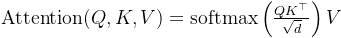

​	其中， 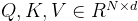，其中$N$是序列长度，$d$是每个注意力头的维度，输出可以记为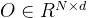。

​	注意力机制的式子可以拆分为三步。

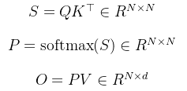

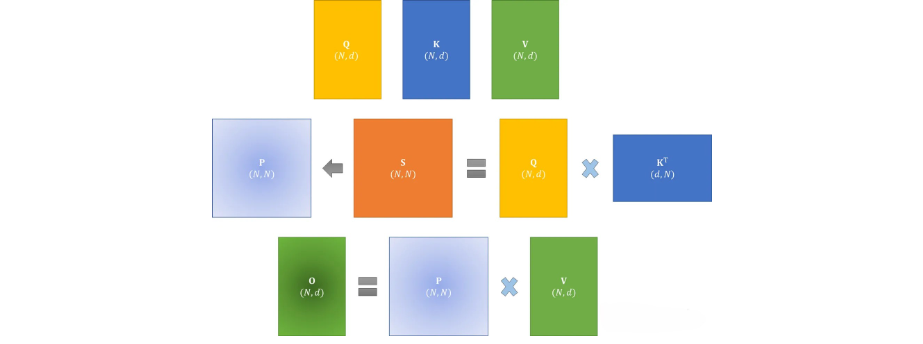

​	

​	在标准注意力实现中，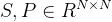都要写回到HBM中，占用了 $O(N²)$的内存，通常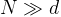。

​	尽管已经有许多近似注意力的方法尝试减少attention的计算和内存要求。例如，稀疏近似和低秩近似的方法，将计算复杂度降低到了序列长度的线性或亚线性但这些近似注意力方法方法并没有得到广泛应用。因为这些方法过于关注FLOPS(浮点数计算次数)的减少，而忽略了IO读写的内存访问开销，导致这并没有效减少运行时间(wall-clock time)
​	总之，在现代GPU中，计算速度已经远超过了显存访问速度，transformer中的大部分计算操作的瓶颈是显存访问。对于显存受限的操作，IO感知是非常重要的，因为显存读写占用了大部分的运行时间,GPU的内存由多个不同大小和不同读写速度的内存组成。内存越小，读写速度越快。对于A100-40GB来说，内存分级图如下所示
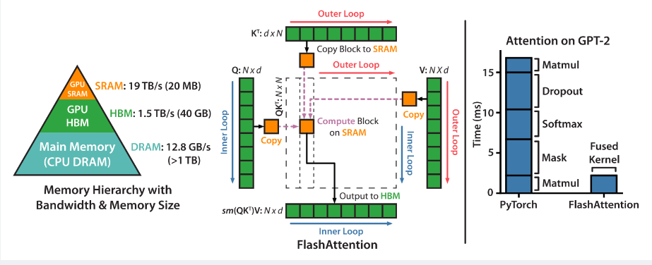

- SRAM内存分布在108个流式多处理器上，每个处理器的大小为192K，合计为$192*108KB=20736KM = 20MB$即计算块，但内存小。
- 高带宽内存HBM（High Bandwidth Memory），也就是我们常说的显存，大小为40GB。SRAM的读写速度为19TB/s，而HBM的读写速度只有1.5TB/s，不到SRAM的1/10,相当于计算慢，但内存大。

即标准注意力实现存在两个问题：

​	1.显存占用多，过程中由于实例化了完整的注意力矩阵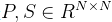，导致了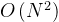的内存要求。
HBM读写次数多，减慢了运行时间(wall-clock time)
​	2.接下来下文的Memory-efficient Attention、Flash Attention，便是要分别解决上述这两个问题。

# 1 原始Attention实现过程

对于矩阵$Q,K,V∈R^{N\times d}存储在HBM$

1. **从HBM加载Q,K到SRAM**

 2. 计算出$S=QK^T$

 3. **将S写入到HBM**

 4. **将S加载到SRAM**

 5. 计算P=softmax(S)

 6. **将P写出到HBM**

 7. **从HBM加载P和V到SRAM**

 8. 计算$O=PV$

 9. **把O写出到HBM**

 10. 返回O

     

​	其中有许多变量存写的过程，而随着序列长度的N增长，缓存$N^2$的增长，而在反向传播过程中我们还是需要保留中间结果如$S,P$。

# 2 效率被约束的原因

​	而从图中我们可以到速度效率的受限主要集中在Memory-bound的受限。

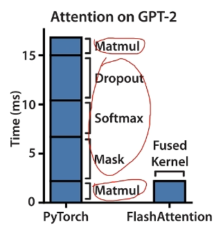

## Compute-bound:

​	计算受限，这一部分大都是计算所损耗的时间，如卷积运算等操作而损耗的时间。

## Memory-bound:

​	内存受限，其主要受限于内存的访问速度。如按位操作 ，Relu，Dropout，规约操作，Sum，Softmax等这些都是受限于内存的访问速度。

​	其优化一般是进行fusion融合操作，不对中间结果缓存，减少HBM的访问，但是在反向传播的时候需要用到中间结果，此时需要重新计算。

# 3 Memory-efficient Attention

​	其作用就是：**把显存复杂度从平方降低到线性，但HBM访问次数仍是平方**。

​	在注意力计算过程中，节省显存的主要挑战是softmax与$K,V$的列是耦合的，其方法是**单独计算softmax的归一化因子**，来实现解耦。

​	下方过程与原本的$QKV$计算的转置相反，但输出结果是一致的。

​	1. 记$Q$的第$i$列为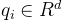，$K$的第$j$列为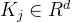，则有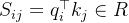。

​		定义softmax的归一化因子为：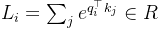。

​	2. 记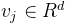为V的第$j$个列向量，则输出$O$的第$i$个列向量$o_i$为：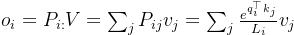

​	3. 这样在得到归一化因子$L_i$后，就可以通过反复累加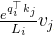来获得$O_i$。

​	节省显存的注意力机制将显存复杂度从$O(N²)$降低到了$O(N)$。

# 4 Flash Attention

​	这里先忽视Softmax层，来进行讲解。	

## 4.1 分块计算注意力tiling

​	通过kernel融合的方式，将多个操作融合为一个操作，利用高速的SRAM进行计算，可以减少读写HBM的次数，从而有效减少内存受限操作的运行时间。但有个问题是SRAM内存太小，因此我们需要分块来计算以满足SRAM内存。

​	tiling分块计算使得我们从HBM中加载输入数据，在SRAM中执行所有的计算操作(矩阵乘法、mask、softmax、dropout、矩阵乘法)，再将计算结果写回到HBM中。

​	下图是一个完整的Attention的流程图。

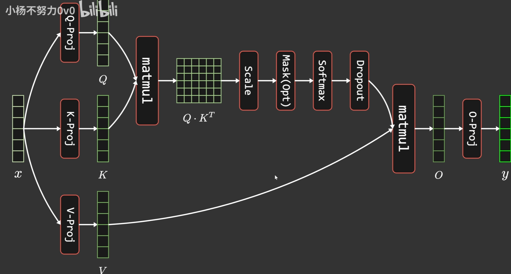

​	简单来说就是从HBM中取出Q,K,V的某一部分，然后保持K,V不动，循环仅拿取Q来进行计算，得出的结果直接放进O，且不将中间值存储，待Q一轮循环完毕后，再取出下一分块的K和V，然后再进行Q的循环以此来获取得到最终的O。

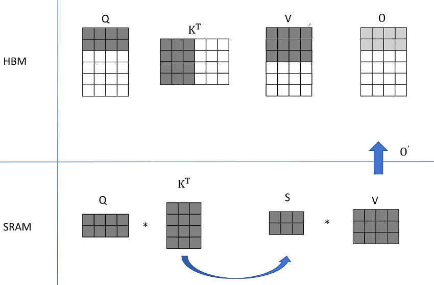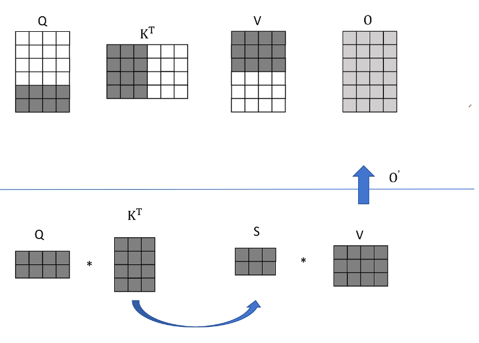

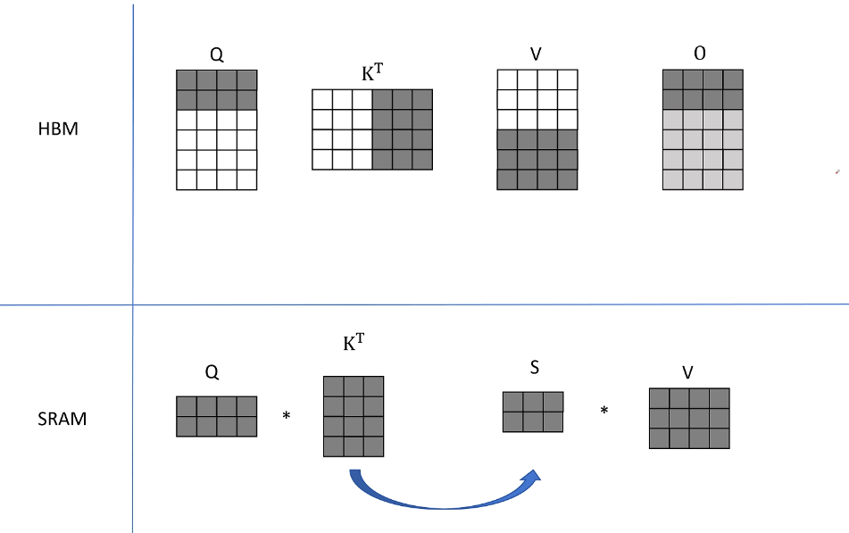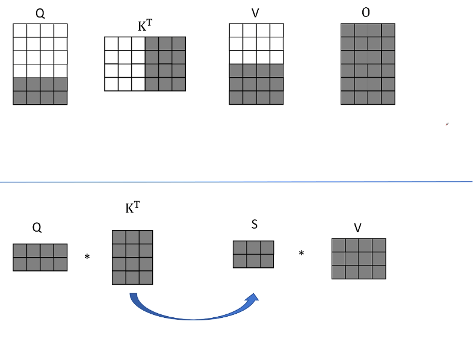

​	而Softmax比较特殊，由于**计算softmax的归一化因子(分母)时，需要获取到完整的输入数据**，进行分块计算的难度比较大。

## 4.2 Softmax

​	注意，$P=Softmax(S)$的S是一个$N \times N$的矩阵。

### safe softmax

​	在FP16下，最大可以表示65536,而在softmax层中，因为有e的幂指数的存在，这个值可能会大于65535，因此我们需要进行一定的缩放来使得其值大于0小于1。

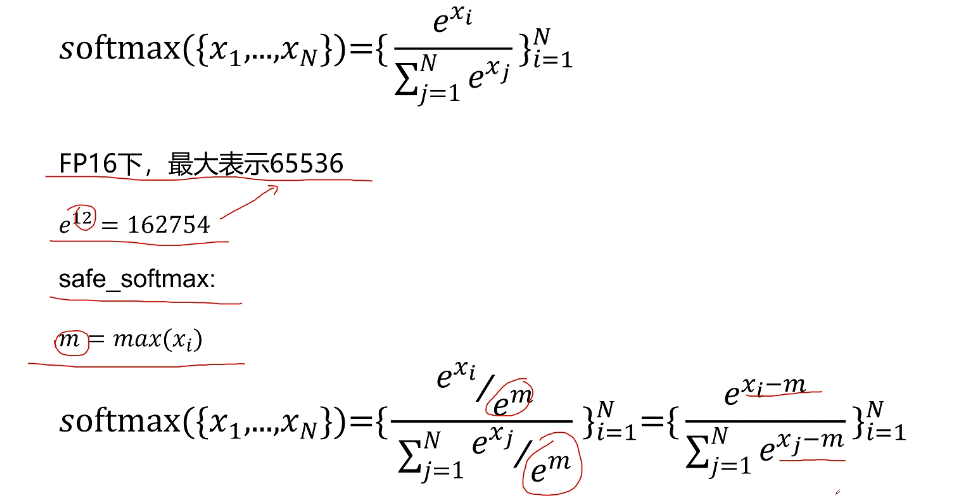

### 	softmax 分块

​	考虑到softmax与$K$的列是耦合的即softmax 操作的结果依赖于 ( K ) 矩阵的列向量，故可以通过引入了两个额外的统计量$m(x),l(x) $来进行解耦(**前者类似最大分数，后者类似exp分数总和**)，实现分块计算。

- 首先，模型训练会影响kernel融合的效果，在于在标准注意力实现中，为了后向传递计算$Q,K,V$的梯度时，前向计算时通常需要将某些中间结果(比如需要用到$N \times N$的中间矩阵$S,P$ )写回到HBM中，这会产生额外的HBM读写次数减慢运行时间。因此，Flash Attention要想办法避免为后向传递保存很大的中间结果矩阵。
- 进一步，Flash Attention的办法是重计算，即不保存$S,P$这两个矩阵，而只保存两个统计量$m(x),l(x)$
  ，后向传递时在高速的SRAM上快速地重新计算Attention，通过分块的方式重新计算注意力矩阵$S,P$。此举相比于标准注意力中“从HBM中读取很大的中间注意力矩阵”的方法，重计算的方法要快得多。
- Flash Attention通过调整注意力的计算顺序，引入两个额外的统计量进行分块计算，避免了实例化完整的$N \times N$的注意力矩阵，将显存复杂度从 $O(N^2)$降低到了 $O(N)$此外，对于内存受限的标准注意力，Flash Attention还通过kernel融合和分块计算，大量减少了HBM访问次数，尽管由于后向传递中的重计算增加了额外的计算量FLOPs，但总的来讲，最终还是减少了不少的运行时间，计算速度更快。

​	此处是将x按行分块以后（其目的是要得到分母的归一化），在计算后可以使用以下方法进行合并，如$P(x)$的计算，我们可以假设某一个分块后的为最大值，前面的权重要么为1，要么进行补偿即可复原。

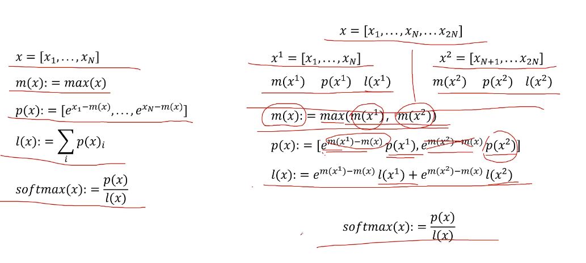

## 4.3 Flash Attention伪算法

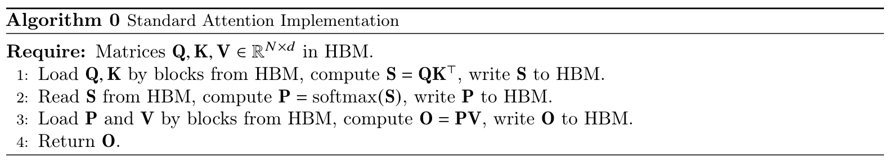

​	在忽略mask和dropout的情况下，简化分析，Flash Attention算法的前向计算过程如下所示

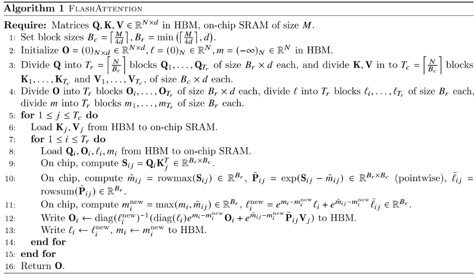

​	从上图可以看到，该算法在$K,V$的维度上做外循环，在  的维度上做内循环(而在[triton](https://link.zhihu.com/?target=https%3A//github.com/openai/triton/blob/main/python/tutorials/06-fused-attention.py)的代码实现中，则采用了在  的维度上做外循环，在$ K,V$ 的维度上做内循环)。

**以下是代码的详细解释：**
$$
1 :\text { Matrices } \mathbf{Q}, \mathbf{K}, \mathbf{V} \in \mathbb{R}^{N \times d} \text { in HBM, on-chip SRAM of size } M
$$
​	其中N为序列长度，d为每个注意力头的维度，SRAM的大小为M。

​	块的大小$B_{r}=\min \left(\left\lceil\frac{M}{4 d}\right\rceil, d\right), B_{c}=\left\lceil\frac{M}{4 d}\right\rceil$,此处除以$4d$是因为兼容Q,K,V,O四个向量（row行,column列）。

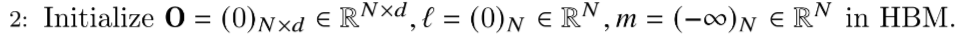

​	用全0初始化输出矩阵，它将作为一个累加器
​	$l$类似上文的$l(x)$，其目的是保存softmax的累积分母——exp分数的总和
​	$m$类似上文的$m(x)$其逐行保存最大分数，且初始化为-inf，因为我们将对其进行Max运算符，因此无论第一个块的Max是什么，它肯定大于-inf。

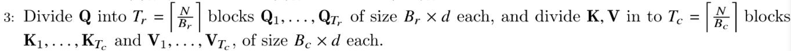

​	将Q,K,V分块，Q沿着行方向分为$T_r$块，每一块为$B_r \times d$；$K,V$沿着行方向分为$T_c$块，每一块为$B_c \times d$。

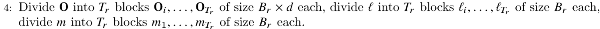

​	将$O,l,m$分块，其中$O与Q$的大小相同，沿着行方向分为$T_r$块，每一块为$B_r \times d$；向量$l和m$则分为$T_r$块，每一块子向量的大小为$B_r$。

其上方四个过程总结下来如下图所示。

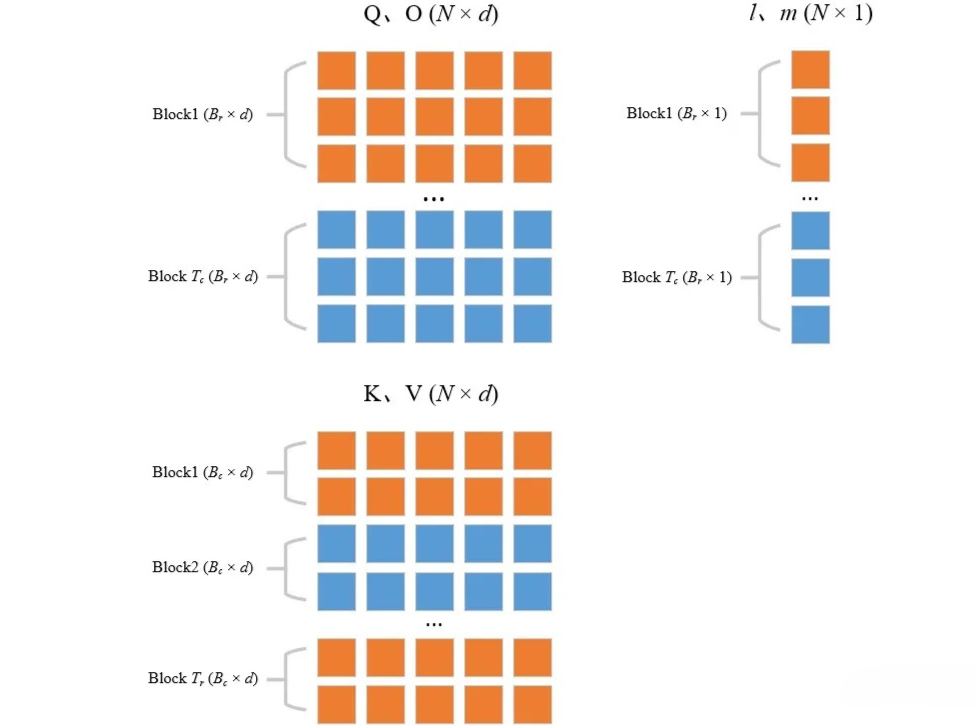
$$
5：for \   1 ≤ j ≤ T_c \ do
$$
​	开始跨列循环(外部循环，由$T_c$控制，从上一列到下一列)，即跨键/值向量，即遍历$K,V$，一共循环$T_{c}=2次$。在第一个版本中，即$K,V$先不动$Q$动,遍历完后重复上述过程。
$$
7：for \   1 ≤ i ≤ T_r \ do
$$
​	 开始跨行内部循环(从上一行到下一行)，即跨查询向量，一共循环$T_{r}=16$次，可只在遍历$Q,O,l,m$。

$$
9:On\ chip, compute \ \mathbf{S}_{i j}=\mathbf{Q}_{i} \mathbf{K}_{i}^{T} \in \mathbb{R}^{B_{r} \times B_{c}}
$$
​	**即为**$C_{64 \times 768}=A_{64 \times d} \times B_{d \times 768}$ 这一步计算$Q_i$($B_r \times d$)和$K_j(d \times B_c)$转置之间的点积。得到分块的Attention Score  $\mathbf{S}_{i j}=\mathbf{Q}_{i} \mathbf{K}_{i}^{T} \in \mathbb{R}^{B_{r} \times B_{c}}$，如下图所示。

当$j=0$，遍历$i$（$K,V$不变$Q$变）

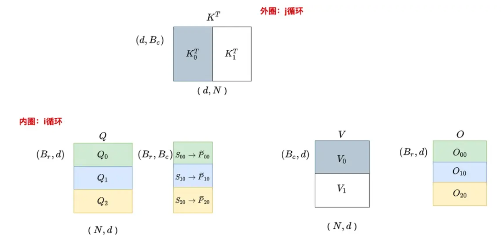

当$j=1$，遍历$i$（$K,V$不变$Q$变）

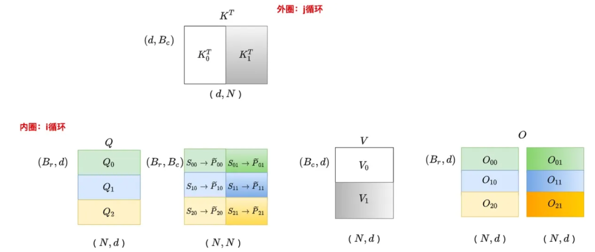
$$
10:On\ chip, compute\\
\tilde{m}_{i j}=\operatorname{rowmax}\left(\mathbf{S}_{i j}\right) \in \mathbb{R}^{B_{r}}\\
 \tilde{\mathbf{P}}_{i j}=\exp \left(\mathbf{S}_{i j}-\tilde{m}_{i j}\right) \in \mathbb{R}^{B_{r} \times B_{c}} \text { (pointwise) }\\
 \tilde{\ell}_{i j}= \operatorname{rowsum}\left(\tilde{\mathbf{P}}_{i j}\right) \in \mathbb{R}^{B_{r}}
$$
​	这一步也即是Safe Softmax的算法。
$$
11:On\ chip, compute\\
 m_{i}^{\text {new }}=\max \left(m_{i}, \tilde{m}_{i j}\right) \in \mathbb{R}^{B_{r}}\\
 \ell_{i}^{\text {new }}=e^{m_{i}-m_{i}^{\text {new }}} \ell_{i}+e^{\tilde{m}_{i j}-m_{i}^{\text {new }}} \tilde{\ell}_{i j} \in \mathbb{R}^{B_{r}}
$$
​	这一步是计算$m_{i}^{\text {new }}$和$\ell_{i}^{\text {new }}$，如下图所示。

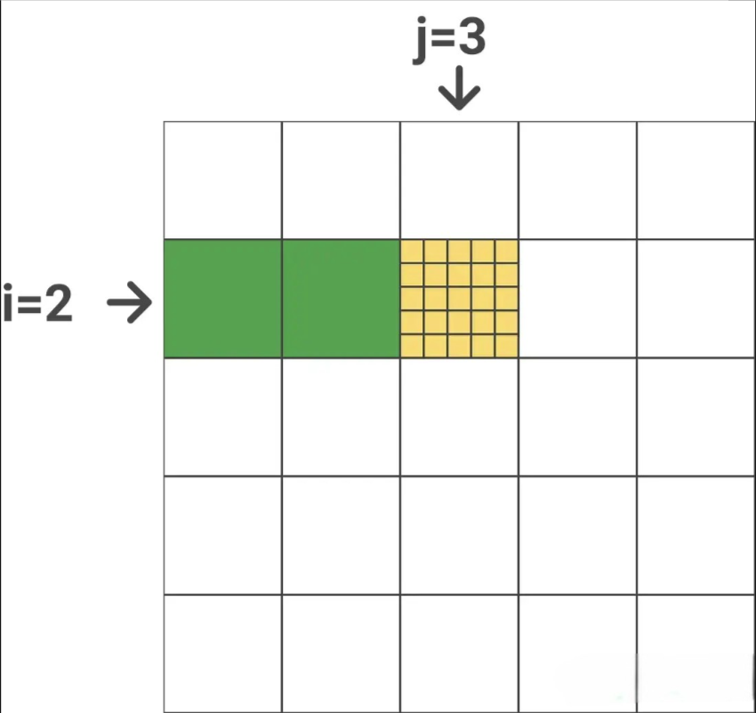

​	$m_{i}$包含之前所有块的逐行最大值($j=1 \& j=2$，用绿色表示)$\tilde{m}_{i j}$包含当前块的逐行最大值(用黄色表示)。为了得到$m_{i}^{\text {new }}$,我们只需要在$\tilde{m}_{i j}和m_{i}$之间取一个最大值,$\ell_{i}^{\text {new }}$类似。
$$
12:\mathbf{O}_{i} \leftarrow \operatorname{diag}\left(\ell_{i}^{\text {new }}\right)^{-1}\left(\operatorname{diag}\left(\ell_{i}\right) e^{m_{i}-m_{i}^{\text {new }}} \mathbf{O}_{i}+e^{\tilde{m}_{i j}-m_{i}^{\text {new }}} \tilde{\mathbf{P}}_{i j} \mathbf{V}_{j}\right) \text { to HBM }
$$
​	注意$l$（局部归一化分母）是一个向量，进行矩对角化后好计算，里面乘$diag(l_i)$是将之前计算得出的分块的$O$进行复原与新的相加再使用新的局部归一化分母$l_i^{new}$归一化，也即上方大体讲解的时候输出矩阵有浅变深的过程。

## 4.4 mask和dropout

给定输入$Q, K, V \in R^{N \times d}$，计算得到注意力输出$O^{N \times d}$。

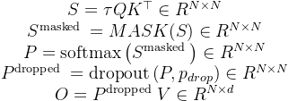

​	其中， $\tau$是softmax的缩放因子，典型的比如$\frac{1}{\sqrt{d_{k}}} $。MASK操作将输入中的某些元素置为 $−∞$ ，计算softmax后就变成了0，其他元素保持不变。

# 5 Flash Attention 2

​	对比上方的Flash Attention 1，其主要有以下几方面的改进。

- 减少了非矩阵的运算。
- 调整了内外循环，Q为外层训练，KV为内存循环，减少HMB的读写。
- 如果一个Block处于矩阵的上三角部分，也即被mask掉的部分，不进行Attention的计算。