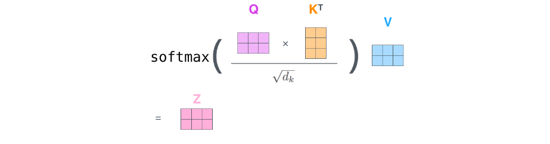
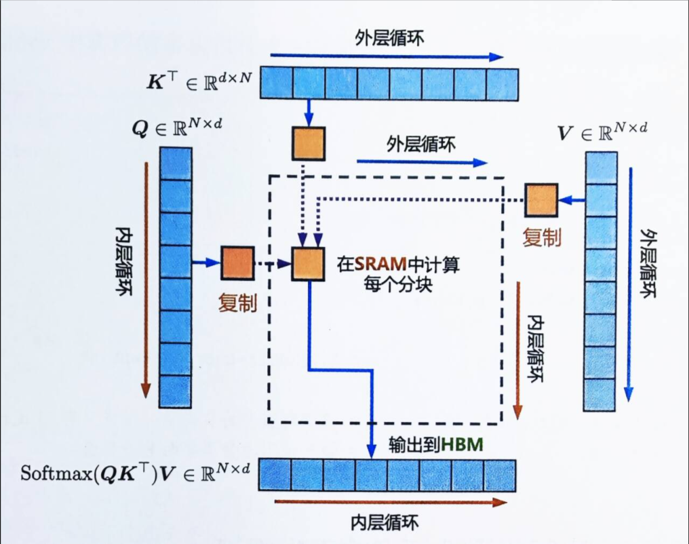
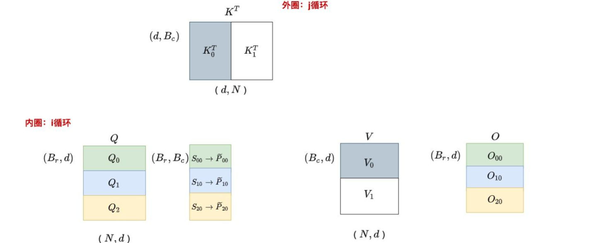

# 0 Standard Attention

**标准注意力Standard Attention的两个问题：显存占用多、HBM读写次数多**	

​	transformer中注意力机制的计算过程为：




​	其中， ，其中$N$是序列长度，$d$是每个注意力头的维度，输出可以记为。

​	注意力机制的式子可以拆分为三步。


​	

​	在标准注意力实现中，都要写回到HBM中，占用了 $O(N²)$的内存，通常。

​	尽管已经有许多近似注意力的方法尝试减少attention的计算和内存要求。例如，稀疏近似和低秩近似的方法，将计算复杂度降低到了序列长度的线性或亚线性但这些近似注意力方法方法并没有得到广泛应用。因为这些方法过于关注FLOPS(浮点数计算次数)的减少，而忽略了IO读写的内存访问开销，导致这并没有效减少运行时间(wall-clock time)
​	总之，在现代GPU中，计算速度已经远超过了显存访问速度，transformer中的大部分计算操作的瓶颈是显存访问。对于显存受限的操作，IO感知是非常重要的，因为显存读写占用了大部分的运行时间,GPU的内存由多个不同大小和不同读写速度的内存组成。内存越小，读写速度越快。对于A100-40GB来说，内存分级图如下所示


- SRAM内存分布在108个流式多处理器上，每个处理器的大小为192K，合计为$192*108KB=20736KM = 20MB$即计算块，但内存小。
- 高带宽内存HBM（High Bandwidth Memory），也就是我们常说的显存，大小为40GB。SRAM的读写速度为19TB/s，而HBM的读写速度只有1.5TB/s，不到SRAM的1/10,相当于计算慢，但内存大。

即标准注意力实现存在两个问题：

​	1.显存占用多，过程中由于实例化了完整的注意力矩阵，导致了的内存要求。
HBM读写次数多，减慢了运行时间(wall-clock time)
​	2.接下来下文的Memory-efficient Attention、Flash Attention，便是要分别解决上述这两个问题。

# 1 原始Attention实现过程

对于矩阵$Q,K,V∈R^{N\times d}存储在HBM$

1. **从HBM加载Q,K到SRAM**

 2. 计算出$S=QK^T$

 3. **将S写入到HBM**

 4. **将S加载到SRAM**

 5. 计算P=softmax(S)

 6. **将P写出到HBM**

 7. **从HBM加载P和V到SRAM**

 8. 计算$O=PV$

 9. **把O写出到HBM**

 10. 返回O

     

​	其中有许多变量存写的过程，而随着序列长度的N增长，缓存$N^2$的增长，而在反向传播过程中我们还是需要保留中间结果如$S,P$。

# 2 效率被约束的原因

​	而从图中我们可以到速度效率的受限主要集中在Memory-bound的受限。


## Compute-bound:

​	计算受限，这一部分大都是计算所损耗的时间，如卷积运算等操作而损耗的时间。

## Memory-bound:

​	内存受限，其主要受限于内存的访问速度。如按位操作 ，Relu，Dropout，规约操作，Sum，Softmax等这些都是受限于内存的访问速度。

​	其优化一般是进行fusion融合操作，不对中间结果缓存，减少HBM的访问，但是在反向传播的时候需要用到中间结果，此时需要重新计算。

# 3 Memory-efficient Attention

​	其作用就是：**把显存复杂度从平方降低到线性，但HBM访问次数仍是平方**。

​	在注意力计算过程中，节省显存的主要挑战是softmax与$K,V$的列是耦合的，其方法是**单独计算softmax的归一化因子**，来实现解耦。

​	下方过程与原本的$QKV$计算的转置相反，但输出结果是一致的。

​	1. 记$Q$的第$i$列为，$K$的第$j$列为，则有。

​		定义softmax的归一化因子为：。

​	2. 记为V的第$j$个列向量，则输出$O$的第$i$个列向量$o_i$为：

​	3. 这样在得到归一化因子$L_i$后，就可以通过反复累加来获得$O_i$。

​	节省显存的注意力机制将显存复杂度从$O(N²)$降低到了$O(N)$。

# 4 Flash Attention

​	这里先忽视Softmax层，来进行讲解。	

## 4.1 分块计算注意力tiling

​	通过kernel融合的方式，将多个操作融合为一个操作，利用高速的SRAM进行计算，可以减少读写HBM的次数，从而有效减少内存受限操作的运行时间。但有个问题是SRAM内存太小，因此我们需要分块来计算以满足SRAM内存。

​	tiling分块计算使得我们从HBM中加载输入数据，在SRAM中执行所有的计算操作(矩阵乘法、mask、softmax、dropout、矩阵乘法)，再将计算结果写回到HBM中。

​	下图是一个完整的Attention的流程图。


​	简单来说就是从HBM中取出Q,K,V的某一部分，然后保持K,V不动，循环仅拿取Q来进行计算，得出的结果直接放进O，且不将中间值存储，待Q一轮循环完毕后，再取出下一分块的K和V，然后再进行Q的循环以此来获取得到最终的O。


​	而Softmax比较特殊，由于**计算softmax的归一化因子(分母)时，需要获取到完整的输入数据**，进行分块计算的难度比较大。

### 公式解释

​	标准的SoftMax如下所示。
$$
1.S=Q K^{\top} \in R^{N \times N}\\
2.P=\operatorname{softmax}(S) \in R^{N \times N}\\
3.O=P V \in R^{N \times d}\\
4.\operatorname{softmax}\left(x_{i}\right)=\frac{e^{x_{i}}}{\sum_{j=1}^{d} e^{x_{j}}}
$$

$$
5.m(x)=\max \left(\left[x_{1}, x_{2}, \ldots, x_{d}\right]\right)
$$

 $m(x)$被定义为$\left[x_{1}, x_{2}, \cdots, x_{d}\right]$中的最大值。
$$
6.\quad f(x) =\left[\begin{array}{lll} e^{x_{1}-m(x)} & \ldots & e^{x_{d}-m(x)} \end{array}\right]
$$
​	$f(x)$是一个新的向量，其中每一项相当于在「公式4的标准softmax的分子即$e^{x_i}$」的每一项的基础上，在其指数项$x_i$中减去了一个$\left[x_{1}, x_{2}, \cdots, x_{d}\right]$中的最大值$m(x)$,即防止数值溢出的问题。
$$
7.\quad \ell(x) = \sum_{i} f(x)_{i}
$$
$\quad \ell(x)$是「**变体softmax分母**」中的求和项，为了方便后续的描述，也即“**EXP求和项**”。
$$
8.\quad \operatorname{softmax}(x):=\frac{f(x)}{\ell(x)} =\frac{\left[\begin{array}{lll} e^{x_{1}-m(x)} & \ldots & e^{x_{d}-m(x)} \end{array}\right]}{\sum_{i} f(x)_{i}}
$$
​	那么理论上$softmax$的计算方式如上图所示，下方我们将进行分块计算。

​	考虑一个大小为2d的向量 $x \in \mathbb R^{2d}$，将其“一切为二”进行分块：$x=[x^{(1)},x^{(2)}]$,其中 $x^{(1)},x^{(2)} \in \mathbb R^d$。
​	换言之，子向量$x^{(1)}$是原向量 x 的前半部分，子向量$x^{(2)}$是原向量$ x $的后半部分假,设在分块计算中先处理 $x^{(1)}$，再处理 $x^{(2)}$
​	那就先使用公式5至公式8对子向量$x^{(1)}$计算它的“局部$\mathrm {softmax}$”，计算过程如下公式9-12所示。
$$
9.m\left(x^{(1)}\right)=\max \left(\left[x_{1}^{(1)}, x_{2}^{(1)}, \ldots, x_{d}^{(1)}\right]\right)\\
10.f\left(x^{(1)}\right)=\left[e^{x_{1}^{(1)}-m\left(x^{(1)}\right)}, \ldots, .e^{x_{d}^{(1)}-m\left(x^{(1)}\right)}\right]\\
11.l\left(x^{(1)}\right)=\sum_{i} f\left(x^{(1)}\right)_{i}\\
12.\operatorname{softmax}\left(x^{(1)}\right)=\frac{f\left(x^{(1)}\right)}{l\left(x^{(1)}\right)}
$$
​	很明显，至此得到的$\operatorname{softmax}\left(x^{(1)}\right)$并不能算是子向量$x^{(1)}$的最终结果，原因有下。

- 公式10中的指数项减去的最大值应该是整个向量$x$的最大值$m(x)$，而不应该是子向量$x^{(1)}$的最大值$m\left(x^{(1)}\right)$

- 公式12中分母的EXP求和项应该是关于整个向量x的求和项，而非仅仅只是子向量$x^{(1)}$中所有元素的求和项
  正因上述计算得到的$ \mathrm {softmax} (x^{(1)}) $不是最终结果，所以将其称为“局部的”。

​	接下来将介绍通过保存额外的一些变量值，在处理完 $x^{(2)}$ 后更新$ x^{(1)}$ 的$\mathrm {softmax}$ 值的方法
​	首先，在处理完子向量$x^{(1)}$ 后，保存 $m(x^{(1)})$和$ l(x^{(1)})$，相比于保存整个子向量$x^{(1)}$，仅保存这两个标量的开销要小的多。
  其次，还需要保存两个全局标量：$m_{max}$ 和$ l_{all}$
  $m_{max} $为当前最大值,  $l_{all}$为全局EXP求和项,目前只处理完了$x^{(1)}$，所以暂时：$m_{max}=m(x^{(1)}),l_{all}=l(x^{(1)})$。
  接着采用类似处理 $x^{(1)}$ 的方法来处理$x^{(2)}$，可得如下结果,与处理$x^{(1)}$几乎一模一样：
$$
13.m\left(x^{(2)}\right)=\max \left(\left[x_{1}^{(2)}, x_{2}^{(2)}, \ldots, x_{d}^{(2)}\right]\right)\\
14.f\left(x^{(2)}\right)=\left[e^{x_{1}^{(2)}-m\left(x^{(2)}\right)}, \ldots, e^{x_{d}^{(2)}-m\left(x^{(2)}\right)}\right]\\
15.l\left(x^{(2)}\right)=\sum_{i} f\left(x^{(2)}\right)_{i}\\
16.\operatorname{softmax}\left(x^{(2)}\right)=\frac{f\left(x^{(2)}\right)}{l\left(x^{(2)}\right)}
$$
​	同理，此时公式16得到的$softmax$也是局部而非全局的但,在处理完$ x^{(2)}$之后，可以利用$x^{(2)}$的信息来更新之前保存的两个全局标量$ m_{max} (m_{max}=m(x^{(1)}))$和 $l_{all}(l_{all}=l(x^{(1)}))$，如下公式17和18所示：
$$
17.m_{m a x}^{n e w}=\max \left(\left[m_{\max }, m\left(x^{(2)}\right)\right]\right)
$$
​	更新后的全局最大值就是「之前的最大值 $m_{max}$」和「 $x^{(2)}$ 的最大值$m\left(x^{(2)}\right)$」中更大的那一个。
$$
18.l_{\text {all }}^{n e w}=e^{m_{\max }-m_{\max }^{\text {new }}} l_{\text {all }}+e^{m_{x^{(2)}}-m_{\max }^{n e w}} l\left(x^{(2)}\right)\\
l_{\text {all }}^{n e w}=e^{m(x^{(1)})-m_{\max }^{\text {new }}} l(x^{(1)})+e^{m_{x^{(2)}}-m_{\max }^{n e w}} l\left(x^{(2)}\right)
$$
​	此处的$m_{max}=m(x^{(1)})$, $l_{all}(l_{all}=l(x^{(1)}))$，上式两个$m_x，1或者2$是同一个意思，懒得改格式了。

​	简单来说就是$l(x^{(1)})和l(x^{(2)})$在计算的时候$m_{max}$并没有更新，而此时的$m_{m a x}^{n e w}$必然等于$m(x^{(1)}或m(x^{(2)})$，加设值即可，里面必然有一个$e^0$和一个可看作补偿值的东西。

​	公式18是更新的全局EXP求和项的方法，此处并非是$l_{\text {all }}^{n e w}=l_{\text {all }}+l\left(x^{(2)}\right)$, 以$l(x^{(2)})$为例($l(x^{(1)})$同理)， 我们说$l(x^{(2)})$是“局部的”是因为$l(x^{(2)}) $到目前为止只用到了$x^{(2)}$的信息， 将 $l(x^{(2)})$更新至“全局”需要用到$m^{new}_{max}$，把$l(x^{(2)})$的计算公式15即$l\left(x^{(2)}\right)=\sum_{i} f\left(x^{(2)}\right)_{i}$中的$f(x^{(2)})$稍微展开可得：$l\left(x^{(2)}\right)=\sum_{i} e^{x_{i}^{(2)}-m\left(x^{(2)}\right)}$,将其带入到公式18中即可得到:
$$
\begin{aligned} l^{\text {new }}\left(x^{(2)}\right) & =l\left(x^{(2)}\right) \cdot e^{m\left(x^{(2)}\right)-m_{\text {max }}^{\text {new }}} \\ & =\sum_{i} e^{x_{i}^{(2)}-m\left(x^{(2)}\right)} \cdot e^{m\left(x^{(2)}\right)-m_{m a x}^{\text {new }}} \\ & =\sum_{i} e^{x_{i}^{(2)}-m_{\text {max }}^{\text {new }}} \end{aligned}
$$
​	此时的$l(x^{(2)})$ 更新为了：“全局的”,这个公式说明，当需要把某个$l $更新为“全局的”时，只要将其乘以一个项：$e^{m - m^{new}_{max}}$，其中$ m $表示当前$l$对应的最大值，$ m^{new}_{max} $ 表示当前最大值。
$$
23.\operatorname{softmax}^{(n e w)}\left(x^{(2)}\right)=\frac{\operatorname{softmax}\left(x^{(2)}\right) \cdot l\left(x^{(2)}\right) \cdot e^{m\left(x^{(2)}\right)-m_{\text {max }}^{\text {new }}}}{l_{\text {all }}^{\text {new }}}
$$

- $x^{(2)}$的局部$\mathrm {softmax}值\mathrm {softmax} (x^{(2)})$，来自公式16
- $x^{(2)}$ 的局部EXP求和项$l(x^{(2)})$，来自公式15
- $x^{(2)}$ 的局部最大值$m(x^{(2)})$，来自公式13
- 全局最大值$m^{new}_{max}$，来自公式17
- 全局EXP求和项$l^{new}_{all}$，来自公式18

​	回到公式18，可知其首先用了这种全局更新方法分别将$l_{all}与l(x^{(2)})$更新至全局，然后将它们求和得到当前的EXP求和项，因此基于上述更新$l$的方法，也能直接更新softmax值。

​	根据公式16：$\operatorname{softmax}\left(x^{(2)}\right)=\frac{f\left(x^{(2)}\right)}{l\left(x^{(2)}\right)}$，可知${f\left(x^{(2)}\right)} = \operatorname{softmax}\left(x^{(2)}\right) \times {l\left(x^{(2)}\right)}$，但是由于当前的分子和分母都是局部的，因此我们需要更新至全局，

​	对于分子部分$f\left(x^{(2)}\right)=\left[e^{x_{1}^{(2)}-m\left(x^{(2)}\right)}, \ldots, e^{x_{d}^{(2)}-m\left(x^{(2)}\right)}\right]$，可将其做下更新：
$$
\begin{aligned} f^{n e w}\left(x^{(2)}\right) & =f\left(x^{(2)}\right) \cdot e^{m\left(x^{(2)}\right)-m_{m a x}^{n e w}} \\ & =\left[e^{x_{1}^{(2)}-m\left(x^{(2)}\right)}, \ldots, e^{x_{d}^{(2)}-m\left(x^{(2)}\right)}\right] \cdot e^{m\left(x^{(2)}\right)-m_{m a x}^{\text {new }}} \\ & =\left[e^{x_{1}^{(2)}-m_{m a x}^{n e w}}, \ldots, e^{x_{d}^{(2)}-m_{m a x}^{n e w}}\right] \end{aligned}
$$
​	再分母部分$l(x^{(2)})$，我们其实只需要将分母由$l(x^{(2)})$替换为$ l^{new}_{all}$ 即可。

​	同理，可以将上面前三项中的$x^{(2)} $替换成$x^{(1)} $来对$ x^{(1)}$ 的 $\mathrm {softmax}$值进行更新，所有更新过程都不需要用到 $x^{(1)}或 x^{(2)}$ 的向量值。

## 4.2 Softmax

​	注意，$P=Softmax(S)$的S是一个$N \times N$的矩阵。

### safe softmax

​	在FP16下，最大可以表示65536,而在softmax层中，因为有e的幂指数的存在，这个值可能会大于65535，因此我们需要进行一定的缩放来使得其值大于0小于1。


### 	softmax 分块

​	考虑到softmax与$K$的列是耦合的(即softmax 操作的结果依赖于 ( K ) 矩阵的列向量)，故可以通过引入两个额外的统计量$m(x),l(x) $来进行解耦(**前者类似最大分数，后者类似exp分数总和**)，实现分块计算。

- 模型训练会影响kernel融合的效果，在标准注意力实现中，为了反向传递计算$Q,K,V$的梯度时，前向计算时通常需要将某些中间结果(比如需要用到$N \times N$的中间矩阵$S,P$ )写回到HBM中，这会产生额外的HBM读写次数减慢运行时间。因此，Flash Attention要想办法避免为后向传递保存很大的中间结果矩阵。
- Flash Attention利用重计算，即不保存$S,P$这两个矩阵，而只保存两个统计量$m(x),l(x)$，反向传递时在高速的SRAM上快速地重新计算Attention，通过分块的方式重新计算注意力矩阵$S,P$。相比于标准注意力中“从HBM中读取很大的中间注意力矩阵”的方法，重计算的方法要快得多。
- Flash Attention通过调整注意力的计算顺序，引入两个额外的统计量进行分块计算，避免实例化完整的$N \times N$的注意力矩阵，将显存复杂度从 $O(N^2)$降低到了 $O(N)$，对于内存受限的标准注意力，Flash Attention还通过kernel融合和分块计算，大量减少了HBM访问次数。

​	此处是将x按行分块以后（其目的是要得到分母的归一化），在计算后可以使用以下方法进行合并，如$P(x)$的计算，我们可以假设某一个分块后的为最大值，前面的权重要么为1，要么进行补偿即可复原。


## 4.3 Forward


​	在忽略mask和dropout的情况下，简化分析，Flash Attention算法的前向计算过程如下所示


​	从上图可以看到，该算法在$K,V$的维度上做外循环，在  的维度上做内循环(而在[triton](https://link.zhihu.com/?target=https%3A//github.com/openai/triton/blob/main/python/tutorials/06-fused-attention.py)的代码实现中，则采用了在  的维度上做外循环，在$ K,V$ 的维度上做内循环)。

**以下是代码的详细解释：**
$$
1 :\text { Matrices } \mathbf{Q}, \mathbf{K}, \mathbf{V} \in \mathbb{R}^{N \times d} \text { in HBM, on-chip SRAM of size } M
$$
​	其中N为序列长度，d为每个注意力头的维度，SRAM的大小为M。

​	块的大小$B_{r}=\min \left(\left\lceil\frac{M}{4 d}\right\rceil, d\right), B_{c}=\left\lceil\frac{M}{4 d}\right\rceil$,此处除以$4d$是因为兼容Q,K,V,O四个向量（row行,column列）。


​	用全0初始化输出矩阵，它将作为一个累加器
​	$l$类似上文的$l(x)$，其目的是保存softmax的累积分母——exp分数的总和
​	$m$类似上文的$m(x)$其逐行保存最大分数，且初始化为-inf，因为我们将对其进行Max运算符，因此无论第一个块的Max是什么，肯定大于-inf。


​	将Q,K,V分块，Q沿着行方向分为$T_r$块，每一块为$B_r \times d$；$K,V$沿着行方向分为$T_c$块，每一块为$B_c \times d$。


​	将$O,l,m$分块，其中$O与Q$的大小相同，沿着行方向分为$T_r$块，每一块为$B_r \times d$；向量$l和m$则分为$T_r$块，每一块子向量的大小为$B_r$。

其上方四个过程总结下来如下图所示。


$$
5：for \   1 ≤ j ≤ T_c \ do
$$
​	开始跨列循环(外部循环，由$T_c$控制，从上一列到下一列)，即跨键/值向量，即遍历$K,V$，一共循环$T_{c}=2次$。在第一个版本中，即$K,V$先不动$Q$动,遍历完后重复上述过程。
$$
7：for \   1 ≤ i ≤ T_r \ do
$$
​	 开始跨行内部循环(从上一行到下一行)，即跨查询向量，一共循环$T_{r}=16$次，可只在遍历$Q,O,l,m$。


$$
9:On\ chip, compute \ \mathbf{S}_{i j}=\mathbf{Q}_{i} \mathbf{K}_{i}^{T} \in \mathbb{R}^{B_{r} \times B_{c}}
$$
​	**即为**$C_{64 \times 768}=A_{64 \times d} \times B_{d \times 768}$ 这一步计算$Q_i$($B_r \times d$)和$K_j(d \times B_c)$转置之间的点积。得到分块的Attention Score  $\mathbf{S}_{i j}=\mathbf{Q}_{i} \mathbf{K}_{i}^{T} \in \mathbb{R}^{B_{r} \times B_{c}}$，如下图所示。

当$j=0$，遍历$i$（$K,V$不变$Q$变）


当$j=1$，遍历$i$（$K,V$不变$Q$变）


$$
10:On\ chip, compute\\
\tilde{m}_{i j}=\operatorname{rowmax}\left(\mathbf{S}_{i j}\right) \in \mathbb{R}^{B_{r}}\\
 \tilde{\mathbf{P}}_{i j}=\exp \left(\mathbf{S}_{i j}-\tilde{m}_{i j}\right) \in \mathbb{R}^{B_{r} \times B_{c}} \text { (pointwise) }\\
 \tilde{\ell}_{i j}= \operatorname{rowsum}\left(\tilde{\mathbf{P}}_{i j}\right) \in \mathbb{R}^{B_{r}}
$$
​	这一步也即是Safe Softmax的算法。
$$
11:On\ chip, compute\\
 m_{i}^{\text {new }}=\max \left(m_{i}, \tilde{m}_{i j}\right) \in \mathbb{R}^{B_{r}}\\
 \ell_{i}^{\text {new }}=e^{m_{i}-m_{i}^{\text {new }}} \ell_{i}+e^{\tilde{m}_{i j}-m_{i}^{\text {new }}} \tilde{\ell}_{i j} \in \mathbb{R}^{B_{r}}
$$
​	这一步是计算$m_{i}^{\text {new }}$和$\ell_{i}^{\text {new }}$，如下图所示。


​	$m_{i}$包含之前所有块的逐行最大值($j=1 \& j=2$，用绿色表示)$\tilde{m}_{i j}$包含当前块的逐行最大值(用黄色表示)。为了得到$m_{i}^{\text {new }}$,我们只需要在$\tilde{m}_{i j}和m_{i}$之间取一个最大值,$\ell_{i}^{\text {new }}$类似。
$$
12:\mathbf{O}_{i} \leftarrow \operatorname{diag}\left(\ell_{i}^{\text {new }}\right)^{-1}\left(\operatorname{diag}\left(\ell_{i}\right) e^{m_{i}-m_{i}^{\text {new }}} \mathbf{O}_{i}+e^{\tilde{m}_{i j}-m_{i}^{\text {new }}} \tilde{\mathbf{P}}_{i j} \mathbf{V}_{j}\right) \text { to HBM }
$$
​	注意$l$（局部归一化分母）是一个向量，进行矩对角化后好计算，里面乘$diag(l_i)$是将之前计算得出的分块的$O$进行复原与新的相加再使用新的局部归一化分母$l_i^{new}$归一化，也即上方大体讲解的时候输出矩阵有浅变深的过程。

### 4.3.1 mask和dropout

给定输入$Q, K, V \in R^{N \times d}$，计算得到注意力输出$O^{N \times d}$。


​	其中， $\tau$是softmax的缩放因子，典型的比如$\frac{1}{\sqrt{d_{k}}} $。MASK操作将输入中的某些元素置为 $−∞$ ，计算softmax后就变成了0，其他元素保持不变。

## 4.4 Bckward流程

### 4.4.1 softmax求导

​	设$$\left\{\begin{matrix} \begin{aligned}  y &= softmax(z)\\  L &= f(y) \end{aligned} \end{matrix}\right.$$其中，$ L$ 表示Loss，$ f(.) $表示Loss函数，$$y = \begin{bmatrix} y_{1}&y_{2}&y_{3} \end{bmatrix}$$ ，$$z = \begin{bmatrix} z_{1}&z_{2}&z_{3} \end{bmatrix}$$ ，若现在我们想求$$\frac{\partial L}{\partial z_{j}}$$，那么根据链式法则，有$\frac{\partial L}{\partial z_{j}} = \frac{\partial L}{\partial y}\frac{\partial y}{\partial z_{j}}$。

​	1.对于$\frac{\partial L}{\partial y}$我们现在不考虑具体的Loss函数，直接假设这一项的结果为$\begin{bmatrix}   m_{1}&m_{2}&m_{3} \end{bmatrix}$。

​	2.对于$\frac{\partial y}{\partial z_{j}}$来说，对于某个$z_{j}$来说，在softmax的操作下，它参与了$y_{1}, y_{2}, y_{3}$三者的计算，因此它的偏导也和这三者密切相关，这里我们分成两种情况：

​		对于softmax其定义如下：
$$
\operatorname{softmax}\left(x_{i}\right)=\frac{e^{x_{i}}}{\sum_{j=1}^{d} e^{x_{j}}}
$$
​		因此我们分为$i=j和i≠j$。

​		例如求 $S_{1}$对$X_{1}$的导数：(相当于与$ i = j$情况)


​		对于$i≠j$的情况。

​		从softmax公式的分母可知，分母包括了$e^{x1}，e^{x2}，……，e^{xj}$，所以任何一个输出节点$ S_{i}$都要对所有$x$ 进行求导，如：求 $s_1$ 对 $x_2$ 的导数:


​		所以可以得到，$i=j 时 和 i ≠ j $时的 softmax导数如下：
$$
\left\{\begin{matrix} \begin{aligned}  \frac{\partial y_{i}}{\partial z_{j}} &= y_{i}(1-y_{i})，当i=j\\ \frac{\partial y_{i}}{\partial z_{j}} &= -y_{i}y_{j}，\qquad当i\neq j \end{aligned} \end{matrix}\right.
$$
​		根据这个结果，我们有： $\frac{\partial y}{\partial z_{j}} = \sum_{i=1}^{l}\frac{\partial y_{i}}{\partial z_{j}}$(因为$y_i,i=3$,$y$有3个)。这里$ l $代表向量中一共有几个要素，例如在本例中，$ l=3$ 。假设我们现在要求 $\frac{\partial y}{\partial z_{1}}$ ，则根据上述公式，我们有:
$$
\frac{\partial y}{\partial z_{1}} = y_{1}(1-y_{1}) - y_{2}y_{1} - y_{3}y_{1}
$$
​		有了这个理解，我们再来谈谈基于$y= softmax(z)$ 的Jacobian矩阵 $diag(y) - y^{T}y$:
$$
\begin{aligned}  diag(y) - y^{T}y &= \begin{bmatrix}   y_{1}&0&0 \\   0&y_{2}&0 \\   0&0&y_{3} \end{bmatrix}-\begin{bmatrix}  y_{1}\\y_{2}\\y_{3} \end{bmatrix}*\begin{bmatrix}   y_{1}&y_{2}&y_{3} \end{bmatrix}\\ &=\begin{bmatrix}   y_{1}-y_{1}^{2}&-y_{1}y_{2}&-y_{1}y_{3} \\   -y_{2}y_{1}&y_{2}-y_{2}^{2}&-y_{2}y_{3} \\   -y_{3}y_{1}&-y_{3}y_{2}&y_{3}-y_{3}^{2} \end{bmatrix} \end{aligned} 
$$
​		很容易发现只要把每行/每列相加，就能得到对应$z$的偏导。

3.$\frac{\partial L}{\partial z_{j}} = \frac{\partial L}{\partial y}\frac{\partial y}{\partial z_{j}}$

​	有了（1）（2）的结果，现在就可以来推导$\frac{\partial L}{\partial z_{j}}$，我们有： $\frac{\partial L}{\partial z_{j}} = \frac{\partial L}{\partial y}\frac{\partial y}{\partial z_{j}} =\sum_{i=1}^{l}\frac{\partial L}{\partial y_{i}}\frac{\partial y_{i}}{\partial z_{j}} = y_{j}(\mathrm{d}y_{j}-\sum_{j=1}^{l}y_{j}dy_{j}) $(最后一个等式没看懂!)。

​	举个例子，若我们现在想求 $\frac{\partial L}{\partial z_{1}}$ ，我们将 $\frac{\partial L}{\partial y} = \begin{bmatrix}   m_{1}&m_{2}&m_{3} \end{bmatrix}$ 代入上面公式，则有：$\frac{\partial L}{\partial z_{1}} = m_{1}(y_{1}-y_{1}^{2}) - m_{2}y_{1}y_{2} - m_{3}y_{1}y_{3}$

​	现在，针对所有的 $z$ ，我们将 $\frac{\partial L}{\partial z}$ 写成矩阵表达式有：
$$
\begin{aligned} \frac{\partial L}{\partial z} &=\frac{\partial L}{\partial y}\frac{\partial y}{\partial z} =\mathrm{d}y(diag(y) - y^{T}y)\\ &=\begin{bmatrix}   m_{1}&m_{2}&m_{3} \end{bmatrix}(\begin{bmatrix}   y_{1}&0&0 \\   0&y_{2}&0\\   0&0&y_{3} \end{bmatrix} - \begin{bmatrix}   y_{1}\\y_{2}\\y_{3} \end{bmatrix}\begin{bmatrix}   y_{1}&y_{2}&y_{3} \end{bmatrix}))\\ &=\begin{bmatrix}   m_{1}&m_{2}&m_{3} \end{bmatrix}\begin{bmatrix}   y_{1}-y_{1}^{2}&-y_{1}y_{2}&-y_{1}y_{3} \\   -y_{2}y_{1}&y_{2}-y_{2}^{2}&-y_{2}y_{3} \\   -y_{3}y_{1}&-y_{3}y_{2}&y_{3}-y_{3}^{2} \end{bmatrix} \end{aligned}
$$
​	**记住这两个重要的结论：**此处的$y$其实和$p$的效果差不多，是一个$softmax$，上方有定义。
$$
\begin{aligned} \frac{\partial L}{\partial z} &=\frac{\partial L}{\partial y}\frac{\partial y}{\partial z} =\mathrm{d}y(diag(y) - y^{T}y)\\ \frac{\partial L}{\partial z_{j}} &= y_{j}(\mathrm{d}y_{j}-\sum_{j=1}^{l}y_{j}dy_{j})  \end{aligned}
$$

### 4.4.2 分块backward计算

​	显存（HBM）上存储的数据：

- $m$：全局rowmax

- $l$ ：全局rowsum

- $Q,K,V$ ：等同于标准attention场景下的结果

- $O$ ：等同于标准attention场景下的输出结果 O

- $dO$ ：有了完整的 O ，我们就可以按正常的backward步骤先求出它的梯度，也存放在显存上。然后我们就能按照链式法则，分块地去求别的矩阵的梯度了。

​	既然有了全局的 $m,l$ ，那么现在对于任意一块 $S_{ij}$ ，我们就能基于$m,l$算出和标准场景下完全一致的 $P_{ij}$ 了。在backward的过程中，flash attention将采用**重计算**的方式，**重新算出 $S_{ij}, P_{ij}$，并将它们运用到backward的计算中去，所以接下来，可以把 S,P 理解成完全等同于标准场景下的结果，而不是像分块计算forward中那样的 S,P 。**

​	**为了简化表达，关于mask、dropout之类的步骤略去。**分块计算backward的伪代码：


**（1）求 $V_{j}$ 梯度**

​	由Forward过程我们知： $O=PV$ ，因此有了 $dO$ 后，我们就可以先来求 $dP 和 dV$ 了。**此时所有的** $P$ **都是不带波浪号的，因为经过了重计算，此处** $S,P$ **的结果都等同于标准场景下的结果，而不是forward中所代表的含义。**


​	假设$j=0$ ，那我们要怎么求 $dV_{0}$ 呢？

​	根据链式法则:
$$
d\mathbf{V} = \frac{\partial \mathcal{L}}{\partial \mathbf{V}} = \frac{\partial \mathcal{L}}{\partial \mathbf{O}} \cdot \frac{\partial \mathbf{O}}{\partial \mathbf{V}}
$$
​	其中$\mathcal{L}$为损失函数，$O=PV,因此\frac{\partial \mathbf{O}}{\partial \mathbf{V}} = \mathbf{P}^\top$，$P$是一个常数矩阵，因此求导后为其转置（应该是这样，没有学过相关知识），将上述结果代入链式法则，我们得到：
$$
d\mathbf{V} = \mathbf{P}^\top d\mathbf{O}
$$
​	由图可知， $P_{00}$ 和 $V_{00}$ 参与了 $O_{0}$ 的计算， $P_{10}$ 和 $V_{00}$ 参与了 $O_{1}$ 的计算， $P_{20}$ 和 $V_{0}$ 参与了 $O_{2}$ 的计算。所以我们有：
$$
dV_{0} = (P_{00})^{T}dO_{0} + (P_{10})^{T}dO_{1} + (P_{20})^{T}dO_{2}
$$
​	进而推知：
$$
dV_{j} = \sum_{i}(P_{ij})^{T}dO_{i}
$$
​	在伪代码11～15行中，做的都是$ S,P $**重计算**的过程，伪代码的第16行，就是在按这个方法分块计算并累积 $dV_{j}$。

**（2）求 $P_{ij}$梯度**


​	根据链式法则：
$$
d\mathbf{P} = \frac{\partial \mathcal{L}}{\partial \mathbf{P}} = \frac{\partial \mathcal{L}}{\partial \mathbf{O}} \cdot \frac{\partial \mathbf{O}}{\partial \mathbf{P}}
$$
​	同理：$O=PV,因此\frac{\partial \mathbf{O}}{\partial \mathbf{V}} = \mathbf{V}^\top$，将上述结果代入链式法则，我们得到：
$$
d\mathbf{P} = d\mathbf{O} \mathbf{V}^\top
$$
​	矩阵乘法不能随意调换位置，因此不能写成$d\mathbf{P} =  \mathbf{V}^\top d\mathbf{O}$。

**（3）求 $S_{ij}$ 梯度**

​	在**“softmax求导”部分让大家记住的一个重要结论：**$\frac{\partial L}{\partial z} =\frac{\partial L}{\partial y}\frac{\partial y}{\partial z} =\mathrm{d}y(diag(y) - y^{T}y)$，根据softmax求导的雅可比行列式(Jacobian matrix)得到的。

​	我们假设$s_{i}, p_{i}, o_{i}$ 分别为矩阵 $S,P,O$ 的某一行（注意这里$i$ 不是表示第$ i$ 块的意思，是表示第 $i $行，所以我们用小写的$ s,p,o$ 表示），那么根据这个结论，我们有此处的$p$既是公式中的$softmax$，可以求导得到:
$$
ds=\frac{\partial L}{\partial s} =\frac{\partial L}{\partial p}\frac{\partial p}{\partial s} =\mathrm{d}p(diag(p) - p^{T}p)\\
d\mathbf{P} = d\mathbf{O} \mathbf{V}^\top\\
O=PV因此O^T=(PV)^T=V^TP^T
$$

$$
\begin{aligned} ds_{i} &= dp_{i}(diag(p_{i}) - p_{i}^{T}p_{i})\\        &= dp_{i}diag(p_{i})-dp_{i}p_{i}^{T}p_{i}\\        &=dp_{i}diag(p_{i})-do_{i}V^{T}p_{i}^{T}p_{i}\\        &= dp_{i}diag(p_{i}) - do_{i}o_{i}^{T}p_{i}\\        &= p_{i}\circ [dp_{i} - rowsum(do_{i}\circ o_{i})] \end{aligned}
$$

​	$\circ$为Hadamard product（哈达玛积）即逐元素相乘，$\text{rowsum}(do_{i} \circ o_{i})$=$o_io_i^T$。

​	这就是伪代码第19～20行做的事情。

**（4）求 $Q_{i}$ 梯度**


​	到目前为止，我们已经知道 $dS_{ij}$ ，那么现在就可以根据链式法则继续求 $dQ_{i}$了。

​	对照上图，我们把目光聚焦在 $Q_{0}$身上，由forward过程可知：
$$
\begin{matrix} S_{00}&= Q_{0}K_{0}^{T}\\ S_{01} &= Q_{0}K_{1}^{T} \end{matrix}
$$
​	与上方类似，有其推导过程。
$$
d\mathbf{Q} = \frac{\partial \mathcal{L}}{\partial \mathbf{Q}} = \frac{\partial \mathcal{L}}{\partial \mathbf{S}} \cdot \frac{\partial \mathbf{S}}{\partial \mathbf{Q}}
$$
​	因此，针对 $Q_{0}$ ，我们有： $dQ_{0} = dS_{00}K_{0} + dS_{01}K_{1}$。

​	推广到任意 $Q_{i}$ ，我们有： $dQ_{i} = \sum_{j}dS_{ij}K_{j}$

​	这就是伪代码第21行做的事情。

**（5）求 $K_{j}$ 梯度**

​	对照上图，取出某一块$K_{j}$ 。由于我们是从$dS_{ij}$ 链式推向$K_{j}$，所以这里只要搞明白这块 $K_{j}$和哪些 $Q$ 一起计算出了哪些$S$ 再把相关结果相加即可。

不难得知：某块$K_{j}$ 和对应的 $Q_{i}$共同计算出了对应的$S_{ij}$，因此有：
$$
d\mathbf{K} = \frac{\partial \mathcal{L}}{\partial \mathbf{K}} = \frac{\partial \mathcal{L}}{\partial \mathbf{S}} \cdot \frac{\partial \mathbf{S}}{\partial \mathbf{K}}
$$
​	此处$S = QK^{T}，K$有转置但是对$K$求导后依旧是$Q$。
$$
dK_{j} = \sum_{i}dS_{ij}^{T}Q_{i}
$$
​	$(dS_{ij}^{T}) $转置是为了确保矩阵维度匹配，从而进行正确的矩阵乘法。

​	**这就是伪代码第22行做的事情。**

# 5 Flash Attention 2

​	对比上方的Flash Attention 1，其主要有以下几方面的改进。

- 减少了非矩阵的运算。
- 调整了内外循环，Q为外层训练，KV为内存循环，减少HMB的读写。
- 如果一个Block处于矩阵的上三角部分，也即被mask掉的部分，不进行Attention的计算。

## 5.1 Flash Attention的前向传播算法

​	先回顾一下Flash Attention的前向传播算法

我们先快速回顾一下V1的运作流程：**以K，V为外循环，Q为内循环。**
$j=0$ ，遍历 $i$ :




$j = 1$ ，遍历$ i$ :


​	为了帮助大家更好理解v1中数据块的流转过程，在图中我们画了6块O。但实际上最终只有三块O： $O_{0}, O_{1}, O_{2}$。

**以** $O_{0}$**为例，它可理解成是由** $O_{00}, O_{01}$ **经过某些处理后汇总而来的**。

- 我们在外循环j = 0时，先遍历一次所有的i，在这个阶段中我们产出 $O_{00}$ ，并将它和一些别的重要数据写回HBM中
- 接下来我们进行第二次外循环，即$j=1$，在这个阶段中我们产出 $O_{01}$ 。同时我们把 O00 和那些重要的数据从HBM传入shared memory中，然后从shared memory中读取它们，以配合$O_{01}$产出最终的 $O_{0}$。

1.为了简单起见，只考虑注意力矩阵$ S$ 的一个行块，形式为：$\left[\begin{array}{ll} \mathbf{S}^{(1)} & \mathbf{S}^{(2)} \end{array}\right]$。

2.对于矩阵$\mathbf{S}^{(1)}, \mathbf{S}^{(2)} \in \mathbb{R}^{B_{r} \times B_{c}}$，其中 $𝐵_𝑟和 𝐵_𝑐$是行和列的块大小。我们想要计算这个行块的softmax并且与形式为$\left[\begin{array}{l} \mathbf{V}^{(1)} \\ \mathbf{V}^{(2)} \end{array}\right]$的值相乘。

3.对于矩阵$\mathbf{V}^{(1)}, \mathbf{V}^{(2)} \in \mathbb{R}^{B_{c} \times d}$，softmax会如下计算。
$$
\begin{array}{l} m=\max \left(\operatorname{rowmax}\left(\mathbf{S}^{(1)}\right), \operatorname{rowmax}\left(\mathbf{S}^{(2)}\right)\right) \in \mathbb{R}^{\boldsymbol{B}_{r}} \\ \ell=\operatorname{rowsum}\left(e^{\mathbf{S}^{(1)}-m}\right)+\operatorname{rowsum}\left(e^{\mathbf{S}^{(2)}-m}\right) \in \mathbb{R}^{B_{r}} \\ \mathbf{P}=\left[\begin{array}{ll} \mathbf{P}^{(1)} & \mathbf{P}^{(2)} \end{array}\right]=\operatorname{diag}(\ell)^{-1}\left[\begin{array}{ll} e^{\mathbf{S}^{(1)}-m} & e^{\mathbf{S}^{(2)}-m} \end{array}\right] \in \mathbb{R}^{\boldsymbol{B}_{r} \times 2 \boldsymbol{B}_{c}} \\ \mathbf{O}=\left[\begin{array}{ll} \mathbf{P}^{(1)} & \mathbf{P}^{(2)} \end{array}\right]\left[\begin{array}{l} \mathbf{V}^{(1)} \\ \mathbf{V}^{(2)} \end{array}\right]=\operatorname{diag}(\ell)^{-1} e^{\mathbf{S}^{(1)}-m} \mathbf{V}^{(1)}+e^{\mathbf{S}^{(2)}-m} \mathbf{V}^{(2)} \in \mathbb{R}^{\boldsymbol{B}_{r} \times d} \\ \end{array}
$$
4.计算每个块的“局部”softmax，并重新缩放以获得正确的输出


​	同上所说，假设$x$分为两个部分。

​	第一个块：
$$
\begin{aligned} m^{(1)} & =\operatorname{rowmax}\left(\mathbf{S}^{(1)}\right) \in \mathbb{R}^{B_{r}} \\ \ell^{(1)} & =\operatorname{rowsum}\left(e^{\mathbf{S}^{(1)}-m^{(1)}}\right) \in \mathbb{R}^{B_{r}} \\ \tilde{\mathbf{P}}^{(1)} & =\operatorname{diag}\left(\ell^{(1)}\right)^{-1} e^{\mathbf{S}^{(1)}-m^{(1)}} \in \mathbb{R}^{B_{r} \times B_{c}} \\ \mathbf{O}^{(1)} & =\tilde{\mathbf{P}}^{(1)} \mathbf{V}^{(1)}=\operatorname{diag}\left(\ell^{(1)}\right)^{-1} e^{\mathbf{S}^{(1)}-m^{(1)}} \mathbf{V}^{(1)} \in \mathbb{R}^{B_{r} \times d} \end{aligned}
$$
​	第二个块：
$$
\begin{aligned} m^{(2)} & =\max \left(m^{(1)}, \operatorname{rowmax}\left(\mathbf{S}^{(2)}\right)\right)=m \\ 
\ell^{(2)} & =e^{m^{(1)}-m^{(2)}} \ell^{(1)}+\operatorname{rowsum}\left(e^{\mathbf{S}^{(2)}-m^{(2)}}\right)=\operatorname{rowsum}\left(e^{\mathbf{S}^{(1)}-m}\right)+\operatorname{rowsum}\left(e^{\mathbf{S}^{(2)}-m}\right)=\ell \\ \tilde{\mathbf{P}}^{(2)} & =\operatorname{diag}\left(\ell^{(2)}\right)^{-1} e^{\mathbf{S}^{(2)}-m^{(2)}} \\ 
\mathbf{O}^{(2)} & =\operatorname{diag}\left(\ell^{(1)} / \ell^{(2)}\right)^{-1} \mathbf{O}^{(1)}+\tilde{\mathbf{P}}^{(2)} \mathbf{V}^{(2)}=\operatorname{diag}\left(\ell^{(2)}\right)^{-1} e^{s^{(1)}-m} \mathbf{V}^{(1)}+\operatorname{diag}\left(\ell^{(2)}\right)^{-1} e^{s^{(2)}-m} \mathbf{V}^{(2)}=\mathbf{O} \end{aligned}
$$

- 在$l$合并这一块其实与公式块相同，只不过这一块可以直接写成全局的推导出最终结果的计算方式。
- 对于计算$O^{(2)}$这一部分，对于$\operatorname{diag}\left(\ell^{(1)} / \ell^{(2)}\right)^{-1} $这一块我们可以将$\ell^{(2)}$提出去，此时的$\ell^{(2)}$通过上方公式，已经成为融合过的分母，而$O^{(1)}$计算的时候还使用的是其局部的分母，因此乘以其局部的分母然后再处于全局的分母。

​	如下图所示，展示了当K被分成两个块，V也被分成两个块时，FlashAttention前向传递的过程。


​	通过对每个块计算注意力并重新缩放输出，最终得到正确的答案，同时避免了中间矩阵S和P的昂贵内存读写(注意，图中省略了softmax中将每个元素减去行最大值的步骤)

**在这个过程中，你是不是隐隐觉得有些别扭：**

- $O_{00}, O_{01}$ 其实都和 $Q_{0}$ 有关系，那我为什么不以$Q$为外循环，以$KV$为内循环做遍历呢？这样我不就能避免往shared memory上读写中间结果，从而一次性把 $O_{00}, O_{01}$ 乃至最终的 $O_{0}$ 给算出来？相当于是直接把一行算出来而不是把列算出来后再进行相加。
- 同时，softmax这个操作也是在row维度上的，所以我固定$Q$循环$KV$的方式，更天然符合softmax的特性。

## 5.2 Flash Attention2的前向传播算法

​	V2相比V1，在前向传播层面进行了两个小的调整，以减少非矩阵乘法的FLOPs：

1.不需要同时重新调整输出更新的两个项$\operatorname{diag}\left(\ell^{(2)}\right)^{-1}$。
$$
\mathbf{O}^{(2)}=\operatorname{diag}\left(\ell^{(1)} / \ell^{(2)}\right)^{-1} \mathbf{O}^{(1)}+\operatorname{diag}\left(\ell^{(2)}\right)^{-1} e^{\mathbf{S}^{(2)}-m^{(2)}} \mathbf{V}^{(2)}
$$
​	相反，我们可以保持一个“未调整”版本的$O^{(2)}$并保留统计数据$\ell^{(2)}$。
$$
\tilde{\mathbf{O}}^{(2)}=\operatorname{diag}\left(\ell^{(1)}\right)^{-1} \mathbf{O}^{(1)}+e^{\mathbf{S}^{(2)}-m^{(2)}} \mathbf{V}^{(2)}
$$
​	只有在循环的最后，我们才将最终的$\tilde{\mathbf{O}}^{\text {(last) }}$按照$\operatorname{diag}\left(\ell^{\text {(last) }}\right)^{-1}$进行缩放，以获得正确的输出。

2.不需要同时保存最大值$m^{(j)}$和$\ell^{(j)}$用于反向传播，只需要存储$\text { logsumexp } L^{(j)}=m^{(j)}+\log \left(\ell^{(j)}\right)$。

3.在只有2个块的简单情况下，在线softmax技巧现在变为：
$$
\begin{aligned} m^{(1)} & =\operatorname{rowmax}\left(\mathbf{S}^{(1)}\right) \in \mathbb{R}^{B_{r}} \\ \ell^{(1)} & =\operatorname{rowsum}\left(e^{\mathbf{S}^{(1)}-m^{(1)}}\right) \in \mathbb{R}^{B_{r}} \\ \mathbf{O}^{\tilde{(1)}} & =e^{\mathbf{S}^{(1)}-m^{(1)}} \mathbf{V}^{(1)} \in \mathbb{R}^{B_{r} \times d} \\ m^{(2)} & =\max \left(m^{(1)}, \operatorname{rowmax}\left(\mathbf{S}^{(2)}\right)\right)=m \\ \ell^{(2)} & =e^{m^{(1)}-m^{(2)}} \ell^{(1)}+\operatorname{rowsum}\left(e^{\mathbf{S}^{(2)}-m^{(2)}}\right)=\operatorname{rowsum}\left(e^{\mathbf{S}^{(1)}-m}\right)+\operatorname{rowsum}\left(e^{\mathbf{S}^{(2)}-m}\right)=\ell \\ \tilde{\mathbf{P}}^{(2)} & =\operatorname{diag}\left(\ell^{(2)}\right)^{-1} e^{\mathbf{S}^{(2)}-m^{(2)}} \\ \tilde{\mathbf{O}}^{(2)} & =\operatorname{diag}\left(e^{m^{(1)}-m^{(2)}}\right) \tilde{\mathbf{O}}^{(1)}+e^{\mathbf{S}^{(2)}-m^{(2)}} \mathbf{V}^{(2)}=e^{S^{(1)}-m} \mathbf{V}^{(1)}+e^{s^{(2)}-m} \mathbf{V}^{(2)} \\ \mathbf{O}^{(2)} & =\operatorname{diag}\left(\ell^{(2)}\right)^{-1} \tilde{\mathbf{O}}^{(2)}=\mathbf{O} . \end{aligned}
$$
​	此处的$\mathbf{O}^{\tilde{(1)}}$不再进行$softmax$运算，相当于整体先不进行$softmax$再最后整合完毕后，再进行$softmax$运算，**即O的计算中缺少归一化的一项$diag(l_{i}^{(j)})^{-1}$ ，这一项放到了第12行做统一计算。**


​	且基于上方中V1的不足处的思想，我们在V2中将原本的内外循环置换了位置。

现在，想象自己固定住了一块Q（i），依此循环K和V的分块（j），在这个想象下我们来解读这份FWD为代码。

- 第8行，计算分块 $S_{i}^{(j)}$
- 第9行：
  - $m_{i}^{(j)}$表示截止到当前分块$S_{i}^{(j)}$(包含当前分块)为止的rowmax。
  - $\tilde{P}_{i}^{(j)}$ 表示使用当前每行最大值计算归一化前的$P_{i}^{(j)}$ （我们在V1中说过，不带波浪号的P表示(s-rowmax)/rowsum的结果，带波浪号表示(s-rowmax)）
  - $l_{i}^{(j)}$表示截止到当前分块 $S_{i}^{(j)}$（包含当前分块为止）的rowsum，即是局部的rowsum。

- 第10行： $O_{i}^{(j)}$表示截止到当前分块 $S_{i}^{(j)}$(包含当前分块)为止计算出的O值。由第9和第10行知，当我们固定Q循环KV时，我们每个分块都是用当前最新的rowmax和rowsum计算的，同理对应的$O_{i}^{(j)}$也是用当前最新的rowmax和rowsum计算的。这样当我们遍历完所有的KV时，得到的 $O_{i}^{(j)}$就等于最终全局的结果。

​	**比起V1，V2中不用再存每一Q分块对应的** $m_{i}$ **和** $l_{i}$ **了。但是在BWD的过程中，我们仍需要** $m_{i}, l_{i}$**来做**$S_{i}^{(j)}$**和**$P_{i}^{(j)}$**的重计算**，这样才能用链式求导法则把$dQ，dK，dV$正常算出来。**V2在这里用了一个很巧妙的方法，它只存一个东西（代码13行，这样又能进一步减少shared memory的读写）**： $L_{i} = m_{i}^{(T_{c})} + log(l_{i}^{(T_{c})})$，这个等式中小写的$m和l$可以理解成是全局的rowmax和rowsum。

## 5.3 V2相对V1在反向传播层面的改进

### 5.3.1 V1的反向传播

​	在反向传播中，当输入块Q，K，V已经加载到SRAM时，通过重新计算注意力矩阵S和P的值，Flash Attention避免了存储大型中间值。 


### 5.3.2 V2的反向传播


​	**在V2 BWD中，内外循环的位置又换回来了，即还是KV外循环，Q内循环，这是为什么呢？**

​	我们知道在BWD的过程中，我们主要是求 $dV_{j}, dK_{j}, dQ_{i}$（为了求它们还需要求中间结果 $dS_{ij}, dP_{ij}$ ），**我们来总结一下这些梯度都需要沿着哪些方向AllReduce：**

- $dV_{j}$ ：沿着i方向做AllReduce，也就是需要每行的结果加总
- $dK_{j}$：沿着i方向做AllReduce，也就是需要每行的结果加总
- $dQ_{i}$ ： 沿着j方向做AllReduce，也就是需要每列的结果加总
- $dS_{ij}, dP_{ij}$：只与当前i,j相关

​	基于此，如果你还是保持$Q$外循环，$KV$外循环不变的话，这种操作其实是固定行，遍历列的，那么在这些梯度中，只有 $dQ_{i}$ 从中受益了，K和V的梯度则进入了别扭的循环（也意味着要往shared memory上写更多的中间结果）；**但如果你采用KV外循环，Q内循环，这样K和V都受益，只有Q独自别扭，因此是一种更好的选择**。（S和P的计算不受循环变动影响）。

​	前面说过，在BWD过程中读写我们要用全局的 $m_{i}^{(j)}, l_{i}^{(j)}$ 重新计算$P_{i}^{(j)}$，计算公式如下：
$$
P_{i}^{(j)} = diag(l_{i}^{(j)})^{-1}exp(S_{i}^{(j)}-m_{i}^{(j)})
$$
​	但如此一来，我们就要从shared memory上同时读取 $m_{i}^{(j)}, l_{i}^{(j)}$**，**似乎有点消耗读写。所以在V2中，我们只存储$L_{i} = m_{i}^{(j)} + log(l_{i}^{(j)})$ ，然后计算：
$$
P_{i}^{(j)} = exp(S_{i}^{(j)}-L_{i})
$$
​	拆开即可，$e$和$log$可以互相抵消。

## 5.4 V2相对V1的改进点

总体来说，**V2从以下三个方面做了改进：**

- 置换内外循环位置，同时减少非矩阵的计算量。（这两点我们在第一部分中已给出详细说明）
- 优化Attention部分thread blocks的并行化计算，新增seq_len维度的并行，使SM的利用率尽量打满。这其实也是内外循环置换这个总体思想配套的改进措施
- 优化thread blocks内部warp级别的工作模式，尽量减少warp间的通讯和读取shared memory的次数。


第二和第三点都可以归结为是cuda gemm层面的优化，我们马上来细看这两点。

## 5.5 thread blocks排布

​	在FlashAttention中，**thread blocks** 是CUDA编程中的一个概念，用于在GPU上进行并行计算。每个thread block包含多个线程，这些线程可以并行执行任务，从而加速计算过程，计算过程被划分为多个小块，每个小块由一个thread block处理。

1. **并行计算**：通过将计算任务分配给多个线程，thread blocks可以显著提高计算效率。

2. **内存访问优化**：thread blocks可以共享内存，从而减少全局内存访问的次数，提高内存访问效率。

```c++
// gridDim in V1
// params.b = batch_size, params.h = num_heads
dim3 grid(params.b, params.h);

// gridDim in V2
const int num_m_block = (params.seqlen_q + Kernel_traits::kBlockM - 1) / Kernel_traits::kBlockM;
dim3 grid(num_m_block, params.b, params.h);
```

​	**这段代码整合自flash attention github下的cutlass实现，为了方便讲解做了一点改写。**这段代码告诉我们：

- **在V1中，我们是按batch_size和num_heads来划分block的，**也就是说一共有`batch_size * num_heads`个block，每个block负责计算O矩阵的一部分
- **在V2中，我们是按batch_size，num_heads和num_m_block来划分block的，其中num_m_block可理解成是沿着Q矩阵行方向做的切分**。例如Q矩阵行方向长度为seqlen_q（其实就是我们熟悉的输入序列长度seq_len，也就是图例中的N），我们将其划分成num_m_block份，每份长度为kBlockM（也就是每份维护kBlockM个token）。这样就一共有`batch_size * num_heads * num_m_block`个block，每个block负责计算矩阵O的一部分。

​	**为什么相比于V1，V2在划分thread block时，要新增Q的seq_len维度上的划分呢？**这样做的目的是尽量让SM打满。block是会被发去SM上执行的。以1块A100 GPU为例，有108个SM，如果此时block数量比较大（例如论文中所说>=80时），就认为GPU的计算资源得到了很好的利用。当batch_size和num_heads都比较大时，block也比较多，此时SM利用率比较高。但是如果我们的数据seq_len比较长，此时往往对应着较小的batch_size和num_heads，就会有SM在空转了。而为了解决这个问题，我们就可以引入在Q的seq_len上的划分。

​	**SM** 指的是 **Streaming Multiprocessor**，这是 NVIDIA GPU 架构中的一个重要组件。每个 SM 包含多个 CUDA 核心，负责并行处理任务。

### 5.5.1 V1 thread block


​	假设batch_size = 1，num_heads = 2，我们用不同的颜色来表示不同的head。**在Multihead Attention中，各个head是可以独立进行计算的，在计算完毕后将结果拼接起来即可。所以将1个head划分给1个block，这样就能实现block间的并行计算，如此每个block只要在计算完毕后把结果写入自己所维护的O的对应位置即可。**

​	而每个block内，就能执行V1中的"KV外循环，Q内循环”的过程了，这个过程是由block的再下级warp level层面进行组织，thread实行计算的。

### 5.5.2 V2 thread block


​	继续假设batch_size = 1，num_heads = 2。与V1不同的是，我们在Q的seq_len维度上也做了切分，将其分成四份，即num_m_block = 4。所以现在我们共有1*2*4 = 8个block在跑。**这些block之间的运算也是独立的，**因为：

- **head的计算是独立的，所以红色block和蓝色block互不干扰**
- **采用Q做外循环，KV做内循环时，行与行之间的block是独立的，因此不同行的block互相不干扰。**

​	每个block从Q上加载对应位置的切块，同时从KV上加载head0的切块，计算出自己所维护的那部分O，然后写入O的对应位置。

​	**为什么只对Q的seq_len做了切分，而不对KV的seq_len做切分呢？**
​	在V2的cutlass实现中，确实也提供了对KV的seq_len做切分的方法。但除非你认为SM真得打不满，否则尽量不要在KV维度上做切分，因为如此一来，不同的block之间是没法独立计算的（比如对于O的某一行，它的各个部分来自不同的block，为了得到全局的softmax结果，这些block的结果还需要汇总做一次计算）。

### 5.5.3 seq 并行不是V2特有

​	**在V1后期的版本中，也出现了seq维度的并行：**

```cpp
// V1 seq parallel: csrc/flash_attn/src/fmha_fwd_launch_template.h
dim3 grid(launch_params.params.b, launch_params.params.h, launch_params.params.num_splits);

// nums_splits计算方法
// Find the number of splits that maximizes the occupancy. For example, if we have
// batch * n_heads = 48 and we have 108 SMs, having 2 splits (efficiency = 0.89) is
// better than having 3 splits (efficiency = 0.67). However, we also don't want too many
// splits as that would incur more HBM reads/writes.
// So we find the best efficiency, then find the smallest number of splits that gets 95%
// of the best efficiency.
// [2022-11-25] TD: Mark this as "inline" otherwise we get "multiple definition" error.
inline int num_splits_heuristic_fwd(int batch_nheads, int num_SMs, int ctas_per_sm, int max_splits) {
    float max_efficiency = 0.f;
    std::vector<float> efficiency;
    efficiency.reserve(max_splits);
    for (int num_splits = 1; num_splits <= max_splits; num_splits++) {
        float n_waves = float(batch_nheads * num_splits) / (num_SMs * ctas_per_sm);
        float eff = n_waves / ceil(n_waves);
        // printf("num_splits = %d, eff = %f\n", num_splits, eff);
        if (eff > max_efficiency) { max_efficiency = eff; }
        efficiency.push_back(eff);
    }
    for (int num_splits = 1; num_splits <= max_splits; num_splits++) {
        if (efficiency[num_splits - 1] > 0.95 * max_efficiency) {
            // printf("num_splits chosen = %d\n", num_splits);
            return num_splits;
        }
    }
    return 1;
}

....
// 可以发现num_splits也是由Q的seq_len维度切分来的
launch_params.params.num_splits = num_splits_heuristic_fwd(
                launch_params.params.b * launch_params.params.h, dprops->multiProcessorCount,
                ctas_per_sm,
                /*max_splits=*/std::min(30, (launch_params.params.seqlen_q + M - 1 / M))
            );
```

​	上图代码中的`num_splits`也是在由Q的seq_len维度切分来的。通过这段代码，作者在V1后期引入seq_len维度切分的原因是：**V1也需要解决seq_len过长时，batch_size和num_heads较小而造成SM打不满的问题。**

​	`num_splits_heuristic_fwd`这个函数的作用概括起来就是，我先提供一连串num_splits值的备选，然后由这个函数计算出每个备选值下SM的利用率。计算完之后，我先找到最高的利用率，然后再找出满足利用率>=0.95 * max(利用率)的那个最小的num_split值，作为最终的选择。

​	**虽然V1也引进过seq parallel，但是它的grid组织形式时`(batch_size, num_heads, num_m_blocks)`，但V2的组织形式是`(num_m_blocks, batch_size, num_heads)`**，这种顺序调换的意义是为了提升L2 cache hit rate。大家可以看下3.2中的图（虽然block实际执行时不一定按照图中的序号），对于同一列的block，它们读的是KV的相同部分，因此同一列block在读取数据时，有很大概率可以直接从L2 cache上读到自己要的数据（别的block之前取过的）。

### 5.5.4 FWD和BWD过程中的thread block划分

​	在上方中其实给出的是FWD过程中thread block的划分方式，我们知道V2中FWD和BWD的内外循环不一致，所以对应来说，thread block的划分也会有所不同：


在图中：

- **worker表示thread block，不同的thread block用不同颜色表示**
- **整个大方框表示输出矩阵O**

​	**左图，它表示FWD下thread block的结构**：每一行都有一个worker，它表示O矩阵的每一行都是由一个thread block计算出来的（假设num_heads = 1），这就对应到我们5.5.1～5.5.3中说的划分方式。那么白色的部分表示什么呢？我们知道如果采用的是**causal attention**，那么有一部分是会被mask掉的，所以这里用白色来表示。但这不意味着thread block不需要加载白色部分数据对应的KV块，只是说在计算的过程中它们会因被mask掉而免于计算（论文中的casual mask一节有提过）。

​	**Causal attention** 是一种在序列建模中使用的机制，特别是在处理时间序列数据时。它确保每个时间步的输出只依赖于当前及之前的时间步，而不会受到未来时间步的影响，在实现 causal attention 时，未来的时间步会被 mask 掉，以防止模型在计算当前时间步的输出时访问未来的信息。

​	**右图，它表示BWD下thread block的结构**：每一列对应一个worker，这是因为BWD中我们是KV做外循环，Q做内循环，这种情况下dK, dV都是按行累加的，而dQ是按列累加的，少数服从多数，因此这里thread_block是按$K^{T}$ 的列划分的。

# 6 Warp级别并行


​	warp level级别的并行，左图表示V1，右图表示V2。不管是V1还是V2**，在Ampere架构下，每个block内进一步被划分为4个warp，在Hopper架构下则是8个warp。**

​	在左图（V1）中，**每个warp都从shared memory上读取相同的Q块以及自己所负责计算的KV块**。在V1中，每个warp只是计算出了列方向上的结果，这些列方向上的结果必须汇总起来，才能得到最终O矩阵行方向上的对应结果。所以每个warp需要把自己算出来的中间结果写到shared memory上，再由一个warp（例如warp1）进行统一的整合。**所以各个warp间需要通讯、需要写中间结果，这就影响了计算效率。**

​	在左图（V2）中，**每个warp都从shared memory上读取相同的KV块以及自己所负责计算的Q块**。在V2中，行方向上的计算是完全独立的，即每个warp把自己计算出的结果写到O的对应位置即可，warp间不需要再做通讯，通过这种方式提升了计算效率。**不过这种warp并行方式在V2的BWD过程中就有缺陷了：由于bwd中dK和dV是在行方向上的AllReduce，所以这种切分方式会导致warp间需要通讯。**

​	V1即是Q小循环KV大循环，V2是Q大循环KV小循环。
