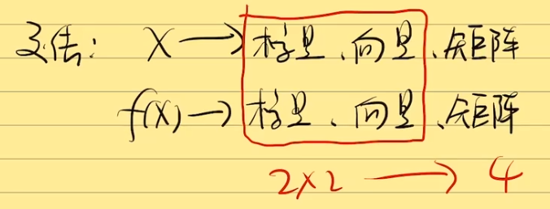

# 1 向量函数与矩阵函数初印象

​	对于输入$x$和输出$f(x)$主要有四种组合方式，即各选取标量和向量中的两个进行组合。

​	**矩阵求导的本质：**

​	$\frac {dA}{dB}$：矩阵A中的每一个元素对矩阵B中的每一个元素求导。

​	我们从求导后的元素个数角度来看：
$$
A \ \ \ \ \ \ \ \ \ \ \ \ \ \ \ \ \ \ \  \ \ \ \  \ \ \  \  \ \ \ B →\ \frac {dA}{dB} \\
1\times1 \ \ \ \ \ \ \ \ \ \ \ \ \ \ \ \ \ \ \ \ \ \ \ 1\times1 →1\times1\\
1\times p \ \ \ \ \ \ \ \ \ \ \ \ \ \ \ \ \ \ \ \ \ \ \ 1\times n →p\times n \\
q\times p \ \ \ \ \ \ \ \ \ \ \ \ \ \ \ \ \ \ \ \ \ \ \ m\times n→p\times q\times m\times n
$$

# 2 YX拉伸术

1.标量不变，向量拉伸

2.前面(Y)横向拉，后面(X)纵向拉。

# 3 常见矩阵求导公式

