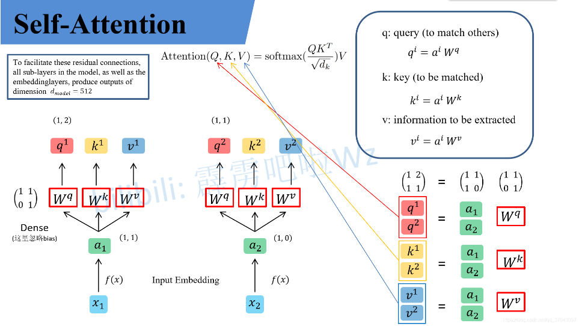

## Self-Attention

​	假设输入的序列长度为2，输入就两个节点$ x_1, x_2 $ ，然后通过Input Embedding也就是图中的$f(x)$将输入映射到$ a_1, a_2$ 。紧接着分别将$a_1, a_2$分别通过三个变换矩阵$W_q, W_k, W_v$（这三个参数是可训练的，是共享的）得到对应的$q^i, k^i, v^i$（这里在源码中是直接使用全连接层实现的，这里为了方便理解，忽略偏置）。

```python
self.qkv = nn.Linear(dim, dim * 3, bias=qkv_bias) #生成qkv，也即直接通过全连接层的训练得到qkv，并非通过x乘以一个矩阵的方式(这种应该为理论)
```




其中

- q代表query，后续会去和每一个k进行匹配
- k代表key，后续会被每个q匹配
- v代表从a中提取得到的信息
- 后续q和k匹配的过程可以理解成计算两者的相关性，相关性越大对应v的权重也就越大

假设$a_1=(1, 1), a_2=(1,0), W^q= \binom{1, 1}{0, 1}$那么：


前面有说Transformer是可以并行化的，所以可以直接写成矩阵形式：


​	同理我们可以得到$\binom{k^1}{k^2}$和$ \binom{v^1}{v^2}$，那么求得的$\binom{q^1}{q^2}$就是原论文中的$Q$，$ \binom{k^1}{k^2}$就是$K$，$ \binom{v^1}{v^2}$就是V。接着先拿$q^1$ 和每个k进行match，点乘操作，接着除以$ \sqrt{d} 
$ 得到对应的$\alpha$，其中$d$代表向量$ k^i
$ 的长度，在本示例中等于2，除以$\sqrt{d}$的原因在论文中的解释是“进行点乘后的数值很大，导致通过softmax后梯度变的很小，所以通过除以$\sqrt{d}$来进行缩放。比如计算$ \alpha_{1, i}$：


​	同理拿$q^2$去匹配所有的k能得到$\alpha_{2, i}$ ，统一写成矩阵乘法形式：


​	接着对每一行即$(\alpha_{1, 1}, \alpha_{1, 2})$和$(\alpha_{2, 1}, \alpha_{2, 2})$分别进行softmax处理得到$ (\hat\alpha_{1, 1}, \hat\alpha_{1, 2})$和$(\hat\alpha_{2, 1}, \hat\alpha_{2, 2})$，这里的$ \hat{\alpha} $ 相当于计算得到针对每个$v$的权重。到这我们就完成了${\rm Attention}(Q, K, V)$公式中${\rm softmax}(\frac{QK^T}{\sqrt{d_k}})$部分。


​	此处要注意其$α$的第二个下标是与$Key$有关，其$Key$是几则计算出来的就是第一个$Value$的权重。

​	上面已经计算得到$\alpha$，即针对每个$v$的权重，接着进行加权得到最终结果：


​	统一写成矩阵乘法形式：


​	到这，`Self-Attention`的内容就讲完了。总结下来就是论文中的一个公式：


## Multi-Head Attention

​	原论文中说使用多头注意力机制能够联合来自不同head部分学习到的信息。Multi-head attention allows the model to jointly attend to information from different representation subspaces at different positions.其实只要懂了Self-Attention模块Multi-Head Attention模块就非常简单了。
​	多头注意力机制（Multi-Head Attention）就是将自注意力机制（Self-Attention）分成多个头（heads），然后并行计算。每个头会独立地进行自注意力计算，这样可以捕捉到不同的特征和关系。最后，将这些头的输出拼接起来，并通过一个线性变换得到最终的结果。

​	首先还是和Self-Attention模块一样将$a_i$分别通过$W^q, W^k, W^v$ 得到对应的$ q^i, k^i, v^iq
$ ，然后再根据使用的head的数目$h$进一步把得到的$q^i, k^i, v^i
$ 均分成h hh份。比如下图中假设h=2然后$q^1
$ 拆分成$q^{1,1}
$ 和$q^{1,2}$ ，那么$q^{1,1}$ 就属于head1，$q^{1,2}
$ 属于head2,此处看的是第一个下标进行分头。


​	论文中写的通过$W^Q_i, W^K_i, W^V_i$ 映射得到每个head的$Q_i, K_i, V_i$吗：$head_i = {\rm Attention}(QW^Q_i, KW^K_i, VW^V_i)$,但在github上看的一些源码中就是简单的进行均分，其实也可以将$W^Q_i, W^K_i, W^V_i$设置成对应值来实现均分，比如下图中的Q通过$W^Q_1$ 就能得到均分后的$Q_1$ 。


​	通过上述方法就能得到每个$head_i$ 对应的$Q_i, K_i, V_i$参数，接下来针对每个head使用和Self-Attention中相同的方法即可得到对应的结果。


​	接着将每个head得到的结果进行concat拼接，比如下图中$b_{1,1}$($head_1$得到的$b_1$ ）和$b_{1,2}$（$head_2$得到的$b_1$ ）拼接在一起，$b_{2,1}$（$head_1$得到的$ b_2$ ）和$b_{2,2}$（$head_2$ 得到的$b_2$ ）拼接在一起。


​	接着将拼接后的结果通过$W^O$（可学习的参数）进行融合，如下图所示，融合后得到最终的结果$b_1, b_2$ 。


## Positional Encoding


## Dropout和DropPath

1. **Dropout**:
   - 在每个训练步骤中，随机丢弃一部分神经元的输出。
   - 全连接层和卷积层。
2. **DropPath**（也称为 Stochastic Depth）:
   - 在每个训练步骤中，随机丢弃**整个路径（即整个层或块）**的输出。
   - 深度神经网络中的残差块（ResNet）或其他模块化结构。

## softmax维度问题

​	在自注意力机制中，对最后一个维度进行 `softmax` 操作是为了计算每个$query$向量与$key$键向量之间的相似度，并将这些相似度归一化为概率分布。

​	如果对倒数第二个维度进行 `softmax`，则每个键向量对所有查询向量的相似度将被归一化，这不符合自注意力机制的逻辑。自注意力机制需要的是每个查询向量对所有键向量的相似度归一化，而不是反过来。

