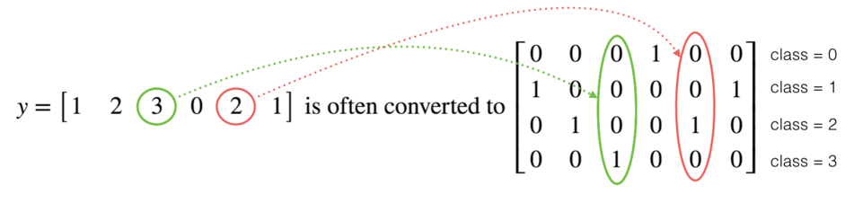
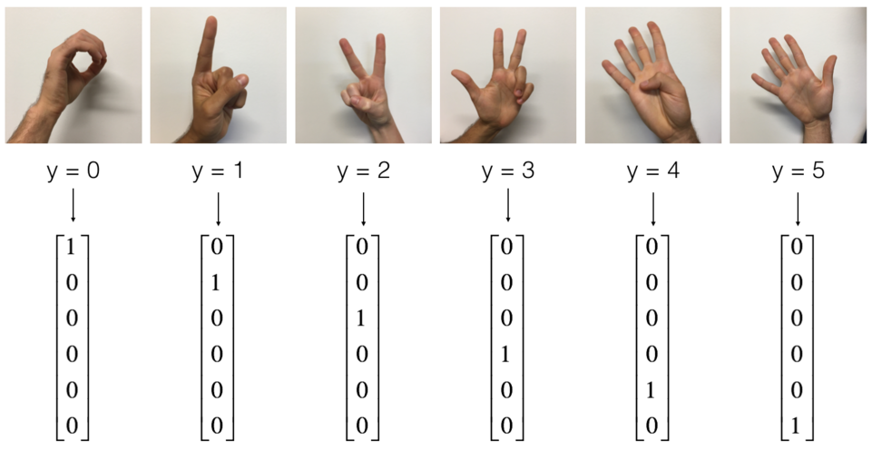
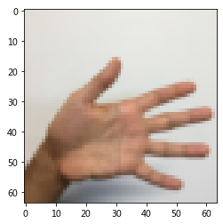
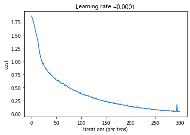
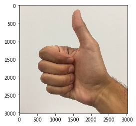

# TensorFlow教程

学习在TensorFlow中执行以下操作：

- 初始化变量
- 创建自己的会话（session）
- 训练算法
- 实现神经网络

编程框架不仅可以缩短编码时间，而且有时还可以进行优化以加快代码速度。

## 1-探索Tensorflow库

使用下述公式计算一个训练数据的损失。
$$
loss = \mathcal{L}(\hat{y}, y) = (\hat y^{(i)} - y^{(i)})^2 \tag{1}
$$

```python
y_hat = tf.constant(36, name='y_hat')            # Define y_hat constant. Set to 36.
y = tf.constant(39, name='y')                    # Define y. Set to 39

loss = tf.Variable((y - y_hat)**2, name='loss')  # Create a variable for the loss

init = tf.global_variables_initializer()         # When init is run later (session.run(init)),
                                                 # the loss variable will be initialized and ready to be computed
with tf.Session() as session:                    # Create a session and print the output
    session.run(init)                            # Initializes the variables
    print(session.run(loss))                     # Prints the loss
```

output：

```python
9
```

在TensorFlow中编写和运行程序包含以下步骤：

1. 创建尚未执行的张量（变量）。
2. 在这些张量之间编写操作。
3. 初始化张量。
4. 创建一个会话。
5. 运行会话，这将运行你上面编写的操作。

因此，当我们为损失创建变量时，我们仅将损失定义为其他数量的函数，但没有验证其值。为了验证它，我们必须运行`init = tf.global_variables_initializer（）`初始化损失变量，在最后一行中，我们终于能够验证`loss`的值并打印它。

现在让我们看一个简单的例子。运行下面的单元格：

```python
a = tf.constant(2)
b = tf.constant(10)
c = tf.multiply(a,b)
print(c)
```

output：

```python
Tensor("Mul:0", shape=(), dtype=int32)
```

不出所料，看不到结果20！而是得到一个张量，是一个不具有shape属性且类型为“int32”的张量。你所做的所有操作都已放入“计算图”中，但你尚未运行此计算。为了实际将两个数字相乘，必须创建一个会话并运行它。

```python
sess = tf.Session()
print(sess.run(c))
```

output：

```PYTHON
20
```

总而言之，**记住要初始化变量，创建一个会话并在该会话中运行操作**。

接下来，你还必须了解 placeholders(占位符)。占位符是一个对象，你只能稍后指定其值。
要为占位符指定值，你可以使用"feed dictionary"（`feed_dict`变量）传入值。在下面，我们为x创建了一个占位符，以允许我们稍后在运行会话时传递数字。

```python
# Change the value of x in the feed_dict

x = tf.placeholder(tf.int64, name = 'x')
print(sess.run(2 * x, feed_dict = {x: 3}))
sess.close()
```

output：

```PYTHON
6
```

当你首次定义`x`时，不必为其指定值。占位符只是一个变量，你在运行会话时才将数据分配给该变量。也就是说你在运行会话时向这些占位符“提供数据”。

当你指定计算所需的操作时，你在告诉TensorFlow如何构造计算图。计算图可以具有一些占位符，你将在稍后指定它们的值。最后，在运行会话时，你要告诉TensorFlow执行计算图。

### 1.1线性函数

计算以下方程式：$Y=WX+b$，其中$W$和$X$是随机矩阵，$b$是随机向量。

**练习**：计算$WX+b$ ，其中$W,X$和$b$是从随机正态分布中得到的，$W$的维度为（4，3），$X$的维度为（3,1），$b$的维度为（4,1）。例如，下面是定义维度为（3,1）的常量$X$的方法：

```python
X = tf.constant(np.random.randn(3,1), name = "X")
```

**常见的运算函数：**

- tf.matmul(..., ...)进行矩阵乘法
- tf.add(..., ...)进行加法
- np.random.randn(...)随机初始化

```python
# GRADED FUNCTION: linear_function

def linear_function():
    """
    Implements a linear function: 
            Initializes W to be a random tensor of shape (4,3)
            Initializes X to be a random tensor of shape (3,1)
            Initializes b to be a random tensor of shape (4,1)
    Returns: 
    result -- runs the session for Y = WX + b 
    """
    
    np.random.seed(1)
    
    ### START CODE HERE ### (4 lines of code)  
    X = tf.constant(np.random.randn(3,1), name = "X")  
    W = tf.constant(np.random.randn(4,3), name = "W")  
    b = tf.constant(np.random.randn(4,1), name = "b")  
    Y = tf.add(tf.matmul(W,X),b)  
    ### END CODE HERE ###   
      
    # Create the session using tf.Session() and run it with sess.run(...) on the variable you want to calculate  
      
    ### START CODE HERE ###  
    sess = tf.Session()  
    result = sess.run(Y)  
    ### END CODE HERE ###   
    
    # close the session 
    sess.close()

    return result

print( "result = " + str(linear_function()))
```

output：

```PYTHON
result = [[-2.15657382]
 [ 2.95891446]
 [-1.08926781]
 [-0.84538042]]
```

### 1.2 计算Sigmoid

你将使用占位符变量`x`进行此练习。在运行会话时，应该使用feed字典传入输入`z`。在本练习中，你必须：
（i）创建一个占位符`x`；
（ii）使用`tf.sigmoid`定义计算Sigmoid所需的操作；
（iii）然后运行该会话

**练习**：实现下面的Sigmoid函数。你应该使用以下内容：

- `tf.placeholder(tf.float32, name = "...")`
- `tf.sigmoid(...)`
- `sess.run(..., feed_dict = {x: z})`

注意，在tensorflow中创建和使用会话有两种典型的方法：

**Method 1:**

```python
sess = tf.Session()  
# Run the variables initialization (if needed), run the operations  
result = sess.run(..., feed_dict = {...})  
sess.close() # Close the session
```

**Method 2:**

```python
with tf.Session() as sess:   
    # run the variables initialization (if needed), run the operations  
    result = sess.run(..., feed_dict = {...})  
    # This takes care of closing the session for you :)
```

```python
# GRADED FUNCTION: sigmoid

def sigmoid(z):
    """
    Computes the sigmoid of z
    
    Arguments:
    z -- input value, scalar or vector
    
    Returns: 
    results -- the sigmoid of z
    """
    
    ### START CODE HERE ### ( approx. 4 lines of code)  
    # Create a placeholder for x. Name it 'x'.  
    x = tf.placeholder(tf.float32, name = "x")  
  
    # compute sigmoid(x)  
    sigmoid = tf.sigmoid(x)  
  
    # Create a session, and run it. Please use the method 2 explained above.   
    # You should use a feed_dict to pass z's value to x.   
    with tf.Session() as sess:  
        # Run session and call the output "result"  
        result = sess.run(sigmoid,feed_dict={x:z})   #actually,the sigmoid here is equal to tf.sigmoid(x)
      
    ### END CODE HERE ###  
    
    return result


print ("sigmoid(0) = " + str(sigmoid(0)))
print ("sigmoid(12) = " + str(sigmoid(12)))
```

output：

```PYTHON
sigmoid(0) = 0.5
sigmoid(12) = 0.9999938
```

**总而言之，你知道如何**：
1.创建占位符
2.指定运算相对应的计算图
3.创建会话
4.如果需要指定占位符变量的值，使用feed字典运行会话。

### 1.3 计算损失

你还可以使用内置函数来计算神经网络的损失。因此，对于$i=1...m$，无需编写代码来将其作为$a^{[2](i)}i)$和$y^{(i)}$的函数来计算：
$$
J = - \frac{1}{m}  \sum_{i = 1}^m  \large ( \small y^{(i)} \log a^{ [2] (i)} + (1-y^{(i)})\log (1-a^{ [2] (i)} )\large )\small\tag{2}
$$
你可以使用tensorflow的一行代码中做到这一点！

**练习**：实现交叉熵损失。你将使用的函数是：

- `tf.nn.sigmoid_cross_entropy_with_logits(logits = ..., labels = ...)`

你的代码应输入`z`，计算出sigmoid（得到`a`），然后计算出交叉熵损失$J$，所有这些操作都可以通过调用`tf.nn.sigmoid_cross_entropy_with_logits`来完成：
$$
-\frac{1}{m}  \sum_{i = 1}^m  \large ( \small y^{(i)} \log \sigma(z^{[2](i)}) + (1-y^{(i)})\log (1-\sigma(z^{[2](i)})\large )\small\tag{3}
$$

```python
# GRADED FUNCTION: cost

def cost(logits, labels):
    """
    Computes the cost using the sigmoid cross entropy
    
    Arguments:
    logits -- vector containing z, output of the last linear unit (before the final sigmoid activation)
    labels -- vector of labels y (1 or 0) 
    
    Note: What we've been calling "z" and "y" in this class are respectively called "logits" and "labels" 
    in the TensorFlow documentation. So logits will feed into z, and labels into y. 
    
    Returns:
    cost -- runs the session of the cost (formula (2))
    """
    
    ### START CODE HERE ###   
      
    # Create the placeholders for "logits" (z) and "labels" (y) (approx. 2 lines)  
    z = tf.placeholder(tf.float32, name = "z")  
    y = tf.placeholder(tf.float32, name = "y")  
      
    # Use the loss function (approx. 1 line)  
    cost = tf.nn.sigmoid_cross_entropy_with_logits(logits=z,labels=y)  
      
    # Create a session (approx. 1 line). See method 1 above.  
    sess = tf.Session()  
      
    # Run the session (approx. 1 line).  
    cost = sess.run(cost,feed_dict={z:logits,y:labels})  
      
    # Close the session (approx. 1 line). See method 1 above.  
    sess.close()  
      
    ### END CODE HERE ###  
    
    return cost

logits = sigmoid(np.array([0.2,0.4,0.7,0.9]))
cost = cost(logits, np.array([0,0,1,1]))
print ("cost = " + str(cost))
```

output：

```PYTHON
cost = [1.0053872  1.0366409  0.41385433 0.39956614]
```

### 1.4 独热(One Hot)编码

在深度学习中，很多时候你会得到一个y向量，其数字范围从0到C-1，其中C是类的数量。例如C是4，那么你可能具有以下y向量，你将需要按以下方式对其进行转换：



这称为独热编码，因为在转换后的表示形式中，每一列中的一个元素正好是“hot”（设为1）。要以numpy格式进行此转换，你可能需要编写几行代码。在tensorflow中，你可以只使用一行代码：

```python
tf.one_hot(labels, depth, axis)
```

**练习**：实现以下函数，以获取一个标签向量和$C$类的总数，并返回一个独热编码。使用`tf.one_hot（）`来做到这一点。

```python
# GRADED FUNCTION: one_hot_matrix

def one_hot_matrix(labels, C):
    """
    Creates a matrix where the i-th row corresponds to the ith class number and the jth column
                     corresponds to the jth training example. So if example j had a label i. Then entry (i,j) 
                     will be 1. 
                     
    Arguments:
    labels -- vector containing the labels 
    C -- number of classes, the depth of the one hot dimension
    
    Returns: 
    one_hot -- one hot matrix
    """
    
    ### START CODE HERE ###  
      
    # Create a tf.constant equal to C (depth), name it 'C'. (approx. 1 line)  
    C = tf.constant(C, name = "C")  
      
    # Use tf.one_hot, be careful with the axis (approx. 1 line)  
    one_hot_matrix = tf.one_hot(labels, C, axis=0)  
      
    # Create the session (approx. 1 line)  
    sess = tf.Session()  
      
    # Run the session (approx. 1 line)  
    one_hot = sess.run(one_hot_matrix)  
      
    # Close the session (approx. 1 line). See method 1 above.  
    sess.close()  
      
    ### END CODE HERE ###  
    
    return one_hot

labels = np.array([1,2,3,0,2,1])
one_hot = one_hot_matrix(labels, C = 4)
print ("one_hot = " + str(one_hot))
```

output：

```PYTHON
one_hot = [[0. 0. 0. 1. 0. 0.]
 [1. 0. 0. 0. 0. 1.]
 [0. 1. 0. 0. 1. 0.]
 [0. 0. 1. 0. 0. 0.]]
```

### 1.5 使用0和1初始化

现在，你将学习如何初始化0和1的向量。 你将要调用的函数是`tf.ones()`。要使用零初始化，可以改用tf.zeros()。这些函数采用一个维度，并分别返回一个包含0和1的维度数组。

**练习**：实现以下函数以获取维度并返回维度数组。


```PYTHON
tf.ones(shape)
```

```PYTHON
# GRADED FUNCTION: ones

def ones(shape):
    """
    Creates an array of ones of dimension shape
    
    Arguments:
    shape -- shape of the array you want to create
        
    Returns: 
    ones -- array containing only ones
    """
    
    ### START CODE HERE ###  
      
    # Create "ones" tensor using tf.ones(...). (approx. 1 line)  
    ones = tf.ones(shape)  
      
    # Create the session (approx. 1 line)  
    sess = tf.Session()  
      
    # Run the session to compute 'ones' (approx. 1 line)  
    ones = sess.run(ones)  
      
    # Close the session (approx. 1 line). See method 1 above.  
    sess.close()  
      
    ### END CODE HERE ###  
    return ones  

print ("ones = " + str(ones([3])))
```

output：

```PYTHON
ones = [1. 1. 1.]
```

# Tensorflow构建你的第一个神经网络

在这一部分作业中，你将使用tensorflow构建神经网络。请记住，实现tensorflow模型包含两个部分：

- 创建计算图
- 运行计算图

### 2.0 SIGNS 数据集

一个下午，我们决定和一些朋友一起用计算机来解密手语。我们花了几个小时在白墙前拍照，并提出了以下数据集。现在，你的工作就是构建一种算法，以帮助语音障碍者和不懂手语的人的交流。

- **训练集**：1080张图片（64 x 64像素）的手势表示从0到5的数字（每个数字180张图片）。
- **测试集**：120张图片（64 x 64像素）的手势表示从0到5的数字（每个数字20张图片）。

请注意，这是SIGNS数据集的子集。完整的数据集包含更多的手势。

这是每个数字的示例，以及如何解释标签的方式。这些是原始图片，然后我们将图像分辨率降低到64 x 64像素。



运行以下代码以加载数据集。

```PYTHON
# Loading the dataset
X_train_orig, Y_train_orig, X_test_orig, Y_test_orig, classes = load_dataset()
```

更改下面的索引并运行单元格以可视化数据集中的一些示例。

```python
# Example of a picture
index = 0
plt.imshow(X_train_orig[index])
print ("y = " + str(np.squeeze(Y_train_orig[:, index])))
```

output：

```PYTHON
y=5
```



通常先将图像数据集展平，然后除以255以对其进行归一化。最重要的是将每个标签转换为一个独热向量，如图1所示。运行下面的单元格即可转化。

```python
# Flatten the training and test images
X_train_flatten = X_train_orig.reshape(X_train_orig.shape[0], -1).T
X_test_flatten = X_test_orig.reshape(X_test_orig.shape[0], -1).T
# Normalize image vectors
X_train = X_train_flatten/255.
X_test = X_test_flatten/255.
# Convert training and test labels to one hot matrices
Y_train = convert_to_one_hot(Y_train_orig, 6)
Y_test = convert_to_one_hot(Y_test_orig, 6)

print ("number of training examples = " + str(X_train.shape[1]))
print ("number of test examples = " + str(X_test.shape[1]))
print ("X_train shape: " + str(X_train.shape))
print ("Y_train shape: " + str(Y_train.shape))
print ("X_test shape: " + str(X_test.shape))
print ("Y_test shape: " + str(Y_test.shape))
```

output：

```PYTHON
number of training examples = 1080
number of test examples = 120
X_train shape: (12288, 1080)
Y_train shape: (6, 1080)
X_test shape: (12288, 120)
Y_test shape: (6, 120)
```

**注意** $12288 =$ $64×64×3$，每个图像均为正方形，64 x 64像素，其中3为RGB颜色。请确保理解这些数据的维度意义，然后再继续。

**你的目标**是建立一种能够高精度识别符号的算法。为此，你将构建一个$tensorflow$模型，该模型与你先前在$numpy$中为猫识别构建的$tensorflow$模型几乎相同（但现在使用softmax输出）。这是将$numpy$实现的模型与$tensorflow$进行比较的好机会。

**模型**为**LINEAR-> RELU-> LINEAR-> RELU-> LINEAR-> SOFTMAX** 。 $SIGMOID$输出层已转换为$SOFTMAX$。$SOFTMAX$层将$SIGMOID$应用到两个以上的类。

### 2.1 创建占位符

你的第一个任务是为`X`和`X`创建占位符，方便你以后在运行会话时传递训练数据。

**练习**：实现以下函数以在tensorflow中创建占位符。

```python
# GRADED FUNCTION: create_placeholders

def create_placeholders(n_x, n_y):
    """
    Creates the placeholders for the tensorflow session.
    
    Arguments:
    n_x -- scalar, size of an image vector (num_px * num_px = 64 * 64 * 3 = 12288)
    n_y -- scalar, number of classes (from 0 to 5, so -> 6)
    
    Returns:
    X -- placeholder for the data input, of shape [n_x, None] and dtype "float"
    Y -- placeholder for the input labels, of shape [n_y, None] and dtype "float"
    
    Tips:
    - You will use None because it let's us be flexible on the number of examples you will for the placeholders.
      In fact, the number of examples during test/train is different.
    """

    ### START CODE HERE ### (approx. 2 lines)  
    X = tf.placeholder(shape=[n_x, None],dtype=tf.float32)  
    Y = tf.placeholder(shape=[n_y, None],dtype=tf.float32)  
    ### END CODE HERE ###  
    
    return X, Y

X, Y = create_placeholders(12288, 6)
print ("X = " + str(X))
print ("Y = " + str(Y))
```

output:

```PYTHON
X = Tensor("Placeholder:0", shape=(12288, ?), dtype=float32)
Y = Tensor("Placeholder_1:0", shape=(6, ?), dtype=float32)
```

### 2.2 初始化参数

你的第二个任务是初始化tensorflow中的参数。

**练习**：实现以下函数以初始化tensorflow中的参数。使用权重的Xavier初始化和偏差的零初始化。维度如下，对于$W^{[1]}$和$b^{[1]}$，你可以使用：

```python
W1 = tf.get_variable("W1", [25,12288], initializer = tf.contrib.layers.xavier_initializer(seed = 1))  
b1 = tf.get_variable("b1", [25,1], initializer = tf.zeros_initializer())
```

```PYTHON
# GRADED FUNCTION: initialize_parameters

def initialize_parameters():
    """
    Initializes parameters to build a neural network with tensorflow. The shapes are:
                        W1 : [25, 12288]
                        b1 : [25, 1]
                        W2 : [12, 25]
                        b2 : [12, 1]
                        W3 : [6, 12]
                        b3 : [6, 1]
    
    Returns:
    parameters -- a dictionary of tensors containing W1, b1, W2, b2, W3, b3
    """
    
    tf.set_random_seed(1)                   # so that your "random" numbers match ours
        
    ### START CODE HERE ### (approx. 6 lines of code)  
    W1 = tf.get_variable("W1", [25,12288], initializer = tf.contrib.layers.xavier_initializer(seed = 1))  
    b1 = tf.get_variable("b1", [25,1], initializer = tf.zeros_initializer())  
    W2 = tf.get_variable("W2", [12,25], initializer = tf.contrib.layers.xavier_initializer(seed = 1))  
    b2 = tf.get_variable("b2", [12,1], initializer = tf.zeros_initializer())  
    W3 = tf.get_variable("W3", [6,12], initializer = tf.contrib.layers.xavier_initializer(seed = 1))  
    b3 = tf.get_variable("b3", [6,1], initializer = tf.zeros_initializer())  
    ### END CODE HERE ### 

    parameters = {"W1": W1,
                  "b1": b1,
                  "W2": W2,
                  "b2": b2,
                  "W3": W3,
                  "b3": b3}
    
    return parameters


tf.reset_default_graph()
with tf.Session() as sess:
    parameters = initialize_parameters()
    print("W1 = " + str(parameters["W1"]))
    print("b1 = " + str(parameters["b1"]))
    print("W2 = " + str(parameters["W2"]))
    print("b2 = " + str(parameters["b2"]))
```

output:

```PYTHON
WARNING: The TensorFlow contrib module will not be included in TensorFlow 2.0.
For more information, please see:
  * https://github.com/tensorflow/community/blob/master/rfcs/20180907-contrib-sunset.md
  * https://github.com/tensorflow/addons
If you depend on functionality not listed there, please file an issue.

W1 = <tf.Variable 'W1:0' shape=(25, 12288) dtype=float32_ref>
b1 = <tf.Variable 'b1:0' shape=(25, 1) dtype=float32_ref>
W2 = <tf.Variable 'W2:0' shape=(12, 25) dtype=float32_ref>
b2 = <tf.Variable 'b2:0' shape=(12, 1) dtype=float32_ref>
```

### 2.3 Tensorflow中的正向传播

你现在将在tensorflow中实现正向传播模块。该函数将接收参数字典，并将完成正向传递。你将使用的函数是：

- `tf.add（...，...）`进行加法
- `tf.matmul（...，...）`进行矩阵乘法
- `tf.nn.relu（...）`以应用ReLU激活

**问题**：实现神经网络的正向传递。我们为你注释了numpy等式，以便你可以将tensorflow实现与numpy实现进行比较。重要的是要注意，前向传播在`z3`处停止。原因是在tensorflow中，最后的**线性层输出**作为计算损失函数的输入。因此，你不需要`a3`！

```PYTHON
# GRADED FUNCTION: forward_propagation

def forward_propagation(X, parameters):
    """
    Implements the forward propagation for the model: LINEAR -> RELU -> LINEAR -> RELU -> LINEAR -> SOFTMAX
    
    Arguments:
    X -- input dataset placeholder, of shape (input size, number of examples)
    parameters -- python dictionary containing your parameters "W1", "b1", "W2", "b2", "W3", "b3"
                  the shapes are given in initialize_parameters

    Returns:
    Z3 -- the output of the last LINEAR unit
    """
    
    # Retrieve the parameters from the dictionary "parameters" 
    W1 = parameters['W1']
    b1 = parameters['b1']
    W2 = parameters['W2']
    b2 = parameters['b2']
    W3 = parameters['W3']
    b3 = parameters['b3']
    
    ### START CODE HERE ### (approx. 5 lines)              # Numpy Equivalents:  
    Z1 = tf.add(tf.matmul(W1,X),b1)                                              # Z1 = np.dot(W1, X) + b1  
    A1 = tf.nn.relu(Z1)                                              # A1 = relu(Z1)  
    Z2 = tf.add(tf.matmul(W2,A1),b2)                                              # Z2 = np.dot(W2, a1) + b2  
    A2 = tf.nn.relu(Z2)                                              # A2 = relu(Z2)  
    Z3 = tf.add(tf.matmul(W3,A2),b3)                                              # Z3 = np.dot(W3,Z2) + b3  
    ### END CODE HERE ###  
    
    return Z3

tf.reset_default_graph()

with tf.Session() as sess:
    X, Y = create_placeholders(12288, 6)
    parameters = initialize_parameters()
    Z3 = forward_propagation(X, parameters)
    print("Z3 = " + str(Z3))
```

output:

```PYTHON
Z3 = Tensor("Add_2:0", shape=(6, ?), dtype=float32)
```

你可能已经注意到，正向传播不会输出任何缓存。当我们开始进行传播时，你将在下面理解为什么。

### 2.4 计算损失

如前所述，使用以下方法很容易计算损失：

```
tf.reduce_mean(tf.nn.softmax_cross_entropy_with_logits(logits = ..., labels = ...))
```

**问题**：实现以下损失函数。

重要的是要知道`tf.nn.softmax_cross_entropy_with_logits`的"`logits`"和"`labels`"输入应具有一样的维度（数据数，类别数）。 因此，我们为你转换了$Z3$和$Y$。

此外，`tf.reduce_mean`是对所以数据进行求和。

 ```PYTHON
  # GRADED FUNCTION: compute_cost 
  
  def compute_cost(Z3, Y):
      """
      Computes the cost
      
      Arguments:
      Z3 -- output of forward propagation (output of the last LINEAR unit), of shape (6, number of examples)
      Y -- "true" labels vector placeholder, same shape as Z3
      
      Returns:
      cost - Tensor of the cost function
      """
      
      # to fit the tensorflow requirement for tf.nn.softmax_cross_entropy_with_logits(...,...)
      #tf.transpose 被用来转置 Z3 和 Y。默认情况下，如果不指定 perm 参数，tf.transpose 会将最后一个轴移到第一个位置，并将其他轴依次后移。这在处理某些操作时非常有用，比如在计算交叉熵时，你可能需要将标签和逻辑回归输出的维度对齐。
      #具体见tf.transpose章节
      logits = tf.transpose(Z3)
      labels = tf.transpose(Y)
      
      ### START CODE HERE ### (1 line of code)  
      cost = tf.reduce_mean(tf.nn.softmax_cross_entropy_with_logits(logits = logits, labels = labels))  
      ### END CODE HERE ###  
      
      return cost
     
 tf.reset_default_graph()
 
 with tf.Session() as sess:
     X, Y = create_placeholders(12288, 6)
     parameters = initialize_parameters()
     Z3 = forward_propagation(X, parameters)
     cost = compute_cost(Z3, Y)
     print("cost = " + str(cost))
 ```

output:

```PYTHON
WARNING:tensorflow:From <ipython-input-26-31bd7f36e96c>:20: softmax_cross_entropy_with_logits (from tensorflow.python.ops.nn_ops) is deprecated and will be removed in a future version.
Instructions for updating:

Future major versions of TensorFlow will allow gradients to flow
into the labels input on backprop by default.

See `tf.nn.softmax_cross_entropy_with_logits_v2`.

cost = Tensor("Mean:0", shape=(), dtype=float32)
```

### 2.5 反向传播和参数更新

所有反向传播和参数更新均可使用1行代码完成，将这部分合并到模型中非常容易。

计算损失函数之后，你将创建一个"`optimizer`"对象。运行tf.session时，必须与损失一起调用此对象。调用时，它将使用所选方法和学习率对给定的损失执行优化。

例如，对于梯度下降，优化器将是：

```python
optimizer = tf.train.GradientDescentOptimizer(learning_rate = learning_rate).minimize(cost)
```

要进行优化，你可以执行以下操作：

```python
_ , c = sess.run([optimizer, cost], feed_dict={X: minibatch_X, Y: minibatch_Y})
```

通过相反顺序的tensorflow图来计算反向传播。从损失到输入。

**注意**编码时，我们经常使用`_`作为“throwaway”变量来存储以后不再需要使用的值。这里`_`代表了我们不需要的`optimizer`的评估值（而 `c` 代表了 `cost`变量的值）。

### 2.6 建立模型

现在，将它们组合在一起！

**练习**:调用之前实现的函数构建完整模型。

```PYTHON
def model(X_train, Y_train, X_test, Y_test, learning_rate = 0.0001,
          num_epochs = 1500, minibatch_size = 32, print_cost = True):
    """
    Implements a three-layer tensorflow neural network: LINEAR->RELU->LINEAR->RELU->LINEAR->SOFTMAX.
    
    Arguments:
    X_train -- training set, of shape (input size = 12288, number of training examples = 1080)
    Y_train -- test set, of shape (output size = 6, number of training examples = 1080)
    X_test -- training set, of shape (input size = 12288, number of training examples = 120)
    Y_test -- test set, of shape (output size = 6, number of test examples = 120)
    learning_rate -- learning rate of the optimization
    num_epochs -- number of epochs of the optimization loop
    minibatch_size -- size of a minibatch
    print_cost -- True to print the cost every 100 epochs
    
    Returns:
    parameters -- parameters learnt by the model. They can then be used to predict.
    """
    
    ops.reset_default_graph()                         # to be able to rerun the model without overwriting tf variables
    tf.set_random_seed(1)                             # to keep consistent results
    seed = 3                                          # to keep consistent results
    (n_x, m) = X_train.shape                          # (n_x: input size, m : number of examples in the train set)
    n_y = Y_train.shape[0]                            # n_y : output size
    costs = []                                        # To keep track of the cost
    
    # Create Placeholders of shape (n_x, n_y)
    ### START CODE HERE ### (1 line)  
    X, Y = create_placeholders(n_x, n_y)  
    ### END CODE HERE ###  
  
    # Initialize parameters  
    ### START CODE HERE ### (1 line)  
    parameters = initialize_parameters()  
    ### END CODE HERE ###  
      
    # Forward propagation: Build the forward propagation in the tensorflow graph  
    ### START CODE HERE ### (1 line)  
    Z3 = forward_propagation(X, parameters)  
    ### END CODE HERE ###  
      
    # Cost function: Add cost function to tensorflow graph  
    ### START CODE HERE ### (1 line)  
    cost = compute_cost(Z3, Y)  
    ### END CODE HERE ###  
      
    # Backpropagation: Define the tensorflow optimizer. Use an AdamOptimizer.  
    ### START CODE HERE ### (1 line)  
    optimizer = tf.train.AdamOptimizer(learning_rate = learning_rate).minimize(cost)  
    ### END CODE HERE ###  
      
    # Initialize all the variables  
    init = tf.global_variables_initializer()  
  
    # Start the session to compute the tensorflow graph  
    with tf.Session() as sess:  
          
        # Run the initialization  
        sess.run(init)  
          
        # Do the training loop  
        for epoch in range(num_epochs):  
  
            epoch_cost = 0.                       # Defines a cost related to an epoch  
            num_minibatches = int(m / minibatch_size) # number of minibatches of size minibatch_size in the train set  
            seed = seed + 1  
            minibatches = random_mini_batches(X_train, Y_train, minibatch_size, seed)  
  
            for minibatch in minibatches:  
  
                # Select a minibatch  
                (minibatch_X, minibatch_Y) = minibatch  
                  
                # IMPORTANT: The line that runs the graph on a minibatch.  
                # Run the session to execute the "optimizer" and the "cost", the feedict should contain a minibatch for (X,Y).  
                ### START CODE HERE ### (1 line)  
                _ , minibatch_cost = sess.run([optimizer, cost], feed_dict={X: minibatch_X, Y: minibatch_Y})  
                ### END CODE HERE ###  
                  
                epoch_cost += minibatch_cost / num_minibatches  
  
            # Print the cost every epoch  
            if print_cost == True and epoch % 100 == 0:  
                print ("Cost after epoch %i: %f" % (epoch, epoch_cost))  
            if print_cost == True and epoch % 5 == 0:  
                costs.append(epoch_cost)  
                  
        # plot the cost  
        plt.plot(np.squeeze(costs))  
        plt.ylabel('cost')  
        plt.xlabel('iterations (per tens)')  
        plt.title("Learning rate =" + str(learning_rate))  
        plt.show()  
  
        # lets save the parameters in a variable  
        parameters = sess.run(parameters)  
        print ("Parameters have been trained!")  
 
        # Calculate the correct predictions
    	# 下方小节
        correct_prediction = tf.equal(tf.argmax(Z3), tf.argmax(Y))  
  
        # Calculate accuracy on the test set  
        accuracy = tf.reduce_mean(tf.cast(correct_prediction, "float"))  
  
        print ("Train Accuracy:", accuracy.eval({X: X_train, Y: Y_train}))  
        print ("Test Accuracy:", accuracy.eval({X: X_test, Y: Y_test}))  
          
        return parameters  
```

运行以下单元格来训练你的模型！在我们的机器上大约需要5分钟。 你的“100epoch后的损失”应为1.016458。如果不是，请不要浪费时间。单击笔记本电脑上方栏中的正方形（⬛），以中断训练，然后尝试更正你的代码。如果损失正确，请稍等片刻，然后在5分钟内回来！

```python
parameters = model(X_train, Y_train, X_test, Y_test)
```

output：

```PYTHON
Cost after epoch 0: 1.855702
Cost after epoch 100: 1.016458
Cost after epoch 200: 0.733102
Cost after epoch 300: 0.572941
Cost after epoch 400: 0.468769
Cost after epoch 500: 0.380960
Cost after epoch 600: 0.313826
Cost after epoch 700: 0.254241
Cost after epoch 800: 0.203784
Cost after epoch 900: 0.166471
Cost after epoch 1000: 0.141413
Cost after epoch 1100: 0.107604
Cost after epoch 1200: 0.086773
Cost after epoch 1300: 0.061032
Cost after epoch 1400: 0.050918
Parameters have been trained!
Train Accuracy: 0.9990741
Test Accuracy: 0.725
```



**评价**：

- 你的模型足够强大，可以很好地拟合训练集。但是，鉴于训练和测试精度之间的差异，你可以尝试添加L2或dropout正则化以减少过拟合。
- 将会话视为训练模型的代码块。每次你在小批次上运行会话时，它都会训练参数。总的来说，你已经运行了该会话多次（1500个epoch），直到获得训练有素的参数为止。

### 2.7 使用自己的图像进行测试

祝贺你完成了此作业。现在，你可以拍张手的照片并查看模型的输出。要做到这一点：
   1.单击此笔记本上部栏中的 "File" ，然后单击"Open"以在Coursera Hub上运行。
   2.将图像添加到Jupyter Notebook的目录中，在 "images" 文件夹中
   3.在以下代码中写下你的图片名称
   4.运行代码，然后检查算法是否正确！

```python
import scipy
from PIL import Image
from scipy import ndimage

## START CODE HERE ## (PUT YOUR IMAGE NAME) 
my_image = "thumbs_up.jpg"
## END CODE HERE ##

# We preprocess your image to fit your algorithm.
fname = my_image
image = np.array(ndimage.imread(fname, flatten=False))
my_image = scipy.misc.imresize(image, size=(64,64)).reshape((1, 64*64*3)).T
my_image_prediction = predict(my_image, parameters)

plt.imshow(image)
print("Your algorithm predicts: y = " + str(np.squeeze(my_image_prediction)))
```

output：

```python
Your algorithm predicts: y = 3
```



尽管你看到算法似乎对它进行了错误分类，但你确实值得“竖起大拇指”。原因是训练集不包含任何“竖起大拇指”，因此模型不知道如何处理！ 我们称其为“数据不平衡”，它是下一章“构建机器学习项目”中的学习课程之一。

## 总结

**你应该记住**：

- Tensorflow是深度学习中经常使用的编程框架
- Tensorflow中的两个主要对象类别是张量和运算符。
- 在Tensorflow中进行编码时，你必须执行以下步骤：
     \- 创建一个包含张量（变量，占位符...）和操作（tf.matmul，tf.add，...）的计算图
     \- 创建会话
     \- 初始化会话
     \- 运行会话以执行计算图
- 你可以像在model（）中看到的那样多次执行计算图
- 在“优化器”对象上运行会话时，将自动完成反向传播和优化。

# 问题答疑

## tf.global_variables_initializer()

在 TensorFlow 中，`tf.global_variables_initializer()` 是用来初始化计算图中所有全局变量的操作。当你定义了一些变量后，例如使用 `tf.Variable()`，这些变量在使用之前需要被明确地初始化。

这个初始化操作会为所有之前定义的变量分配它们声明时的初始值。

## 张量和变量的区别

在 TensorFlow 中，张量（Tensors）和变量（Variables）是两个基本的概念，它们有以下区别：

1. **张量（Tensors）**:
   - 张量是一个多维数组，它可以是一个标量、向量、矩阵或者更高维度的数组。
   - 张量是不可变的，这意味着一旦创建，它们的值就不能改变。
   - 张量用于表示数据和操作的结果。
2. **变量（Variables）**:
   - 变量是 TensorFlow 中的一种特殊类型的张量，用于存储可变的状态，如模型的参数。
   - 变量是可变的，它们的值可以在训练过程中通过优化算法更新。
   - 变量需要被初始化，并且可以被保存、恢复，用于模型的持久化。

简单来说，张量就像是数据的容器，而变量则是在模型训练过程中需要学习和更新的参数。在 TensorFlow 程序中，你会经常看到张量作为变量的初始值，或者作为计算的输入和输出。

## session.run()

```python
session.run(fetches, feed_dict=None, options=None, run_metadata=None)
```

- **fetches**: 这个参数可以是单个操作，也可以是操作的列表。这决定了 `session.run()` 需要执行哪些操作或者需要评估哪些张量。
- **feed_dict**: 这是一个字典，用于给图中的占位符（placeholders）提供输入数据。键是 `tf.placeholder` 类型的张量，值是要传递给这些占位符的数据。
- **options**: 这个参数允许你指定运行时的选项，例如超时限制。
- **run_metadata**: 如果提供，这个参数会收集运行时的元数据，例如在分布式执行时的时间和内存消耗。

**参数作用**:

- `fetches` 参数告诉 TensorFlow 哪些计算需要被执行或哪些张量的值需要被获取。
- `feed_dict` 参数允许你动态地覆盖图中的任何张量的值。
- `options` 和 `run_metadata` 通常用于高级用途，如性能分析或调试。

```PYTHON
# GRADED FUNCTION: cost

def cost(logits, labels):
    """
    Computes the cost using the sigmoid cross entropy
    
    Arguments:
    logits -- vector containing z, output of the last linear unit (before the final sigmoid activation)
    labels -- vector of labels y (1 or 0) 
    
    Note: What we've been calling "z" and "y" in this class are respectively called "logits" and "labels" 
    in the TensorFlow documentation. So logits will feed into z, and labels into y. 
    
    Returns:
    cost -- runs the session of the cost (formula (2))
    """
    
    ### START CODE HERE ###   
      
    # Create the placeholders for "logits" (z) and "labels" (y) (approx. 2 lines)  
    z = tf.placeholder(tf.float32, name = "z")  
    y = tf.placeholder(tf.float32, name = "y")  
      
    # Use the loss function (approx. 1 line)  
    cost = tf.nn.sigmoid_cross_entropy_with_logits(logits=z,labels=y)  
      
    # Create a session (approx. 1 line). See method 1 above.  
    sess = tf.Session()  
      
    # Run the session (approx. 1 line).  
    cost = sess.run(cost,feed_dict={z:logits,y:labels})  
      
    # Close the session (approx. 1 line). See method 1 above.  
    sess.close()  
      
    ### END CODE HERE ###  
    
    return cost
```

## axis

​	`axis` 参数用于指定操作应该沿着哪个维度进行。`axis=0` 通常指的是第一个维度（通常是行），而 `axis=1` 指的是第二个维度（通常是列）。

axis指的就是"轴"，轴的取值一般是0，1，2...其中0表示最高维，1表示次高维，依次推算下去。
当axis=0的时候，由于0代表最高维度，因此数据中高维发生变化，而低维没有变化(但是低维相同)的数据，会自动成为一组，即$a[0][0]$，$a[1][0]$，$a[2][0]$。
当axis=1的是时候，由于1代表次高维，因此数据中低维发生变化，而高维没有变化(但是高维相同)的数据，会自动成为一组，即$a[0][0]$、$a[0][1]$、$a[0][2]$。

## tf.placeholder

​	在 TensorFlow 中，`X = tf.placeholder(shape=[n_x, None], dtype=tf.float32)` 这行代码中的 `None` 代表张量 `X` 的第二个维度（通常是列）可以是任意长度的。这允许你在运行时动态地决定这个维度的大小，这在处理不同批次大小的数据时非常有用。

​	例如，如果你在训练神经网络时使用小批量梯度下降法，你可能会有不同大小的批次。通过设置 `None`，你可以灵活地在每次迭代时提供任意数量的样本。这样，你就不需要在定义占位符时预先确定一个固定的批次大小。

## tf.transpose

​	在 TensorFlow 中，`tf.transpose` 函数的作用是改变张量的维度顺序。这个函数可以将给定的张量按照指定的新顺序重新排列其轴（dimensions）。

​	例如，如果你有一个形状为 (height, width, channels) 的图像张量，使用 `tf.transpose` 可以将其转换为 (width, height, channels) 或者 (channels, height, width)。

​	这里，`tf.transpose` 被用来转置 `Z3` 和 `Y`。默认情况下，如果不指定 `perm` 参数，`tf.transpose` 会将最后一个轴移到第一个位置，并将其他轴依次后移。这在处理某些操作时非常有用，比如在计算交叉熵时，你可能需要将标签和逻辑回归输出的维度对齐。

​	例如，如果 `Z3` 是一个形状为 (batch_size, num_classes) 的张量，那么 `tf.transpose(Z3)` 会将其转换为形状为 (num_classes, batch_size) 的张量。同样，如果 `Y` 是一个形状为 (batch_size, num_classes) 的标签张量，`tf.transpose(Y)` 也会进行相同的转换。

​	通常，在构建神经网络时，我们的 `logits`（即模型的输出，未经过 softmax 函数的原始预测值）和 `labels`（即真实标签）的维度应该是对齐的。在某些情况下，例如当你的 `logits` 是通过某些操作（如 `tf.matmul`）得到的，它们的维度可能是 `[batch_size, num_classes]`。而你的 `labels` 可能是 `[num_classes, batch_size]` 的形状，特别是在使用 one-hot 编码时。这时，你需要使用 `tf.transpose` 来转置其中一个张量，使得两者的维度匹配。`tf.nn.softmax_cross_entropy_with_logits` 函数要求 `logits` 和 `labels` 的最后一个维度数目相同，并且这个维度代表了类别的数量。如果不进行转置，`logits` 和 `labels` 的维度可能不匹配，这会导致错误。

## 正确率计算方法

1. `correct_prediction = tf.equal(tf.argmax(Z3), tf.argmax(Y))`:
   - `tf.argmax(Z3)` 和 `tf.argmax(Y)` 分别计算 `Z3`（模型的输出）和 `Y`（真实标签）沿着指定轴的最大值的索引。默认情况下，如果没有指定轴，`tf.argmax` 会在最后一个维度上进行操作，这通常代表类别的概率。
   - `tf.equal` 比较这两个索引张量，逐元素地检查预测的类别是否与真实的类别相同。如果相同，返回 `True`；否则，返回 `False`。
2. `accuracy = tf.reduce_mean(tf.cast(correct_prediction, "float"))`:
   - `tf.cast(correct_prediction, "float")` 将布尔值 `True` 和 `False` 转换为浮点数 `1.0` 和 `0.0`。这样，正确的预测会被转换为 `1.0`，错误的预测会被转换为 `0.0`。
   - `tf.reduce_mean` 计算所有预测的平均值，得到的就是模型的准确率。这个值表示了模型正确预测的样本占总样本的比例。