​	图1:不同架构的比较，其中“Conv”和“TF-E”分别代表“convolution”和“Transformer encoder”。

​	(a)许多CNN主干使用金字塔结构进行密集预测任务，如对象检测(DET)、实例和语义分割(SEG)。

​	(b)最近提出的(Vision Transformer, ViT)[13]是一种专门为图像分类(CLS)设计的“柱状”结构。

​	(c)通过结合cnn的金字塔结构，提出了金字塔视觉变压器(PVT)，它可以作为许多计算机视觉任务的通用骨干，扩大了ViT的范围和影响。此外，我们的实验还表明，PVT可以很容易地与DETR[6]相结合，构建一个没有卷积的端到端目标检测系统。

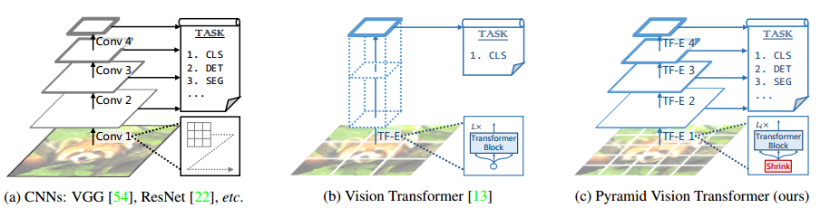

# 0 总体架构

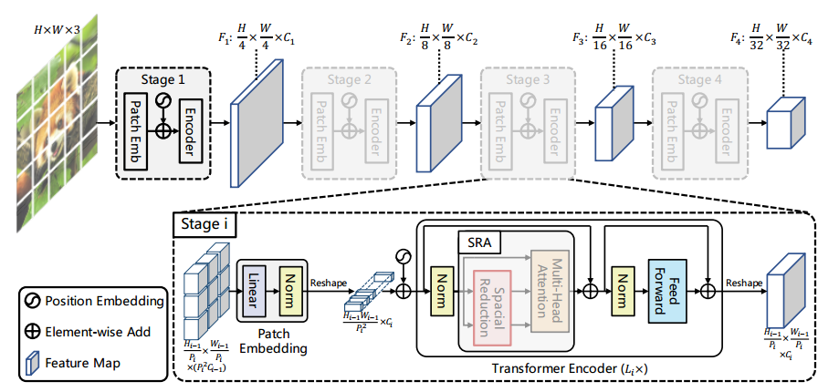

​	整个模型分为四个阶段，每个阶段由一个Patch Embedding和一个Transformer Enconder组成。按照金字塔结构，四个阶段的输出分辨率从高(4步)到低(32步)逐渐缩小。

​	在第一个stage，输入图像的尺寸为，首先将其分解为个patchs，每个patch大小为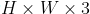。然后，将这些patchs拉直，进行线性投影得到嵌入后的patchs，其尺寸为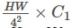。接着，将嵌入后的patchs和位置嵌入一同送到一个层的Transformer Encoder，将输出reshape后得到$F_1$，尺寸为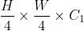。

​	按照与第一个stage相似的方式，可以得到stage2~4的输出，其输出步幅分别为8，16，32。于是便得到了特征金字塔，其可以轻松用于各种下游任务，如分类、检测、分割等。

# 1 Transformer特征金字塔

​	定义第i个stage的patch尺寸为$P_i$，在$stage\ i$的起始阶段，首先将输入feature map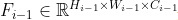分解为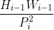个patchs，然后将每个patch拉直并投影到$C_i$维，经过线性投影后，嵌入的patch尺寸为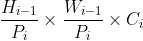，其中宽和高均比输入小$P_i$倍。

# 2 Transformer Encoder

​	针对stage i，其中的Transformer Encoder具有$L_i$个Encoder层，每个Encoder层由注意力层和前馈层组成。由于所提出的PVT需要处理高分辨率的feature maps（如：4步长），因此提出了一个空间缩减注意力（SRA）层，替代传统的多头注意力（MHA）层。
​	与MHA相似，所提出的SRA同样接受query Q、key K、value V作为输入，不同之处在于SRA将K和V的宽高分别降低为原来的$R_i$倍。

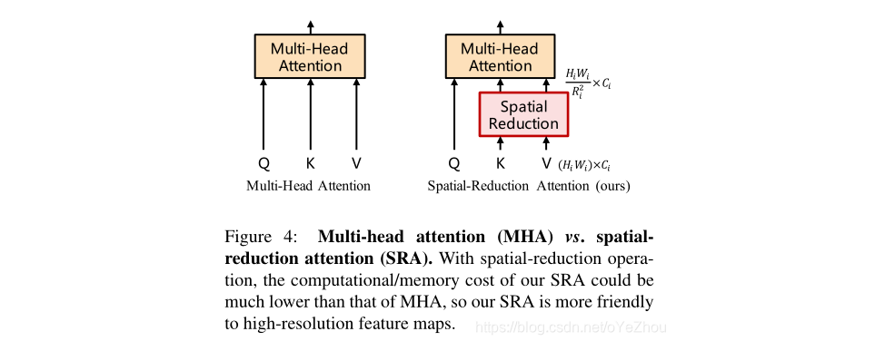

​	SRA的公式表示如下：

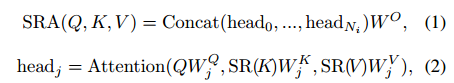

​	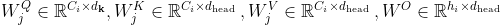为线性投影的参数，$N_i$为stage i中的Transformer Encoder的个数，因此每个head的维度为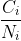。

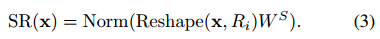

​	$R_i$表示stage i中注意力层的缩减率，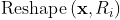将输入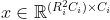重塑为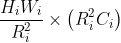。$W^s$为对输入进行降维的线性投影。

​	注意力机制公式不变。