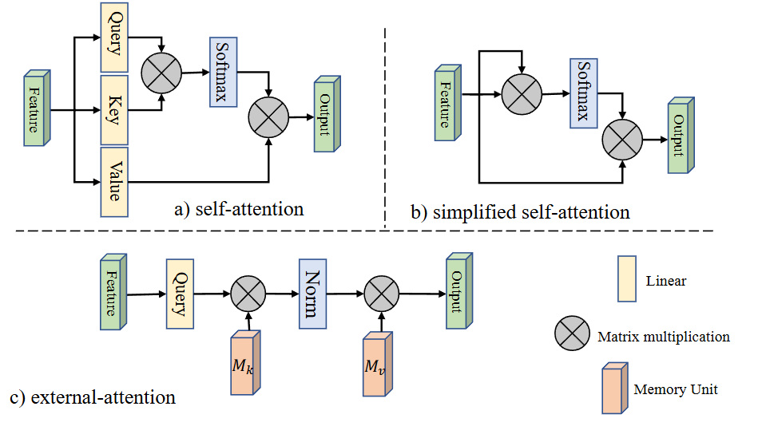
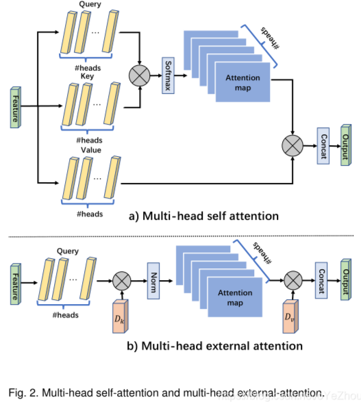

# External-Attention

​	使用两个级联的线性层以及归一化层去实现。总体来说，计算的是输入和外部记忆单元之间的注意力，记忆单元记为$M∈R^{S×d}$ ，可以表述为：
$$
 A =(\alpha)_{i, j}=\operatorname{Norm}\left(F M^{T}\right)\\F_{\text {out }} =A M 
$$
​	此处的$ (α)_{i,j}$ 表示第i个元素和M的第j行之间的相似性，记忆单元是一个独立与输入的科学系的参数，作为整个训练数据集的记忆。

​	EA使用一个外部矩阵M来建模第i个像素和第j行之间的相似性，且M是可学习的、大小可变的，同时，M还可以随着训练过程的进行建模整个数据集不同样本间的联系。

​	在实际应用中，M分为两个：M_k、M_v，分别对应SA中的K和V：
$$
 A =\operatorname{Norm}\left(F M_{k}^{T}\right) \\ F_{\text {out }} =A M_{v} . 
$$

# Normalization

​	在SA中，使用的Normalization是SoftMax，其对输入feature的尺度非常敏感。作者在EA中使用的double-normalization，其对列和行分别计算：

​	即对行和列分布进行了分母归一化。
$$
 (\tilde{\alpha})_{i, j} =F M_{k}^{T} \\ \hat{\alpha}_{i, j} =\exp \left(\tilde{\alpha}_{i, j}\right) / \sum_{k} \exp \left(\tilde{\alpha}_{k, j}\right) \\ \alpha_{i, j} =\hat{\alpha}_{i, j} / \sum_{k} \hat{\alpha}_{i, k}
$$

# Multi-head external attention

​	其所用公式如下
$$
 h_{i} =\text { ExternalAttention }\left(F_{i}, M_{k}, M_{v}\right) \\ F_{\text {out }} =\operatorname{MultiHead}\left(F, M_{k}, M_{v}\right) \\ =\operatorname{Concat}\left(h_{1}, \ldots, h_{H}\right) W_{o} 
$$
