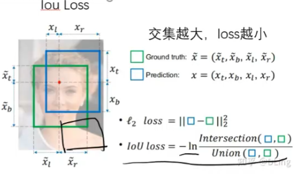

# 0 SAM模型任务目标

​	也即输入要求(可以是以下四种之一也可以是多个)和图片，然后输出对应的图片。

# 1 模型框架

## 1.1 prompt encoder

​	在prompt encoder中，输入为上述segmentation prompt中的内容，然后prompt encoder便会将其整合为一个向量。

​	prompt总共有point，box，mask，text四种，主要将其分为三类。

- point和box可以作为一类使用position encodings,通过位置编码与每种提示类型的学习嵌入相加来表示point和box。
- text可以使用CLP作为encoder，即通过Clip现成文本编码器。
- mask是一种密集型prompt，可以使用卷积作为encode，并与图像嵌入逐元素相加。

​	稀疏提示（除mask外）被映射到 256 维向量嵌入，

​	1.一个点表示为该点位置的位置信息编码与两个指示该点是在前景还是背景中的学习的嵌入向量中的其中之一的总和。

​	2.一个框由一对嵌入表示：(1) 其左上角的位置信息编码与表示“左上角”的学习嵌入相加，以及 (2) 采用指示“右下角”的学习嵌入的相同结构（两个点可以确定一个矩形）。

​	3.为了表示自由形式的文本，我们使用 CLIP 的文本编码器（一般来说，任何文本编码器都是可以的）。

​	4.密集提示（即掩码）与图像在空间上对应。我们将掩码以比输入图像低 4 倍的分辨率输入，然后使用两个 2×2、步长为 2 的卷积（输出通道分别为 4 和 16）进一步缩小 4 倍。最终的 1×1 卷积将通道维度映射到 256。每一层都由 GELU 激活和层归一化隔开。掩码和图像然后逐元素相加，如果没有掩码提示，则将表示“无掩码”的学习嵌入添加到每个图像嵌入位置。

​		[相关博客](https://blog.csdn.net/m0_46690805/article/details/138068189)

### point embedding

​	点提示$（point\ prompts）$在 $PromptEncoder$ 类中传入的是点的位置坐标信息。点提示通常用于指定图像中某些关键点的位置，这些点可能对应于图像中的重要特征或对象的特定部分。在$cv$任务中，这些点可以用来引导模型的注意力，使其专注于图像的特定区域。

​	点提示在$ PromptEncoder $的$ forward$ 方法中作为一个可选参数传入，它是一个元组$ points$，其中包含两个$ torch.Tensor$ 对象：

1.第一个张量包含点的坐标$（coords）$，形状通常是 $(batch\_size, num\_points, 2)$，其中$ batch_size$ 是输入的批次大小，$num\_points$ 是每个输入中点的数量，最后的 2 表示每个点的 x 和 y 坐标。

2.第二个张量包含点的标签$（labels）$，形状为 $(batch\_size, num\_points)$。这些标签用于区分不同的点，例如，可以标记正样本点、负样本点或其他类型的点。

​	在 $\_embed\_points$ 方法中，点提示的坐标首先被加上 0.5 来将点的位置从像素的左上角移动到像素的中心。然后，这些坐标会通过位置编码层 $PositionEmbeddingRandom$ 进行编码，以获得位置信息。最终，根据点的标签，特定的嵌入向量会被加到位置编码的点上，生成点提示的嵌入表示。

### box embedding

​	框提示（box prompts）在 $PromptEncoder $类中传入的也是坐标信息，但它们表示的是框（通常称为边界框或bounding boxes）的坐标，而不是单个点的坐标。边界框通常用于描述图像中对象的位置和范围，它们通常是矩形的，由左上角和右下角的坐标定义，或者通过中心点加上宽度和高度来定义。

​	在$ PromptEncoder $类的 forward 方法中，框提示作为 boxes 参数传入，它是一个$ torch.Tensor$ 对象，其形状通常是 $(batch\_size, num\_boxes, 4)$：

- batch_size 是输入的批次大小。

- $num \_ boxes$ 是每个输入中框的数量。

- 其中4 表示每个框由四个坐标组成，通常是$ (x1, y1, x2, y2)，其中 (x1, y1) $是框左上角的坐标，$(x2, y2) $是框右下角的坐标。

​	在 _embed_boxes 方法中，这些框的坐标首先被加上 0.5 来将框的位置从像素的左上角移动到像素的中心。然后，框的坐标被重塑为点坐标的形式，以便能够对框的每个角点进行位置编码。具体来说，每个框由两个点组成（左上角和右下角），因此通过 reshape(-1, 2, 2) 将框的坐标转换为 (batch_size * num_boxes, 2, 2) 的形状。

​	接着，使用 $PositionEmbeddingRandom$ 的 $forward\_with\_coords$ 方法对这些角点进行位置编码，以获得每个角点的位置信息。最后，根据角点的位置，将特定的嵌入向量加到位置编码的结果上，从而生成框提示的嵌入表示。

### Position Embedding

​	SAM中的point_embedding、box_embedding、image_embedding均会用到位置编码。官网给的代码里面使用到的是PositionEmbeddingRandom这个类。该类会随机高斯生产位置编码矩阵维度为(2, 64)。然后将带有位置信息的坐标点、框、图形的grid信息等右乘该矩阵，相当于改变了坐标系(左乘矩阵坐标系不变，坐标平移加旋转；右成矩阵坐标系改变，点不变)，这里以旋转矩阵为例(逆时针旋转90度):
$$
 R=\begin{bmatrix}   cos(90)&-sin(90) \\   sin(90)&cos(90) \end{bmatrix}= \begin{bmatrix}   0&-1 \\   1&0 \end{bmatrix}
$$
左乘旋转矩阵相当于点沿着原点旋转。
$$
 \begin{bmatrix}   0&-1 \\   1&0 \end{bmatrix} * [1,1]^T=\begin{bmatrix}   -1&1  \end{bmatrix}
$$
右乘旋转矩阵相当于点不动，坐标系旋转90度。
$$
[1,1] \begin{bmatrix}   0&-1 \\   1&0 \end{bmatrix} =\begin{bmatrix}   1&-1  \end{bmatrix}
$$

​	上局橙色部分是在笛卡尔坐标系下y=x的线段，蓝色部分是旋转90度后的线段,绿色部分是坐标系旋转90度后的线段(将笛卡尔坐标系下的y =x 和 y=-x 两条直线分别当做是x轴和y轴)。当坐标信息点乘随机的位置矩阵后，为了保证周期性以及体现出相对位置，因此会经过正弦和余弦函数后再把结果拼接起来。

1. **高斯矩阵生成**：首先生成一个随机的高斯矩阵。这个矩阵的每个元素都是从一个高斯分布中采样得到的。
2. **位置编码**：将输入的位置向量与高斯矩阵相乘，得到编码后的位置信息。

具体可以看[位置编码](https://blog.csdn.net/weixin_43406046/article/details/130745363),[知乎编码](https://zhuanlan.zhihu.com/p/668396354)。

## 1.2 image enconder

​	此处对于图像的提取我们使用VIT来进行，特征提取，不使用CNN的图像提取是因为最终会使用特征融合和多模态。

​	一般来说，图像编码器可以是任何输出 C×H×W 图像嵌入的网络。使用一个 ViT-H/16，它具有 14×14 的窗口注意力和四个等间距的全局注意力块，图像编码器的输出是输入图像的 16 倍降尺度（下采样）嵌入。

​	通过调整图像大小并填充较短边获得的 1024×1024 的输入分辨率。因此，图像嵌入为 64×64。为了减少通道维度，使用 1×1 卷积得到 256 个通道，然后再使用具有 256 个通道的 3×3 卷积，且每个卷积之后都跟着一个层归一化。

## 1.3 mask enconder

[相关博客](https://zhuanlan.zhihu.com/p/621320070)

​	$mask \ enconder$有效地将图像嵌入、提示嵌入额输出特征映射到一个掩码，

### 博客讲解

- 在$prompt\ embedding$进入$decoder$之前，先在它上面$concat$了一组可学习的$output\ tokens，output\ tokens$由两个部分构成：

- - 一个是$iou\ token$，它会在后面被分离出来用于预测$iou$的可靠性（对应结构图右侧的$IoU\ output\ token$），它受到模型计算出的$iou$与模型计算出的mask与GT实际的$iou$之间的$MSE\ loss$监督；
  - 另一个是$mask\ token$，它也会在后面被分离出来参与预测最终的$mask$（对应结构图右侧的$output\ token\ per\ mask$），$mask$受到$focal\ loss$和$dice\ loss $的20:1的加权组合监督。
  - 这两个token的意义比较抽象，因为理论来说进入decoder的变量应该是由模型的输入，也就是prompt和image的映射构成，但这两个token的定义与prompt和image完全没有关系，而是凭空出现的。从结果反推原因，只能把它们理解成对模型的额外约束，因为它们两个参与构成了模型的两个输出并且有loss对他们进行监督。
  - 最终$prompt\ embedding$（这一步改名叫$prompt\ token$）和刚才提到这两个$token\ concat$到一起统称为$tokens$进入$decoder$。

- image embedding在进入decoder之前也要进行一步操作：dense prompt由于包含密集的空间信息，与image embedding所在的特征空间一致性更高，所以直接与image embedding相加融合。因为后面要与prompt做cross attention融合，这里还要先算一下image embedding的位置编码。

- 接下来{image embedding，image embedding的位置编码，tokens}进入一个两层transformer结构的decoder做融合。值得注意的是，在[transformer](https://zhida.zhihu.com/search?q=transformer&zhida_source=entity&is_preview=1)结构中，为了保持位置信息始终不丢失，每做一次attention运算，不管是[self-attention](https://zhida.zhihu.com/search?q=self-attention&zhida_source=entity&is_preview=1)还是cross-attention，tokens都叠加一次初始的tokens，image embedding都叠加一次它自己的位置编码，并且每个attention后边都接一个layer_norm。

- - tokens先过一个self-attention。
  - tokens作为q，对image embedding做cross attention，更新tokens。
  - tokens再过两层的mlp做特征变换。
  - image embedding作为q，对tokens做cross attention，更新image embedding。

- 更新后的tokens作为q，再对更新后的image embedding做cross attention，产生最终的tokens。

- 更新后的image embedding过两层kernel_size=2, stride=2的转置卷积，升采样到4x大小（依然是4x降采样原图的大小），产生最终的image embedding。

- 接下来兵分两路：

- - mask token被从tokens中分离出来（因为他一开始就是concat上去的，可以直接按维度摘出来），过一个三层的mlp调整channel数与最终的image embedding一致，并且他们两个做[矩阵乘法](https://zhida.zhihu.com/search?q=矩阵乘法&zhida_source=entity&is_preview=1)生成mask的预测。
  - $iou token$被从tokens中分离出来，也过一个三层的mlp生成最终的iou预测。

- 最后，如前文所述，分别对mask的预测和iou预测进行监督，反向传播，更新参数。

### 论文原文

​	image embedding是一个图片嵌入。

​	output tokens为输出特征，一般输出为三个，prompt tokens即是上面四个。这两个都将是序列，因此可以做自注意力，然后通过token to image attention与通过绿线输出进来的图片向量做自注意力（token作为Q，image作为K,V），通过$MLP$后再与图片做自注意力机制image to token attention（image作为Q，token作为K,V）。

​	$2X\ conv\ trans$是将通过自注意力机制变小的图片恢复为原来的尺寸，并将$MLP$后的prompt与自注意力机制后的图像再次attention，然后一个获得$IoU$的分数，一个通过输出三个目标后的结果与图像进行点积生成masks。

​	论文中每个decoder层中执行以下四个步骤，也即对上述话的总结：

(1) self-attention on the tokens,

(2)cross-attention from tokens (as queries) to the image embedding,

(3) a point-wise MLP updates each token, 

(4)cross-attention from the image embedding (as queries) to tokens. 

​	最后使用提示信息更新图像嵌入；且在cross attention中，image embedding被视为一组$64 \times64 \times 256$维度的向量，在训练中每个$self/cross-attention$和$MLP$有着残差连接、层归一化以及0.1的dropout。我们使用两层$decoder$，下一个$decoder$接收来自上一层的更新标记和更新图像的嵌入。

​	确保解码器能够访问关键的几何信息，在图像嵌入参与注意力层时，会添加位置编码。在参与注意力层时，所有原始提示词（包括它们的位置编码）都会重新添加到更新后的词语中。

​	在运行解码器后，通过两个转置卷积层将更新的图像嵌入向上采样 4 倍（现在它相对于输入图像缩小了 4 倍）。然后，token再次关注图像嵌入，并将更新后的输出token嵌入传递给一个小的 3 层 $MLP$，该 $MLP$ 输出一个与上采样图像嵌入的通道维数匹配的向量。最后，通过上采样图像嵌入和 $MLP$ 输出的空间点积预测掩码。

​	密集提示（即掩码）与图像具有空间对应关系。我们以比输入图像低4倍的分辨率输入掩码，然后使用两个2×2、步幅为2的卷积分别将输出通道为4和16，从而额外下采样4倍(即最终从64->16)。最后，一个1×1卷积将通道维度映射到256(embed_dim)。每一层都由$GELU$激活和层归一化分隔。然后，掩码和图像嵌入逐元素相加。如果没有掩码提示，则会将表示“无掩码”的学习嵌入添加到每个图像嵌入位置。

​	Transformer 使用 256 的嵌入维度。Transformer $MLP$ 块的内部维度很大，为 2048，但 $MLP$ 仅应用于prompt token，而这些token维度相对较少（通常不超过 20）。在cross attention层中，我们有 64×64 的图像嵌入，为了提高计算效率，我们将$queries、keys和values$的通道维度减半至 128。所有注意力层使用 8 个头部。用于上采样输出图像嵌入的转置卷积是2×2，步幅为2，输出通道维度分别为64和32，并且使用$GELU$激活函数且之间由层归一化层分隔。

​	在训练过程中，计算真实值和每个预测掩码之间的损失，但只从最低损失进行反向传播。为了在应用中使用，我们希望对预测的掩码进行排名，因此添加了一个小的头部（作用在额外的output token上），用于估算每个预测掩码与其覆盖对象之间的交并比（$IoU$）。

​	**一个prompt为什么会出3个mask？**3是个经验值且作者认为3个足够覆盖大部分情况，主要解决物体之间相互覆盖，如点击衣服，那么到底是指衣服还是指人？对于一个模糊的提示，模型会对多个有效的掩码进行平均，从而得到一个输出，使其能够针对单个提示预测多个输出掩码。当使用多个提示时，歧义的情况要少得多，三个输出掩码通常会变得相似。为了最大程度地减少训练时的损失（收敛）计算，确保单个无歧义掩码接收常规梯度信号，因此当给出多个提示时（多个point），我们只预测一个掩码。这是通过添加第四个输出标记用于额外的掩码预测,第四个掩码在单个提示的情况下不会返回，多个提示情况下唯一返回的掩码。

​	**使用$IoU$的方式，排序mask**，对于$IoU$交集比较大的情况，做训练的时候只有损失最小的$IoU$才会参与反向传播，而舍弃其他$IoU$的结果，即仅仅训练好的结果。

## 1.4 loss

​	主要使用的是focal loss；每一个mask，会随机产生11种prompt与之配对。是解决类别不均衡的损失函数，即通过系数来控制好分与难分的权重。

​	我们使用focal loss和dice loss的线性组合来监督掩码预测，其中焦点损失与骰子损失的比例为 20:1，我们观察到在每个解码器层之后进行辅助深度监督是无益的。IoU预测头使用均方误差损失（mean-square-error loss）在IoU预测值和预测掩码与真实掩码的IoU之间进行训练，以1.0的常数缩放因子添加到mask loss中。

###  focal loss

​	通过引入一个调制因子，动态降低易区分样本的权重，从而将训练重心放在难区分的样本上。公式如下：
$$
L_{FL} = -\alpha_t (1 - p_t)^\gamma \log(p_t)
$$

- $( p_t )$ 模型预测的概率。
- $( \alpha_t )$ 平衡因子，用于调整正负样本的权重。
- $( \gamma )$ 调制因子，控制易区分样本的权重降低程度。

### Dice Loss

**Dice Loss** 是基于Dice系数的一种损失函数，常用于语义分割任务，特别是在医学图像分割中。Dice系数用于衡量两个样本的相似度，取值范围在0到1之间，值越大表示越相似。Dice Loss的公式如下：
$$
L_{Dice} = 1 - \frac{2|X \cap Y|}{|X| + |Y|}
$$

- $( |X \cap Y| )$ 是预测值和真实值的交集。
- $( |X| ) 和 ( |Y| )$ 分别是预测值和真实值的元素个数。

## 1.5 Training algorithm