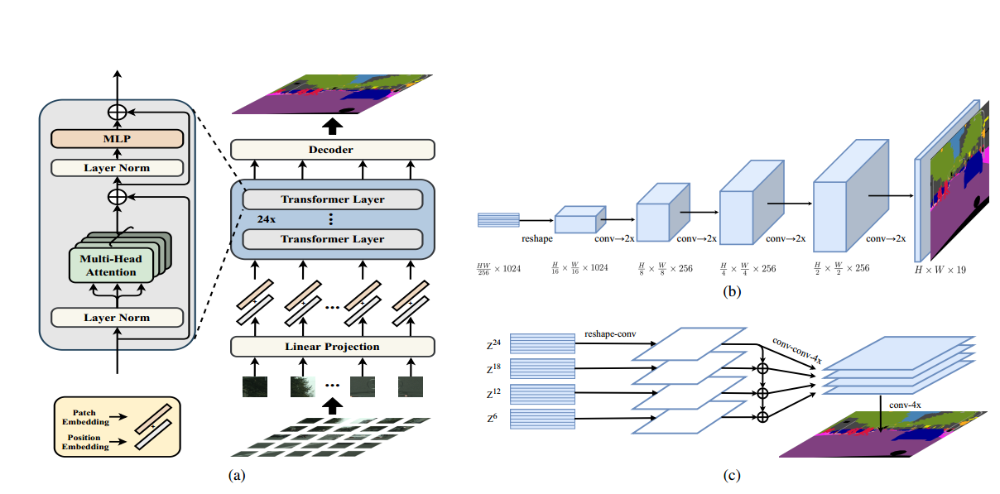
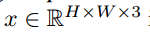
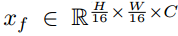
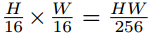
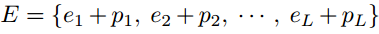

# 0 Segmentation transformers

​	由于图像并非一维数据，因此我们需要进行图像序列化以将输入图像转换为$Z$。一种简单的方法就是将像素点平铺为$3HW$的序列，但考虑到Transformer的二次模型的复杂性，不可能同时在空间和时间上处理这样的高维向量。

​	在之前的Swin Transformer中，将图像下采样为，因此我们可仿照其设置$L$为，即下采样16。且在每一个像素中也嵌入一个位置向量，。