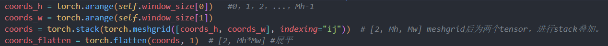
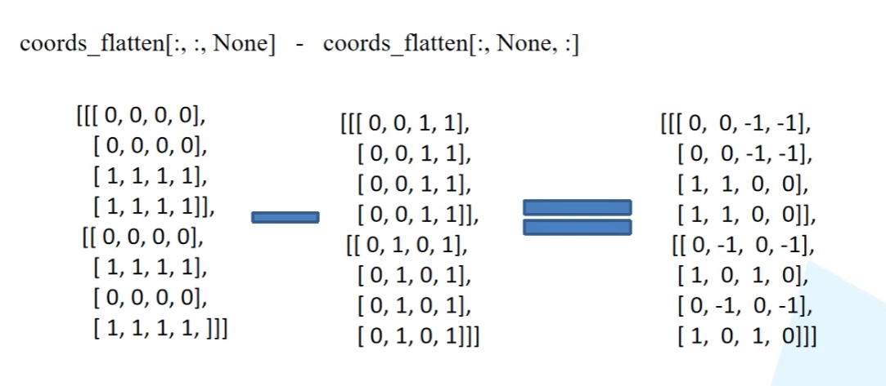

## 1 网络整体框架

- Swin Transformer使用了类似卷积神经网络中的层次化构建方法（Hierarchical feature maps），比如特征图尺寸中有对图像下采样4倍的，8倍的以及16倍的，这样的backbone有助于在此基础上构建目标检测，实例分割等任务。而在之前的Vision Transformer中是一开始就直接下采样16倍，后面的特征图也是维持这个下采样率不变。
- 在Swin Transformer中使用了Windows Multi-Head Self-Attention(W-MSA)的概念，比如在下图的4倍下采样和8倍下采样中，将特征图划分成了多个不相交的区域（Window），并且Multi-Head Self-Attention只在每个窗口（Window）内进行。相对于Vision Transformer中直接对整个（Global）特征图进行Multi-Head Self-Attention，这样做的目的是能够减少计算量的，尤其是在浅层特征图很大的时候。
**下采样**:
- **16×16**：
  - 这意味着输入图像被分割成16×16像素的小块。每个小块被处理成一个特征向量。
  - 例如，如果输入图像的分辨率是256×256像素，那么经过16倍下采样后，会得到16×16=256个小块。
- **4×4**：
  - 这意味着输入图像被分割成4×4像素的小块。每个小块被处理成一个特征向量。
  - 例如，如果输入图像的分辨率是256×256像素，那么经过4倍下采样后，会得到64×64=4096个小块。

​	接下来，简单看下原论文中给出的关于Swin Transformer（Swin-T）网络的架构图。

- 首先将图片输入到Patch Partition模块中进行分块，即每4x4相邻的像素为一个Patch，然后在channel方向展平（flatten）。假设输入的是RGB三通道图片，那么每个patch就有4x4=16个像素，然后每个像素有R、G、B三个值所以展平后是16x3=48，所以通过Patch Partition后图像shape由 $[H, W, 3]$变成了$ [H/4, W/4, 48]$。然后在通过Linear Embeding层对每个像素的channel数据做线性变换，由48变成C，即图像shape再由 $[H/4, W/4, 48]$变成了 $[H/4, W/4, C]$。其实在源码中Patch Partition和Linear Embeding就是直接通过一个卷积层实现的，和之前Vision Transformer中讲的 Embedding层结构一模一样。

- 然后就是通过四个Stage构建不同大小的特征图，除了Stage1中先通过一个Linear Embeding层外，剩下三个stage都是先通过一个Patch Merging层（类似于池化层）进行下采样（后面会细讲）。然后都是重复堆叠Swin Transformer Block注意这里的Block其实有两种结构，如图(b)中所示，这两种结构的不同之处仅在于一个使用了W-MSA结构，一个使用了SW-MSA结构。而且这两个结构是成对使用的，先使用一个W-MSA结构再使用一个SW-MSA结构。所以你会发现堆叠Swin Transformer Block的次数都是偶数（因为成对使用）。

- 最后对于分类网络，后面还会接上一个Layer Norm层、全局池化层以及全连接层得到最终输出。图中没有画，但源码中是这样做的，其作者想将SwinT成为一个骨干网络。
  

## 2 Patch Merging详解

​	如下图所示，假设输入Patch Merging的是一个4x4大小的单通道特征图（feature map），Patch Merging会将每个2x2的相邻像素划分为一个patch，然后将每个patch中相同位置（同一颜色）像素给拼在一起就得到了4个feature map。接着将这四个feature map在深度方向进行concat拼接，然后在通过一个LayerNorm层。最后通过一个全连接层在feature map的深度方向做线性变化，将feature map的深度由C变成C/2。通过这个简单的例子可以看出，通过Patch Merging层后，feature map的高和宽会减半，深度会翻倍。

## 3 W-MSA详解

​	引入Windows Multi-head Self-Attention（W-MSA）模块是为了减少计算量。如下图所示，左侧使用的是普通的Multi-head Self-Attention（MSA）模块，对于feature map中的每个像素（或称作token，patch）在Self-Attention计算过程中需要和所有的像素去计算。但在图右侧，在使用Windows Multi-head Self-Attention（W-MSA）模块时，首先将feature map按照MxM（例子中的M=2）大小划分成一个个Windows，然后单独对每个Windows内部进行Self-Attention。

两者的计算量具体差多少呢？
$$
\Omega (MSA)=4hwC^2 + 2{(hw)}^2C\\ \Omega (W-MSA)=4hwC^2 + 2M^2hwC
$$

## 4 SW-MSA详解

​	前面有说，采用W-MSA模块时，只会在每个窗口内进行自注意力计算，所以窗口与窗口之间是无法进行信息传递的。为了解决这个问题，作者引入了Shifted Windows Multi-Head Self-Attention（SW-MSA）模块，即进行偏移的W-MSA。如下图所示，左侧使用的是刚刚讲的W-MSA（假设是第L层），那么根据之前介绍的W-MSA和SW-MSA是成对使用的，那么第L+1层使用的就是SW-MSA（右侧图）。根据左右两幅图对比能够发现窗口（Windows）发生了偏移（可以理解成窗口从左上角分别向右侧和下方各偏移了$ \lfloor \frac {M} {2}  \rfloor $个像素）。看下偏移后的窗口（右侧图），比如对于第一行第2列的2x4的窗口，它能够使第L层的第一排的两个窗口信息进行交流。再比如，第二行第二列的4x4的窗口，他能够使第L层的四个窗口信息进行交流，其他的同理。那么这就解决了不同窗口之间无法进行信息交流的问题。

​	根据上图，可以发现通过将窗口进行偏移后，由原来的4个窗口变成9个窗口了。后面又要对每个窗口内部进行MSA，这样做感觉又变麻烦了。为了解决这个麻烦，作者又提出而了`Efficient batch computation for shifted configuration`，一种更加高效的计算方法。下面是原论文给的示意图。

​	而把不同的区域合并在一起（比如5和3）进行MSA，信息会错乱，因为是平移过来的，因此在实际计算中使用的是`masked MSA`即带蒙板mask的MSA，就能够通过设置蒙板来隔绝不同区域的信息了

​	下图是以上面的区域5和区域3为例。对于该窗口内的每一个像素（或称token，patch）在进行MSA计算时，都要先生成对应的$query(q)，key(k)，value(v)$。假设对于上图的像素0而言，得到$q^0$ 后要与每一个像素的k进行匹配（match），假设$\alpha _{0,0}$ 代表$q^0$与像素0对应的$k^0$进行匹配的结果，那么同理可以得到$ \alpha _{0,0}$ 至 $\alpha _{0,15}$ 。按照普通的MSA计算，接下来就是SoftMax操作了。

​	但对于这里的`masked MSA`，像素0是属于区域5的，我们只想让它和区域5内的像素进行匹配。那么我们可以将像素0与区域3中的所有像素匹配结果都减去100（例如 $\alpha _{0,2}, \alpha _{0,3}, \alpha _{0,6}, \alpha _{0,7}$ 等等），由于$ \alpha$的值都很小，将其中一些数减去100后在通过SoftMax得到对应的权重都等于0了。在计算完后还要把数据给挪回到原来的位置上（例如上述的A，B，C区域）。

​	其主要计算过程就是将某个区域的像素展平，然后进行内积（转置相乘），计算出的结果如若出现跨区域相乘则进行掩码操作。

## 5 Relative Position Bias详解

​	根据论文中提供的公式可知是在Q和K进行匹配并除以$ \sqrt d $ 后加上了相对位置偏执B。

$$
 Attention(Q, K, V)=SoftMax(\frac {QK^T} {\sqrt d} + B)V
$$

​	如下图，假设输入的feature map高宽都为2，那么首先我们可以构建出每个像素的绝对位置（左下方的矩阵），对于每个像素的绝对位置是使用行号和列号表示的。比如蓝色的像素对应的是第0行第0列所以绝对位置索引是$(0,0)$。

​	接下来再看看相对位置索引，首先看下蓝色的像素，在蓝色像素使用q与所有像素k进行匹配过程中，以蓝色像素为参考点，然后用蓝色像素的绝对位置索引与其他位置索引进行相减，就得到其他位置相对蓝色像素的相对位置索引；例如黄色像素的绝对位置索引是$ (0,1)$，则它相对蓝色像素的相对位置索引为$(0, 0) - (0, 1)=(0, -1)$。

​	这里是`相对位置索引`，并不是`相对位置偏执参数`。因为后面我们会根据相对位置索引去取对应的参数。比如说黄色像素是在蓝色像素的右边，所以相对蓝色像素的相对位置索引为(0, -1)。绿色像素是在红色像素的右边，所以相对红色像素的相对位置索引为(0, -1)。可以发现这两者的相对位置索引都是(0, -1)，所以他们使用的相对位置偏执参数都是一样的。

​	在源码中作者为了方便把二维索引给转成了一维索引。首先在原始的相对位置索引上加上M-1(M为窗口的大小，在本示例中M=2)，加上之后索引中就不会有负数了。

​	接着将所有的**行标**都乘上$2M-1$。

​	最后将行标和列标进行相加。

​	之前计算的是相对位置索引并不是相对位置偏执参数。真正使用到的可训练参数$ \hat{B}$ 是保存在`relative position bias table`表里的，这个表的长度是等于$(2M-1) \times (2M-1)$的。那么上述公式中的相对位置偏执参数B是根据上面的相对位置索引表根据查`relative position bias table`表得到的，如下图所示。

## 代码问题处理

### creat mask

​	在creat mask中创建分块并进行编号如下图所示。

​	进行shift后进行分块然后赋值。

然后window partition进行了分块。

​	此处在上述分块后，num_windows=9，且每个都为[Mh，Mw]的矩阵。

​	在第二行代码中进行展平处理，如下图。

​	而后unsqueeze需要进行广播后才可以进行矩阵相加减，在第一维度插入的广播的时候我们可以想象成展平一个行向量(1,Mh\*Mw)需要在列方向上进行复制9次(左边)；同理在第二维度插入的广播的时候我们可以想象成一个列向量(Mh\*Mw,1)在行方向上进行复制9次(右边)。

​	此处相同数字就是想着进行自注意力机制而不同区域则没有必要进行自注意力计算，然后进行相减得到0的地方就需要我们进行自注意力的计算。然后在不等于0的区域填入100，等于0的区域写入0，即掩码操作，与上方理论知识有出入。

### Relative Position Bias

当我们假设窗口大小为2的时候，展平后上下拼即是在理论中的绝对坐标。

这行代码即与前方（unsqueeze）新加维度相同，利用行列向量进行广播可以很好理解。

​	而减法则是涵盖了理论部分四个相对模块的相对位置的计算。

然后通过上方理论知识相加减之类的得到相对位置索引，然后根据偏置值进行赋值。

