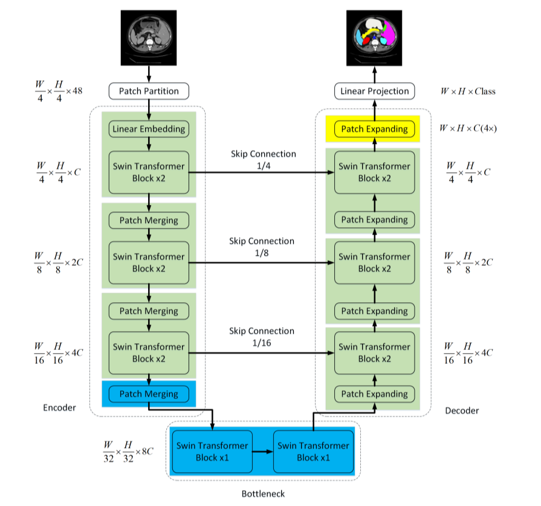
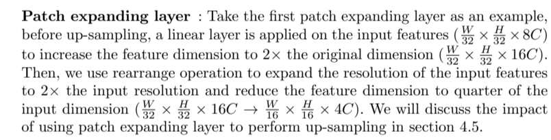

SwinUnet与SwinTransformer有很大的相似之处，不同之处主要集中在上采样。



# 1 PatchExpanding

​	以下为论文原文。



​	即先将C扩大两倍然后再缩小四倍，以此来对应`Patch Merging`层。

```python
class PatchExpand(nn.Module):
    def __init__(self, input_resolution, dim, dim_scale=2, norm_layer=nn.LayerNorm): #scale规模倍数
        super().__init__()
        self.input_resolution = input_resolution
        self.dim = dim
        self.expand = nn.Linear(dim, 2*dim, bias=False) if dim_scale==2 else nn.Identity() #扩大C两倍
        self.norm = norm_layer(dim // dim_scale)

    def forward(self, x):
        """
        x: B, H*W, C
        """
        H, W = self.input_resolution
        x = self.expand(x) #扩大C
        B, L, C = x.shape
        assert L == H * W, "input feature has wrong size"

        x = x.view(B, H, W, C) #将之前展平的x重塑为B H W C
        #将x最后一个维度拆分为三个部分，分别是 p1、p2 和 c。
        #将拆分后的维度重新组合，形成新的维度顺序。
        x = rearrange(x, 'b h w (p1 p2 c)-> b (h p1) (w p2) c', p1=2, p2=2, c=C//4)
        x = x.view(B,-1,C//4)
        x= self.norm(x)

        return x
```

​	而如同上图所示，其余层的上采样的时候仅仅是一些SwinT   block的堆叠再加上一些上采样的操作。

```python
layer_up = BasicLayer_up(dim=int(embed_dim * 2 ** (self.num_layers-1-i_layer)),
	                  input_resolution=(patches_resolution[0] // (2 ** (self.num_layers-1-i_layer)),
					  patches_resolution[1] // (2 ** (self.num_layers-1-i_layer))),
					  depth=depths[(self.num_layers-1-i_layer)],
                      num_heads=num_heads[(self.num_layers-1-i_layer)],
                      window_size=window_size,
                      mlp_ratio=self.mlp_ratio,
                      qkv_bias=qkv_bias, qk_scale=qk_scale,
                      drop=drop_rate, attn_drop=attn_drop_rate,
                      drop_path=dpr[sum(depths[:(self.num_layers-1-i_layer)]):sum(depths[:(self.num_layers-1-i_layer) + 1])],
                      norm_layer=norm_layer,
                      upsample=PatchExpand if (i_layer < self.num_layers - 1) else None,
                      use_checkpoint=use_checkpoint)#仅仅是一些SwinT Block的堆叠多了一些上采样模块
```

## PatchExpanding(X4)

​	即把H，W复原即可，代码后方拿到此处数据后选择再复原。

```python
class FinalPatchExpand_X4(nn.Module):
    def __init__(self, input_resolution, dim, dim_scale=4, norm_layer=nn.LayerNorm):
        super().__init__()
        self.input_resolution = input_resolution
        self.dim = dim
        self.dim_scale = dim_scale
        self.expand = nn.Linear(dim, 16*dim, bias=False)
        self.output_dim = dim 
        self.norm = norm_layer(self.output_dim)

    def forward(self, x):
        """
        x: B, H*W, C
        """
        H, W = self.input_resolution
        x = self.expand(x)
        B, L, C = x.shape
        assert L == H * W, "input feature has wrong size"

        x = x.view(B, H, W, C)
        x = rearrange(x, 'b h w (p1 p2 c)-> b (h p1) (w p2) c', p1=self.dim_scale, p2=self.dim_scale, c=C//(self.dim_scale**2)) #这一步到底是干啥的 这一步好像就是已经复原了，下一步似乎是展平的？
        x = x.view(B,-1,self.output_dim) #OUTPUT_DIM=96
        x= self.norm(x)

        return x
```

# 2 Encoder

此处Encoder and Bottleneck中的Bottlenck其实就是Encoder的前几层没什么区别，无特殊性。