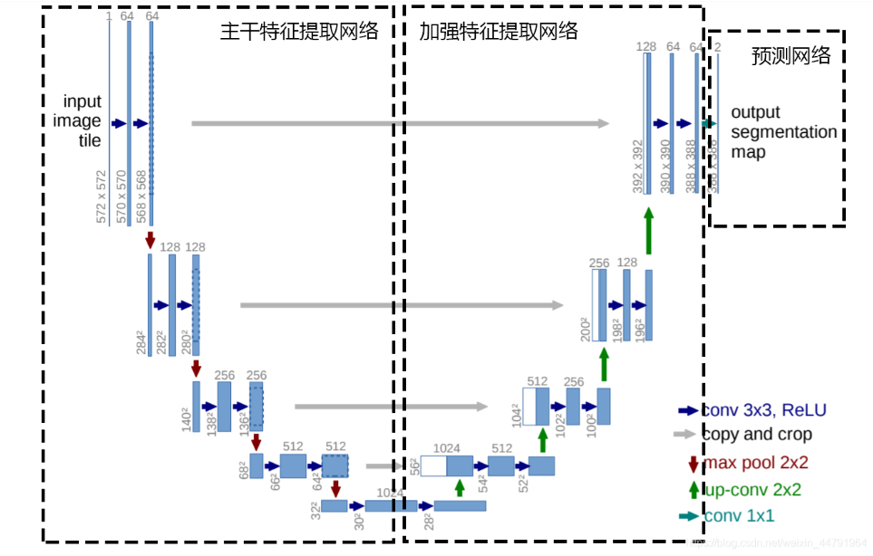
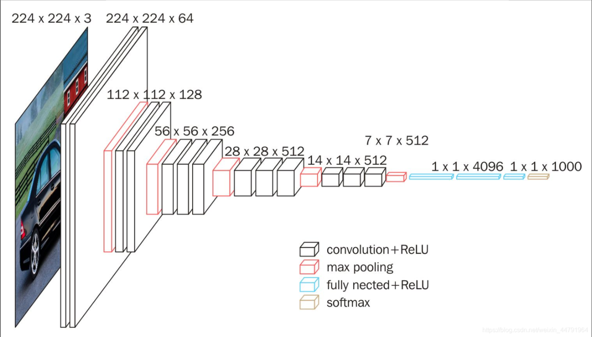
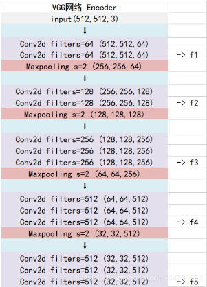
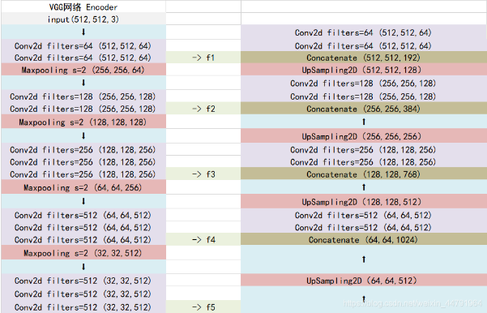

# Unet模型介绍

​	第一部分是主干特征提取部分，利用主干部分获得一个又一个的特征层，Unet的主干特征提取部分与VGG相似，为卷积和最大池化的堆叠。利用主干特征提取部分我们可以获得五个初步有效特征层，在第二步中，我们会利用这五个有效特征层可以进行特征融合。

​	第二部分是加强特征提取部分，我们可以利用主干部分获取到的五个初步有效特征层进行上采样，并且进行特征融合，获得一个最终的，融合了所有特征的有效特征层。

​	第三部分是预测部分，我们会利用最终获得的最后一个有效特征层对每一个特征点进行分类，相当于对每一个像素点进行分类。

# Unet实现思路

## 1、主干网络介绍

​	Unet的主干特征提取部分由卷积+最大池化组成，整体结构与VGG类似。本文所采用的主干特征提取网络为VGG16，这样也方便使用imagnet上的预训练权重。

当我们使用VGG16作为主干特征提取网络的时候，我们只会用到两种类型的层，分别是卷积层和最大池化层。

当输入的图像大小为512x512x3的时候，具体执行方式如下：
1、conv1：进行两次[3,3]的64通道的卷积，获得一个[512,512,64]的初步有效特征层，再进行2X2最大池化，获得一个[256,256,64]的特征层。
2、conv2：进行两次[3,3]的128通道的卷积，获得一个[256,256,128]的初步有效特征层，再进行2X2最大池化，获得一个[128,128,128]的特征层。
3、conv3：进行三次[3,3]的256通道的卷积，获得一个[128,128,256]的初步有效特征层，再进行2X2最大池化，获得一个[64,64,256]的特征层。
4、conv4：进行三次[3,3]的512通道的卷积，获得一个[64,64,512]的初步有效特征层，再进行2X2最大池化，获得一个[32,32,512]的特征层。
5、conv5：进行三次[3,3]的512通道的卷积，获得一个[32,32,512]的初步有效特征层。

## 2、加强特征提取结构

利用第一步我们可以获得五个初步的有效特征层，在加强特征提取网络这里，我们会利用这五个初步的有效特征层进行特征融合，特征融合的方式就是对特征层进行上采样并且进行堆叠。

为了方便网络的构建与更好的通用性，我们的Unet和上图的Unet结构有些许不同，在上采样时直接进行两倍上采样再进行特征融合，最终获得的特征层和输入图片的高宽相同。

​	**Concatenate层**是一种在深度学习中常用的层类型，‌它主要用于将两个或多个张量（‌tensor）‌沿着指定的轴（‌axis）‌连接在一起。此处将上采样后的数据与主干网络池化层前的数据拼接在一起，然后继续卷积上采样循环。