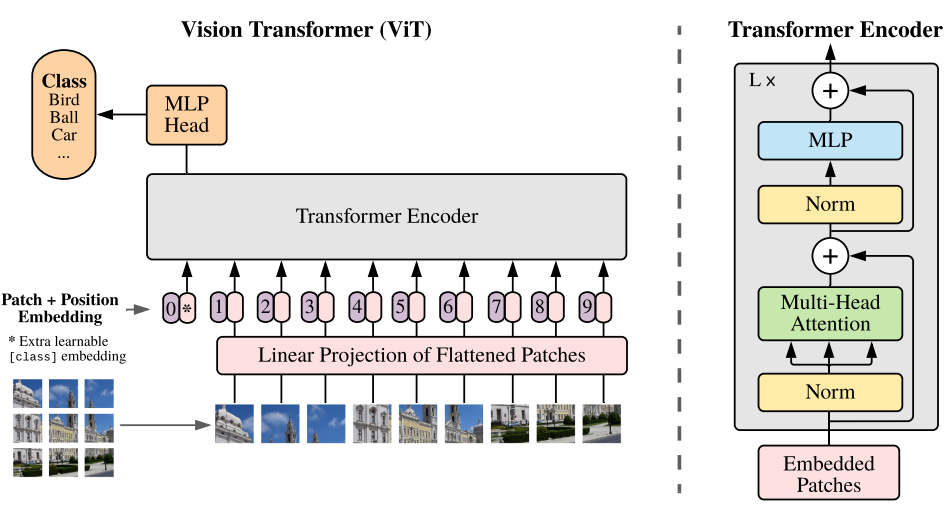
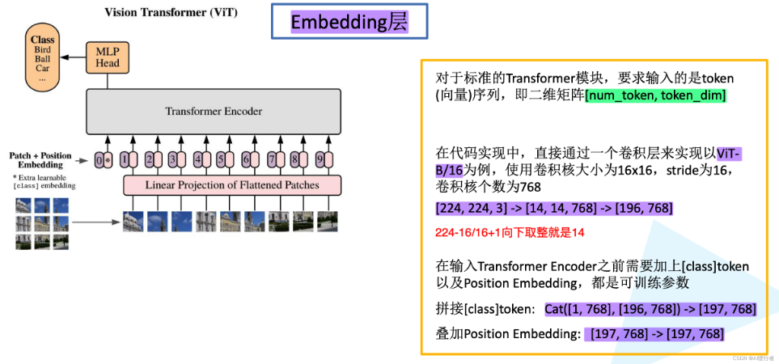
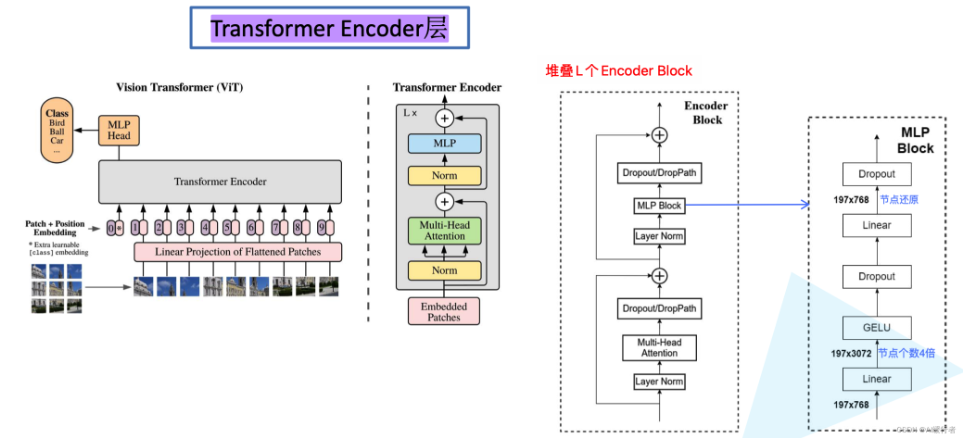
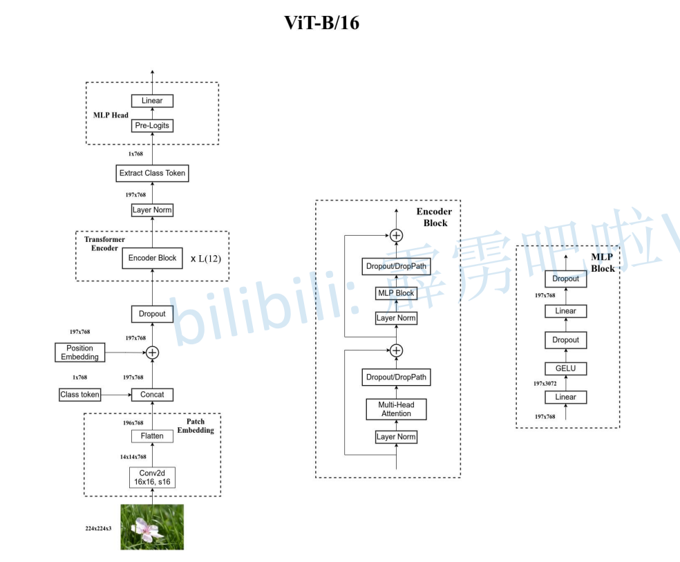

# 论文笔记

​	模型架构图：ViT将输入图片分为多个patch(16x16)，再将每个patch投影为固定长度的向量送入Transformer，后续encoder的操作和原始Transformer中完全相同。在输入序列中加入一个特殊的token，该token对应的输出即为最后的类别预测。

1. **Patch embedding：**例如输入图片大小为$224\times224$，将图片分为固定大小的patch，patch大小为 $16\times16$，则每张图像会生成 $224\times224/16\times16=196$个patch，即输入序列长度为196，每个patch维度$16\times16\times3=768$，线性投射层的维度为$768 \times N (N=768)$，因此输入通过线性投射层之后的维度依然为$196\times768$，即一共有196个token，每个token的维度是768。这里还需要在前面加上一个分类字符cls_token，因此最终的维度是$197\times 768$。到目前为止，已经通过patch embedding将一个视觉问题转化为了一个seq2seq问题。
2. Positional encoding(standard learnable 1D position embeddings)：ViT同样需要加入位置编码，位置编码可以理解为一张表，表一共有N行，N的大小和输入序列长度相同，每一行代表一个向量，向量的维度和输入序列embedding的维度相同(768)。注意位置编码的操作是sum，而不是concat。加入位置编码信息之后，维度依然是$197\times 768$。
3. **LN/multi-head attention/LN：**LN输出维度依然是$197\times 768$。多头自注意力时，先将输入映射到 $\boldsymbol {q，k，v}$，如果只有一个头，$ \boldsymbol {q，k，v}$的维度都是$ 197\times 768$，如果有12个头( 768 / 12 = 64 ) ，则$\boldsymbol {q，k，v}$的维度是$197\times64$，一共有12组$ \boldsymbol {q，k，v}$，最后再将12组$ \boldsymbol {q，k，v}$的输出拼接起来，输出维度是$197\times 768$，然后在过一层LN，维度依然是$197\times 768$。
4. **MLP：**将维度放大再缩小回去，197x768放大为197x3072，再缩小变为197x768

$$
z_0 = [x_{class}; x_1E; x_2E; ... ; x_pE] + E_{pos}
$$
**解释**：输入序列的初始化。

$x_{class}$是分类标记，$x_1E$是输入序列中每个元素的嵌入表示，$E_{pos}$是位置嵌入，用于编码序列中每个位置的信息。
$$
z'_l = MSA(LN(z_{l-1})) + z_{l-1}, \quad (l=1...L) 
$$
**解释**：多头自注意力机制。对输入进行层归一化（LN），然后通过多头自注意力机制（MSA）计算新的表示，最后与原始输入相加（残差连接）。
$$
z_l = MLP(LN(z'_l)) + z'_l, \quad (l=1...L) 
$$
**解释**：多层感知机（MLP）的应用。首先对前一步的输出进行层归一化（LN），然后通过MLP计算新的表示，最后与前一步的输出相加（残差连接）。
$$
y = LN(z_L^0) 
$$
**解释**：最终输出的计算。对最后一层的输出进行层归一化（LN），得到最终的输出表示。

**MLP Head**

**MLP Head**用于分类任务，将特征提取后的向量输入到一个全连接层进行分类预测。

- 结构：
  1. 输入是Transformer编码器的输出。
  2. 一个或多个全连接层。
  3. 最后一层通常是一个Softmax层，用于输出类别概率。

**cls_token的作用**

1. **初始化**：cls_token在模型训练开始时被随机初始化，并随着训练过程不断更新。
2. **信息汇聚**：cls_token会与图像的patch token一起输入到Transformer中。在每一层的自注意力机制中，cls_token会与其他token进行交互，从而汇聚整个图像的信息。
3. **分类决策**：在经过多层Transformer编码器后，cls_token会包含整个图像的全局特征。最终，cls_token的输出会通过一个线性分类器（通常是一个全连接层）进行分类预测。

# QE

##  vit中为什么MLP要扔掉第二维？

- **`:`**：表示选择该维度上的所有元素。
- **`0`**：表示选择该维度上的第一个元素（索引从0开始）。
- **`:`**：表示选择该维度上的所有元素。

​	在 Vision Transformer (ViT) 中，`x[:, 0, :]` 这一操作是为了提取特定位置的特征， CLS token 的特征。

​	在 ViT 模型中，输入图像被分割成多个小块（patch），然后每个小块被嵌入到一个高维空间中，形成一个序列。这个序列的第一个位置通常是一个特殊的分类标记（CLS token），用于聚合全局信息并进行最终的分类。

- **`x` 的形状**：假设 `x` 的形状为 `(batch_size, seq_len, embed_dim)`，其中 `batch_size` 是批量大小，`seq_len` 是序列长度（包括 CLS token 和所有图像块和位置信息），`embed_dim` 是嵌入维度。
- **`x[:, 0, :]`**：这个操作提取了每个批次中第一个位置（CLS token）的嵌入特征，结果是一个形状为 `(batch_size, 1，embed_dim)` 的张量。